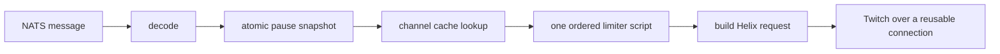

# Outgress Hot-Path Optimization Plan

Status: implemented, pending a production canary and real-Valkey integration run.
Scope: `app/outgress` plus expected-nack handling in `pkg/bus`.

## Outcome

For a warm-cache chat send, reduce the synchronous pre-Twitch path to one Valkey
write round trip while preserving the premium reservation and kill-switch
semantics.

Target command path:



Expected steady-state Valkey round trips:

| Path | Current | Target |
|---|---:|---:|
| Standard chat, warm channel cache | 3 | 1 |
| Standard chat, cold channel cache | 4 | 2 |
| Premium chat, warm channel cache | 2 | 1 |
| Premium chat, cold channel cache | 3 | 2 |

The current warm standard path is three, not four, round trips: the 24-hour
channel cache normally removes `HGETALL`. Four is the cold-cache case.

## Corrections to the original proposal

1. Do not implement the proposed `Lua.ExecMulti` pipeline.

   - It is not atomic. Both scripts execute even if the standard bucket denies.
     In that case the shared bucket is still consumed, allowing rejected standard
     traffic to erode capacity intended for premium traffic.
   - This differs from the current ordered behavior. Today a standard-bucket
     denial stops before the shared bucket is touched; a shared-bucket denial
     occurs after the standard token has already been consumed.
   - In valkey-go v1.0.75, `Lua.ExecMulti` performs `SCRIPT LOAD` against the
     client's nodes on every invocation before issuing the pipeline. It therefore
     is not reliably a one-round-trip hot-path operation.

2. Do not use an unlocked two-second pause TTL cache as written.

   Releasing the read lock before refresh permits every worker crossing the TTL
   boundary to issue the same `GET`. It also delays an emergency pause on the
   other outgress replicas because the management RPC is queue-grouped and only
   one replica executes `SetPaused`.

3. Treat the HTTP connection claim as a hypothesis to verify.

   Draining response bodies is correct and necessary for reliable HTTP/1.1
   reuse, but `http.Transport` already pools connections and Twitch may negotiate
   HTTP/2. The claim that every request currently incurs a new TCP/TLS handshake
   needs connection tracing before attaching a latency number to it.

4. Defer a broad `PreparedBucket` API until allocation profiles justify it.

   The network round trips dominate. Server-side time and a small pre-encoded
   bucket spec remove most of the formatting work without adding four public
   limiter methods.

## Native Valkey features first

Use Valkey's built-in operations unless they cannot express the required
invariant:

| Need | Native feature | Decision |
|---|---|---|
| Pause state/version update | `MULTI/EXEC` + `SET`/`DEL` + `INCR` | Use it |
| Pause reconciliation | `MGET` | Use it |
| Idle limiter cleanup | Hashes + `EXPIRE` | Use it |
| Batch independent commands | Pipelining | Use where no conditional dependency exists |
| Ordered two-bucket admission | Pipeline | Reject: always executes bucket two |
| Ordered two-bucket admission | `MULTI/EXEC` | Reject: transactions cannot branch on bucket one |
| Ordered two-bucket admission | `WATCH` | Reject: extra read/transaction RTTs and contention retries |
| Ordered two-bucket admission | One bounded Lua script | Use as the narrow exception |

The Lua script composes native `TIME`, `HMGET`, `HSET`, and `EXPIRE` operations;
it does not replace native features that can already solve the problem.

## Phase 0: establish a baseline

Instrument the stages before changing behavior:

- decode duration;
- pause lookup duration and snapshot age;
- channel cache hit/miss and load duration;
- limiter duration, lane, decision, and denied bucket class;
- token lookup duration;
- Twitch request duration and status class;
- sampled HTTP connection reuse (`httptrace.GotConnInfo.Reused`);
- nack/redelivery counts by reason.

Do not label metrics with broadcaster ID, endpoint query strings, or bucket keys;
those are unbounded-cardinality values. Use fixed labels such as lane, operation,
status class, and `standard`/`shared`/`system`.

Capture p50/p95/p99 and allocation profiles for warm and cold channel-cache
paths. Run the benchmark with an actual Valkey instance; local function
benchmarks cannot validate round-trip savings.

## Phase 1: one ordered limiter execution

### Design

Replace the two sequential standard-lane executions with one Lua script that
evaluates one or two buckets in order. Use `valkey.Lua.Exec`, not `ExecMulti`.

The script must preserve these exact transitions:

| First bucket | Second bucket | Result | State mutation |
|---|---|---|---|
| deny | any | deny first | update first's refill timestamp/state; do not touch second |
| allow | deny | deny second | consume first; update denied second |
| allow | allow | allow | consume both |

Implementation requirements:

- Call Valkey `TIME` once inside the script. This removes fleet clock-skew from
  refill calculations and removes the per-call timestamp formatting allocation.
- Read and validate all participating hashes before the first write. Lua scripts
  are isolated, but Redis/Valkey does not roll back earlier writes after a runtime
  error; read-before-write avoids partial mutation on a wrong-type key.
- Return a compact decision: allowed, first denied, or second denied. Optionally
  return the computed delay until one token is available for metrics and a later
  retry-policy improvement.
- Keep the existing keys and hash fields. Old and new pods then share limiter
  state safely during a rolling deployment, and rollback does not reset budgets.
- Keep the script non-retryable. Retrying an ambiguously completed write can
  consume a token twice.
- Bound the API to the actual use case (one or two buckets). Avoid variadic heap
  work and accidental duplicate keys on the hot path.

Suggested API shape:

```go
type Spec struct {
    capacityArg string
    refillArg   string
    ttlArg      string
}

type Request struct {
    Key  string
    Spec Spec
}

// AllowOrdered evaluates first and, only when first allows, second.
// denied is 0 on success, 1 for first, and 2 for second.
func (l *Limiter) AllowOrdered(
    ctx context.Context,
    first Request,
    second *Request,
) (denied uint8, err error)
```

Precompute the small set of `Spec` values once:

- chat non-mod shared and standard;
- chat mod shared and standard;
- Helix general, standard, and system.

Only the per-channel key is assembled per chat message. Consolidate the repeated
Helix rate-limit logic in `processAPI`, `processAnnounce`, and `processShoutout`
behind one worker helper so all three routes cannot drift.

### Required invariant tests

Use a real Valkey integration test for the script:

- fresh, partially full, empty, and just-refilled buckets;
- first denial leaves the second hash byte-for-byte unchanged;
- second denial consumes the first token, matching current behavior;
- concurrent callers produce exactly the permitted number of successes;
- backward/forward application-host clock changes have no effect;
- wrong-type second key causes no mutation to the first;
- `SCRIPT FLUSH` exercises the `EVALSHA` to `EVAL` fallback;
- cancellation and connection failure do not trigger an automatic write retry.

## Phase 2: zero-I/O pause reads without a stale fleet

### Design

Keep an immutable, versioned pause snapshot behind `atomic.Pointer`. The message
path performs one atomic load and no lock, allocation, or Valkey command.

`SetPaused` uses native `MULTI/EXEC` to:

1. atomically persist the new boolean and increment a Valkey version;
2. publish `{paused, version}` on a dedicated NATS invalidation subject;
3. update the local snapshot only after the Valkey write succeeds.

Every outgress replica should:

- subscribe before it starts consuming lane messages;
- load the initial state and version before reporting ready;
- apply an event only when its version is newer, preventing concurrent
  pause/unpause requests from being applied out of order;
- reconcile from Valkey on a jittered interval (for example, one second) so a
  missed best-effort NATS event repairs itself;
- expose snapshot age and reconciliation failures;
- cancel and join the reconciler in `Registry.Close`.

Define the failure policy explicitly. To preserve today's fail-closed behavior,
return an error once the last successfully reconciled snapshot exceeds a bounded
maximum age. `system.status` may use a strong lookup rather than the hot snapshot
so the operator-facing result remains authoritative.

This gives immediate fleet-wide pause propagation in the normal case, bounded
repair after a missed event, and no TTL-boundary request stampede.

### Required tests

- startup does not become ready until an initial snapshot exists;
- all simulated replicas observe a pause event;
- an intentionally dropped event is repaired by reconciliation;
- out-of-order versions cannot revert state;
- concurrent hot reads pass `go test -race` and cause no refresh calls;
- stale snapshots fail closed;
- a failed Valkey write is neither published nor exposed locally.

## Phase 3: make HTTP reuse explicit and measurable

Immediately defer a bounded drain-and-close helper after every successful
`Do`/`ExecuteAs` call. It must cover 2xx, 4xx, 429, and 5xx returns. Read at most
`maxBody + 1`; reaching EOF within the bound makes HTTP/1.1 reuse possible, while
an oversized or non-terminating body is closed without unbounded draining.

Give the Twitch client a dedicated transport cloned from `http.DefaultTransport`:

- retain proxy, dial, TLS, and HTTP/2 defaults;
- set `MaxIdleConns` and `MaxIdleConnsPerHost` high enough for configured
  per-pod concurrency instead of the HTTP/1.1 default of two idle connections;
- avoid a low `MaxConnsPerHost` that simply moves queueing into the transport;
- close idle connections during shutdown.

Verify with an HTTP/1.1 `httptest.Server` that sequential and concurrent small
responses reuse connections. Cover success and error bodies, an oversized body,
and cancellation. Use sampled production traces to determine whether Twitch is
using HTTP/1.1 or HTTP/2 and whether transport tuning changes p95/p99; do not claim
a fixed handshake saving without that evidence.

## Phase 4: remove overload-path amplification

Limiter denial is expected backpressure, but it currently becomes a formatted
error, a New Relic noticed error, and a warning log on each delivery attempt. At
high load that observability work can become the hottest local path.

Introduce a typed expected-nack classification understood by `pkg/bus`:

- nack with the same delivery semantics;
- count it as a bounded-cardinality metric;
- omit `NoticeError` and warning logs, or sample them at a low rate;
- keep dependency failures and unexpected handler failures as real errors.

If the limiter returns a retry delay, evaluate a later change to delay redelivery
until a token can exist. That requires an end-to-end nack contract; do not sleep
inside a worker goroutine. Also drop work immediately when the computed delay is
beyond the message's remaining five-second lifetime.

## Deferred optimization: local token leases

Do not start with per-pod token leasing. It can remove most Valkey calls, but four
pods can strand leased chat tokens and reduce effective capacity substantially.
Only consider it if production profiles still show limiter RTT as a bottleneck
after the one-script change. Any lease design must reserve tokens centrally,
never return expired leases, adapt batch size to observed traffic, and prove that
the fleet cannot exceed either shared or standard capacity.

## Verification and acceptance gates

Run:

```bash
go test -race ./app/outgress/...
go test ./...
go vet ./app/outgress/...
go test -run '^$' -bench 'Limiter|Pause|HTTP' -benchmem -count 10 ./app/outgress/...
```

Compare benchmark runs with `benchstat`. Add a real-Valkey latency run with
representative network delay and a fake Twitch server so it measures the entire
pre-HTTP worker path rather than only helper functions.

Ship in independently reversible changes:

1. metrics and baseline;
2. response draining plus transport tests;
3. ordered limiter script using the existing keys;
4. versioned pause snapshot;
5. expected-nack suppression;
6. allocation-only work if profiles still justify it.

Canary one replica, then roll the fleet. At each step gate on:

- no increase in Twitch 429s or authorization failures;
- no loss of the premium reservation invariant;
- no increase in dropped or redelivered messages;
- expected Valkey commands per warm message (standard 1, premium 1);
- lower pre-Twitch p95/p99 and no HTTP connection-churn regression;
- pause propagation and reconciliation age within the declared bounds.

Rollback is safe because the limiter key schema and semantics remain compatible
with the current implementation. Do not combine this rollout with a limiter-key
rename or bucket-capacity change.
