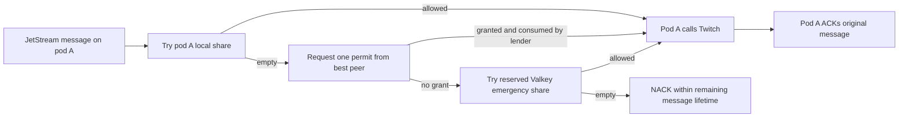

# Outgress Quota-Lease Protocol Plan

Status: proposed implementation plan

Scope: replace the per-message transatlantic Valkey rate-limit decision with
local Go admission, while retaining the existing Valkey primary/replica system
as the global authority and the current limiter as a bounded emergency path.

## Decision

Keep outgress in Go. Use a hierarchical quota-share lease protocol:

1. Valkey remains the authority that publishes one immutable allocation plan
   for an epoch.
2. Each active holder spends only its non-overlapping local share with an
   in-process token bucket.
3. If the receiving pod has no token, it asks another pod for **one immediate
   permit**. The original pod keeps the JetStream message, performs the Twitch
   request, and ACKs it.
4. If no peer can lend, use a small, explicitly reserved central Valkey
   partition. Never run the existing full-size central bucket beside local
   leases because that would double the real budget.
5. If all allocated and emergency quota is empty, NACK with a retry delay that
   fits inside the message's five-second lifetime. No correct protocol can send
   when the real Twitch budget is exhausted.

Permit borrowing is preferable to transferring the message. A handoff creates
an ambiguous interval in which either pod may send or ACK, requires a second
delivery protocol, and still cannot make JetStream redeliver to a particular
pod. A borrowed permit changes only admission; message ownership stays exactly
as it is today.



## Non-negotiable safety invariants

For each independent Twitch bucket partition and every instant `t`:

```text
sum(active local refill rates) + emergency refill rate <= global refill rate
sum(active local burst capacities) + emergency burst <= global burst capacity
```

In addition:

- a pod may spend only while its lease is active;
- the old and new holders of a share must never be active at the same time;
- renewal extends validity but does **not** refill or recreate the local bucket;
- a new or restarted holder begins empty; v1 has no replayable initial-token
  grant;
- unused tokens from an expired or crashed holder are discarded, not inferred
  or recreated;
- a borrowed permit is debited at the lender before the reply is sent;
- a lost or timed-out permit reply burns capacity but never creates capacity;
- the central emergency bucket is a separate slice of the real budget;
- stale, duplicate, reordered, or unknown-version plans are rejected;
- an expired plan fails closed.

These rules matter more than the transport. “Admit locally and reconcile
later” is unsafe: during a partition every pod could spend the whole global
bucket. Reserving unrestricted batches of tokens is also unsafe because Valkey
would begin refilling while delayed local tokens still exist. A lease therefore
assigns a sustained **rate and burst share**, not a bag of freely movable tokens.

## Budget layout

Preserve all existing partitions and their ordered semantics:

| Bucket class | Global budget | Leased initially | Emergency initially |
|---|---:|---:|---:|
| chat shared, non-mod | 20 / 30 s | 18 / 30 s, burst 18 | 2 / 30 s, burst 2 |
| chat standard, non-mod | 10 / 30 s | 9 / 30 s, burst 9 | 1 / 30 s, burst 1 |
| chat shared, mod | 100 / 30 s | 90 / 30 s, burst 90 | 10 / 30 s, burst 10 |
| chat standard, mod | 50 / 30 s | 45 / 30 s, burst 45 | 5 / 30 s, burst 5 |
| Helix general | 700 / 60 s | 630 / 60 s, burst 630 | 70 / 60 s, burst 70 |
| Helix standard | 350 / 60 s | 315 / 60 s, burst 315 | 35 / 60 s, burst 35 |
| Helix system | 100 / 60 s | 90 / 60 s, burst 90 | 10 / 60 s, burst 10 |

These 90/10 values are conservative starting points, not permanent constants.
After canary data, increase the leased share toward 95-98% if peer borrowing is
healthy. Do not make the emergency burst zero until failover behavior has been
proven in production.

Standard traffic must consume the standard share first and the shared share
second, matching the existing ordered Valkey script. Premium traffic consumes
only shared. System traffic remains independent.

## Allocation strategy

Use different placement for small, broadcaster-scoped chat buckets and the
large fleet-wide Helix buckets.

### Chat: one regional owner per broadcaster

Splitting a 20-token chat bucket evenly across four pods strands too much
capacity. For each active broadcaster, assign the leased chat share to one
owner in the region that observed the most recent demand. Other pods request
one permit from that owner and still send the message themselves.

- Demand reports are approximate and affect only the next epoch.
- Ties use rendezvous hashing over `(broadcasterID, epoch, memberID)` so every
  allocator reaches the same answer for the same input.
- Prefer the current owner while it is healthy to avoid churn and token loss.
- Move ownership only at an epoch boundary.
- A new owner starts empty; the old owner's unused balance is discarded. This
  is conservative but prevents a fresh burst from being minted on every move.
- Later, broadcaster-affine message routing can reduce same-region borrowing,
  but it is not required for correctness or the first rollout.

Only active broadcasters need entries. Expire demand state after two idle chat
windows so the plan does not grow without bound.

A broadcaster absent from the active plan remains entirely on the legacy
central-full limiter. Its first message must not receive a tiny emergency-only
budget. The next epoch may transition that whole bucket into leased mode; it
then starts empty at the guarded boundary. A bucket is never central-full and
leased at the same time.

### Helix: weighted pod shares

Allocate the Helix leased partitions across active pods using bounded demand
weights:

```text
share_i = floor(total_leased * clamp(demand_i / total_demand, min, max))
```

Give every ready pod a small floor, place the rounding remainder on the busiest
pod, and prefer the previous allocation unless demand crosses a hysteresis
threshold. This prevents oscillation. A pod that exhausts its share borrows one
permit from a peer with advertised headroom.

The allocator must compute integer bursts and fixed-point refill rates, then
assert the aggregate inequalities before publishing. Invalid plans are never
written.

## Epoch and plan protocol

Start with a 30-second epoch. Any pod may propose the next plan; a short native
Valkey transaction chooses one winner without a long-lived distributed lock.

1. Pods advertise readiness, region, protocol version, and bounded demand over
   Core NATS.
2. Ten seconds before the next boundary, an allocator snapshots the active
   membership and recent demand and builds the plan for `epoch + 1`.
3. On a dedicated `valkey-go` connection, it `WATCH`es the epoch plan key,
   verifies that it is absent, then uses `MULTI/EXEC` to write the immutable
   plan and its derived per-bucket mode transitions together. Contenders retry
   by reading the winning plan. This is off the hot path, so optimistic native
   transactions are preferable to Lua or a lock-renewal protocol.
4. The winner writes any mode-transition metadata and executes native
   `WAIT <promotion-eligible-replicas> <timeout>` on that **same dedicated
   connection**. `WAIT` acknowledges preceding writes by that client; using a
   pooled connection here would not establish the intended barrier.
   It publishes the plan digest on NATS only after the required replicas have
   acknowledged it. A recovering allocator reads the winning blob, writes an
   idempotent `PEXPIRE`/mode-metadata refresh on one dedicated connection, and
   then repeats the `WAIT` barrier; replication acknowledgement of the later
   write also covers the preceding immutable plan in the ordered replication
   stream.
5. A notification is only a wake-up. Every pod loads the blob from the Valkey
   primary, validates its digest and invariants, samples Valkey `TIME`, and then
   installs it locally.
6. The pod activates the new plan after the boundary plus a clock/RTT guard and
   expires the old plan before the boundary minus that guard. The deliberate
   gap sacrifices a small amount of capacity to prevent overlap.

`WAIT` improves replication acknowledgement but does not turn asynchronous
Valkey replication into consensus. The operational contract must therefore be:

- wait for every **promotion-eligible** replica, not merely one arbitrary
  replica;
- configure Sentinel not to promote a replica outside that acknowledged set;
- configure `min-replicas-to-write` and `min-replicas-max-lag` consistently;
- never create or change the current epoch after its activation boundary;
- if the replication barrier cannot be met, do not activate a new lease plan.

This pays transatlantic latency once per epoch, off the message hot path. If the
deployment cannot guarantee promotion only from acknowledged replicas, strict
lease safety across primary failover is impossible with asynchronous Sentinel;
in that configuration the system must drop back to central mode after a
failover before issuing new leases.

Each bucket's mode record contains `{mode, generation, valid_from, plan_digest}`.
The full-central limiter script checks this record using the same server `TIME`
it already obtains and rejects only after a leased transition becomes active.
State keys include the generation, so rollback or later reactivation cannot
reuse a stale full bucket. A missing mode record means central-full, which is
also how a newly seen broadcaster operates until a future plan adopts it.

### Plan shape

Use an explicitly versioned control-plane structure. `encoding/json` is
sufficient because this runs once per epoch and debuggability is valuable.

```go
type Plan struct {
    Version       uint16       `json:"version"`
    Epoch         uint64       `json:"epoch"`
    Digest        string       `json:"digest"`
    ValidFromMS   int64        `json:"valid_from_ms"`
    ValidUntilMS  int64        `json:"valid_until_ms"`
    Members       []Member     `json:"members"`
    Allocations   []Allocation `json:"allocations"`
}

type Allocation struct {
    Bucket        BucketID `json:"bucket"`
    Holder        string   `json:"holder"`
    Generation    uint64   `json:"generation"`
    RateMicros    int64    `json:"rate_micros_per_second"`
    Burst         int      `json:"burst"`
}
```

Canonicalize with stable slice ordering and calculate the digest with
`crypto/sha256` while the `Digest` field is empty, then serialize the completed
plan. Use the same standard-library hash for rendezvous scores. Do not add a
third-party serialization or hashing dependency for a 30-second control path.

### Time handling

Do not compare lease boundaries directly with unsynchronized pod wall clocks.
Around a primary `TIME` call, record local monotonic `t0` and `t1`, then map the
server boundary onto a local monotonic deadline. Use:

```text
uncertainty = (t1 - t0) / 2 + configured NTP error floor
activate    = server valid_from + uncertainty
expire      = server valid_until - uncertainty
```

Start with a 250 ms floor. If measured uncertainty is too large to leave a
usable lease interval, mark the lease client unready and use only the central
emergency path.

## Local admission implementation

Add `golang.org/x/time/rate` and use `rate.Limiter.AllowN(now, 1)` for the local
token buckets. It is concurrency-safe and already exposes explicit-time APIs
needed by deterministic tests.

Do **not** use `Wait`, `WaitN`, `Reserve`, or `ReserveN`:

- outgress messages are perishable and should not sleep behind a local token;
- outstanding reservations make rate/burst changes difficult to reason about;
- a handler at zero should immediately try a peer instead.

Each logical bucket is a small object:

```go
type LocalBucket struct {
    mu       sync.Mutex
    epoch    uint64
    holder   string
    shared   *rate.Limiter
    standard *rate.Limiter
    notBefore time.Time // local monotonic deadline
    notAfter  time.Time // local monotonic deadline
}
```

`TryPremium` and `TryStandard` take the same short per-bucket mutex.
`TryStandard` calls standard first and shared second. If shared denies, the
standard token remains consumed, exactly matching today's semantics. The mutex
prevents premium admission from interleaving between the pair.

The limiter lifecycle prevents burst creation:

- renewal of an unchanged allocation updates only `notAfter`;
- a changed allocation updates the existing limiter at the boundary with
  `SetLimitAt` and `SetBurstAt`; this is safe because this design never creates
  reservations;
- increasing burst does not grant tokens by itself;
- a newly owned or restarted allocation is created full and immediately
  drained with `AllowN(now, burst)`, leaving zero;
- an expired allocation cannot be called even if its cache entry remains.

`Generation` identifies one uninterrupted ownership incarnation. An unchanged
holder keeps the same generation across epoch renewals, so its limiter state is
reused. An owner change increments it. A process that has no in-memory state for
the generation still starts empty; replaying a plan after restart must never
replay a burst grant.

Publish the current immutable plan with `atomic.Pointer[PlanState]`. The hot
path performs one atomic load, a bounded cache lookup, one short bucket lock,
and one or two `AllowN` calls. It performs no Valkey I/O and creates no goroutine.

Use the already-present Theine cache to bound broadcaster bucket objects and
borrow-request deduplication. Do not start one timer or goroutine per bucket;
use Theine TTLs plus one lease lifecycle loop.

## One-permit borrow protocol

Use Core NATS request/reply, not JetStream and not NATS KV. A permit is
ephemeral; persisting and redelivering it would make duplicate consumption
harder, while KV would add a quorum/CAS operation to admission.

Register one targeted endpoint per pod:

```text
bagel.outgress.permit.v1.<region>.<podID>
```

The requester ranks donors by:

1. required bucket/epoch ownership;
2. same region;
3. recently advertised headroom;
4. measured request/reply EWMA;
5. stable pod ID tie-break.

Try donors sequentially, at most two. Do not fan out in parallel: every lender
would debit a token even though only one reply is used. Start with 10 ms for a
same-region attempt and an adaptive, separately bounded timeout for an optional
cross-region attempt. Never exceed the original message's remaining lifetime.

```go
type BorrowRequest struct {
    Version      uint16   `json:"version"`
    RequestID    string   `json:"request_id"`
    Epoch        uint64   `json:"epoch"`
    Bucket       BucketID `json:"bucket"`
    Lane         Lane     `json:"lane"`
    Need         uint8    `json:"need"` // bit mask: standard, shared, system
    DeadlineMS   int64    `json:"deadline_ms"`
}

type BorrowReply struct {
    Version      uint16 `json:"version"`
    Epoch        uint64 `json:"epoch"`
    GrantID      string `json:"grant_id,omitempty"`
    Paid         uint8  `json:"paid,omitempty"`
    RemainingMS  int64  `json:"remaining_ms,omitempty"`
    Status       string `json:"status"` // granted, partial, empty, stale, invalid
}
```

Lender algorithm:

1. Validate protocol version, current epoch, deadline, bucket, and caller.
2. Look up `RequestID` in a short-lived Theine dedupe cache. Return the same
   reply for a duplicate request to this lender.
3. Under the local bucket lock, consume the requested components in canonical
   standard-then-shared order and report exactly which components were paid.
4. Store the reply in the dedupe cache before responding.
5. Give the grant a very short lifetime (initially 250 ms).

Borrower algorithm:

1. Accept only the requested epoch/bucket and a non-expired grant. Subtract the
   full observed request RTT from `RemainingMS` rather than trusting clocks
   between pods.
2. Use it immediately for the already-owned message; grants are not banked.
3. If the reply is lost or arrives after expiry, do not send. The lender's
   token is intentionally burned.
4. The borrower never sends an ACK back to the lender and never transfers the
   JetStream message.

After an ambiguous timeout, do not retry the same lender or reuse the same
request ID. A second donor attempt gets a new ID. Core NATS does not durably
redeliver requests, so the lender dedupe cache is defensive against accidental
application duplicates rather than the foundation of correctness.

Admission tracks a small remaining-component mask. If local standard succeeds
but shared denies, the standard component remains paid and the borrower asks a
peer only for shared. If a peer pays standard and then lacks shared, the next
attempt also requests only shared. This preserves the current conservative
ordered debit without wasting another standard token on every fallback.

Use `github.com/nats-io/nats.go/micro`, already provided by `nats.go`, for the
versioned service, INFO/STATS/PING discovery, endpoint pending limits, and
shutdown lifecycle. Disable the endpoint queue group because each subject is
pod-specific. Use the ordinary `nats.Conn.RequestMsgWithContext` client API for
targeted requests and immediate `ErrNoResponders` handling.

Headroom advertisements are hints only and may be stale. The lender's local
`AllowN` decision is authoritative. Publish fixed-size summaries at most four
times per second; never publish per-token state changes.

## Central emergency path

The existing Valkey limiter remains useful, but in leased mode it must operate
on dedicated `:emergency:<generation>` keys and the reduced rates/bursts in the
table above. A new generation starts empty at its server-time activation
boundary; it never inherits a stale full key. Its idle expiry must be no shorter
than the time needed to refill the whole emergency burst, so recreating a key
after expiry cannot mint capacity.

- Use the existing one-bucket script for premium/system emergency admission.
- Use the existing ordered two-bucket script for standard emergency admission.
- If a standard component was already paid locally or by a peer, request only
  the still-missing shared component from the emergency partition.
- Bound all central attempts with a weighted semaphore and a short deadline.
- Never retry an ambiguously completed write.

Never put a write admission result behind `singleflight`: its result is
broadcast to every waiter, which would multiply one Valkey token. Use
`singleflight.Group.DoChan` only for idempotent reads such as loading the same
epoch plan or refreshing the same membership snapshot.

This is the narrow place where Lua remains justified. Native Valkey commands
are preferred everywhere else, but native transactions cannot conditionally
refill and decrement two buckets in ordered sequence. The script is already
bounded, atomic, uses server `TIME`, and composes native hash/expiry commands.

## Libraries

| Library | Status | Use | Reason |
|---|---|---|---|
| `golang.org/x/time/rate` | add, pin in `go.mod` | local token buckets | maintained, concurrency-safe, explicit-time `AllowN` |
| `github.com/nats-io/nats.go` v1.52.0 | present | targeted request/reply and gossip | existing transport; no new operational system |
| `github.com/nats-io/nats.go/micro` | present in `nats.go` | borrow service discovery/stats/lifecycle | versioned endpoints and bounded pending limits |
| `github.com/valkey-io/valkey-go` v1.0.75 | present | immutable plan write/read, `TIME`, `WAIT`, emergency script | existing Sentinel-aware client and auto-pipelining |
| `github.com/Yiling-J/theine-go` v0.6.2 | present | bounded broadcaster and request-dedupe caches | existing high-performance generic cache with TTL |
| `golang.org/x/sync/singleflight` v0.20.0 | present | collapse plan/membership reads only | duplicate suppression without sharing admission results |
| `golang.org/x/sync/semaphore` | present module | bound peer/global fallback concurrency | prevents overload amplification |
| `sync/atomic`, `sync`, `crypto/sha256`, `encoding/json` | standard library | plan publication, bucket pairing, digest, protocol | no unnecessary dependency |
| `github.com/stretchr/testify` v1.11.1 | present | invariant and integration assertions | repository test convention |

Do not add a Redis-specific distributed rate-limit or lock library. It would
bring a second client stack, retain the transatlantic per-request operation, and
usually cannot express the paired standard/shared invariant. Do not add a
lock-free map or a new hashing package before profiles prove the standard
library and Theine insufficient.

## Go concurrency model

Keep concurrency bounded and ownership explicit:

- one lease lifecycle goroutine per process;
- one demand/headroom publisher goroutine per process;
- NATS micro uses its subscription callback path with configured pending limits;
- a semaphore bounds outstanding borrow requests;
- a separate semaphore bounds emergency Valkey calls;
- no goroutine per message merely to race peers;
- no goroutine, ticker, or channel per broadcaster;
- per-bucket critical sections contain only local limiter operations;
- immutable plan state is swapped atomically;
- all background components have `Close`, are joined during shutdown, and stop
  granting before the NATS/Valkey connections are closed.

Use `errgroup.WithContext` in `main` to own the lifecycle. On shutdown, first
mark the permit service unavailable, drain its NATS subscription, stop message
consumers, and then close the lease manager. This avoids granting a permit from
a pod that is no longer able to maintain its lease state.

## Failure behavior

| Failure | Required behavior |
|---|---|
| local share empty | targeted one-permit borrow, then emergency reserve |
| peer reply lost | lender token is burned; requester may try one other peer with a new request ID |
| duplicate request to same peer | cached identical reply; never debit twice |
| lender crashes after debit | capacity is lost until refill; no over-admission |
| borrower crashes after grant | capacity is lost; original JetStream message redelivers normally |
| NATS partition | local shares remain usable; no cross-partition borrowing; emergency or NACK |
| Valkey primary unreachable | active leases remain usable only until early expiry; no renewal |
| insufficient replica acknowledgements | plan is not announced or activated |
| primary failover | no current-epoch rewrite; verify new authority before next activation |
| allocator crash before plan notification | another allocator reads the transaction winner, refreshes metadata, repeats `WAIT`, and notifies |
| duplicate/reordered plan | digest, version, epoch, and monotonic transition checks reject it |
| excessive clock uncertainty | do not activate local lease; use emergency path |
| pod restart | local shares start empty; plan replay cannot recreate a burst |
| owner change | old expires early, new starts late and empty; unused capacity is discarded |
| all real quota empty | NACK/drop according to the remaining five-second message lifetime |

All ambiguous failures lose capacity rather than create capacity.

## Rollout and safe cutover

Add `OUTGRESS_RATE_MODE=central|shadow|leased`, defaulting to `central`.

### Phase 1: local engine and model tests

Files:

```text
app/outgress/internal/ratelimit/local.go
app/outgress/internal/ratelimit/local_test.go
app/outgress/internal/ratelimit/model_test.go
```

- Add and pin `golang.org/x/time/rate`.
- Implement local shared/standard/system admission and explicit clock injection.
- Model renewals, resize, expiry, restart, and owner transfer.
- Keep production on the existing central limiter.

### Phase 2: plan control plane in shadow mode

Files:

```text
app/outgress/internal/ratelimit/protocol.go
app/outgress/internal/ratelimit/allocator.go
app/outgress/internal/ratelimit/lease_client.go
```

- Implement native `WATCH`/`MULTI`, `WAIT`, `GET`, and `TIME` flows with one
  dedicated connection spanning transaction and replication barrier.
- Generate plans and local decisions without affecting sends.
- Record disagreement between shadow-local and central decisions.
- Prove plan size and epoch work stay negligible.

### Phase 3: peer permit service

Files:

```text
app/outgress/internal/ratelimit/borrow.go
app/outgress/internal/ratelimit/borrow_test.go
```

- Add the targeted NATS micro endpoint, dedupe cache, donor ranking, deadlines,
  and bounded concurrency.
- Exercise it in shadow mode; consume shadow tokens but do not authorize sends.
- Verify standard requests consume the local pair atomically.

### Phase 4: split the real budget

Deploy code that understands both bucket layouts to every pod before changing
the mode. The cutover must prevent the old full central bucket and the new local
shares from being active together.

Use a one-time, versioned migration guarded by a mode key:

1. all pods report support for protocol v1;
2. make the central-full script reject admissions at a shared server-time
   boundary by checking the versioned mode key;
3. atomically switch the mode and publish the first leased plan;
4. start every local and emergency bucket empty, deliberately discarding the
   old bucket's unknown remaining balance rather than minting a cutover burst;
5. pass the replica acknowledgement barrier;
6. activate after the clock guard and let all partitions refill normally.

The mode and plan write uses native `WATCH`/`MULTI`; contention is bounded and
the operation is off the hot path. The existing limiter script needs one
versioned mode-key check so an old full-budget call cannot race past the
boundary. Test old calls in flight and a process crash at every step. The
empty-start tradeoff costs brief availability during cutover, but it is simple,
replay-safe, and preserves the Twitch burst invariant.

Canary leased mode by deterministic broadcaster cohort, but keep each entire
broadcaster bucket in exactly one mode. Do not split one bucket between central
and leased enforcement.

### Phase 5: production expansion

1. 1% of broadcaster buckets, Helix still central.
2. 10%, 50%, then 100% chat after at least one full failure drill at each early
   stage.
3. Helix general/standard, then system.
4. Increase the leased percentage only after emergency and 429 metrics prove
   the invariants in practice.

Rollback switches whole bucket cohorts back at a future server-time boundary.
Do not instantly recreate a full central burst; v1 starts the new central
generation empty and refills.

## Verification

### Deterministic and property tests

Use the standard Go fuzzing engine and a fake clock. Generate random sequences
of admission, borrow, renewal, resize, expiry, crash, restart, reordering, and
failover. Assert after every operation:

- aggregate successful admissions never exceed the reference global model;
- no holder spends outside its validity interval;
- renewal never changes the token count;
- an owner move or restart never creates tokens;
- each grant corresponds to exactly one lender debit;
- duplicates never debit twice at one lender;
- standard success implies one standard and one shared debit;
- shared denial after standard admission preserves today's conservative debit.

### Integration and race tests

- `go test -race ./app/outgress/... ./pkg/bus/...`
- real Valkey primary plus replicas: transaction winner, `WAIT`, failover,
  `TIME`, script fallback, and migration tests;
- multi-process NATS test: no responders, duplicate request, delayed reply,
  disconnect, drain, same-region preference, and cross-region fallback;
- crash at every transition between lender debit and response;
- benchmark local hit, local pair, same-region borrow, and central emergency.

### Production gates

Before moving each rollout stage, require:

- at least 95% of admissions local after warm-up;
- less than 5% peer borrowing and less than 1% central emergency use in normal
  operation (tune after observing actual routing distribution);
- no statistically significant increase in Twitch 429 responses;
- no increase in expired outgress messages;
- p99 rate-limit decision below 1 ms for local hits;
- bounded permit-service pending messages and zero slow-consumer disconnects;
- invariant/plan rejection counters at zero;
- successful drills for NATS partition, Valkey failover, pod restart, and owner
  transfer.

## Observability

Use only bounded labels such as bucket class, lane, region, decision source, and
failure reason. Never label by broadcaster, pod subject, request ID, or bucket
key.

Minimum metrics:

- `outgress_ratelimit_decisions_total{source=local|peer|emergency,result}`
- `outgress_ratelimit_decision_seconds{source}`
- `outgress_lease_epoch`, `outgress_lease_seconds_remaining`
- `outgress_lease_plan_rejected_total{reason}`
- `outgress_lease_clock_uncertainty_seconds`
- `outgress_borrow_requests_total{region_relation,result}`
- `outgress_borrow_seconds{region_relation}`
- `outgress_borrow_tokens_burned_total{reason}`
- `outgress_emergency_inflight`
- `outgress_shadow_disagreement_total{central,local}`
- Twitch 429s and expired JetStream messages as rollout guardrails.

## Explicitly deferred

- Moving the rate buckets to NATS KV.
- Active-active Valkey.
- Moving outgress to Elixir.
- Message handoff between outgress pods.
- Broadcaster-affine JetStream routing.
- A custom lock-free token bucket.
- Cryptographic signatures for internal plans; NATS/Valkey authentication,
  digest validation, and protocol versioning are sufficient for v1.

## References

- [Go `x/time/rate` API](https://pkg.go.dev/golang.org/x/time/rate)
- [Go `x/sync/singleflight` API](https://pkg.go.dev/golang.org/x/sync/singleflight)
- [NATS request/reply](https://docs.nats.io/nats-concepts/core-nats/reqreply)
- [NATS queue groups and geo-affinity](https://docs.nats.io/nats-concepts/core-nats/queue)
- [NATS Go micro package](https://pkg.go.dev/github.com/nats-io/nats.go/micro)
- [Valkey Go client](https://pkg.go.dev/github.com/valkey-io/valkey-go)
- [Valkey distributed-lock and expiry safety discussion](https://valkey.io/topics/distlock/)
- [Theine Go cache](https://pkg.go.dev/github.com/Yiling-J/theine-go)
