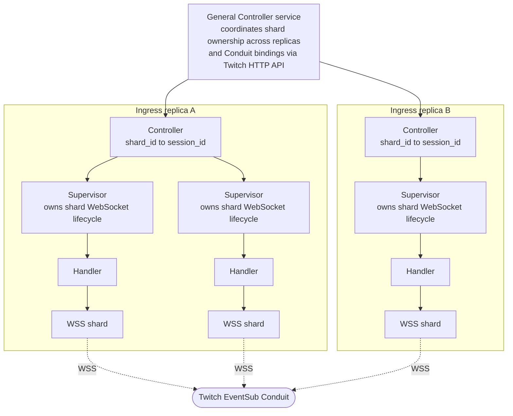

**Date:** 2026-05-23

## Status

Accepted

Supersedes [ADR 0001](/adr/0001-rewriting-to-microservices/)

## Context

[ADR 0001](/adr/0001-rewriting-to-microservices/) set the rewrite plan in motion and called out, specifically, the v1's
networking pain: long-lived Twitch sockets that drifted into zombie state when the heartbeat stopped arriving, a
library that hid the raw socket lifecycle, and the impossibility of writing a real supervisor on top of it. Solving
that class of problem was one of the original motivations for the rewrite.

Since then,
[ADR 0002](/adr/0002-adoption-of-go-as-primary-service-language/) chose Go as the primary service language and
[ADR 0003](/adr/0003-adoption-of-nats-as-communication-bridge/) chose NATS as the communication substrate, including
JetStream KV for shard ownership across Go services. For most services in the system that combination is the right
answer. The Twitch ingress is the service where it stops being the right answer.

The ingress consumes Twitch events through a **Twitch EventSub Conduit**. A Conduit is a server-side fan-in that
Twitch owns: we declare a fixed number of shards on the Conduit, attach one WebSocket session to each shard, and
Twitch routes events across those shards on its side. We do not open a socket per channel. We hold a small fleet of
WebSocket shards, and Twitch decides which event goes to which shard. The subscriptions themselves (per-tenant,
per-event-type) live on the Conduit and survive shard disconnects.

That shape has a very specific set of obligations:

- A small number of long-lived WebSocket shards, each one a session that Twitch can reset, close, or move at any
  time. The count is in the single-to-low-double digits, not per-channel.
- Each shard is a small state machine: connect, receive `session_welcome`, take its `session_id`, call Twitch's HTTP
  API to bind that `session_id` to the shard on the Conduit, handle the `reconnect` flow, reconnect with backoff,
  recover from server-side resets. Twitch resets connections routinely; failure is not exceptional.
- Failures must be isolated. A single bad shard cannot take its siblings down with it, and restarting one shard must
  not perturb the others.
- Ownership of shards is distributed across multiple ingress instances. We need to know which instance currently
  owns shard `n`, and on node death the surviving instance must re-open a WebSocket, take a new `session_id`, and
  call Twitch's API to re-bind that shard, in seconds.

In Go we can build all of this, but we are essentially rebuilding the OTP supervision model and a clustering layer
on top of it. The Go ecosystem has the pieces (`hashicorp/memberlist`, `serf`, ad-hoc supervisor code, the NATS KV
leases from ADR 0003), but they are pieces, not a runtime. Each one is something we own and maintain.

The shape we had been sketching in Go, before changing course, looked like this: each ingress replica wraps a
low-level WebSocket shard in a supervisor process that owns the connection's lifecycle and exposes a handler
interface to it; a per-replica controller maps shard IDs to session IDs and owns multiple supervisor instances; and
a separate "general controller" service sits above the replicas and coordinates shard ownership across them and the
Conduit bindings against Twitch's HTTP API.

That diagram makes the cost of the Go path explicit: three layers of hand-written infrastructure (general
controller, per-replica controller, per-shard supervisor) before the first byte of Twitch traffic is processed,
plus a separate service whose only job is to coordinate ingress replicas and reconcile their state against the
Conduit. None of that code does business work; all of it exists to recreate what a runtime can already provide.

The BEAM VM (Erlang/Elixir) was built for exactly this shape of work. It comes from telecoms, where always-on
long-lived sessions, per-session supervision, and seamless distribution across nodes are not features but the entire
point of the platform. The maturity here is measured in decades, on the same domain (network edges, switches, chat
systems). Lightweight processes are cheap enough that one BEAM process per shard is the natural design, not a clever
optimization. Supervision is the default failure model, not something we have to write. And BEAM nodes form a cluster on
their own: with `libcluster` (or any equivalent) the nodes discover each other and from that point on, process groups (
`:pg`, `Horde.Registry`, or similar) give us a live, distributed registry of "who owns what" without an external
coordinator.

That last property matters in particular. The NATS KV leases we planned in ADR 0003 for shard ownership are great
for Go services that have no native clustering of their own. Inside a BEAM cluster, the VM already provides the
primitive: nodes know each other, processes can be located by name across the cluster, and ownership transfer on
node death is built in. Adding NATS KV on top would be adding a second, slower source of truth for something the VM
already tracks authoritatively in-memory. The only external source of truth we still have to reconcile against is
Twitch itself, via the Conduit's HTTP API, and that is unavoidable regardless of the language we pick.

The cost of going to Elixir is the learning curve, and the cost of running a second language across the fleet. Both
of those are real and have to be weighed honestly.

## Decision

The **Twitch ingress service is written in Elixir on the BEAM VM**. The rest of the system stays in Go, per
[ADR 0002](/adr/0002-adoption-of-go-as-primary-service-language/). The two languages talk to each other through
NATS, per [ADR 0003](/adr/0003-adoption-of-nats-as-communication-bridge/).

- **One Conduit, supervised per shard.** The ingress owns a single Twitch EventSub Conduit. Each of its WebSocket
  shards is a supervised process. A crash restarts one shard in isolation, with backoff and reconnect logic encoded
  in the supervisor strategy instead of inside the connection code. Re-binding the new `session_id` to the shard
  through Twitch's HTTP API is part of that startup path. This is the part of the design the v1 explicitly could
  not do, and that ADR 0001 was written against.
- **Clustering and shard ownership inside the VM.** Ingress nodes form a BEAM cluster (via `libcluster` over the
  tailnet established in [ADR 0004](/adr/0004-adoption-of-oracle-cloud/)). Shard ownership across nodes is tracked
  in a distributed process registry (`:pg` or `Horde.Registry`), with handoff on node death handled by the runtime.
  We do not use NATS KV leases for ingress shard ownership.
- **Scope of the supersession.** This ADR supersedes [ADR 0001](/adr/0001-rewriting-to-microservices/) because the
  most prominent unsolved problem ADR 0001 surfaced (the Twitch socket supervision and reconnect story) is now
  addressed by a different language choice than ADR 0001 implicitly assumed. The decisions in ADR 0001 that are not
  about the ingress (full rewrite, microservices architecture, reduced reliance on AI for code generation, keeping
  the same repository) remain in force; this ADR refines, not reverses, them.

## Consequences

- The fleet now runs two languages. Build pipelines, CI, container base images, observability conventions, and
  developer onboarding documentation have to cover both Go and Elixir. We keep the surface deliberately narrow:
  one Elixir service, with the rest of the system in Go.
- The v1's defining networking failure mode (zombie sockets, no supervisor, no reconnect) is closed by construction.
  Supervision is the default in OTP, not a feature we have to remember to add.
- The Conduit is server-side state owned by Twitch. The ingress must reconcile its local view of shard bindings
  against Twitch's view at boot, on shard handoff, and on subscription drift. That reconciliation is the same job
  in any language, but Elixir gives us a natural home for it (a supervised reconciler process per Conduit).
- NATS KV is no longer in the path of ingress shard ownership. It remains the right primitive for Go services that
  need cluster-wide coordination, but the ingress uses the BEAM's own distributed registry. That trade buys us one
  less coordination layer in this service at the cost of being responsible for keeping the Elixir cluster healthy.
- BEAM clustering requires the ingress nodes to be able to reach each other on the Erlang distribution port. That
  fits naturally on top of the tailnet from
  [ADR 0004](/adr/0004-adoption-of-oracle-cloud/): nodes find each other inside the tailnet, no public
  ports exposed.
- Multi-arch builds still apply. BEAM has solid ARM support, so this is not a regression on
  [ADR 0004](/adr/0004-adoption-of-oracle-cloud/)'s ARM-first posture.
- The learning curve is a real cost during the build phase of this service. Initial velocity in Elixir will be
  lower than in Go for the maintainer, and design mistakes are more likely while the OTP mental model is being
  internalized. We treat that as project-cost in this ADR rather than pretending it does not exist.
- The Elixir service still has to play well with the rest of the stack: typed contracts on NATS subjects, structured
  logging matching what Go services emit, the same metrics conventions. Some glue work falls on the Elixir side to
  match conventions established by the Go services.

## Alternatives considered

- **Keep the Twitch ingress in Go.** Viable, and the simplest answer if we only weighed surface-language uniformity.
  Rejected because it forces us to build OTP-equivalent supervision and a clustering/shard-ownership layer in Go
  using bolted-together libraries (`memberlist`, custom supervisors, NATS KV leases for ownership) on top of the
  Conduit reconciliation we have to write either way. That is infrastructure we would own, maintain, and debug, in
  a domain where another runtime already solves the supervision and clustering halves of it.
- **One WebSocket per channel instead of a Conduit.** This was the v1's shape and the reason ADR 0001 exists. It
  scales linearly with channel count, multiplies the surface area of every failure mode, and is also no longer the
  Twitch-recommended transport for fan-in workloads. Rejected on both operational and platform grounds.
- **Webhook transport on the Conduit instead of WebSocket shards.** Removes the long-lived socket problem entirely
  by having Twitch POST events to us. Rejected because it requires a publicly reachable HTTPS endpoint with a
  stable URL, which conflicts with the tailnet-only posture from
  [ADR 0004](/adr/0004-adoption-of-oracle-cloud/), and it pushes the failure modes into HTTP retries and
  request-signing instead of removing them. We prefer outbound connections from inside the tailnet. Moreover, 
  chat Eventsub aren't available over webhooks, solely over websockets.
- **Go actor frameworks (e.g., Proto.Actor for Go).** Lifts the OTP shape into Go syntactically, but does not bring
  the runtime guarantees with it. Process scheduling, fault isolation, and distribution are surface-level
  imitations of what BEAM gives natively. If we are paying a learning cost anyway, we would rather pay it on the
  real thing.
- **Keep using Python (like the v1) with asyncio.** Declined in
  [ADR 0002](/adr/0002-adoption-of-go-as-primary-service-language/) for throughput and concurrency reasons, and
  none of those reasons have changed. The v1's bugs in this exact area are also part of why this ADR exists.
- **External coordination service (etcd, Consul, ZooKeeper) for shard ownership instead of BEAM clustering.**
  Already declined in [ADR 0003](/adr/0003-adoption-of-nats-as-communication-bridge/) for the broader system, and
  even less appealing here because BEAM provides the same primitive in-VM. Adopting Elixir without using its native
  distribution would forfeit the main reason for adopting it.
