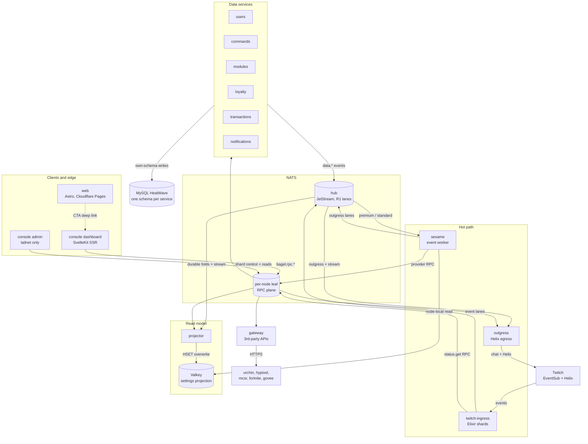

ItsBagelBot is an event-driven microservice platform that runs a production Twitch bot on a three-node self-hosted
fleet. Twitch events enter through an Elixir ingress that folds and lanes them onto NATS; a Go event worker
(sesame) reacts, runs per-broadcaster modules, and publishes actions; a single egress service (outgress) executes
every Twitch call under a fleet-wide rate budget. Configuration and identity live in per-schema Go data services on
MySQL HeatWave, each the sole writer of its schema, and a projector folds their change events into a Valkey read
model the hot path reads instead of joining across databases. Humans reach the platform through a SvelteKit console
(a public broadcaster dashboard and a tailnet-only operator admin), and a static Astro site markets it from the
edge. The only inter-service transport is NATS: subject-based pub/sub for events, request-reply for RPC, with no
service ever reading another service's database ([ADR 0001](/adr/0001-rewriting-to-microservices/),
[ADR 0003](/adr/0003-adoption-of-nats-as-communication-bridge/),
[ADR 0007](/adr/0007-adoption-of-per-schema-data-microservices/)).

## The system at a glance

The hot path is a straight line: Twitch to ingress to a lane, sesame reacts, outgress sends. Everything to the side
of that line exists to keep the line fast: the data services own the durable truth, the projector keeps a
denormalized copy of it in Valkey so the worker never blocks on MySQL, and the console mutates the truth through the
owning service and lets the change pipeline reconverge every cache. The two NATS planes are deliberate: the shared
BUS account carries the JetStream firehose straight to the hub, and each service's own RPC account stays on its
node-local leaf.

## The 4+1 views and where each one lives

We document the system as Kruchten's 4+1 view model, so a reader can pick the view that answers their question
rather than reading the whole system top to bottom. Each service page is itself a small 4+1: a class diagram
(logical), sequence diagrams and NATS contracts (process), a deployment section (physical), and key flows
(scenarios).

| View | What it answers | Where it lives |
|---|---|---|
| Logical | Structure and responsibilities: the types, interfaces, and packages, and the patterns they realize | The class diagram and design-notes section on each [service page](/microservices/), and [Data plane class design](/data-and-state/design/) for the data services |
| Process | Concurrency and runtime interaction: consumers, queue groups, sequence flows, and the subject contracts | The sequence diagrams and NATS-contract tables on each service page, plus the full [RPC contracts](/reference/rpc-contracts/) surface |
| Physical | Deployment: nodes, replicas, placement, probes, and rollout behavior | [Hardware and cluster](/infrastructure/hardware-and-cluster/), [Networking](/infrastructure/networking/), and the deployment section on each service page |
| Development | Module organization and delivery: the repo layout, the shared `pkg/*` libraries, and the GitOps build train | The repo structure under `app/`, `pkg/`, `console/`, `web/`, and the delivery pipeline in [Hardware and cluster](/infrastructure/hardware-and-cluster/) |
| Scenarios (+1) | The use cases that tie the views together end to end | [System state](/reference/system-overview/) for the load-bearing walkthroughs, and the key-flow sequences on each service page |

## Architectural style

The style is named precisely, because each choice is an ADR with a stated trade.

- **Event-driven microservices on NATS.** Services are independently deployable, own one concern, and communicate
  only over NATS: fire-and-forget pub/sub for events, request-reply for RPC ([ADR 0001](/adr/0001-rewriting-to-microservices/),
  [ADR 0003](/adr/0003-adoption-of-nats-as-communication-bridge/)). Account isolation makes the boundaries
  structural: a shared BUS account plus per-service RPC accounts with explicit import and export lines, so a
  compromised credential reaches only the subjects its account imports.
- **Per-schema bounded contexts, single writer.** Each data service owns exactly one MySQL schema and is its only
  writer, enforced by a per-schema database user rather than convention ([ADR 0007](/adr/0007-adoption-of-per-schema-data-microservices/)).
  State that crosses a boundary travels as a full-state event (event-carried state transfer), so a consumer updates
  itself from the event alone and redelivery is harmless.
- **CQRS-flavored read model with a projection.** The write side is the normalized per-schema MySQL truth; the read
  side is a denormalized Valkey hash per user that the projector folds from the change events. The hot path reads the
  projection, never a write-side schema, and losing Valkey loses latency, not data ([ADR 0009](/adr/0009-adoption-of-valkey-for-the-settings-projection/)).
- **Write-behind for re-submittable state.** Settings edits are bursty, so module and command writes coalesce
  through a write-behind batcher and land one transaction per flush window, returning the caller an optimistic reply
  ([ADR 0008](/adr/0008-caching-and-write-behind-strategy/)). The money and identity paths (tier, tokens, Tebex
  records, config compare-and-swap) write through immediately; the rule is stated on the batcher type itself.

## Quality attributes and the tactics that deliver them

Each attribute is tied to the concrete tactic the code implements and the page that details it, in SEI/Bass
vocabulary.

| Attribute | Tactic in the code | Where it is detailed |
|---|---|---|
| Availability | Heartbeat and health RPC, removal from service (readiness gating, PodDisruptionBudgets, drain hooks), active redundancy (Horde shard failover and rescue sessions, three-replica data services), and deliberate fail-open versus fail-closed choices (the ban check fails open, the outgress kill switch and lease floor fail closed) | [Twitch Ingress](/microservices/twitch-ingress/), [Outgress](/microservices/outgress/), [Console](/microservices/console/), [Hardware and cluster](/infrastructure/hardware-and-cluster/) |
| Scalability | Sharding (Conduit shards, per-scheduler publishers, RPC queue groups spreading load) and autoscaling (KEDA on sesame and outgress by CPU plus JetStream lag, the ingress shard autoscaler from measured load) | [Twitch Ingress](/microservices/twitch-ingress/), [Sesame](/microservices/sesame/), [Outgress](/microservices/outgress/) |
| Performance | Queue-based load leveling (the memory-backed firehose lanes absorb bursts into an autoscaling drain), the Valkey projection and node-local replica reads keeping the hot path off MySQL, in-process stale-while-revalidate caches, and an allocation-free no-output chat path | [Projector](/microservices/projector/), [Sesame](/microservices/sesame/), [Caching and write-behind](/data-and-state/caching/) |
| Security | Per-account NATS isolation with export-gated secret subjects, encrypt-at-rest with per-record associated data (Tink AEAD for tokens and the Govee key), a tailnet-only operator surface with a DB-backed staff roster, WireGuard plus native TLS on the wire, and a default-deny NetworkPolicy | [Users](/microservices/users/), [Modules](/microservices/modules/), [Console](/microservices/console/), [Networking](/infrastructure/networking/) |
| Modifiability | Pluggable engines (sesame's `modules.All`, the gateway's `providers.All`: adding a feature is one file plus one line), event-carried state transfer decoupling every consumer from a schema, and Protected Variations seams (interfaces over Valkey, NATS, and crypto) | [Sesame](/microservices/sesame/), [Gateway](/microservices/gateway/), [Data plane design](/data-and-state/design/) |

## A note on method

The documentation follows the software-engineering practice taught in Concordia University's software engineering
curriculum: UML 2.5 modeling with GRASP responsibility assignment and applied GoF design patterns (SOEN 343),
architectural views and quality-attribute tactics (SOEN 344), verification and acceptance practice (SOEN 345),
security analysis and least-privilege design (SOEN 321), and an architecture-decision-record process for capturing
significant choices with their context and consequences (SOEN 341 and SOEN 384). Every diagram uses UML relationship
semantics deliberately, every pattern claim points at a concrete type in the code, and every load-bearing decision
is an [ADR](/adr/) rather than a paragraph of prose.

## Where to go next

- [Service registry](/microservices/): every service, what it owns, and how it authenticates.
- [System state](/reference/system-overview/): the end-to-end walkthroughs (a chat message, a dashboard write, a
  go-live).
- [RPC contracts](/reference/rpc-contracts/): the full request-reply surface, grouped by owning service.
- [Data and state](/data-and-state/): the write side, the projection, and the caching and write-behind machinery.
- [Architecture decisions](/adr/): the ADRs behind every choice above.
