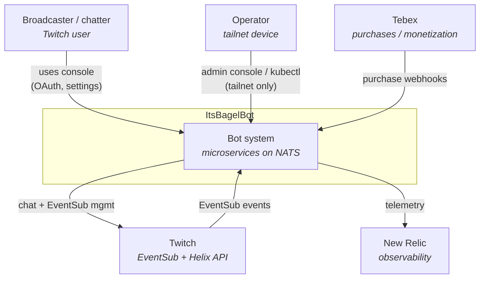

ItsBagelBot is a fully scalable, high-availability Twitch bot that extends into new
services by adding the appropriate ingress workers. This makes it easy to drive
multi-platform streamers from a single configuration.

We keep the footprint of each service small to reduce the hardware and energy cost
of the system.

This page is the **C4 Level 1 (System Context) view**. It deliberately hides
everything inside the bot and shows only the actors that interact with it and the
external systems it depends on. For what's inside the box, see
[Microservices →](/microservices/). For the running shape (data plane, bus, request
flow), see [System state →](/reference/system-overview/).

## Context diagram

## Actors and external systems

| Party | Relationship |
|---|---|
| **Broadcaster / chatter** | Drives the bot through Twitch chat and EventSub; configures it through the console (Twitch OAuth via arctic). |
| **Operator** | Runs the bot. Reaches the admin console and `kubectl` over the Tailscale tailnet only; no public path. |
| **Twitch** | Source of EventSub events (ingress) and target for chat sends + EventSub management (outgress), via the Helix API and the bot account token. |
| **Tebex** | Monetization. Purchase records flow into the transactions service and promote a broadcaster's tier (paid). |
| **New Relic** | Observability sink for the Go and Elixir services. |

The bot's only public surface is the broadcaster console, served through the
outbound cloudflared tunnel. Everything operator-facing is tailnet-only. Inside the
box, services talk exclusively over NATS.