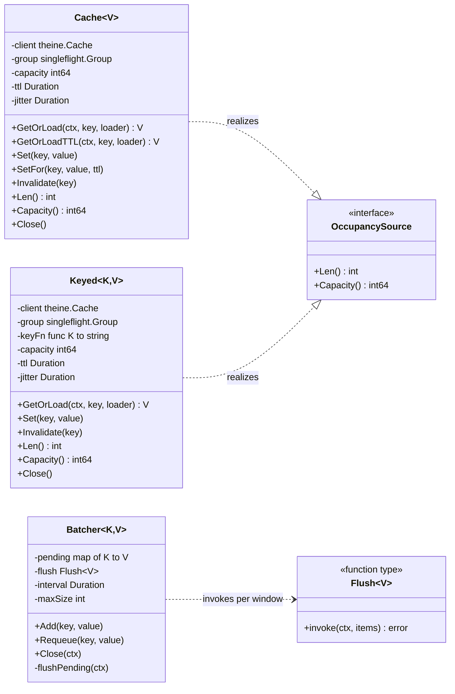
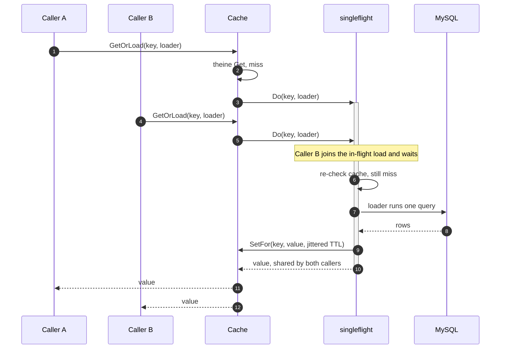
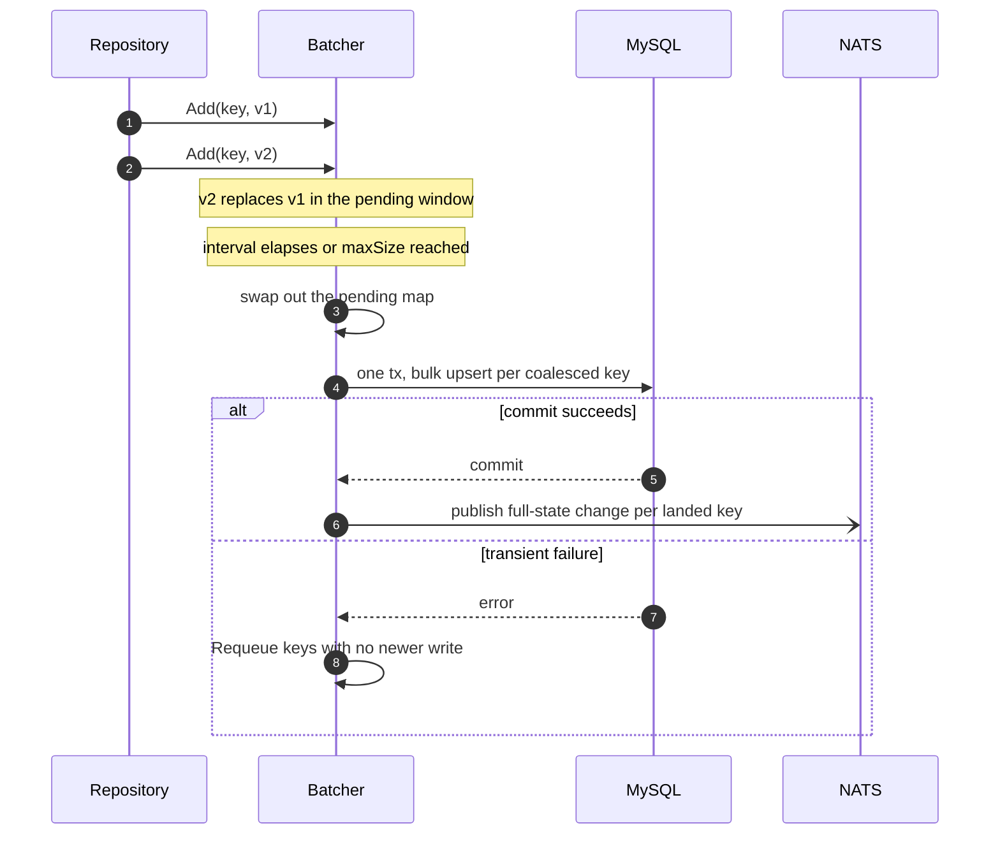
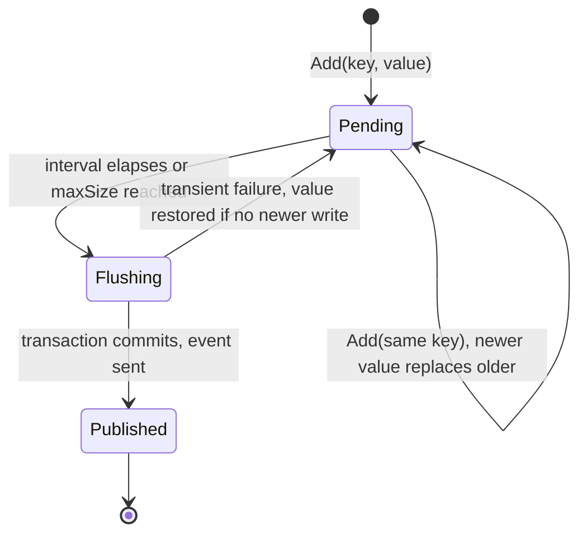

Two reusable packages keep the shared HeatWave instance off the hot path: `pkg/cache`, an in-process read-through
cache with stampede protection, and `pkg/batch`, a coalescing write-behind batcher
([ADR 0008](/adr/0008-caching-and-write-behind-strategy/)). Both are generic and carry no domain knowledge, so every
repository and the worker's projection client compose the same machinery. This page documents their real API shape,
the read and write flows, and the batcher's state machine.

## The machinery

`Cache` and `Keyed` are the same read-through cache with two key strategies. `Cache~V~` is string-keyed and covers
the common case (everything keyed by a `settings:<id>` style string). `Keyed~K,V~` is keyed by an arbitrary
comparable, so a hot path holding a `uint64` broadcaster id pays no string allocation on a cache hit; the key is
stringified through `keyFn` only on the miss and invalidate paths, which feed singleflight. Both wrap `theine-go` for
the TTL store and `golang.org/x/sync/singleflight` for miss coalescing, and both satisfy `OccupancySource` so a
service can log how full a mix of caches runs (`StartOccupancyLogger`) and tune each capacity to its working set. Two
small allocation-free helpers build the keys the hot paths use: `UserKey(prefix, id)` and `PairKey(prefix, id, name)`.

`Batcher~K,V~` is the write side. It coalesces writes per key and hands each window to a `Flush~V~` callback, which is
where a repository puts its bulk upsert.

## Read path

A read is served from the in-process TTL cache, and two protections target the two classic stampede vectors.
Concurrent misses on one key collapse into a single loader call through singleflight, and TTLs carry a random jitter
of up to 10 percent so entries written together never expire together. Failed loads are never cached, so a transient
database error cannot poison a key for a whole TTL.

The sequence below shows two goroutines missing the same key at the same time. The second joins the flight opened by
the first and shares its result; the database sees exactly one query.

`GetOrLoadTTL` is the same read with a loader-selected TTL, which lets a caller give positive and negative results
different freshness windows (the worker caches a "no such command" result so unknown `!word` spam never reaches Valkey
twice). `Invalidate` drops the key and calls `Forget` on the flight, so a stale flight in progress cannot repopulate
the cache after the new state has already landed. That is what makes event-driven invalidation correct: the TTL is a
ceiling, not the norm, because change events evict ahead of expiry.

Sizing is explicit. `DefaultCapacity` is a generous 10000 for cold paths and tests, but an always-on service sizes
each cache to its working set: the worker's projection caches run 4096 for users and modules and 8192 for commands,
the last larger because negative `!word` entries churn it fastest. The repositories run their view caches at 4096 with
a 5 minute TTL; the worker runs a much shorter TTL (tens of seconds) so edits propagate quickly while still absorbing
per-message bursts.

## Write path

Module and command edits go through the write-behind batcher. Writes to the same key within a flush window (2
seconds, or 256 pending keys, whichever comes first) collapse into the latest value, and the whole window lands in one
database transaction. The repository returns to its caller as soon as it enqueues, so a streamer flipping a toggle
five times costs one row write, and the change event publishes only after the commit.

The `Flush` callback is where the coalescing meets the schema. The [modules](/microservices/modules/) repository's
flush lands the whole window as one `INSERT ... ON DUPLICATE KEY UPDATE`; if that statement fails it falls back to
per-item writes so one unpersistable row cannot wedge the entire batch in a retry loop forever. A row the database
will never accept (a validation or constraint error) is dropped with a log; a transiently failing row is handed to
`Requeue`, which restores it to the pending window only if no newer write for the same key arrived in the meantime.
Whatever actually landed is then invalidated locally and announced on the bus.

The flush window is also the durability window: a value sits in memory for at most the flush interval before it is
persisted. That trade is acceptable only for state a user can re-submit, so the money and identity paths never go
through the batcher:

- **Always direct.** Tier status changes, OAuth token writes, Tebex records, command deletions, and module config
  compare-and-swap. A deletion is immediate so a removed command stops firing right away; a config patch is
  synchronous because the compare-and-swap needs the current row.
- **Write-behind.** Module toggles and configs (via `Set`), and command creations and edits.

Shutdown is clean: `Close` stops the background loop and flushes whatever is pending before the process exits, so a
graceful `SIGTERM` never loses the last window.

## Lifecycle of a batched write

One pending entry moves through three states. A failed flush returns the value to the pending window, unless a newer
write for the same key arrived while the flush ran, in which case the newer value wins (the same rule `Requeue`
applies to a single item).

## Invalidation correctness

The invalidation rules across a horizontally scaled fleet, stated once:

- The instance that wrote invalidates its own cache synchronously, so it reads its own writes immediately.
- Every other instance of the same service invalidates when the full-state change event arrives on its broadcast
  subscription (no queue group, so every instance sees it).
- The projector consumes the same events through its durable group and overwrites Valkey, so redelivery is harmless,
  then emits a push-invalidation so hot-path readers evict the exact entry that changed (see
  [Settings projection](/data-and-state/projection/)).
- Consumers must stay idempotent: the bus is at-least-once
  ([ADR 0003](/adr/0003-adoption-of-nats-as-communication-bridge/)), and full-state payloads are what make replay
  safe.

## References

- [ADR 0008](/adr/0008-caching-and-write-behind-strategy/): the caching and write-behind decision.
- [ADR 0003](/adr/0003-adoption-of-nats-as-communication-bridge/): the bus that carries invalidation.
- Sibling pages: [Data plane design](/data-and-state/design/), [Database design](/data-and-state/database/),
  [Settings projection](/data-and-state/projection/).
