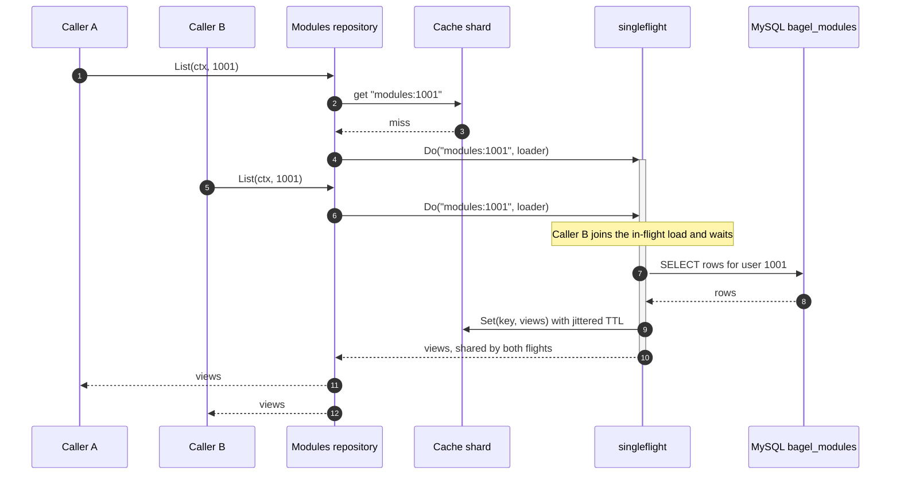
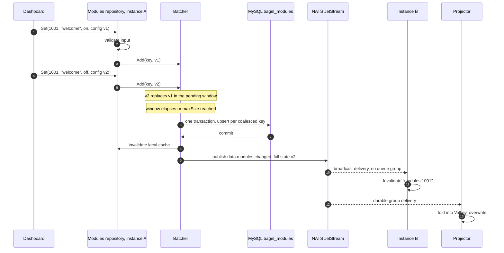
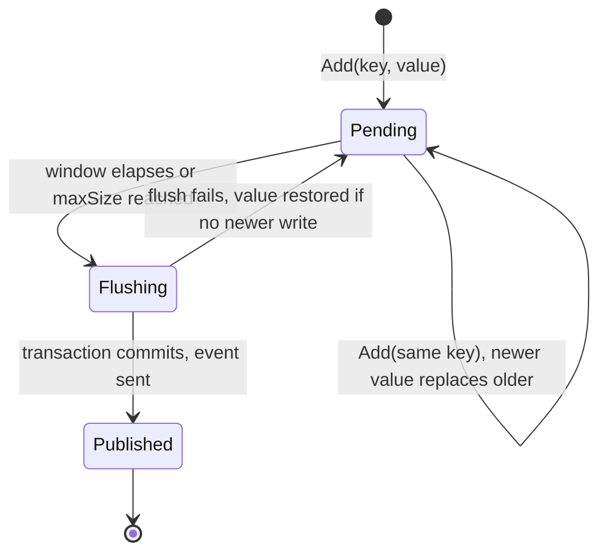

Two mechanisms keep the free HeatWave instance off the hot path: an in-process cache with stampede protection on
the read side, and a coalescing write-behind batcher on the write side. Both publish and consume the change events
from the [overview](/data-and-state/), so a fleet of instances stays coherent without sharing memory.

## Read path

Reads are served from a sharded in-process TTL cache (`pkg/cache`). Two protections target the two classic stampede
vectors: concurrent misses on one key collapse into a single query through singleflight, and TTLs carry a random
jitter of up to 10% so entries written together never expire together. Errors are never cached.

The sequence below shows two goroutines missing the same key at the same time. The second one blocks on the flight
opened by the first and shares its result; the database sees exactly one query.

A change event arriving from any instance invalidates the key and also forgets any in-flight load for it, so a
stale flight cannot repopulate the cache after the new state landed. The 5 minute TTL is therefore a ceiling, not
the norm: events invalidate ahead of expiry.

## Write path

Settings writes go through the write-behind batcher (`pkg/batch`). Writes to the same key within a flush window
(2 seconds, or 256 pending keys, whichever comes first) collapse into the latest value, and the whole window lands
in one database transaction. Events publish only after the commit and carry the full new state.

The flush window is also the durability window: a value sits in memory for at most the flush interval before it is
persisted. That trade is acceptable only for state a user can re-submit, so the money path never goes through the
batcher:

- **Always direct:** Tebex transactions (duplicate IDs from webhook retries count as already recorded), tier status
  changes, token writes, command deletions.
- **Write-behind:** module toggles and configs, command creations and edits.

## Lifecycle of a batched write

The state machine of one pending entry. A failed flush returns the value to the pending window, unless a newer
write for the same key arrived in the meantime, in which case the newer value wins.

Shutdown closes the batcher, which flushes whatever is pending before the process exits.

## Invalidation correctness

The invalidation rules, stated once:

- The instance that wrote invalidates its own cache synchronously, so it reads its own writes immediately.
- Every other instance invalidates when the change event arrives on the broadcast subscription.
- The projector consumes the same events through its durable group and overwrites, so redelivery is harmless.
- Consumers must stay idempotent: the bus is at-least-once
  ([ADR 0003](/adr/0003-adoption-of-nats-as-communication-bridge/)), and full-state payloads are what make replay
  safe.
