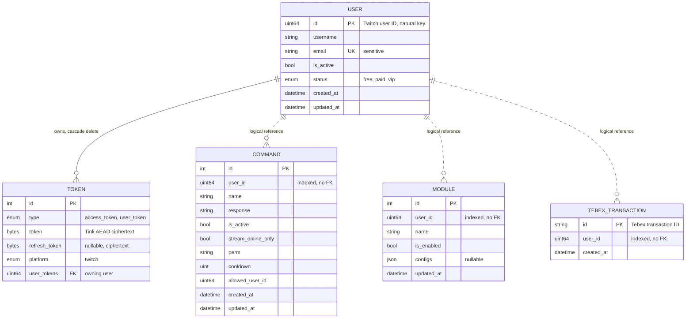
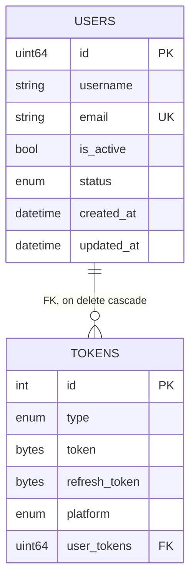
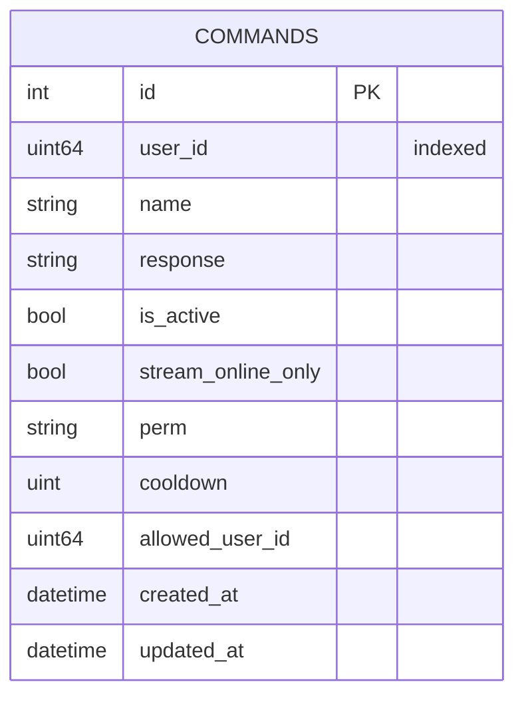
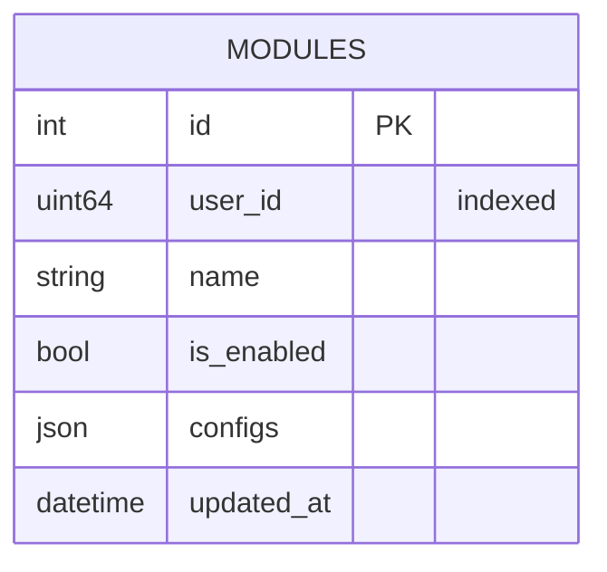
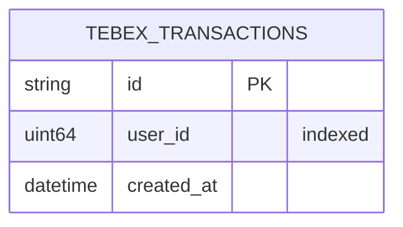

The design follows the classic two-step: a conceptual entity-relationship model first, then its mapping to physical
relational schemas. The twist is that the mapping is split across four isolated MySQL schemas
([ADR 0005](/adr/0005-adoption-of-mysql-heatwave/)), so relationships that cross a service boundary exist only in
the conceptual model and are enforced by the application, never by a foreign key.

## Conceptual model

Crow's foot notation. Solid lines are identifying relationships enforced by a foreign key inside one schema; dashed
lines are non-identifying, logical references across schemas, carried by a plain Twitch user ID column.

## Physical schemas

Each service generates its schema from its own ent definitions and migrates it on startup. The session settings are
pinned at the connection level rather than trusted as server defaults: `utf8mb4`, `READ COMMITTED`, strict SQL mode,
UTC.

### `bagel_users` (users service)

The only schema with a real foreign key, because users and tokens live in the same bounded context and change
together (a login refreshes both inside one transaction).

Indexes: unique on `email`, composite on `(id, is_active)`, and a unique composite on `(type, platform, user)` so a
user holds at most one token per type and platform. The token columns store only Tink AEAD ciphertext; the
associated data binds each envelope to its owner, type, and platform, so a ciphertext copied onto another row fails
authentication on decrypt.

### `bagel_commands` (commands service)

Indexes: unique composite on `(user_id, name)`, which both enforces "one command name per channel" and serves the
per-channel lookup.

### `bagel_modules` (modules service)

Indexes: unique composite on `(user_id, name)`. The `configs` column is opaque JSON owned by the module that reads
it; the database only guarantees it is valid JSON of bounded size (see the integrity rules below).

### `bagel_transactions` (transactions service)

The natural key is the Tebex transaction ID itself. Inserting an existing ID is treated as "already recorded", which
makes webhook retries idempotent without a read before the write.

## Integrity rules

Integrity is enforced in two layers. The schema layer carries what the database can express: primary keys, unique
constraints, enum domains, NOT NULL, and the single in-schema foreign key with cascade. The application layer
(`internal/domain/validate`) carries the domain constraints the database cannot, applied at every repository
boundary, rejecting rather than rewriting:

| Input | Rule |
|-------|------|
| User ID | Non-zero |
| Username | 1-25 characters of `[a-zA-Z0-9_]` |
| Email | RFC 5322 address, 254 max, no smuggled display name or CRLF |
| Command name | 1-64 printable ASCII characters, no whitespace |
| Command response | 1-500 characters, no control characters |
| Module name | 1-64 characters of `[a-z0-9_-]`, strict because it becomes part of a Valkey hash field |
| Module config | Valid JSON, 16 KiB cap |
| Transaction ID | 1-64 characters of `[a-zA-Z0-9_-]` |
| Token | 1 byte to 8 KiB, stored only as ciphertext |

ent parameterizes every query, so SQL injection is closed at the access layer; the rules above target domain
validity, resource caps, and projection key safety.

## Normalization

Every table is in BCNF. The argument is short because the schemas are deliberately narrow:

- `users`: all non-key attributes depend on the Twitch ID alone; `email` is an additional candidate key and
  determines nothing beyond itself.
- `tokens`: the candidate key `(user, type, platform)` determines the ciphertext columns; the surrogate `id` exists
  for ent's benefit, not as a hiding place for dependencies.
- `commands` and `modules`: all attributes depend on the candidate key `(user_id, name)` in full; there are no
  partial or transitive dependencies.
- `tebex_transactions`: two attributes, one key, nothing to decompose.

The one deliberate denormalization in the system lives outside MySQL: the Valkey projection duplicates status and
module state as a read model (see [Settings projection](/data-and-state/projection/)). That copy is a cache,
rebuildable at any time, and never the system of record.
