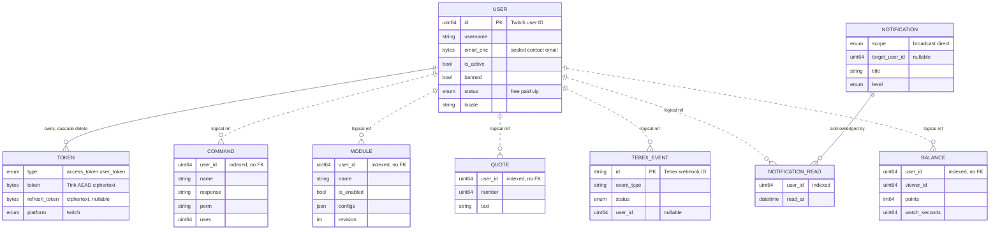
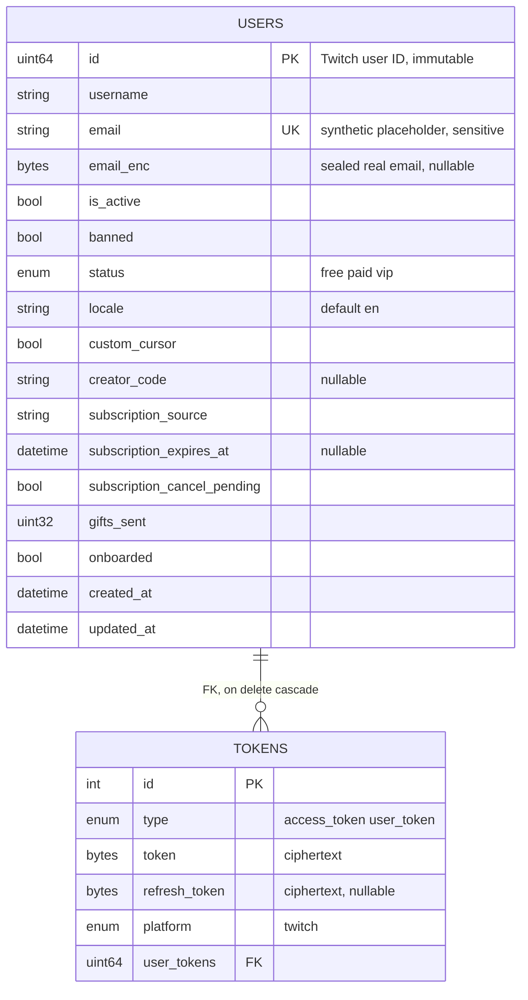
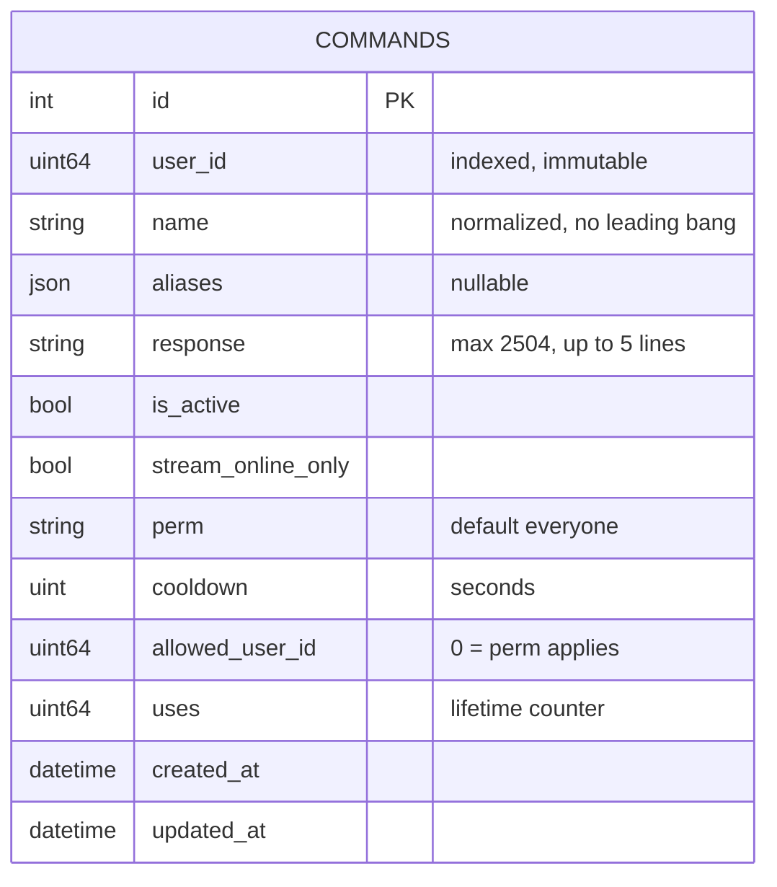
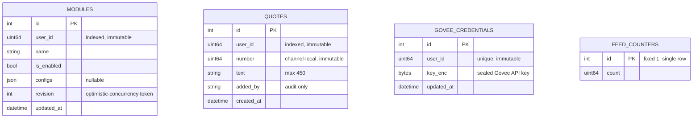
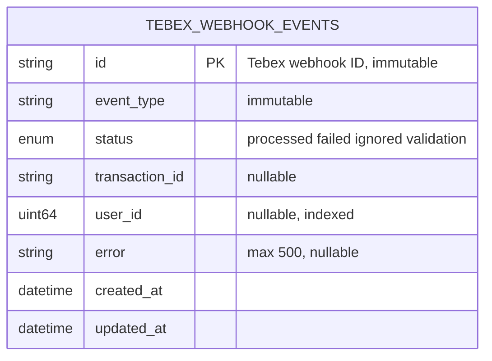
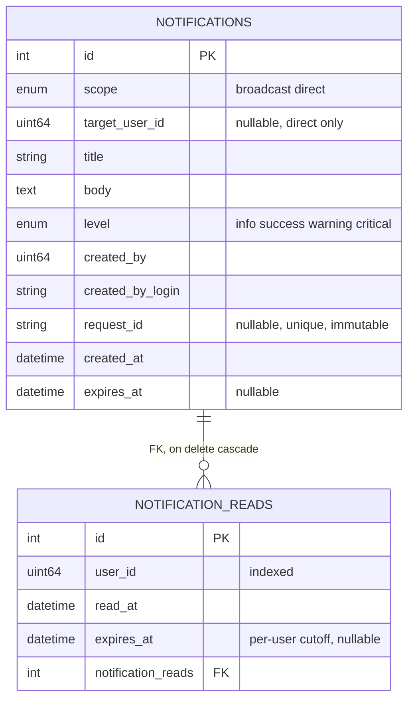
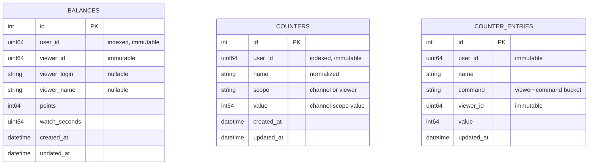

The relational store is a single managed MySQL HeatWave instance ([ADR 0005](/adr/0005-adoption-of-mysql-heatwave/)),
carved into one isolated schema per bounded-context service ([ADR 0007](/adr/0007-adoption-of-per-schema-data-microservices/)).
A service authenticates as its own MySQL user, sees only its own schema, and is the only writer of it. Relationships
that would cross a service boundary exist only in the conceptual model and are carried by a plain indexed Twitch user
ID column, never by a foreign key. This page maps the conceptual model to the physical schemas, states the integrity
rules, and gives the normalization argument.

## Schemas and their owners

Six services own a schema; the projector owns none (its state lives in Valkey). Each service generates its schema
from its own `ent/schema` directory and runs `ent`'s auto-migration on startup, so the schema is created and evolved
by the code that owns it.

| Service | Schema | Tables |
|---------|--------|--------|
| [users](/microservices/users/) | `bagel_users` | `users`, `tokens`, `admin_users`, `admin_audits`, `delegations` |
| [commands](/microservices/commands/) | `bagel_commands` | `commands` |
| [modules](/microservices/modules/) | `bagel_modules` | `modules`, `quotes`, `govee_credentials`, `feed_counters` |
| [transactions](/microservices/transactions/) | `bagel_transactions` | `tebex_webhook_events` |
| [notifications](/microservices/notifications/) | `bagel_notifications` | `notifications`, `notification_reads` |
| loyalty | `bagel_loyalty` | `balances`, `counters`, `counter_entries` |

## Conceptual model

The user is the hub of the whole system. Every other context references the user by its Twitch ID. Solid lines are
identifying relationships enforced by a foreign key inside one schema; dashed lines are non-identifying logical
references that cross a schema boundary and are enforced by the application, never by the database.

Only two foreign keys exist in the whole system, and both live inside a single schema: user to token in
`bagel_users`, and notification to notification-read in `bagel_notifications`. Everything else is a logical reference
resolved by an event or an RPC.

## Physical schemas

The connection settings are pinned at the connection level (`pkg/db`) rather than trusted as server defaults:
`utf8mb4_unicode_ci`, `READ-COMMITTED`, strict SQL mode (`STRICT_TRANS_TABLES,NO_ZERO_DATE,NO_ZERO_IN_DATE,ERROR_FOR_DIVISION_BY_ZERO`),
and UTC. TLS is mandatory and pins the HeatWave endpoint CA (the managed certificate carries no SAN, so the client
verifies the presented chain back to the pinned root itself instead of matching a hostname).

### `bagel_users`

The identity context, and the only place with real foreign keys. Users and their tokens change together (a login
refreshes both inside one transaction), which is exactly why they are one bounded context rather than two.

The `users` row carries the full billing posture next to the tier status on purpose, so that a webhook retry applies
idempotently and a Tebex cancellation can never revoke a permanent VIP or a staff grant. The `email` column is a
synthetic placeholder kept unique for legacy reasons; the real contact address, captured at Twitch login, lives in
`email_enc` as a Tink AEAD envelope bound to the user id, so a database leak never exposes an address. Tokens store
only ciphertext; the associated data binds each envelope to its owner, type, and platform, so a ciphertext copied
onto another row fails authentication on decrypt. The unique index on `(type, platform, user)` holds a user to at
most one token per type and platform.

The identity context also holds three operator tables that share the schema but reference no user by FK:
`admin_users` (the staff roster: `moderator`, `admin`, `owner` tiers with an `active` flag), `admin_audits` (an
append-only who-did-what log, denormalizing the actor login so the record survives an admin's removal), and
`delegations` (single-use scoped dashboard-access grants consumed exactly once on the invitee's login).

### `bagel_commands`

The unique index on `(user_id, name)` both enforces "one command name per channel" and serves the per-channel
lookup. A schema hook normalizes the name on write (strip a leading `!`, lower-case, trim), so `!test` and `test`
resolve to the same row. The `response` column is sized to the worst case (5 lines of 500 characters plus separators)
so it outgrows the dialect's default varchar. `uses` is a loss-tolerant lifetime counter: the worker aggregates
executions locally and the commands service folds the summed `data.commands.used` events into the row on its own
batch flush, so a spammed command costs one write per window, not one per run.

### `bagel_modules`

`modules` carries a `revision` column that is the optimistic-concurrency token for config writes: a partial config
patch bumps it and rejects any write whose expected revision no longer matches, so two clients editing the same module
cannot silently clobber each other (see the compare-and-swap on the [modules](/microservices/modules/) page). The
unique index on `(user_id, name)` is the natural key. Three sibling tables share the schema: `quotes` (channel-local
quote numbers that leave holes on delete so the numbers chat knows never move), `govee_credentials` (one broadcaster's
Govee API key sealed at rest as Tink AEAD ciphertext, never projected in cleartext), and `feed_counters` (a single
global row, id fixed at 1, for the personality module's lifetime "feed the bagel" tally).

### `bagel_transactions`

The money context stores webhook processing state, not payments: Tebex remains the system of record for payment
details. The natural key is the Tebex webhook ID, so re-processing a delivered webhook is an insert of an existing
key, which makes retries idempotent without a read before the write. Secondary indexes on `status`, `event_type`,
`user_id`, and `transaction_id` serve the operator's audit queries.

### `bagel_notifications`

A notification is either a `broadcast` (everyone) or a `direct` message to one `target_user_id`. The `request_id` is
unique and immutable so one admin send is idempotent across every delivery. Read state is a row per
`(notification, user)`, and the per-user `expires_at` is a visibility cutoff: a full read sets a short one, a dropdown
peek a longer one, and the notification drops out of that user's list once it passes even though the rows still exist.

### `bagel_loyalty`

The loyalty context stores standings, never events, so the tables grow with distinct viewers, not with activity.
`balances` is one row per `(broadcaster, viewer)`, created lazily on the first accrual and only ever grown by additive
batch flushes; the `(user_id, points)` index serves top-N leaderboard reads. `counters` holds a named counter's
definition and, for channel scope, its value; a viewer-scoped counter keeps per-viewer values in `counter_entries`,
which uses a flat natural key `(user_id, name, command, viewer_id)` so the additive bulk upserts on the flush path
stay a single statement with no id lookups.

## The grants model

Isolation is structural, enforced by MySQL privileges, not by convention:

- **One user per schema.** Each service connects with `DB_USER` / `DB_PASS` scoped to its own schema and has no grant
  on any other. A bug that tries to read another service's table is denied by the server, not merely by code review.
- **Own-schema DDL only.** `ent`'s auto-migration (`client.Schema.Create`) runs on startup, so each service's user
  holds `CREATE`, `ALTER`, and index privileges on its own schema, which is what lets the code that owns a schema
  evolve it. `DB_AUTO_MIGRATE=false` disables the migration for an environment that manages DDL out of band.
- **Administrative credentials are separate.** Schema and user provisioning, and any cross-schema operator work, use a
  distinct administrative credential held out of the service configuration entirely, so a leaked service password
  cannot escalate past its one schema.

The connection pool is bounded small (a default of 4 open connections, 30 minute max lifetime, 5 minute max idle)
because every service shares the same 8 GB HeatWave instance. An in-process concurrency gate (`DB_QUERY_CONCURRENCY`)
sits in front of the pool so request goroutines queue instead of piling up during a dashboard or admin burst, which
is queue-based load leveling applied to the database itself.

### Database configuration

| Variable | Purpose |
|----------|---------|
| `DB_ADDR` | HeatWave endpoint `host:port` |
| `DB_USER` | Per-service MySQL user (required) |
| `DB_PASS` | Per-service password (required) |
| `DB_SCHEMA` | The service's schema, defaulting to its `bagel_<service>` name |
| `DB_CA_CERT` | PEM of the HeatWave endpoint CA, pinned for TLS; connections fail closed without it |
| `DB_MAX_OPEN_CONNS` | Pool ceiling (default 4) |
| `DB_QUERY_CONCURRENCY` | In-process concurrency gate size |
| `DB_AUTO_MIGRATE` | Run `ent` auto-migration on boot (default true) |

## Integrity rules

Integrity is enforced in two layers. The **schema layer** carries what the database can express: primary and unique
keys, enum domains, NOT NULL, and the two in-schema foreign keys with cascade. The **application layer**
(`internal/domain/validate`) carries the domain constraints the database cannot, applied at every trust boundary
(repository methods fed by RPC or webhooks, and event payloads consumed from the bus), rejecting rather than
rewriting:

| Input | Rule |
|-------|------|
| User ID | Non-zero |
| Username | 1 to 25 characters of `[a-zA-Z0-9_]` (Twitch login limit) |
| Email | RFC 5321/5322 address, 254 max, exact match so no display name or comment is smuggled in |
| Command name | 1 to 64 printable ASCII characters, no whitespace, plus the content floor |
| Command aliases | Each a valid command name, unique case-insensitively, at most 25 |
| Command response | 1 to 5 lines, each 1 to 500 characters, no control characters, plus the content floor |
| Perm | One of `everyone`, `sub`, `vip`, `mod`, `lead_mod`, `broadcaster` |
| Cooldown | 0 to 86400 seconds |
| Module name | 1 to 64 characters of `[a-z0-9_-]`, strict because the name becomes a Valkey hash field |
| Module config | Valid JSON, 16 KiB cap, every string value passes the content floor |
| Token | 1 byte to 8 KiB, stored only as ciphertext |
| Status | `free`, `paid`, or `vip` |

Two of these are security tactics rather than plain validity checks. The module name charset is strict because the
name is interpolated into a Valkey hash field (`module:<name>:enabled`); a colon in a name could otherwise forge
another field, so the write boundary refuses it. The **content floor** (`FloorClean`, an injectable moderation hook)
runs over the normalized skeleton of any text the bot would post as itself (command names, responses, and every
string in a module config), folding leet and lookalike obfuscation onto the plain spelling and refusing identity
slurs and abuse infrastructure at save time, regardless of any per-channel automod setting. `ent` parameterizes every
query, so SQL injection is closed at the access layer; the rules above target domain validity, resource caps, and
projection key safety.

## Normalization

Every table is in BCNF, and the argument is short because the schemas are deliberately narrow:

- `users`: all non-key attributes depend on the Twitch ID alone; `email` is an additional candidate key and
  determines nothing beyond itself.
- `tokens`: the candidate key `(user, type, platform)` determines the ciphertext columns; the surrogate `id` exists
  for `ent`'s benefit, not as a hiding place for dependencies.
- `commands`, `modules`, `quotes`, `counters`: every attribute depends on the full candidate key
  (`(user_id, name)`, or `(user_id, number)` for quotes) with no partial or transitive dependency.
- `balances` and `counter_entries`: attributes depend on `(user_id, viewer_id)` and
  `(user_id, name, command, viewer_id)` respectively; the denormalized viewer login and name are a deliberate,
  refreshable display cache, not a dependency of the key.
- `tebex_webhook_events`, `notifications`: audit and message rows whose non-key attributes depend on the row's own
  key alone.

The one deliberate denormalization in the system lives outside MySQL: the Valkey projection duplicates status and
settings as a read model (see [Settings projection](/data-and-state/projection/)). That copy is a cache, rebuildable
at any time from the schemas above, and never the system of record.

## References

- [ADR 0005](/adr/0005-adoption-of-mysql-heatwave/): MySQL HeatWave and per-schema isolation.
- [ADR 0007](/adr/0007-adoption-of-per-schema-data-microservices/): the bounded-context split.
- [ADR 0008](/adr/0008-caching-and-write-behind-strategy/): the write paths that feed these tables.
- Sibling pages: [Data plane design](/data-and-state/design/), [Caching and write-behind](/data-and-state/caching/),
  [Settings projection](/data-and-state/projection/).
