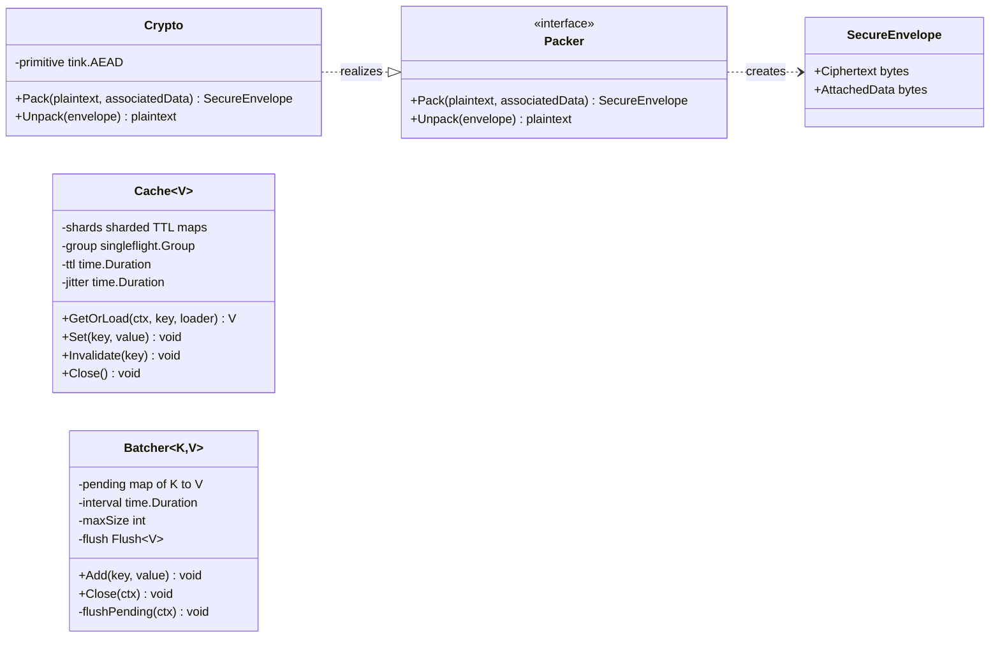
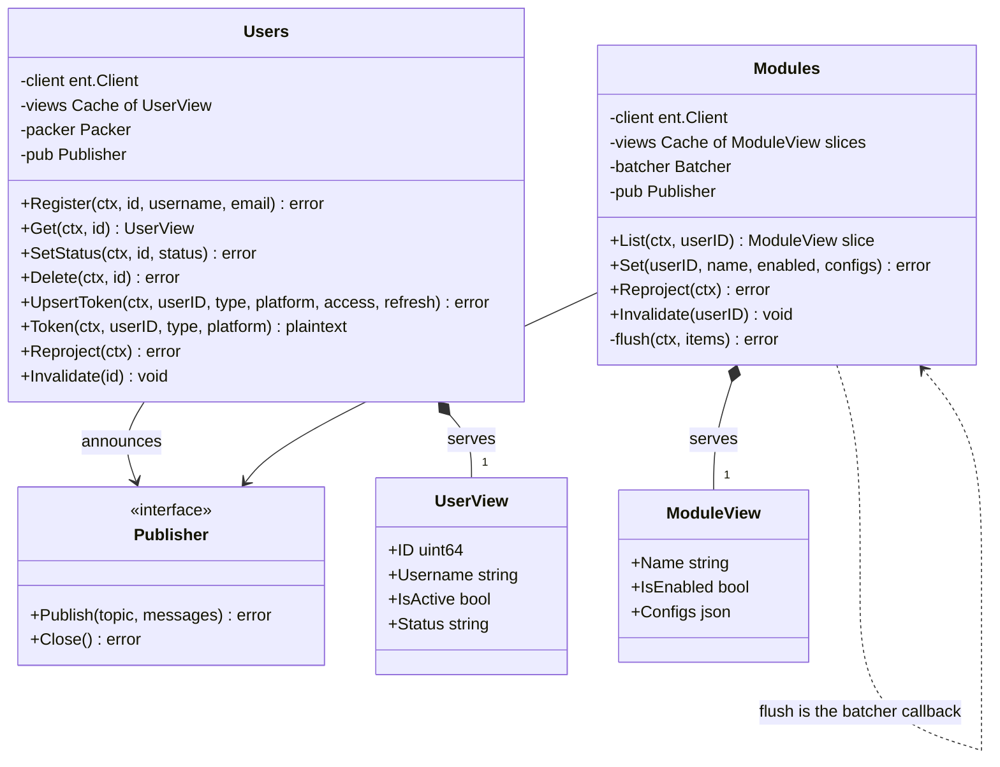

The data plane separates domain contracts (`internal/domain`), reusable infrastructure (`pkg/`), and the service
code that composes them (`app/`). Dependencies point inward: repositories depend on interfaces and on the generic
infrastructure, never the other way around.

## Shared infrastructure

The crypto adapter realizes the domain's `Packer` interface, so the services depend on the abstraction and Tink
stays an implementation detail. The cache and the batcher are generic and carry no domain knowledge.

## Repositories

One diagram per shape: the users repository writes through directly and seals tokens; the modules repository (the
commands one is its twin) routes settings writes through the batcher and hands the batcher its `flush` method as
the callback. All collaborators arrive by constructor injection, which is what lets the tests substitute an
in-memory SQLite client and a recording publisher.

The composition (filled diamond) between a repository and its cache and batcher is deliberate: the repository
creates and owns them, and closing the repository closes them. The publisher and the packer are associations to
interfaces owned elsewhere, injected at construction.

## Patterns in play

| Pattern | Where | Why |
|---------|-------|-----|
| Repository (PoEAA) | `app/*/repository` | One object per aggregate mediating between domain and ent, the seam every test uses |
| Data Transfer Object | `internal/domain/event/data`, the view structs | Full-state payloads across the bus, sensitive-field-free views in the caches |
| Publish/Subscribe (Observer at system scale) | `pkg/bus` over NATS | Decouples writers from every reader: caches, projector, future consumers |
| Event-Carried State Transfer | All change events | Consumers update from the event alone; no service reads another's schema |
| Read-Through cache with request coalescing | `pkg/cache` | Singleflight guarantees one loader per key regardless of concurrency |
| Write-Behind | `pkg/batch` | Coalesces per key and lands one transaction per window instead of one write per click |
| CQRS, read model | `app/projector` and Valkey | The write side stays normalized in MySQL; the read side is a denormalized projection |
| Adapter | `pkg/crypto` (Tink behind `Packer`), `pkg/bus` (zap behind Watermill's logger) | Third-party APIs stay behind owned interfaces |
| Dependency Injection | Every `NewX` constructor | Composition happens in `main`, tests inject fakes |
| Idempotent Receiver | Every consumer, `Transactions.Record` | At-least-once delivery and webhook retries must not double-apply |

## Where the patterns are not

Just as deliberate as the patterns used are the ones avoided. There is no service locator and no global registry:
everything arrives by constructor. There is no shared kernel of entities between services: each owns its ent
schema, and the only shared types are the event DTOs. And there is no premature abstraction over the database: the
repositories speak ent directly, because swapping MySQL is already covered at the driver and dialect level
([ADR 0005](/adr/0005-adoption-of-mysql-heatwave/)).
