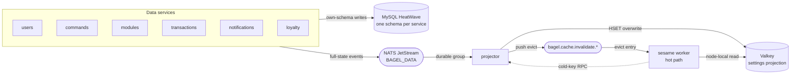
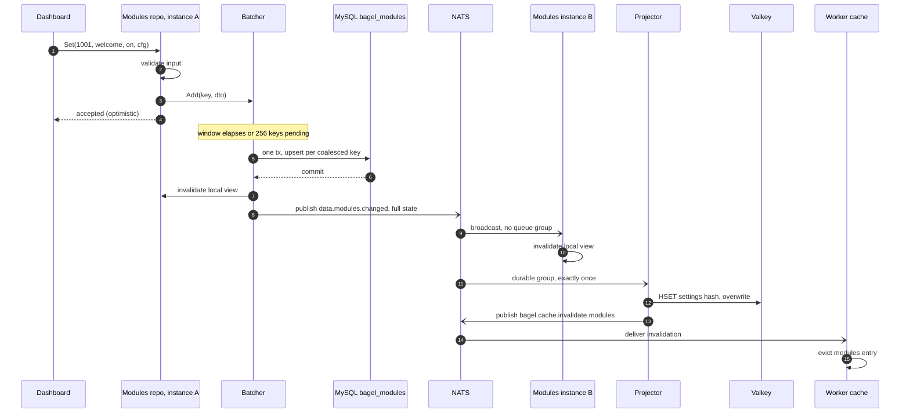

The data plane is a set of bounded-context services under `app/`, each the sole owner and sole writer of one MySQL
schema on HeatWave ([ADR 0005](/adr/0005-adoption-of-mysql-heatwave/), [ADR 0007](/adr/0007-adoption-of-per-schema-data-microservices/)).
No service reads another's tables. State that has to cross a boundary travels as a full-state event on NATS
([ADR 0003](/adr/0003-adoption-of-nats-as-communication-bridge/)), and the hot path (reacting to a chat message)
reads none of these schemas at all: it reads a denormalized projection in Valkey that the projector keeps fresh
([ADR 0009](/adr/0009-adoption-of-valkey-for-the-settings-projection/)).

This page is the conceptual view. The sibling pages go deeper: [Database design](/data-and-state/database/) for the
schemas and integrity rules, [Caching and write-behind](/data-and-state/caching/) for the reusable machinery, and
[Settings projection](/data-and-state/projection/) for the read model and its rebuild protocol.

## Ownership boundaries

Every piece of durable state has exactly one owner, and the owner is the only writer. Dependencies point inward:
repositories depend on the domain contracts (`internal/domain`) and the generic infrastructure (`pkg/`), never the
other way around.

| Owner | Schema | Owns |
|-------|--------|------|
| [users](/microservices/users/) | `bagel_users` | User records, OAuth tokens (sealed), tier status, staff roster, delegations |
| [commands](/microservices/commands/) | `bagel_commands` | Custom chat commands and their lifetime use counters |
| [modules](/microservices/modules/) | `bagel_modules` | Module toggles and configs, quotes, the sealed Govee key, the feed counter |
| [transactions](/microservices/transactions/) | `bagel_transactions` | Tebex webhook processing records |
| [notifications](/microservices/notifications/) | `bagel_notifications` | Operator notifications and per-user read state |
| loyalty | `bagel_loyalty` | Per-channel viewer balances and named counters |
| [projector](/microservices/projector/) | (no schema) | The Valkey settings projection, built from the events above |

Three rules follow from this layout and hold everywhere:

- **Single writer.** A row is written only by its owner. A reader that needs someone else's data consumes the event
  or asks over RPC, and never opens a connection to a schema it does not own. HeatWave enforces this with a per-schema
  MySQL user; the isolation is structural, not a convention.
- **Full-state events.** Every change event carries the complete new state of the row (event-carried state transfer),
  so a consumer updates itself from the event alone. This is what makes redelivery and full replay safe: applying the
  same event twice lands the same state.
- **The projection is a cache.** Valkey holds a rebuildable read model, never the system of record. MySQL can
  reconstruct it from scratch at any time, so losing Valkey loses latency, not data.

## The data plane end to end

Writes land in MySQL through the owning service. The commit is announced on `BAGEL_DATA`, the replayable data event
bus. The projector consumes those events through a durable group (exactly one projector pod folds each event) and
overwrites the affected fields of the user's Valkey hash. After the projection is written, the projector fans a small
push-invalidation message out so the hot-path readers drop the exact in-process entry that changed, instead of waiting
for a TTL. The worker reads the projection from its node-local Valkey replica and falls through to the projector over
RPC only on a cold key.

## Write-behind

Settings edits are bursty and re-submittable: a streamer flips a toggle five times in two seconds or iterates on a
command's wording. Writing each keystroke straight to the shared HeatWave instance would spend the database's capacity
persisting states that were obsolete before they committed. So module and command edits go through a coalescing
write-behind batcher ([ADR 0008](/adr/0008-caching-and-write-behind-strategy/)): writes to the same key inside a flush
window collapse to the latest value, and the whole window lands as one transaction. The repository returns to the
caller optimistically, and the durability window is the flush interval.

That trade is only acceptable for state a user can re-submit, so the money path and identity path never touch the
batcher. Tier status changes, OAuth token writes, Tebex records, and module config compare-and-swap all write through
immediately. The rule is stated on the batcher type itself and enforced at each call site.

The canonical cycle, a module toggle from the dashboard through to the worker's cache:

Two event families run over the bus and it is worth keeping them apart. The **change events** (`data.users.changed`,
`data.modules.changed`, `data.commands.changed`, `data.users.deleted`) are the full-state records on `BAGEL_DATA`;
the projector and every peer instance fold them. The **push-invalidation events** (`bagel.cache.invalidate.<scope>`)
are tiny core-NATS pings the projector emits after Valkey is written, so a hot-path reader evicts exactly the entry
that changed. Change events are correctness (they carry the state); invalidations are latency (they only say what went
stale). A lost invalidation costs one TTL of staleness, never data.

## The two Valkey read modes

Valkey runs as three Sentinel-managed replicas with the master on `node2`, native TLS on 6380, and one instance per
node. The client library (`pkg/valkey`) exposes two read routes on purpose, because read-your-write correctness and
per-message latency want opposite things.

- **Node-local reads (the default).** Read-only commands go to the pod's own node-local Valkey instance (the
  `valkey-local` Service is `internalTrafficPolicy: Local`, so kube-proxy never crosses a node). That instance is a
  replica everywhere except the master node, so a read can lag the master by a replication hop. For the hot path this
  is the right trade: a chat message wants the lowest-latency read and tolerates a few milliseconds of staleness that
  the next event corrects anyway.
- **Primary-pinned reads.** A path that must observe its own write wraps the client in `Primary(...)`, which routes
  its reads to the Sentinel-elected master. Any read-after-write in the projection uses it (for example the store's
  alias-retirement read-modify-write, which never converges if it reads a stale replica). `IsPrimary` lets a store
  assert the wrap in a test, so dropping it in a refactor fails a test instead of silently reintroducing lag.

There is a third, related pin. Keyspace expiry notifications fire only on the master, so the timer clock and the
live-recheck watchers ([sesame](/microservices/sesame/)) subscribe on a dedicated master-pinned pub/sub connection.
A subscription against a replica would simply never receive the expired-key events. The client isolates that
long-lived subscription on its own lazy connection so services that never subscribe pay nothing for it.

## Patterns and tactics

The named responsibilities and patterns that genuinely appear, each pointed at the concrete type that embodies it:

| Pattern or tactic | Where | Role |
|-------------------|-------|------|
| Repository (PoEAA) | `app/*/repository` | One object per aggregate mediating domain and ent, the seam every test injects through |
| Information Expert (GRASP) | each repository | The owner of a schema is the only code that reads or writes it |
| Event-carried state transfer | `internal/domain/event/data` | Full-state DTOs let consumers update without a callback query |
| Publish/subscribe (Observer at system scale) | `pkg/bus` over NATS | Decouples the writer from caches, projector, and future consumers |
| CQRS read model | projector plus Valkey | Normalized write side in MySQL, denormalized read side in Valkey |
| Write-behind | `pkg/batch` | Coalesces per key, one transaction per window |
| Read-through with request coalescing | `pkg/cache` | Singleflight guarantees one loader per key under any concurrency |
| Adapter (GoF) | `pkg/crypto`, `pkg/bus`, `pkg/valkey` | Third-party APIs stay behind owned interfaces |
| Idempotent receiver | every consumer, `TebexWebhookEvents` | At-least-once delivery and webhook retries must not double-apply |
| Protected Variations (GRASP) | `Packer`, `Reader`, `bus.Publisher` | Volatile dependencies sit behind stable interfaces |

Queue-based load leveling and rate limiting show up as tactics: the batcher levels write bursts into one transaction
per window, the in-process caches level read bursts off the database, and the projection levels the entire hot path
off MySQL.

## Where the patterns are not

Just as deliberate as the patterns used are the ones avoided. There is no service locator and no global registry:
every collaborator arrives by constructor injection, which is what lets tests substitute an in-memory SQLite client
and a recording publisher. There is no shared kernel of entities between services: each owns its ent schema, and the
only shared types are the event DTOs. And there is no premature abstraction over the database: the repositories speak
ent directly, because the door to a future engine swap is already held open at the driver and dialect level
([ADR 0005](/adr/0005-adoption-of-mysql-heatwave/)).

## References

- [ADR 0001](/adr/0001-rewriting-to-microservices/): the rewrite to microservices.
- [ADR 0003](/adr/0003-adoption-of-nats-as-communication-bridge/): NATS as the communication substrate.
- [ADR 0005](/adr/0005-adoption-of-mysql-heatwave/): the relational store and per-schema isolation.
- [ADR 0007](/adr/0007-adoption-of-per-schema-data-microservices/): the bounded-context split.
- [ADR 0008](/adr/0008-caching-and-write-behind-strategy/): caching and write-behind.
- [ADR 0009](/adr/0009-adoption-of-valkey-for-the-settings-projection/): the Valkey projection.
- Sibling pages: [Database design](/data-and-state/database/), [Caching and write-behind](/data-and-state/caching/),
  [Settings projection](/data-and-state/projection/).
