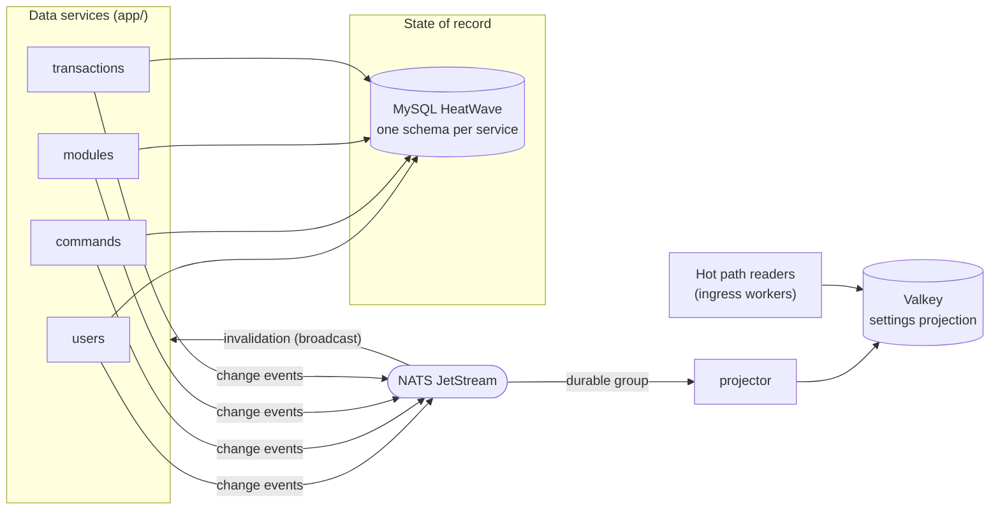

The data plane is four bounded-context services plus a projector, all under `app/`. Each service owns its own MySQL
schema on HeatWave ([ADR 0005](/adr/0005-adoption-of-mysql-heatwave/)), announces every committed change as an event
on NATS ([ADR 0003](/adr/0003-adoption-of-nats-as-communication-bridge/)), and the projector folds those events into
the Valkey settings projection that the hot path reads.

This page is the component view. The rest of the section goes deeper:

- [Database design](/data-and-state/database/): the conceptual model, the physical schemas, and the integrity rules.
- [Caching and write-behind](/data-and-state/caching/): the read and write paths, with their UML sequence and state
  diagrams.
- [Class design](/data-and-state/design/): the UML class diagrams and the design patterns in play.
- [Settings projection](/data-and-state/projection/): the Valkey layout and the rebuild protocol.

## Component diagram

## Ownership

| Service | Schema | Owns | Write path |
|---------|--------|------|------------|
| `app/users` | `bagel_users` | User records (Twitch ID, username, email, active flag, tier status) and OAuth tokens as Tink AEAD ciphertext | Direct, always |
| `app/commands` | `bagel_commands` | Custom chat commands | Write-behind (deletes direct) |
| `app/modules` | `bagel_modules` | Module toggles and JSON configurations | Write-behind |
| `app/transactions` | `bagel_transactions` | Tebex transaction ID and owning user, nothing else | Direct, always, idempotent on retry |
| `app/projector` | none | The Valkey projection (disposable, rebuildable) | Event-driven overwrites |

Cross-service references are a plain indexed Twitch user ID column. There are no foreign keys across schemas, by
construction.

## Event contracts

The subjects and payload DTOs live in `internal/domain/event/data` and are a public contract: renaming a subject or
narrowing a payload is a breaking change. Every payload carries the full new state (event-carried state transfer),
so consumers never read another service's schema and redelivery is harmless.

| Subject | Payload | Published when |
|---------|---------|----------------|
| `data.users.changed` | full user view (ID, username, active, status) | Registration, rename, tier change |
| `data.users.deleted` | user ID | User deletion |
| `data.modules.changed` | user ID, module name, enabled, config JSON | Each module row landed by a flush |
| `data.commands.changed` | user ID, name, response, active, stream-online-only, permissions, cooldown, allowed user, deleted flag | Each command row landed by a flush, and deletions |
| `data.transactions.recorded` | transaction ID, user ID | First successful record of a transaction |
| `data.reproject.request` | empty | Projector cold start; owners replay their state as ordinary change events |

Two subscription shapes, on purpose:

- **Broadcast (no queue group):** cache invalidation. Every instance of a service drops its cached keys when any
  instance writes.
- **Durable queue group:** the projector, and the reproject responders. Exactly one consumer per group handles each
  event, and the group keeps its position across restarts.

Consumers validate every payload and **drop** (log and ack) what fails to decode or validate. Nacking a poison
message would redeliver it forever.

## Configuration

Every service reads its configuration from the environment. Common variables:

| Variable | Default | Used by |
|----------|---------|---------|
| `APP_ENV` | `development` | all (logger profile) |
| `NATS_URL` | `nats://127.0.0.1:4222` | all |
| `DB_ADDR` | `127.0.0.1:3306` | data services |
| `DB_USER`, `DB_PASS` | required | data services |
| `DB_SCHEMA` | `bagel_<service>` | data services |
| `DB_CA_CERT` | unset (encrypted only) | data services; set to the HeatWave CA PEM to verify the server chain without hostname/SAN verification |
| `TINK_KEYSET_PATH` | required | users |
| `VALKEY_ADDR` | `127.0.0.1:6379` | projector |
| `VALKEY_PASSWORD` | empty | projector |
| `NEW_RELIC_LICENSE_KEY` | empty (monitoring disabled) | all |

Monitoring is a no-op without a license key, so local development needs none of the `NEW_RELIC_*` variables.
