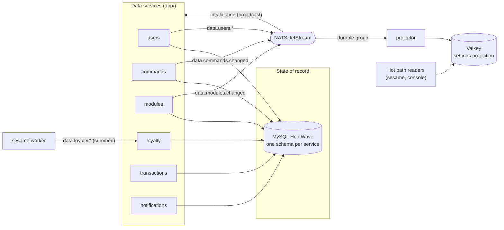

The data plane is six per-schema data services plus a projector, all under `app/`. Each data service owns its own
MySQL schema on HeatWave ([ADR 0005](/adr/0005-adoption-of-mysql-heatwave/)) and is that schema's only writer; the
three settings services also announce every committed change as a full-state event on NATS
([ADR 0003](/adr/0003-adoption-of-nats-as-communication-bridge/)), and the projector folds those events into the
Valkey settings projection that the hot path reads.

This page is the component view. The rest of the section goes deeper:

- [Database design](/data-and-state/database/): the conceptual model, the physical schemas, and the integrity rules.
- [Caching and write-behind](/data-and-state/caching/): the read and write paths, with their UML sequence and state
  diagrams.
- [Class design](/data-and-state/design/): the UML class diagrams and the design patterns in play.
- [Settings projection](/data-and-state/projection/): the Valkey layout and the rebuild protocol.

## Component diagram

Three shapes of data service live here. The **settings services** (users, commands, modules) publish full-state
`data.*` change events that the projector folds into Valkey. **Loyalty** is fed the other way: it consumes a firehose
of summed accrual deltas from sesame and never publishes a change event of its own. **Transactions** and
**notifications** own a schema and serve it entirely over RPC, with no projection feed at all.

## Ownership

| Service | Schema | Owns | Write path |
|---------|--------|------|------------|
| [users](/microservices/users/) | `bagel_users` | Accounts, tier status, the sealed OAuth token vault, the staff roster and audit, delegations | Direct, always |
| [commands](/microservices/commands/) | `bagel_commands` | Custom chat commands and their lifetime use counters | Write-behind (rename and delete direct) |
| [modules](/microservices/modules/) | `bagel_modules` | Module toggles and configs, the quote book, the feed counter, the sealed Govee key | Write-behind (config patch is a direct compare-and-swap) |
| [loyalty](/microservices/loyalty/) | `bagel_loyalty` | Per-viewer points, watch time, and named counters | Accumulate then bulk additive upsert |
| [transactions](/microservices/transactions/) | `bagel_transactions` | Tebex webhook processing records (audit only) | Direct, idempotent on retry |
| [notifications](/microservices/notifications/) | `bagel_notifications` | Dashboard notifications and per-user read state | Direct |
| [projector](/microservices/projector/) | none | The Valkey projection (disposable, rebuildable) | Event-driven overwrites |

Cross-service references are a plain indexed Twitch user id column. There are no foreign keys across schemas, by
construction.

## Event contracts

The subjects and payload DTOs live in `internal/domain/event/data` and are a public contract: renaming a subject or
narrowing a payload is a breaking change. Every change-event payload carries the full new state (event-carried state
transfer), so consumers never read another service's schema and redelivery is harmless.

| Subject | Payload | Published when | Publisher |
|---------|---------|----------------|-----------|
| `data.users.changed` | Full user view (id, username, active, status, banned, locale) | Registration, rename, tier change | users |
| `data.users.deleted` | User id | User deletion | users |
| `data.modules.changed` | User id, module name, enabled, config JSON | Each module row landed by a flush, patch, or reprojection | modules |
| `data.commands.changed` | Full command row, or `{user_id, name, deleted}` | Each command row landed by a flush, rename side, delete, and uses flush | commands |
| `data.commands.used` | User id, name, summed count | Per sesame window; folded by commands into `uses` | sesame |
| `data.loyalty.earned` / `data.loyalty.counters` | Summed point/watch and counter deltas, chunked per user | Per sesame window; folded by loyalty | sesame |
| `data.reproject.request` | Empty | Projector cold start; owners replay their state as ordinary change events | projector / admin |

There is no `data.transactions.recorded` subject: transactions is webhook-driven and RPC-only, and applies
entitlements through the users service rather than announcing them on the bus.

Two subscription shapes, on purpose:

- **Broadcast (no queue group):** cache invalidation and each service's own change-event fold. Every instance of a
  service drops its cached keys when any instance writes.
- **Durable queue group:** the projector folds, the loyalty and commands-uses folds, and the reproject responders.
  Exactly one consumer per group handles each event, and the group keeps its position across restarts.

Consumers validate every payload and **drop** (log and ack) what fails to decode or validate. Nacking a poison
message would redeliver it forever.

## Configuration

Every service reads its configuration from the environment. Common variables:

| Variable | Default | Used by |
|----------|---------|---------|
| `APP_ENV` | `development` | all (logger profile) |
| `NATS_HUB_URL` | (manifest) | data services (JetStream event plane, dialed direct) |
| `NATS_RPC_URL` / `NATS_LEAF_URL` | (manifest) | all (RPC and cache plane on the node-local leaf) |
| `NATS_CA_PEM` | (fleet CA) | all (verifies the broker's native TLS cert) |
| `NATS_RPC_USER` / `NATS_RPC_PASSWORD` | falls back to `NATS_USER` | all (per-service RPC account) |
| `DB_ADDR` | `127.0.0.1:3306` | data services |
| `DB_USER`, `DB_PASS` | required | data services (schema-scoped credentials) |
| `DB_SCHEMA` | `bagel_<service>` | data services |
| `DB_AUTO_MIGRATE` | `true` | data services (ent migrations at startup) |
| `TINK_KEYSET_PATH` | required (users), optional (modules) | at-rest AEAD encryption |
| `VALKEY_ADDR` | `127.0.0.1:6379` | projector |
| `NEW_RELIC_LICENSE_KEY` | empty (monitoring disabled) | all |

Monitoring is a no-op without a license key, so local development needs none of the `NEW_RELIC_*` variables.
