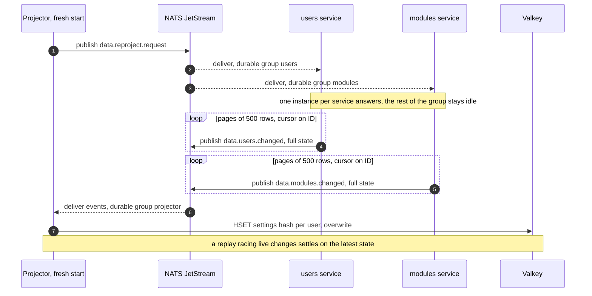

The hot path of the system is reacting to a chat message, and that read cannot touch MySQL. The projector
(`app/projector`) maintains a denormalized read model in Valkey: everything the hot path needs about a channel,
fetchable in one round trip. The projection is a cache, never the system of record; MySQL can rebuild it at any
time.

## Layout

One hash per user, readable with a single `HGETALL`:

```
settings:<user_id>
  status                  free | paid | vip
  active                  0 | 1
  live                    0 | 1
  module:<name>:enabled   0 | 1
  module:<name>:config    raw JSON
```

Readers parse nothing except the config blob of the module they actually use. Module names are validated at the
write boundary (lowercase alphanumerics, underscore, hyphen) precisely because the name is embedded in the field: a
colon in a name could otherwise forge another field.

Commands are deliberately not projected into Valkey. They are served by the commands service from its own
in-process cache, on a slower path; projecting them would grow every hash for data the hot path does not need on
every message. The worker still reads the `live` bit when a command is marked `stream_online_only`.

## Live flow

The projector consumes the user and module change events through a durable queue group, so each event is folded
exactly once and the consumer keeps its position across restarts. Every handler validates the payload, then
overwrites: `HSET` for changes, `DEL` for user deletion. Overwrite semantics are what make redelivery and replay
harmless.

## Rebuild: the reproject handshake

A fresh or wiped Valkey converges to the full projection without the projector ever reading another service's
schema. On startup the projector publishes a reproject request; each owning service replays its current rows as
ordinary change events, paged so a table is never loaded at once.



The handshake doubles as the reconciliation tool: if an event is ever missed beyond the JetStream retention window
([ADR 0003](/adr/0003-adoption-of-nats-as-communication-bridge/)), the projection is stale for the affected user
only until the next change or the next reproject.

## Failure posture

- **Valkey down:** no data is lost; the projection rebuilds from a reproject request once Valkey returns. Hot path
  readers must degrade deliberately while it is gone, which is their decision to make, not the projector's.
- **Projector down:** the durable group buffers its position; on restart it resumes where it stopped, inside the
  retention window.
- **Poison event:** validated, logged, and acknowledged away. The projection never blocks on a malformed message.
- **Why Valkey and not Redis:** same protocol, same clients, same data model; Valkey is the BSD-licensed,
  openly-governed fork, which matters for software that may be self-hosted indefinitely on the fleet from
  [ADR 0004](/adr/0004-adoption-of-oracle-cloud/).
