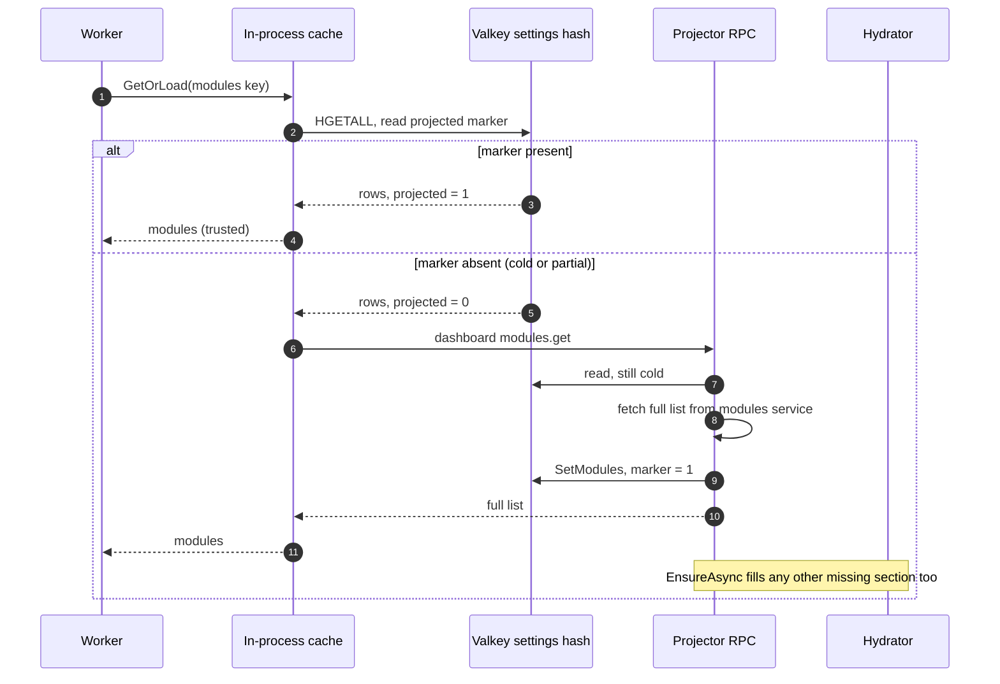
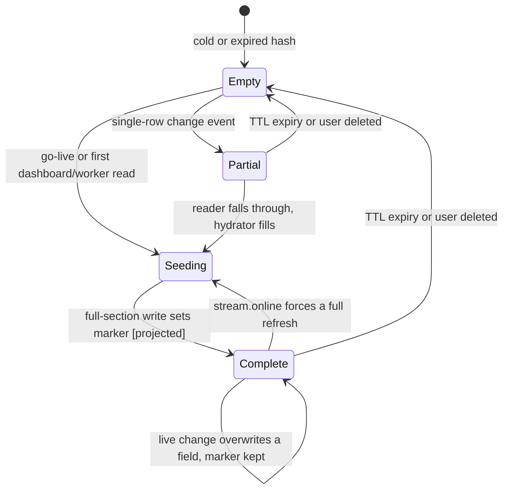

The hot path of the system is reacting to a chat message, and that read cannot touch MySQL. The
[projector](/microservices/projector/) maintains a denormalized read model in Valkey: everything the hot path needs
about a channel, fetchable in one round trip ([ADR 0009](/adr/0009-adoption-of-valkey-for-the-settings-projection/)).
The projection is a cache, never the system of record; MySQL can rebuild it at any time. The store itself lives in
`internal/projection` and is shared by the projector (the writer) and the [sesame](/microservices/sesame/) worker
(the reader), so both sides agree on the layout and the trust rules.

## Layout

One hash per user, readable with a single `HGETALL`:

```
settings:<user_id>
  status                  free | paid | vip
  active                  0 | 1
  banned                  0 | 1
  locale                  en | fr | ...
  live                    0 | 1
  modules:projected       1            (completeness marker)
  module:<name>:enabled   0 | 1
  module:<name>:config    raw JSON
  commands:projected      1            (completeness marker)
  command:<name>          command JSON
  cmdalias:<alias>        primary name (pointer)
```

A reader parses nothing except the config or command blob it actually uses. Commands are addressable individually, so
resolving one is a single `HGET` on `command:<name>`, not a whole-hash scan; an alias resolves in one extra `HGET`
through the `cmdalias:` pointer. Names are validated at the write boundary (module names to `[a-z0-9_-]`, commands to
printable ASCII without whitespace) precisely because the name is interpolated into the field: a colon in a name could
otherwise forge another field.

The `live` field is the projector's own copy of Twitch's stream-status signal, used to answer the broadcaster-live RPC
and to gate `stream_online_only` commands. It is maintained independently of the configuration sections and is not
part of hydration completeness.

Expiry is a floor, not a fixed lifetime. Every write extends the hash TTL with a pair of `EXPIRE` commands, one `NX`
(set a TTL on a hash that has none) and one `GT` (extend an existing shorter TTL), which together compute
`max(current, requested)` without a read-modify-write race. So a 2 hour query hydration can never shorten a 24 hour
live projection. `DefaultTTL` is 24 hours.

## The completeness markers

The projection distinguishes an intentionally empty section from a section it simply has not populated yet, using two
marker fields. `modules:projected` and `commands:projected` are set only by the full-section writes (`SetModules`,
`SetCommands`), never by a single-row write. This is the load-bearing rule of the whole read model:

**A reader trusts a section only when its marker is present.** A section without its marker reads as cold, and the
reader falls through to the projector RPC even if some rows happen to be there. That is what keeps a partial hash,
built one event at a time, from being mistaken for a complete list.

The user section has no separate marker: a non-empty `status` is its completeness signal. `GetHydrationState` reads
all three signals with one `HMGET` and reports which sections are complete.

## The read side

The worker reads the projection through a three-tier client (`internal/projection`), read-only the whole way down:

1. **In-process cache** (`pkg/cache`, short TTL): the hot path, no I/O.
2. **The Valkey `settings:<id>` hash**: the shared projection, read node-local.
3. **Projector RPC** on a cold key: modules and commands ask the projector's dashboard get verbs, users ask the users
   service's projection verb. The projector owns Valkey, so its miss path hydrates the projection and the next read
   is a Valkey hit. The worker never writes Valkey itself.

The fallback is driven entirely by the markers: `GetModules` and `GetCommands` return the rows plus a `projected`
flag, and the client only trusts the rows when `projected` is true. On a cold or unknown user the client fails safe
toward `standard`, never `premium`, so a projector outage can never promote traffic. This is where premium and
standard lane selection is decided on the worker side: `User.Premium()` mirrors the projector's tier rule (active, and
status in the paid set) so the worker's view agrees with the lane the ingress originally sorted the event onto.



## The live fold

The projector consumes the data-service change events through a durable queue group, so each event is folded exactly
once and the consumer keeps its position across restarts. Every handler validates the payload, then overwrites:
`HSET` for a change, `DEL` for a user deletion. Overwrite semantics are what make redelivery and replay harmless. A
malformed or invalid event is logged and acknowledged away, never nacked, because redelivering a poison message
forever helps no one.

Two things happen after Valkey is written. First, the projector emits a push-invalidation on
`bagel.cache.invalidate.<scope>` (core NATS, no queue group) so every hot-path reader drops the exact in-process entry
that changed instead of waiting for its TTL; command events carry the command name and every alias so only those
per-command entries are evicted, never a whole dictionary. Second, the stream lane
(`twitch.ingress.event.stream`) rides its own durable consumer: a stream event sets the `live` field synchronously
(a dropped live write would silently corrupt the live RPC fallback, so it nacks for redelivery on failure), and a
go-live event additionally triggers a full asynchronous refresh of the user's whole snapshot.

Note that the live change events (`SetModule`, `SetCommand`) deliberately do not set the section markers. A single
event landing on a cold hash writes its row but leaves the section reading as not-yet-projected, so the reader still
hydrates the full list rather than trusting one row as the whole picture.

## The hydration state machine

A user's hash moves through these states. The guard `[projected]` is the completeness marker; a full-section write is
the only transition that sets it.



- **Empty to Partial.** Trigger: a single-row change event (`data.modules.changed` or `data.commands.changed`) folds
  onto a hash that has no marker. The row is written, but the section marker is not, so the section stays untrusted.
- **Empty to Seeding.** Trigger: a `stream.online` event (`RefreshAsync`), or the first dashboard or worker read of a
  cold user (`EnsureAsync`). The hydrator fetches the missing sections from the data services over RPC.
- **Partial to Seeding.** Trigger: a reader falls through because a section's marker is absent. The hydrator fills
  exactly the missing sections; a section already complete is skipped.
- **Seeding to Complete.** Guard: `[projected]`. The full-section write (`SetModulesWithTTL`, `SetCommandsWithTTL`,
  and a non-empty user `status`) sets the marker, and `HydrationState.Complete()` becomes true. Reads are now served
  from Valkey.
- **Complete to Complete.** Trigger: a live change event overwrites a single field. The marker is untouched, so the
  section stays trusted and the new value is visible on the next read.
- **Complete to Seeding.** Trigger: a `stream.online` event forces a refresh (`RefreshAsync` runs with `force`) so a
  channel going live always gets the freshest full snapshot with the longer live TTL, even if it was already complete.
- **Complete or Partial to Empty.** Trigger: the hash TTL lapses, or a `data.users.deleted` event drops the whole
  hash with `DEL`.

Hydration concurrency is bounded and collapsed per user: simultaneous fills for one user share one flight, and a live
refresh arriving during a query fill runs afterward so the longer live TTL and freshest snapshot win.

## Rebuild and the reproject capability

Because completeness is per user and marker-gated, the projection converges lazily. A fresh or wiped Valkey needs no
bulk replay to be correct: the first read of any user (a dashboard load, a worker cold-key RPC, or a go-live) hydrates
that user's sections from the data services and stamps the markers, and the tier status arrives with the next
`data.users.changed`. Nothing serves stale data in the meantime, because an absent marker always falls through to RPC.

The event contract also reserves a bulk-replay path: `data.reproject.request` asks every data service to republish its
current rows as ordinary change events, paged by ID so a table is never loaded at once. The users and modules services
subscribe to it through their durable groups (so exactly one instance per service answers), and the NATS ACLs grant
the subject. Because the replayed events are single-row, they restore the field data and the user tier without faking
a section marker, so the marker-trust rule still governs when a reader trusts a rebuilt section. This is the designed
reconciliation tool for a mass reload; in the running system the lazy per-user hydration above is what keeps the
projection fresh.

## Mid-stream enrollment and the live seed

Twitch only delivers `stream.online` for sessions that begin after the EventSub subscription exists. A channel that
enrolls (or re-enrolls) while its stream is already running therefore never receives a go-live event for the session
in progress, so the projector's `RefreshAsync` never fires for it. Two safety nets cover the gap:

- **Live seed at enroll.** Right after an EventSub enroll, [outgress](/microservices/outgress/) resolves the
  broadcaster's current live state with a Helix check and writes it to the live projection, so a live-gated command
  does not read offline until the next stream.
- **Lazy section hydration.** The module and command sections hydrate on the first dashboard read or the worker's
  first cold-key RPC, exactly as for any cold user, and the markers are stamped then.

## Failure posture

- **Valkey down.** No data is lost; the projection re-derives from the data services once Valkey returns and readers
  hydrate lazily. Hot-path readers degrade deliberately while it is gone (fail safe toward standard), which is their
  decision to make, not the projector's.
- **Projector down.** The durable group buffers its position; on restart it resumes inside the JetStream retention
  window. Events older than the window are re-derived on the next read.
- **Poison event.** Validated, logged, and acknowledged away. The projection never blocks on a malformed message.
- **Missed invalidation.** A dropped `bagel.cache.invalidate` ping only delays a reader by one in-process TTL; the
  Valkey projection is already correct, so nothing is lost.

## References

- [ADR 0009](/adr/0009-adoption-of-valkey-for-the-settings-projection/): the projection decision and layout.
- [ADR 0003](/adr/0003-adoption-of-nats-as-communication-bridge/): the bus and its retention posture.
- [ADR 0008](/adr/0008-caching-and-write-behind-strategy/): the write-behind window that precedes an event.
- Related services: [projector](/microservices/projector/), [sesame](/microservices/sesame/),
  [outgress](/microservices/outgress/).
- Sibling pages: [Data plane design](/data-and-state/design/), [Caching and write-behind](/data-and-state/caching/),
  [Database design](/data-and-state/database/).
