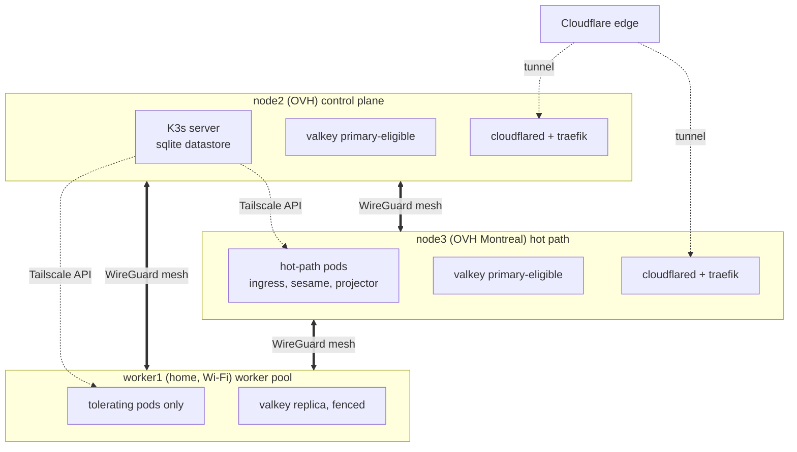
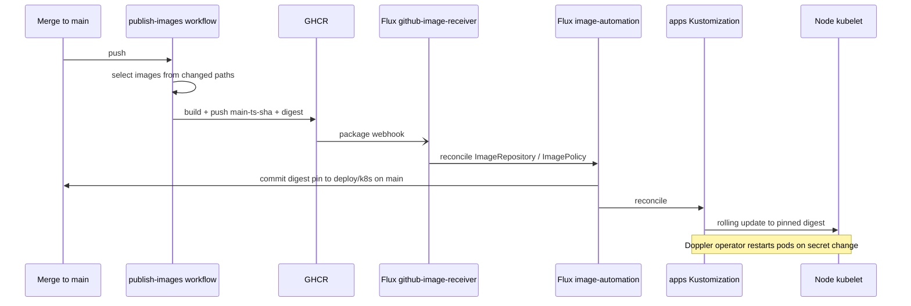

The cluster is intentionally small, intentionally self-hosted, and shaped by one constraint: it has to run a production Twitch bot on a one-person budget. Three Intel nodes, one K3s server, native binaries with tight limits ([ADR 0002](/adr/0002-adoption-of-go-as-primary-service-language/)), and a pull-based delivery pipeline that never needs a human with SSH. This page documents the physical fleet, the Kubernetes shape, how workloads are placed, and how images get from a merge to the nodes.

## Physical layout

The fleet is three x86_64 nodes. There is no ARM node, and images are built natively for Intel. node1 left the cluster in July 2026 and now runs off-cluster as a PostgreSQL host on the tailnet; it is not part of the application data path, whose database is managed MySQL HeatWave ([ADR 0005](/adr/0005-adoption-of-mysql-heatwave/)).

| Node | Provider / location | Role | Notes |
| --- | --- | --- | --- |
| node2 | OVH | K3s server, control plane | Single sqlite datastore; also an ingress and Valkey-eligible node |
| node3 | OVH Montreal | Hot-path worker | Runs the latency-sensitive services; Valkey-eligible |
| worker1 | Home, bare metal | Burst worker | Wi-Fi uplink (~270 Mbps); `worker-pool` taint; Valkey replica but fenced from primary |

worker1 carries a `itsbagelbot.dev/pool=worker-pool:NoSchedule` taint, so only pods that explicitly tolerate it land there. That keeps the flaky home node out of the failure domain for anything that cannot absorb its Wi-Fi tail.

## Kubernetes distribution: K3s

We run [K3s](https://k3s.io/), pinned to `v1.35.5+k3s1`, with a single server on node2 backed by the sqlite (kine) datastore. There is no HA control plane: one server is acceptable for a single-streamer workload, and a second server would spend a meaningful slice of a small fleet's CPU and RAM on control-plane overhead. The trade is that node2 is a single point of failure for the API, which shapes the backup and recovery posture below.

Deliberate configuration:

- **Flannel `wireguard-native`** is the CNI backend; the data plane is documented in [Networking](/infrastructure/networking/).
- **metrics-server and CoreDNS are handed to Flux.** The packaged metrics-server is disabled and the CoreDNS addon is skipped, so both run as Flux-owned manifests that keep kubelet collection and DNS on the intended interfaces.
- **kubelet is hardened:** `protect-kernel-defaults=true`, `make-iptables-util-chains=true`, image garbage collection at 55/45 percent, an `eviction-hard` threshold on memory and disk, and `serialize-image-pulls=true` so a cold node does not saturate its uplink pulling every image at once.
- **The server's Go runtime is capped** with `GOMEMLIMIT=1300MiB` and `GOGC=75`, delivered through the unit's environment file and tracked in ansible. The single control plane has no peer to absorb an OOM, so its heap is bounded on the 12 GB box that also hosts pods. Nothing automated ever restarts the server: applying a changed value is an explicit, human-timed action.
- **SELinux is enforcing** on every node.

The datastore is snapshotted every six hours along with an identity bundle for recovery. The K3s API and node SSH live on the Tailscale management plane; the kubeconfig distributed to operators binds to the server's tailnet address, not a LAN address.

## Scheduling and placement

The fleet has three nodes, and the hot path is anti-affinitied off worker1, so non-worker application deployments cap at two replicas: one on node2 and one on node3. Placement, disruption budgets, and rollout strategy are all sized for that shape.

| Workload | Replicas | Placement | Rollout |
| --- | --- | --- | --- |
| console-dashboard | 2 | One per non-worker node, hard anti-affinity | `maxSurge: 0` / `maxUnavailable: 1`, PDB `maxUnavailable: 1` |
| console-admin | 2 | One per non-worker node, hard anti-affinity | `maxSurge: 1` / `maxUnavailable: 0`, PDB `minAvailable: 1` |
| cloudflared | 2 | node2 and node3, hard anti-affinity | `maxSurge: 1` / `maxUnavailable: 0` |
| CoreDNS | DaemonSet | Every node | PDB `minAvailable: 2` |
| nats-leaf | DaemonSet | Every node (tolerates the taint) | `maxSurge: 1` / `maxUnavailable: 0`, lame-duck drain |
| Valkey | 3 | One per node (tolerates the taint), `maxSkew: 1` | RollingUpdate, PDB `maxUnavailable: 1` |

Hard anti-affinity across a small fleet has a known trap: a `maxSurge` greater than zero cannot place the surge pod when every eligible node already holds a replica, so the rollout deadlocks. console-dashboard resolves it with `maxSurge: 0` / `maxUnavailable: 1`, which rolls one pod at a time without needing a spare node. When a StatefulSet or Deployment does wedge on a broken pod, deleting that pod is the unblock.

Valkey is the one stateful workload that tolerates the worker-pool taint, so it lands one member per node including worker1. Only node2 and node3 are eligible to be the Sentinel-elected primary (`replica-priority 100`); worker1 and any other node are fenced (`replica-priority 0`) so a Wi-Fi node can never become the write primary. The Sentinel quorum is three co-located Sentinels, and the PDB allows only one voluntary disruption at a time to keep two votes reachable.

Priority classes line up with criticality: CoreDNS is `system-cluster-critical`, infrastructure such as Valkey and the NATS leaves sit at `infra-low`, and application pods take the default.

## Resource model

Every workload declares CPU and memory requests and limits. Native Go binaries make tight limits realistic: a service handling a normal Twitch event stream sits well under its request, so generous defaults would waste a real fraction of a small node. Observed sizing from the manifests:

| Workload | CPU request | Memory request | Memory limit |
| --- | --- | --- | --- |
| cloudflared | 25m | 64Mi | 256Mi |
| CoreDNS | 100m | 128Mi | 256Mi |
| nats-leaf | 50m | 96Mi | 512Mi |
| Valkey | 250m | 384Mi | 2Gi |

OOM kills are treated as a load signal, not a failure: if a service is OOM killed during a hype train, the response is to raise that service's limit, not to add slack everywhere.

Workloads are split by namespace: `production` for the bot services, `valkey` for the datastore, `cloudflared` and `kube-system` for edge, `tailscale` for the operator proxies, and `keda`, `falco`, `flux-system` for platform controllers.

## Delivery: pull-based GitOps

Nothing mutates the cluster by hand. CI publishes images to GHCR; Flux runs in-cluster and is the only actor that changes a Deployment. Images are pulled directly by each node, and the packages are public, so there is no registry credential anywhere in the cluster.

The pipeline is event-driven, not interval-driven: a GHCR publish fires a GitHub `package` webhook that reconciles the `ImageRepository`, the `ImagePolicy` picks the newest tag by its embedded timestamp, and `ImageUpdateAutomation` commits the `tag@sha256:<digest>` pin back to `main`. The one-hour intervals are only a backstop for a missed webhook. Once pinned, the digest is immutable; the tag alone cannot be moved without changing the digest already in git, and CI attests build provenance.

Which images a change rebuilds is decided by path mapping in the publish workflow:

- `app/<service>/*` rebuilds only that service.
- `pkg/*` or `internal/*` (plus `go.mod`, `go.sum`) rebuilds every root Go service, because a shared internal package is imported across them. A narrower list once shipped a sesame image without its matching projector.
- `console/shared/*` rebuilds both console apps.

Two ordering dependencies matter. The `apps` Kustomization `dependsOn` **keda** (so the ScaledObject CRD and webhook exist before outgress and sesame apply their ScaledObjects) and **pki** (so the cert-manager-issued NATS and console TLS secrets and the trust-manager CA ConfigMap exist before pods mount them). A frozen deploy train is usually one of those Kustomizations not reconciling, so check the Kustomizations first.

Secrets come from the Doppler Kubernetes operator. A secret change auto-restarts the consuming app through a reload annotation. NATS is the exception: its leaves reload configuration and rotated certificates through a SIGHUP from the config-reloader sidecar, so a config or cert change hot-reloads without a pod restart.

## Observability and security

New Relic is the observability backend: a Go agent in each service, fleet dashboards, and alert workflows ([ADR 0010](/adr/0010-adoption-of-new-relic-for-observability/)). Logs ship through a fluent-bit pipeline; NATS and Valkey expose Prometheus metrics that the cluster bundle scrapes. The concrete tracing and capacity-telemetry plan is the [New Relic bottleneck plan](/infrastructure/new-relic-bottleneck-plan/).

Falco runs as a `modern_ebpf` DaemonSet on every node (tolerating the worker-pool taint), brought under Flux through the Helm controller, with three false-positive allowlist families tuned against the stock ruleset that was emitting thousands of noise events a day. PKI is cert-manager plus trust-manager: they issue the NATS hub, NATS leaf, and console TLS certificates and publish the fleet CA that services trust. Runtime network segmentation is the `default-deny` NetworkPolicy documented in [Networking](/infrastructure/networking/).

## Failure modes and recovery

| Failure | Response |
| --- | --- |
| Single node lost | Two-replica apps keep serving on the surviving node; DaemonSets shrink by one; Valkey re-elects a primary among eligible nodes |
| Control-plane (node2) loss | API unavailable while workloads keep running; recover from the six-hourly sqlite snapshot plus the identity bundle |
| Rollout wedged on a broken pod | Delete the pod; the anti-affinity and `maxSurge: 0` shape then lets the roll proceed |
| firewalld drops CNI interfaces after a reboot | Cross-node pod traffic dies until `cni0` / `flannel.1` / `flannel-wg` are re-added to the trusted zone `--permanent`; the boot-time binder does this automatically |
| Service OOM killed under burst | Treated as a load signal: raise that service's limit rather than adding slack fleet-wide |

## Where to next

- [Networking](/infrastructure/networking/): the three planes, the WireGuard mesh, and the edge.
- [Performance and cleanup roadmap](/infrastructure/performance-roadmap/): the capacity and latency work these nodes are sized for.
- [ADR 0002](/adr/0002-adoption-of-go-as-primary-service-language/): why native binaries shape the resource model.
- [ADR 0004](/adr/0004-adoption-of-oracle-cloud/): the fleet decision.
