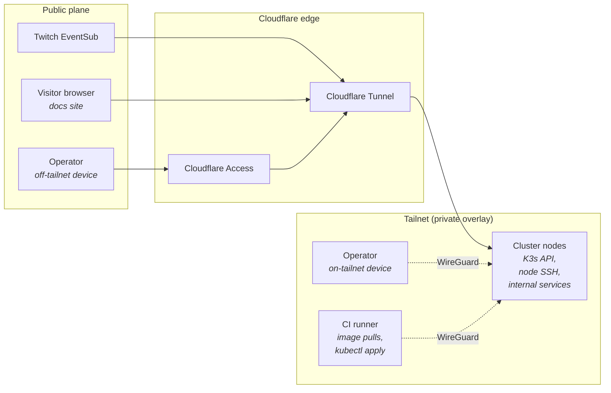

ItsBagelBot has **no public IP**, **no open router ports**, and **no LAN-only trust**. Every connection in or out crosses a Zero-Trust boundary that gates on identity, not network position.

The architectural decision is recorded in [ADR-0001](/adr/0001-zero-trust-network/); this page is the operational reference.

## The two planes

- **Public plane (Cloudflare):** anything that needs to be reached by a party we don't control — Twitch, anonymous docs visitors, occasionally the operator from a device that isn't on the tailnet.
- **Private plane (Tailscale):** everything else. Node-to-node traffic, operator-to-cluster, CI-to-cluster. WireGuard underneath, with identity coordination by Tailscale.

## Tailscale: the private overlay

### What's on the tailnet

| Member | Purpose | ACL tag |
| --- | --- | --- |
| `node1`, `node2` (k3s nodes) | Node-to-node (k3s control plane, CNI), SSH target | `tag:itsbagelbot` |
| `witness1` (OCI micro VM) | Valkey Sentinel quorum witness; OCI VCN subnet router | `tag:witness` |
| Operator devices | SSH, admin UI, `kubectl` via the operator proxy | `tag:Macbook` |
| `k8s-operator` (in-cluster) | Tailscale Kubernetes operator; Kubernetes API server proxy | `tag:k8s-operator` |
| `ts-ingress-*` proxies (in-cluster) | Advertise Tailscale Services (`svc:admin`) | `tag:k8s` |

### ACL shape

The policy is committed as code at `deploy/infra/tailscale/policy.hujson` and pasted/applied to the admin
console; it is **default-deny** (grants only). The posture in one sentence: **bare metal accepts only
SSH from operator devices; everything Kubernetes-hosted is reached through Tailscale operator proxies.**

- Operator devices → cluster nodes and witness: `tcp:22` only.
- Operator devices → `svc:admin:443` (the admin UI) and → `tag:k8s-operator:443` with the
  `tailscale.com/cap/kubernetes` capability (`kubectl` impersonating `system:masters`).
- Nodes ↔ nodes: unrestricted (k3s control plane and CNI ride the tailnet).
- Witness ↔ nodes: exactly the Sentinel quorum ports (`6379`, `26379` toward the nodes;
  `26379` plus the exporter ports `9100`/`9121` toward the witness).
- Tailscale SSH gates on operator identity with an explicit user list.

Break-glass with the operator down: SSH to `node1`, `sudo k3s kubectl`.

### Node bindings

Internal services bind to the **Tailscale interface address** (`tailscale0`), not `0.0.0.0`. This is enforced via systemd units that set `IPAddressDeny=any` and `IPAddressAllow=` to the Tailscale CGNAT range (`100.64.0.0/10`) for the affected services.

The Kubernetes API server is started with `--bind-address` set to the node's tailnet IP, so a misconfigured Tailscale ACL doesn't leak the API on the LAN.

### MagicDNS

`*.tail451e6d.ts.net` names resolve for tailnet members only. The ones that matter:

- `admin.tail451e6d.ts.net` — the operator-only admin UI (Tailscale Service `svc:admin`, HA across both
  nodes, Let's Encrypt TLS).
- `k8s-operator.tail451e6d.ts.net` — the Kubernetes API server proxy
  (`tailscale configure kubeconfig k8s-operator`).

We do **not** rely on MagicDNS for service-to-service routing inside the cluster — that's Kubernetes
Services / CoreDNS. MagicDNS is operator-ergonomics only.

## Cloudflare Tunnel: the public ingress

### What's exposed

| Hostname | Backend | Auth in front |
| --- | --- | --- |
| `eventsub.bagelbot.[domain]` | `bot-gateway.bagelbot-app:8080/eventsub` | None (Twitch can't SSO) — HMAC signature verification at the gateway. |
| `bagelbot.[domain]` | `web-ui.bagelbot-app:80` | Cloudflare Access (streamer + maintainer identities). |
| `docs.bagelbot.[domain]` | The Starlight site built from this repo | None — intentionally public. |

The `cloudflared` daemon runs as a Deployment with two replicas, anti-affinity across nodes, so the loss of any single node doesn't sever ingress. Credentials are mounted from a Kubernetes Secret backed by [TBD: sealed-secrets / SOPS-encrypted manifests].

### Why not Tailscale Funnel?

Funnel is a viable option for the public surfaces and was considered. We chose Cloudflare Tunnel because:

- We get DDoS absorption and edge TLS termination on Cloudflare's network, which matters for a public webhook receiver.
- Cloudflare Access integrates with our SSO already; running it for the dashboard is "set policy, done."
- Twitch is happier with a stable, branded webhook URL than with a `*.ts.net` hostname.

See [ADR-0001](/adr/0001-zero-trust-network/) for the full trade-off discussion.

### Cloudflare Access policies

Non-public hostnames sit behind Cloudflare Access with policies:

- **`bagelbot.[domain]` → streamer + maintainer.** SSO via GitHub; WebAuthn required; session lifetime 24h.
- **`grafana.[domain]` → maintainer only.** WebAuthn; session lifetime 8h.
- **No bypass for "trusted networks."** The whole point is that network position is not trust.

These policies are committed as code (Terraform) and applied in CI; UI changes drift back to git on every plan.

## The break-glass path

Both Tailscale and Cloudflare are external dependencies. If the coordination server or the edge are unreachable, we have a documented physical-console path:

1. Connect a keyboard/HDMI to the control-plane node (or local KVM where available).
2. Use the locally-stored emergency operator credential (offline, in a sealed envelope in the same room as the cluster — yes, really).
3. Bring the cluster to a safe state from the console, or boot a recovery shell from the SBC's microSD.

The break-glass credential is rotated annually and after any suspected compromise. It does **not** depend on Tailscale or Cloudflare being up.

## What's deliberately *not* here

- **A LAN ingress.** No `NodePort` services are reachable on the LAN. If a tunnel is down and Tailscale is down, the service is unreachable — and that's the explicit posture.
- **A VPN concentrator on the cluster.** Tailscale is the VPN; we don't run a second one.
- **`mDNS` / `Avahi` / Bonjour discovery on the LAN.** Not needed; would be a passive information leak.

## Where to next

- **[Hardware & cluster →](/infrastructure/hardware-and-cluster/)** — what the nodes are and how K3s is shaped.
- **[CI/CD pipeline →](/infrastructure/cicd-pipeline/)** — how the CI runner gets onto the tailnet to deploy.
- **[ADR-0001 →](/adr/0001-zero-trust-network/)** — the full decision record for this posture.
