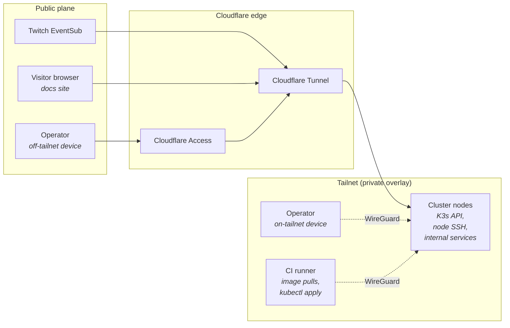

ItsBagelBot has **no public IP**, **no open router ports**, and **no LAN-only trust**. Every connection in or out crosses a Zero-Trust boundary that gates on identity, not network position.

The architectural decision is recorded in [ADR-0001](/adr/0001-zero-trust-network/); this page is the operational reference.

## The two planes



- **Public plane (Cloudflare):** anything that needs to be reached by a party we don't control — Twitch, anonymous docs visitors, occasionally the operator from a device that isn't on the tailnet.
- **Private plane (Tailscale):** everything else. Node-to-node traffic, operator-to-cluster, CI-to-cluster. WireGuard underneath, with identity coordination by Tailscale.

## Tailscale: the private overlay

### What's on the tailnet

| Member | Purpose | ACL tag |
| --- | --- | --- |
| Each cluster node | Node-to-node, operator-to-node | `tag:cluster-node` |
| Operator devices (laptop, phone) | `kubectl`, SSH, dashboards | `tag:operator` |
| GitHub Actions runner | Image pulls from in-cluster registry mirror, optional `kubectl apply` | `tag:ci` |
| Backup target (off-cluster SBC) | Receives restic snapshots | `tag:backup` |

### ACL shape

ACLs are configured as policy-as-code in a single JSON document, committed to the ops repo and applied via the Tailscale API. The policy is **default-deny**: a new member with no tag matches no rule.

Representative rules (illustrative):

```jsonc
{
  "acls": [
    // Operators can reach anything on the cluster.
    { "action": "accept", "src": ["tag:operator"], "dst": ["tag:cluster-node:*"] },

    // Cluster nodes can reach each other on Kubernetes/etcd/Tailscale ports.
    { "action": "accept", "src": ["tag:cluster-node"], "dst": ["tag:cluster-node:*"] },

    // CI can reach the K8s API and the registry mirror; not the database, not SSH.
    { "action": "accept", "src": ["tag:ci"],
      "dst": ["tag:cluster-node:6443,5000"] },

    // The backup target receives traffic from cluster nodes on the restic REST port.
    { "action": "accept", "src": ["tag:cluster-node"], "dst": ["tag:backup:8000"] }
  ],
  "ssh": [
    // SSH gated on operator identity, not just network reachability.
    { "action": "accept", "src": ["tag:operator"], "dst": ["tag:cluster-node"],
      "users": ["root", "ops"] }
  ]
}
```

### Node bindings

Internal services bind to the **Tailscale interface address** (`tailscale0`), not `0.0.0.0`. This is enforced via systemd units that set `IPAddressDeny=any` and `IPAddressAllow=` to the Tailscale CGNAT range (`100.64.0.0/10`) for the affected services.

The Kubernetes API server is started with `--bind-address` set to the node's tailnet IP, so a misconfigured Tailscale ACL doesn't leak the API on the LAN.

### MagicDNS

`*.bagelbot.ts.net` is used internally for cluster nodes and a handful of operator targets. We do **not** rely on it for service-to-service routing inside the cluster — that's Kubernetes Services / CoreDNS. MagicDNS is operator-ergonomics only.

## Cloudflare Tunnel: the public ingress

### What's exposed

| Hostname | Backend | Auth in front |
| --- | --- | --- |
| `eventsub.bagelbot.[domain]` | `bot-gateway.bagelbot-app:8080/eventsub` | None (Twitch can't SSO) — HMAC signature verification at the gateway. |
| `bagelbot.[domain]` | `web-ui.bagelbot-app:80` | Cloudflare Access (streamer + maintainer identities). |
| `docs.bagelbot.[domain]` | The Starlight site built from this repo | None — intentionally public. |

The `cloudflared` daemon runs as a Deployment with two replicas, anti-affinity across nodes, so the loss of any single node doesn't sever ingress. Credentials are mounted from a Kubernetes Secret backed by [TBD: sealed-secrets / SOPS-encrypted manifests].

### Why not Tailscale Funnel?

Funnel is a viable option for the public surfaces and was considered. We chose Cloudflare Tunnel because:

- We get DDoS absorption and edge TLS termination on Cloudflare's network, which matters for a public webhook receiver.
- Cloudflare Access integrates with our SSO already; running it for the dashboard is "set policy, done."
- Twitch is happier with a stable, branded webhook URL than with a `*.ts.net` hostname.

See [ADR-0001](/adr/0001-zero-trust-network/) for the full trade-off discussion.

### Cloudflare Access policies

Non-public hostnames sit behind Cloudflare Access with policies:

- **`bagelbot.[domain]` → streamer + maintainer.** SSO via GitHub; WebAuthn required; session lifetime 24h.
- **`grafana.[domain]` → maintainer only.** WebAuthn; session lifetime 8h.
- **No bypass for "trusted networks."** The whole point is that network position is not trust.

These policies are committed as code (Terraform) and applied in CI; UI changes drift back to git on every plan.

## The break-glass path

Both Tailscale and Cloudflare are external dependencies. If the coordination server or the edge are unreachable, we have a documented physical-console path:

1. Connect a keyboard/HDMI to the control-plane node (or local KVM where available).
2. Use the locally-stored emergency operator credential (offline, in a sealed envelope in the same room as the cluster — yes, really).
3. Bring the cluster to a safe state from the console, or boot a recovery shell from the SBC's microSD.

The break-glass credential is rotated annually and after any suspected compromise. It does **not** depend on Tailscale or Cloudflare being up.

## What's deliberately *not* here

- **A LAN ingress.** No `NodePort` services are reachable on the home LAN. If a tunnel is down and Tailscale is down, the service is unreachable — and that's the explicit posture.
- **A VPN concentrator on the cluster.** Tailscale is the VPN; we don't run a second one.
- **`mDNS` / `Avahi` / Bonjour discovery on the LAN.** Not needed; would be a passive information leak.

## Where to next

- **[Hardware & cluster →](/infrastructure/hardware-and-cluster/)** — what the nodes are and how K3s is shaped.
- **[CI/CD pipeline →](/infrastructure/cicd-pipeline/)** — how the CI runner gets onto the tailnet to deploy.
- **[ADR-0001 →](/adr/0001-zero-trust-network/)** — the full decision record for this posture.
