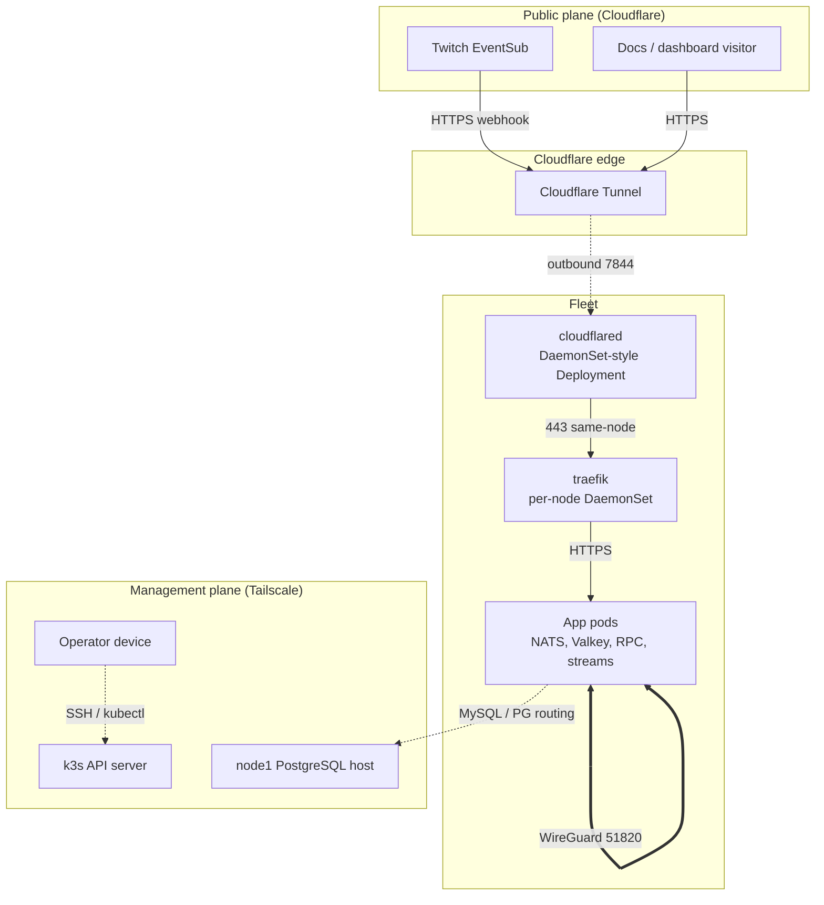

ItsBagelBot runs on three nodes with no public application IP, no open LAN ports, and no LAN-only trust. Traffic is split across three planes that never blur into each other: a kernel WireGuard mesh carries all pod and service data, Tailscale carries only management and database routing, and Cloudflare carries the public edge. Each plane has its own transport, its own key material, and its own firewall posture.

The fleet these planes connect is described in [ADR 0004](/adr/0004-adoption-of-oracle-cloud/); the message bus that rides the data plane is [ADR 0003](/adr/0003-adoption-of-nats-as-communication-bridge/). This page is the operational reference for the wiring.

## The three planes



Every pod-to-pod hop rides the WireGuard mesh (thick line). The operator and the database routes ride Tailscale (dotted). Public traffic only ever enters through Cloudflare, and Cloudflare only reaches the cluster through an outbound tunnel that the connectors dial, never an inbound port we open.

| Plane | Transport | Interface | Carries | Reachability |
| --- | --- | --- | --- | --- |
| Data | Kernel WireGuard (K3s Flannel `wireguard-native`) | `flannel-wg`, UDP 51820 | Pod and Service traffic: NATS, Valkey, RPC, JetStream, telemetry, KEDA | Node to node over public WAN IPs, authenticated by WireGuard keys |
| Management | Tailscale (WireGuard under Tailscale identity) | `tailscale0`, UDP 41641 | SSH, k3s API, kubelet metrics, admin ingress, database routing | Tailnet members only, `tag:itsbagelbot` and operator identities |
| Edge | Cloudflare Tunnel | outbound 7844 to Cloudflare, 443 to traefik | Public webhooks, docs, dashboard | Cloudflare edge inbound, cluster outbound only |

## Data plane: the kernel WireGuard mesh

Pod and Service traffic uses K3s Flannel with the supported `wireguard-native` backend. Each node advertises a direct WAN endpoint and dials every peer on UDP 51820, so the mesh is a full set of point-to-point kernel WireGuard tunnels over the public internet, with no relay and no overlay-in-overlay nesting.

| Node | Flannel interface | WireGuard endpoint |
| --- | --- | --- |
| node2 (control plane) | `eth0` | `144.217.7.48:51820` |
| node3 (hot path) | `eth0` | `148.113.191.17:51820` |
| worker1 (home) | `wlp2s0` | `174.88.117.68:51820` |

Flannel derives a uniform 1420 byte MTU for the pod interfaces (`cni0`, pods): the 1500 byte underlay minus the 80 byte kernel WireGuard header. `net.ipv4.tcp_mtu_probing=1` is the blackhole backstop if any path ever falls below that.

The Kubernetes `InternalIP` deliberately stays the node's Tailscale management address while the data plane rides the WAN endpoint. On node2 this needs two explicit settings that must not be removed while Tailscale is the management plane:

```yaml
advertise-address: 100.95.95.9
kube-apiserver-arg: ["kubelet-preferred-address-types=InternalIP,Hostname,ExternalIP"]
```

Without them the first server restart repoints the built-in `kubernetes` Service at the blocked public node2 address.

### What runs on the data plane

- NATS: the hub is a 3 replica StatefulSet with JetStream (`domain: hub`, R1 for the firehose lanes); a `nats-leaf` DaemonSet runs a JetStream-disabled relay on every node. Applications connect only to their node-local leaf through the `nats-leaf` Service (`trafficDistribution: PreferSameNode`), and the leaves form a full mesh over their cluster listener on 6222. Native TLS protects both the client listener (4222) and the routes (6222). Account isolation gives a shared BUS account plus per-service `*_RPC` accounts with explicit import and export lines.
- Valkey: replication and Sentinel announce stable StatefulSet DNS names over the pod network, with native TLS on the data port (6380) and the Sentinel port (26380). No listener is exposed through a node hostPort. A `valkey-local` Service with `internalTrafficPolicy: Local` keeps node-local reads on the pod network without any host hop.

Both NATS and Valkey add their own native TLS on top of WireGuard. The kernel tunnel gives node-to-node encryption; application TLS gives end-to-end identity that survives a future transport change.

### Socket and congestion tuning

The data plane is tuned for a high bandwidth-delay-product WAN link carrying a burst firehose. Values are pinned in `/etc/sysctl.d` and tracked in the ansible base role so a node rebuild cannot silently drop them:

| Setting | Value | Why |
| --- | --- | --- |
| `net.core.rmem_max` / `wmem_max` | 16 MiB | The firehose push and publish sockets stall on the EL10 4 MiB default under burst |
| `net.ipv4.tcp_rmem` / `tcp_wmem` | up to 16 MiB | Matches the raised ceilings for large windows |
| `net.core.default_qdisc` | `fq` | Pacing for BBR |
| `net.ipv4.tcp_congestion_control` | `bbr` | Higher throughput and lower latency over the internet |
| `net.core.netdev_max_backlog` | 16384 | Per-CPU ingress queue for bursts |
| `net.ipv4.tcp_low_latency` | 1 | Favor latency on the RPC path |

worker1 reaches the mesh over a home Wi-Fi uplink capped near 270 Mbps, so its cross-node tail is physical: p99 sits near 13 to 14 ms against roughly 3 ms between the two datacenter nodes. That ceiling is the reason worker1 stays off the synchronous publish-ack path and is fenced out of Valkey primary eligibility.

### Firewall: keeping the CNI interfaces trusted

The public firewalld zone opens exactly three inbound ports: SSH (bootstrap and break-glass), the Tailscale port (41641/udp), and the WireGuard port (51820/udp). The obsolete VXLAN transport (8472/udp) is closed.

firewalld starts at boot before K3s creates `cni0` and the flannel transport, and it does not retro-apply a permanent zone binding to an interface that appears later. So every boot those interfaces land in the default (public) zone, and firewalld drops the cross-node pod traffic that rides them, including the leaf-to-leaf cluster on 6222 that carries the outgress rate-limit permit borrow. A dropped bind fails the fleet's quota sharing silently. A boot-time oneshot (`fleet-cni-trust.service`) waits for the interfaces and binds `cni0`, `flannel.1`, and `flannel-wg` into the trusted zone `--permanent`, so a `firewall-cmd --reload` keeps them. The pod and service CIDRs (`10.42.0.0/16`, `10.43.0.0/16`) are also trusted as sources. If cross-node interest ever breaks after a reboot, re-adding those interfaces to the trusted zone is the first thing to check.

## Management plane: Tailscale

Tailscale carries only management and database traffic: SSH, the Kubernetes API, kubelet metrics collection, the admin ingress, and the routes to the database hosts. Pods never ride Tailscale. Each node joins the tailnet pre-authorized under `tag:itsbagelbot` with Tailscale SSH enabled, and OpenSSH is removed from the box once Tailscale and the firewall are verified up.

Direct connectivity is treated as an infrastructure precondition, not an optimization: provisioning fails a node unless it can reach every fleet peer over a direct UDP path, explicitly rejecting DERP and peer-relay routes. `tailscale0` runs at MTU 1350 (`TS_DEBUG_MTU=1350`), well above the 1280 floor.

### Tailnet members

| Member | Role on the tailnet |
| --- | --- |
| node2, node3, worker1 | Cluster nodes: SSH, k3s API and kubelet, database routing |
| Operator devices | SSH and `kubectl` through the operator proxy |
| `k8s-operator` (in-cluster) | Tailscale Kubernetes operator; API server proxy |
| `ts-ingress` ProxyGroup (2 replicas) | Advertises the admin ingress as a Tailscale Service |
| node1 | Off-cluster PostgreSQL host, tailnet-reachable, not a k3s node |

MagicDNS names under `*.tail451e6d.ts.net` resolve for tailnet members only. The two that matter operationally are `admin.tail451e6d.ts.net` (the operator-only console admin, served through the Tailscale operator ProxyGroup) and `k8s-operator.tail451e6d.ts.net` (the API server proxy, the kube context every runbook targets). We do not use MagicDNS for service-to-service routing inside the cluster; that is CoreDNS.

The Valkey Sentinel quorum is three in-cluster Sentinels co-located with the data pods; the earlier external witness Sentinel on the tailnet is retired (the witness host remains only as a monitored node-exporter target).

## Edge plane: Cloudflare Tunnel

Public traffic enters through Cloudflare's edge, which dials the outbound `cloudflared` connectors on 7844 and forwards to `traefik.kube-system:443`. We run `cloudflared` as a 2 replica Deployment, one per non-worker node (node2 and node3) with hard pod anti-affinity across hosts, so losing a single node does not sever public ingress. worker1 is excluded: it is a burst worker, not part of the ingress failure domain. Rollouts use `maxSurge: 1` / `maxUnavailable: 0`, and a Doppler reload annotation rolls the pods when the tunnel credential rotates.

traefik itself is a per-node DaemonSet with a ClusterIP Service and `trafficDistribution: PreferClose`. One traefik endpoint per node keeps the `cloudflared` to traefik hop on the same node instead of round-robining across the trans-Atlantic fleet, and preserves ingress when any node is lost. A soft-anti-affinity Deployment did not hold here: the scheduler drifted both replicas onto one node, so one node loss took down all ingress. traefik is reachable only from inside the cluster; nothing legitimate connects to it on a node address.

| Hostname class | Backend | Auth in front |
| --- | --- | --- |
| Docs site | Starlight build | None, intentionally public |
| Dashboard | `console-dashboard` | Console session auth |
| EventSub webhook | gateway / webhook receiver | HMAC signature verification at the backend (Twitch cannot SSO) |

There is deliberately no LAN ingress and no NodePort. If Cloudflare is down and Tailscale is down, the service is unreachable, and that is the explicit posture.

## Cluster DNS

CoreDNS is a Flux-owned DaemonSet that replaces the k3s-packaged single-replica addon (skipped on the server). Running a resolver on every node plus a kube-dns Service with `trafficDistribution: PreferSameNode` means a pod's DNS query is answered by the CoreDNS instance on its own node and never crosses the mesh for a lookup. A `PodDisruptionBudget` of `minAvailable: 2` keeps at least two resolvers up through any drain. External names forward to anycast resolvers (1.1.1.1, 8.8.8.8, 9.9.9.9) rather than `/etc/resolv.conf`, because a node's host upstream can be a link-local address the pod network cannot reach. The cache serves stale entries during an upstream blip.

## Network policy

A `default-deny-apps` NetworkPolicy selects the application pods in the `production` namespace and constrains egress: DNS (53), intra-namespace traffic (so pods reach NATS and each other), the Valkey namespace, outbound HTTPS (443) for Twitch OAuth and the managed database TLS endpoint, and MySQL (3306) to the external HeatWave database ([ADR 0005](/adr/0005-adoption-of-mysql-heatwave/)). The NATS and `nats-leaf` pods are intentionally not selected, so they stay NetworkPolicy-unrestricted and rely on native TLS on 4222 and 6222.

## Break-glass

Both Tailscale and Cloudflare are external dependencies. If the coordination server or the edge are unreachable, the documented path is a physical or local console into the control-plane node and `sudo k3s kubectl` from there. That path does not depend on Tailscale or Cloudflare being up.

## Where to next

- [Hardware and cluster](/infrastructure/hardware-and-cluster/): the nodes, K3s shape, scheduling, and the delivery pipeline.
- [ADR 0003](/adr/0003-adoption-of-nats-as-communication-bridge/): the NATS bus that rides the data plane.
- [ADR 0004](/adr/0004-adoption-of-oracle-cloud/): the fleet these planes connect.
