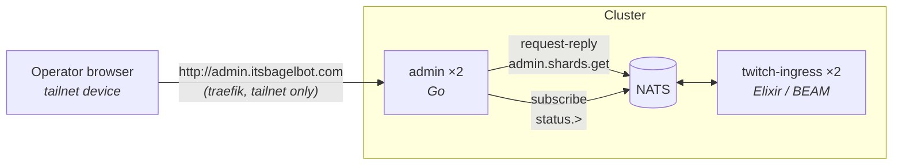

The Admin service is the operator's window into the [Twitch Ingress](/microservices/twitch-ingress/): the live
state of every Conduit shard (which BEAM node owns it, its EventSub session, when its last frame arrived), where
the conduit-manager singleton runs, plus the raw shard up/down event stream. It reads everything over NATS and
owns no data of its own.

It is intentionally boring: no auth layer, no database, no Twitch credentials. The network is the perimeter — the
service is reachable **only over Tailscale**, and tailnet ACLs (`tag:operator` → `tag:cluster-node`) are the
access control. See [Networking](/infrastructure/networking/) for the posture this slots into.

## Responsibilities

- Render the **shard fleet page**: one card per Conduit shard with its derived state (`connected`, `migrating`,
  `binding`, `connecting`, `backoff`, `unregistered`, `unresponsive`), owning BEAM node, EventSub session id,
  bound-since / last-frame ages, keepalive window, and reconnect attempts.
- Show the **cluster summary**: BEAM cluster membership, where the conduit-manager singleton runs, and the
  conduit id, as reported by whichever ingress replica answered.
- Stream **live shard events** (`twitch.ingress.status.>`) to the browser over SSE; an event triggers an
  immediate snapshot refresh, with a steady 5s poll as fallback.
- **User management**: look up a user by Twitch id or username (plus a recent-users list), grant **VIP**
  (permanent premium), mark **paid premium**, drop back to **free**, and **reset state** (clears the
  user's stored Twitch tokens; account, tier and transaction history stay). All actions go over NATS to
  the users service — the owner of the schema — which publishes the broadcaster cache invalidation key so
  the ingress lanes react immediately.

What this service does **not** do: touch infrastructure. No shard restarts, no conduit reconfiguration —
operations on the fleet stay in `kubectl` where they are audited and reviewable. It also never opens MySQL;
every read and write is a NATS RPC against the owning service.

The one mutating HTTP endpoint requires a custom request header. Tailnet ACLs are the access control, but the
header forces any cross-origin browser request through a CORS preflight this server never grants, so a
malicious public website in an operator's browser cannot fire form POSTs at the private address.

## External shape

The shard snapshot is served by `Ingress.AdminRpc` inside the ingress itself: any replica can answer (a queue
group picks one), and it walks the Horde registry, so the reply covers shards on every BEAM node regardless of
which replica responds.

## NATS contracts

| Subject                            | Direction     | Payload                                                                 |
|------------------------------------|---------------|--------------------------------------------------------------------------|
| `twitch.ingress.admin.shards.get`  | request-reply | reply: `{generated_at, reporter, nodes, shard_count, conduit_manager, shards[]}` |
| `twitch.ingress.status.>`          | subscribe     | shard up/down events, bridged verbatim to the browser as SSE             |
| `bagel.rpc.admin.user.get`         | request-reply | `{user_id}` or `{username}` → `{user}`                                  |
| `bagel.rpc.admin.user.list`        | request-reply | `{limit}` → `{users[]}` (most recently updated first)                   |
| `bagel.rpc.admin.user.set_status`  | request-reply | `{user_id, status: free\|paid\|vip}` → `{user}` (provisions the row if unseen) |
| `bagel.rpc.admin.user.reset`       | request-reply | `{user_id}` → `{user}` (clears stored tokens)                          |
| `bagel.rpc.admin.user.stats`       | request-reply | `{}` → `{stats}`                                                        |
| `bagel.rpc.admin.user.token_set` / `token_status` / `token_clear` | request-reply | bot-account token management; `{token: {present}}` |
| `bagel.rpc.admin.user.delete`      | request-reply | `{user_id}` or `{username}` → `{}` (cascade-deletes the user)          |

Each entry in `shards[]` carries `{shard_id, state, node, session_id, bound, handshake_in_flight, keepalive_ms,
attempts, bound_at, last_frame_at}`. The user verbs are owned and answered by broadcaster-data; a user is
`{id, username, is_active, tier, premium_kind, updated_at}` where `tier` (premium|standard) drives the lanes
and `premium_kind` records how premium was obtained (`vip` = operator grant, permanent; `paid` = Tebex).

## Configuration

Environment-driven, nothing secret; the manifest sets these directly (no Doppler project).

| Variable                      | Purpose                                            | Default                            |
|-------------------------------|----------------------------------------------------|------------------------------------|
| `ADMIN_LISTEN_ADDR`           | HTTP listen address inside the pod.                | `:8080`                            |
| `NATS_HOST` / `NATS_PORT`     | NATS endpoint.                                     | `127.0.0.1` / `4222`               |
| `NATS_ADMIN_SUBJECT`          | Request-reply subject answered by the ingress.     | `twitch.ingress.admin.shards.get`  |
| `NATS_STATUS_SUBJECT_PREFIX`  | Prefix of the status subjects bridged to SSE.      | `twitch.ingress.status`            |

## Deployment

`deploy/k8s/admin.yaml`. Same HA shape as the rest of the fleet: 2 replicas, pod anti-affinity across
`node1` (ARM) and `node2` (Intel), PodDisruptionBudget `minAvailable: 1`, distroless image, non-root,
all capabilities dropped. Images are built per node: ARM natively on the operator Mac, Intel natively on
`node2` — no cross-arch emulation in the pipeline.

The service is served through the Tailscale Kubernetes operator at a single name:

| URL                              | Backed by                                                     |
|----------------------------------|---------------------------------------------------------------|
| `https://admin.tail451e6d.ts.net`| Tailscale Service `svc:admin` → ingress ProxyGroup ×2 → both admin pods |

The tailnet-only exposure is structural, not policy-on-top:

1. **DNS**: the name is MagicDNS. It resolves only for tailnet members; there is no public DNS record of any
   kind, and the nodes' tailnet IPs appear in no public zone.
2. **Data plane**: the `tailscale`-class Ingress attaches to the `ts-ingress` ProxyGroup
   (`deploy/infra/tailscale/proxies.yaml`), two proxy pods spread across node1/node2 that advertise the Tailscale
   Service `svc:admin`. The path shares nothing with public ingress: no traefik route, no cloudflared
   hostname, no listener on any node interface.
3. **Access control**: the tailnet policy (`deploy/infra/tailscale/policy.hujson`) grants `svc:admin:443` to
   operator devices only; bare metal accepts nothing but SSH from them.
4. **TLS**: the proxy terminates HTTPS with an operator-provisioned Let's Encrypt certificate for the
   MagicDNS name; browsers show a normal padlock with no private CA to install.

Either proxy replica keeps `svc:admin` answering through the loss of a node, and the admin Service spreads
requests across both admin pods. Linkerd injection is disabled on purpose: the tool exists to debug the
fleet, so it must not share failure modes with the mesh.

## References

- [Twitch Ingress](/microservices/twitch-ingress/): the service this tool observes, including `Ingress.AdminRpc`.
- [Networking](/infrastructure/networking/): the two-plane model that makes "tailnet only" meaningful.
- [RPC contracts](/reference/rpc-contracts/): the full `bagel.rpc.admin.user.*` and shard-snapshot surface.
- [ADR 0004](/adr/0004-adoption-of-oracle-cloud/): the tailnet fleet the "tailnet only" posture rides on.
