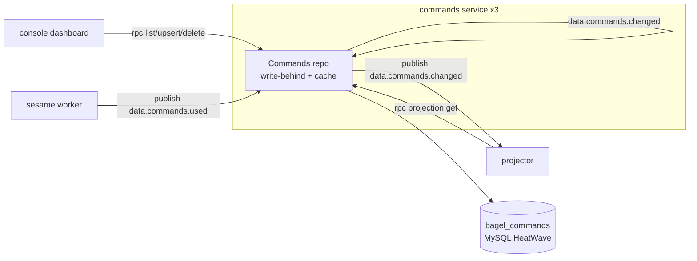
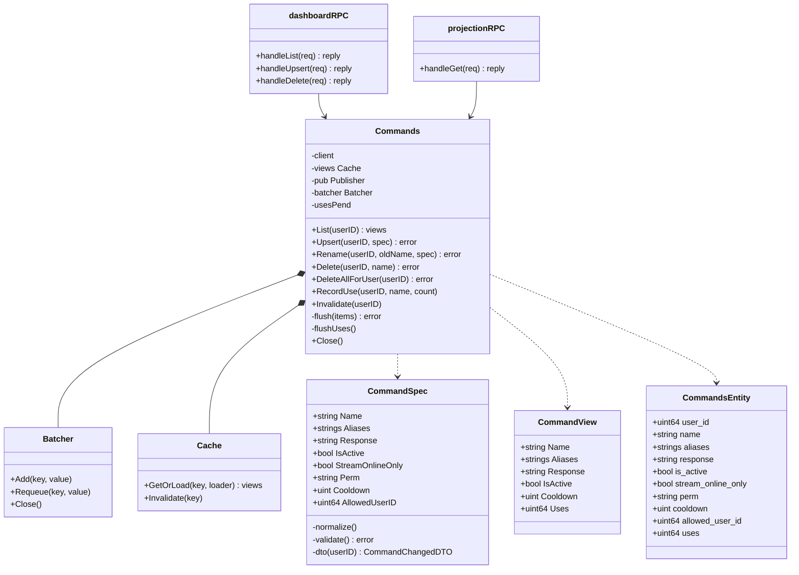
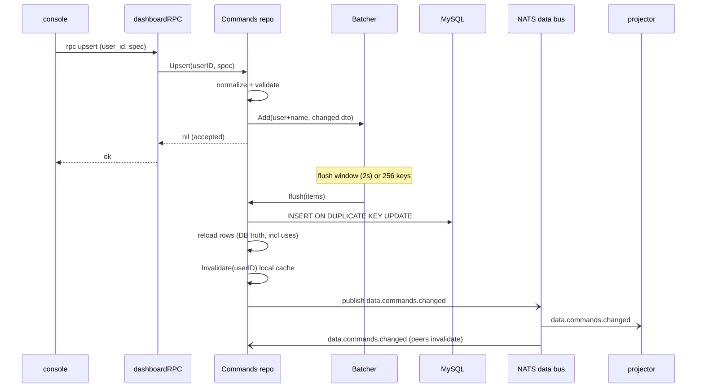
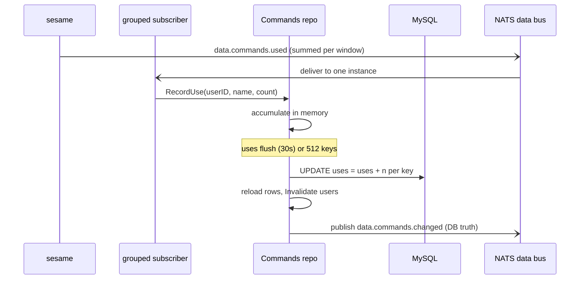
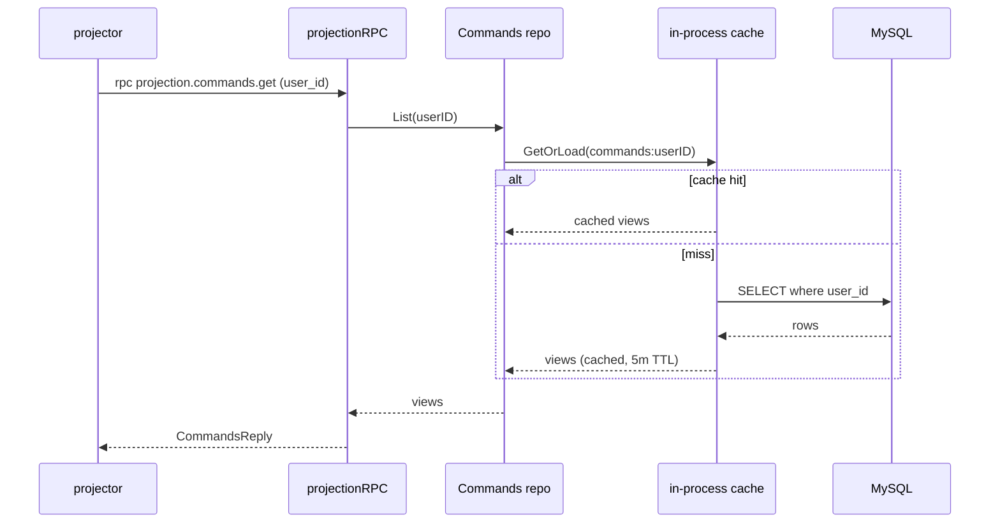
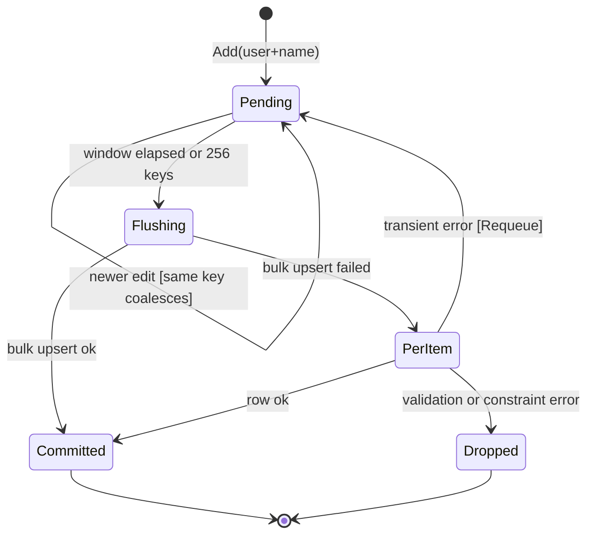

The Commands service (`app/commands/`) is the sole owner of the custom chat commands schema. It is a Go data
service in the sense of [ADR 0007](/adr/0007-adoption-of-per-schema-data-microservices/): one MySQL schema, one
writer, no other service ever reads its tables. Broadcasters author commands from the [console](/microservices/console/);
the service validates and persists each edit through a write-behind batcher, then broadcasts the new state on the
NATS bus so the [projector](/microservices/projector/) and every peer converge without touching the database.
The caching and write-behind posture is the one described in
[ADR 0008](/adr/0008-caching-and-write-behind-strategy/); the bus is [ADR 0003](/adr/0003-adoption-of-nats-as-communication-bridge/);
the database is [ADR 0005](/adr/0005-adoption-of-mysql-heatwave/).

## Responsibilities

- Own the `bagel_commands` schema and its single `commands` table, and be its only writer.
- Validate and persist command create, edit, rename and delete requests from the console over request-reply RPC.
- Coalesce rapid edits of one command into a single row write through a write-behind batcher, so a streamer
  iterating on wording costs one write per flush window, not one per keystroke.
- Maintain a lifetime `uses` counter per command by folding the summed `data.commands.used` events that
  [sesame](/microservices/sesame/) publishes.
- Emit `data.commands.changed` as full state (event-carried state transfer) so the Valkey projection and the
  in-process caches update themselves from the event alone.
- Serve an internal projection read (`bagel.rpc.internal.projection.commands.get`) that the projector calls to
  hydrate one broadcaster's command list on a cache miss.
- Sweep every command of a deleted account when the `data.users.deleted` event arrives.

What this service does **not** do:

- It does not execute commands. Matching a chat line to a command, checking permission tiers and cooldowns, and
  sending the response are all sesame's job; this service only stores definitions.
- It does not read another service's schema. Broadcaster identity, status and locale reach it only as ids on the
  wire; there are no cross-schema joins.
- It does not own the read-side projection. It publishes change events; the projector writes Valkey.
- It does not rate-limit or aggregate chat. The `uses` events arrive pre-summed from sesame.

## External context

The console issues request-reply RPC on the leaf plane; sesame and the projector reach the service the same way for
the projection read. Everything else is asynchronous JetStream traffic on the `data.>` subjects.

## Internal design

The service main wires the standard data-service scaffold from `pkg/svcboot`: a named New Relic logger, the MySQL
driver, ent auto-migration, and the standard NATS connection set (an asynchronous JetStream publisher, a per-service
RPC connection, a broadcast subscriber with no queue group, and a durable group subscriber). The `Commands`
repository is the Information Expert for command state and the only object that touches the ent client.

Two normalization rules keep every path agreeing on a command's identity. `normalizeName` stores the bare trigger
(lower-cased, leading `!` stripped), applied by an ent mutation hook and again in the repository, so `!Test` and
`test` are one command. `normalizeResponse` folds CRLF to LF and drops blank and trailing-whitespace lines before
validation, so the bot's one-message-per-line rendering never emits an unsendable empty line. A response is capped
at five lines of 500 characters (the column is sized 2504 to hold the worst case).

## Key flows

### Dashboard edit: write-behind then converge

An edit is acknowledged the moment it is validated and queued. The row write and the change event happen later, on
the flush window, so a burst of edits collapses into one statement.

The flush publishes DB truth, not the queued edit: it reloads the landed rows so the event carries the `uses`
counter the edit never set, and event-carried state transfer must never regress it in the projection. If the single
bulk upsert fails, the flush falls back to per-item writes (see failure modes) so one bad row cannot wedge the
window.

### Rename: immediate, not batched

A rename changes the row's key, which the batcher (keyed by user and name) cannot express as a queued edit, so it is
synchronous: one `UPDATE` rewrites the row in place, then the service publishes a delete for the old name and a
change for the new so name-keyed consumers drop the stale entry. If the old row is already gone, the rename degrades
to a plain write of the new command so the edit is not lost.

### Command uses: fold summed events

Uses are loss-tolerant: sesame pre-sums executions per window (rate-limiting the bus), the service sums them into
the row on a generous 30-second window, and a dropped event costs at most one window of ticks. The accumulator
flushes early if its key set crosses 512, guarded by a single-flight flag so a viral chat cannot spawn concurrent
flushes.

### Projection read

`List` is served entirely from the read-through cache (capacity 4096, 5-minute TTL, stampede-protected per
[ADR 0008](/adr/0008-caching-and-write-behind-strategy/)). Every write path invalidates the affected user's entry,
and the broadcast subscriber invalidates peers, so the cache never serves state that a change event has superseded.

## Queued edit lifecycle

A command edit accepted by `Upsert` is a small state machine inside the batcher and the flush path.

- **Pending to Pending**: a second edit of the same command before the flush replaces the first; only the latest
  state is written. This is exactly what dashboard clicking produces.
- **Pending to Flushing**: the 2-second ticker fires, or the pending set reaches 256 keys, whichever comes first.
- **Flushing to Committed**: the whole window lands as one `INSERT ON DUPLICATE KEY UPDATE`, updating only
  edit-owned columns so `uses` and `created_at` are never regressed.
- **Flushing to PerItem**: the bulk statement failed, so the flush retries each item alone rather than losing the
  batch.
- **PerItem to Dropped**: a row the database will never accept (validation or constraint error) is logged and
  dropped, because requeueing it would poison every future window.
- **PerItem to Pending [transient]**: a transiently failing row is requeued for the next window, unless a newer edit
  for the same key already arrived (the newer value wins).

## NATS contracts

The service runs on two planes (see [ADR 0003](/adr/0003-adoption-of-nats-as-communication-bridge/)): request-reply
RPC on the per-service account through the node-local leaf, and durable JetStream events on the shared BUS account
against the hub. The `data.>` subjects live on the `BAGEL_DATA` stream (R1, 5-minute retention), owned and
reconciled by the [users](/microservices/users/) service.

### Published

| Subject                  | Plane          | Payload                                                              | Notes                                                              |
|--------------------------|----------------|---------------------------------------------------------------------|-------------------------------------------------------------------|
| `data.commands.changed`  | JetStream bus  | `CommandChangedDTO` (full state, or `{user_id, name, deleted:true}`) | Event-carried state transfer. One per landed edit, rename side, delete, and uses flush. |

### Consumed

| Subject                | Subscriber   | Queue group | Delivery                                   | Handler                                                     |
|------------------------|--------------|-------------|--------------------------------------------|------------------------------------------------------------|
| `data.commands.changed`| broadcast    | none        | ephemeral consumer, DeliverNew, every pod  | Invalidate the changed user's cached view.                 |
| `data.commands.used`   | grouped      | `commands`  | durable, one pod per event                 | Fold the summed count into the `uses` accumulator.         |
| `data.users.deleted`   | grouped      | `commands`  | durable, one pod per event                 | Delete every command of the account.                       |

Grouped consumers run on the shared fleet redelivery budget: a handler error NAKs, paced at a 3-second delay, up to
5 redeliveries, after which the message is TERMed. Handlers are therefore idempotent. The broadcast subscriber uses
an ephemeral consumer so every replica sees every invalidation.

### Request-reply (RPC)

| Subject                                      | Queue group    | Request / Reply                        | Purpose                                    |
|----------------------------------------------|----------------|----------------------------------------|--------------------------------------------|
| `bagel.rpc.commands.list`                    | `commands-rpc` | `DashboardRequest` / `DashboardReply`  | List a broadcaster's commands.             |
| `bagel.rpc.commands.upsert`                  | `commands-rpc` | `DashboardRequest` / `DashboardReply`  | Create or edit; a differing `original_name` makes it a rename. |
| `bagel.rpc.commands.delete`                  | `commands-rpc` | `DashboardRequest` / `DashboardReply`  | Delete one command immediately.            |
| `bagel.rpc.internal.projection.commands.get` | `commands-rpc` | `projection.Request` / `CommandsReply` | Projector hydration read.                  |
| `bagel.rpc.health.commands`                  | `commands-rpc` | health ping                            | Liveness of the RPC responder.             |

All RPC handlers reply with a JSON `{"error": "..."}` envelope on failure, and the request handler enforces a
2-second processing timeout.

## Data

The service owns one table in `bagel_commands`.

### `commands`

| Column               | Type    | Notes                                                                       |
|----------------------|---------|-----------------------------------------------------------------------------|
| `id`                 | int PK  | Auto-increment surrogate.                                                    |
| `user_id`            | uint64  | Broadcaster Twitch id. Immutable.                                            |
| `name`               | string  | Normalized trigger (no `!`, lower-cased). Not empty.                         |
| `aliases`            | JSON    | Alternate triggers as a string array. No migration to add or drop one.      |
| `response`           | string  | Newline-delimited, one chat message per line. Max 2504 (5 lines of 500).    |
| `is_active`          | bool    | Default true.                                                               |
| `stream_online_only` | bool    | Default false. Runs only while the stream is reported online.               |
| `perm`               | string  | Minimum role: everyone, sub, vip, mod, lead_mod, broadcaster. Default everyone. |
| `cooldown`           | uint    | Seconds. 0 means none.                                                       |
| `allowed_user_id`    | uint64  | When non-zero, only this viewer may run it (overrides perm). Default 0.      |
| `uses`               | uint64  | Lifetime execution counter. Loss-tolerant; only the uses flush writes it.   |
| `created_at`         | time    |                                                                             |
| `updated_at`         | time    | Auto-updated on write.                                                       |

Unique index on `(user_id, name)`, which is also the conflict target for the bulk upsert.

The only other datastore is the in-process read model cache (key `commands:{user_id}`, one entry per broadcaster
holding the whole command list). Valkey is written by the projector, not by this service.

## Configuration

Env-driven, read once at boot. Names are the real ones from the config loader.

| Variable                                     | Purpose                                                     | Default                                         |
|----------------------------------------------|-------------------------------------------------------------|-------------------------------------------------|
| `APP_ENV`                                    | Logger profile.                                             | `development`                                   |
| `DB_ADDR`                                    | MySQL address.                                              | `127.0.0.1:3306`                                |
| `DB_USER` / `DB_PASS`                        | Schema-scoped credentials (required).                      | (none)                                          |
| `DB_SCHEMA`                                  | Owned schema.                                               | `bagel_commands`                                |
| `DB_AUTO_MIGRATE`                            | Run ent auto-migration at boot.                            | `true`                                          |
| `DB_MAX_OPEN_CONNS` / `DB_QUERY_CONCURRENCY` | Connection pool and query gate size.                       | `4` (from the manifest)                         |
| `DB_CA_CERT`                                 | Optional MySQL TLS CA.                                     | (none)                                          |
| `NATS_URL`                                   | Local-dev fallback endpoint.                               | `nats://127.0.0.1:4222`                         |
| `NATS_HUB_URL` / `NATS_HUB_PUBLISH_URL`      | JetStream hub (consume / publish).                         | (manifest: `nats://nats:4222`)                  |
| `NATS_RPC_URL` / `NATS_LEAF_URL`             | RPC plane, node-local leaf.                                | (manifest: `nats://nats-leaf:4222`)             |
| `NATS_CA_PEM`                                | Fleet CA to verify the broker TLS cert.                    | (fleet-ca ConfigMap)                            |
| `NATS_USER` / `NATS_PASSWORD`                | Shared BUS account (JetStream plane).                      | (secret)                                        |
| `NATS_RPC_USER` / `NATS_RPC_PASSWORD`        | Per-service RPC account.                                   | (falls back to `NATS_USER`)                     |
| `NATS_JS_DOMAIN`                             | JetStream domain the streams live in.                      | `hub`                                           |
| `NATS_COMMANDS_SUBJECT_PREFIX`               | Dashboard RPC prefix.                                      | `bagel.rpc.commands`                            |
| `NATS_INTERNAL_PROJECTION_COMMANDS_SUBJECT`  | Projection read subject.                                   | `bagel.rpc.internal.projection.commands.get`    |
| `LISTEN_ADDR`                                | Health server bind.                                        | `:8080`                                         |
| `NEW_RELIC_LICENSE_KEY`                      | Enables the APM agent; absent makes it a no-op.            | (secret)                                        |

## Deployment

From `deploy/k8s/commands.yaml`, delivered by Flux from a digest-pinned GHCR image.

- **Image**: multi-stage build on `golang:1.26.5-bookworm`, shipped on `gcr.io/distroless/static-debian12:nonroot`.
  Ent clients are regenerated at build with `--feature sql/upsert` (the bulk upsert needs it).
- **Replicas**: 3, one per hot-path node (node2, node3, worker1). Required pod anti-affinity keeps old and new
  ReplicaSets from stacking two pods on one node, and a topology spread constraint holds one per host.
- **Rollout**: `RollingUpdate` with `maxSurge: 0`, `maxUnavailable: 1`, so the anti-affinity never deadlocks a
  surge pod; `minReadySeconds: 10`; a PodDisruptionBudget of `maxUnavailable: 1`.
- **Placement**: tolerates the `worker-pool` taint (worker1) and short unreachable/not-ready windows; node affinity
  excludes the retired node1.
- **Probes**: `/healthz` liveness (process up), `/readyz` readiness (returns 503 while NATS is disconnected), and a
  `/drain` preStop hook that sleeps 10 seconds so endpoints drain before SIGTERM. `terminationGracePeriodSeconds: 45`.
- **Runtime**: `GOMEMLIMIT=160MiB` against a 256Mi limit; requests 25m CPU and 64Mi memory.
- **Secrets**: the Doppler operator manages `commands-env` and restarts the pods on a secret change.

Shutdown order matters: main defers the publisher close after the repository close, so the batcher and uses
accumulator flush their pending writes through the publisher during drain.

## Observability

- **Logging**: structured zap to stdout, New Relic wrapped.
- **Tracing and metrics**: New Relic Go agent ([ADR 0010](/adr/0010-adoption-of-new-relic-for-observability/)). Each
  consumed event and each RPC runs inside its own transaction, joined to the publisher's trace through message
  headers. Background flushes report as their own transactions (`flush commands`, `flush command uses`), so
  write-behind latency is visible separately from request latency. Slow RPC handlers (over 250 ms) log at debug.
- **Health**: the RPC health responder answers liveness pings on `bagel.rpc.health.commands`.

## Failure modes and how the service responds

| Failure                                   | Response                                                                                                     |
|-------------------------------------------|-------------------------------------------------------------------------------------------------------------|
| Bulk upsert statement fails               | Fall back to per-item writes. Validation/constraint errors are dropped with an error log; transient errors requeue for the next window. |
| Change event fails to publish             | The row is already committed; log and move on. The next change or a projector rebuild reconverges Valkey.    |
| A single `uses` row missing at flush      | Skip that key, keep the rest of the window; the counter is loss-tolerant.                                    |
| Malformed `data.commands.used` payload    | Dropped (handler returns nil), not retried.                                                                  |
| `data.users.deleted` DB failure           | Return the error so JetStream redelivers, up to the budget; the sweep is idempotent.                         |
| NATS disconnect                           | `pkg/bus` reconnects endlessly with a 32 MB publish buffer; `/readyz` reports 503 until reconnected.         |
| Pod eviction during a write window        | Drain flushes pending edits and uses before exit; anything unflushed is a re-submittable edit, never money.  |

## Design notes

- **Information Expert / High Cohesion**: the `Commands` repository is the single authority on command state and the
  only holder of the ent client. RPC handlers are thin Controllers that parse ids and delegate.
- **Pure Fabrication**: the `Batcher` (`pkg/batch`) and read-through `Cache` (`pkg/cache`) are fabricated collaborators
  with no domain identity, introduced to meet performance and coupling goals.
- **Protected Variations / Low Coupling**: event-carried state transfer on `data.commands.changed` decouples the
  projection and consoles from this schema. No consumer reads the table; a schema change stays behind the DTO.
- **Observer**: `data.commands.changed` is an observer fan-out over the bus, one publish feeding the projector and
  every peer's cache.
- **Architecture tactics**: queue-based load leveling (the write-behind batcher), rate limiting (sesame's summed
  `uses` events plus the local accumulator window), retry with capped budget and paced NAK (JetStream redelivery),
  removal from service (readiness 503 on NATS loss plus the `/drain` preStop), and heartbeat (the RPC health
  responder and the once-per-second in-progress acks that bound the redelivery clock).

## References

- [ADR 0003](/adr/0003-adoption-of-nats-as-communication-bridge/): the bus, subject space and delivery semantics.
- [ADR 0005](/adr/0005-adoption-of-mysql-heatwave/): the relational database.
- [ADR 0007](/adr/0007-adoption-of-per-schema-data-microservices/): the per-schema, single-writer data-service model.
- [ADR 0008](/adr/0008-caching-and-write-behind-strategy/): in-process caching and write-behind.
- [ADR 0009](/adr/0009-adoption-of-valkey-for-the-settings-projection/): the read-side projection this service feeds.
- [ADR 0010](/adr/0010-adoption-of-new-relic-for-observability/): observability.
- Related services: [sesame](/microservices/sesame/), [projector](/microservices/projector/),
  [modules](/microservices/modules/), [loyalty](/microservices/loyalty/), [users](/microservices/users/),
  [console](/microservices/console/).
