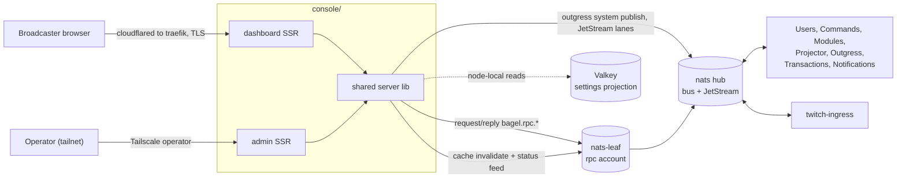
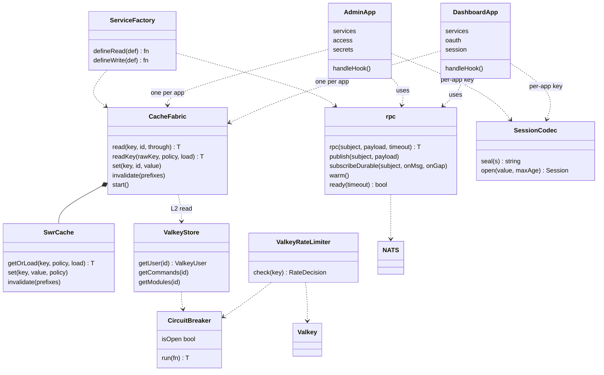
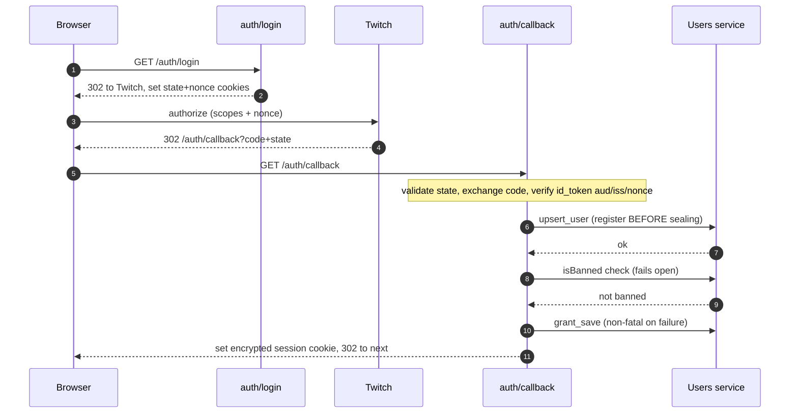
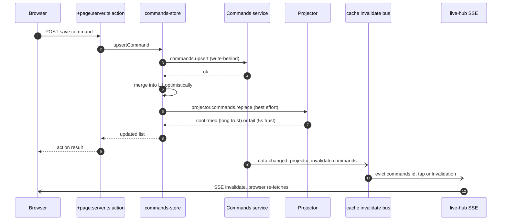
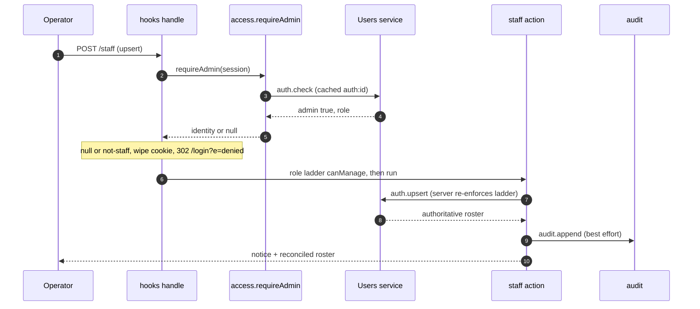
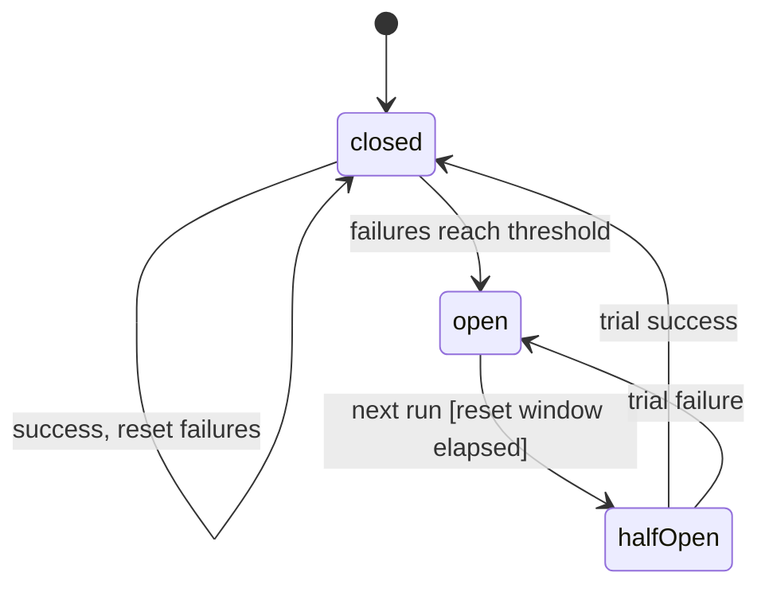
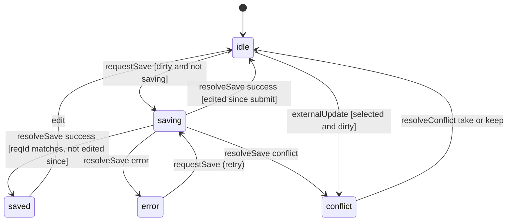

The Console (`console/`) is the human interface to the platform. It is two separate SvelteKit server-rendered apps that share one internal library:

- `console/dashboard/` is the broadcaster self-serve app, public at `dashboard.itsbagelbot.com`.
- `console/admin/` is the operator app, reachable only over the tailnet at `admin.tail451e6d.ts.net`.
- `console/shared/` (`@bagel/shared`) holds the UI primitives and, more importantly, the server runtime both apps run on: the NATS RPC client, the hybrid cache, the session codec, the rate limiter, and the resilience primitives.

The console holds no application data of its own. Every read and write is a NATS request/reply against the service that owns the data ([Users](/microservices/users/), [Commands](/microservices/commands/), [Modules](/microservices/modules/), [Projector](/microservices/projector/), [Outgress](/microservices/outgress/), [Transactions](/microservices/transactions/), [Notifications](/microservices/notifications/)), so it never opens the application database. See [ADR 0003](/adr/0003-adoption-of-nats-as-communication-bridge/) for the transport choice, [ADR 0008](/adr/0008-caching-and-write-behind-strategy/) for the caching and write-behind model the console reads and writes through, and [ADR 0009](/adr/0009-adoption-of-valkey-for-the-settings-projection/) for the node-local Valkey projection it reads as a fast tier. The one exception to "no database": the admin secrets tooling opens a privileged MySQL admin connection to provision per-service credentials, which is credential administration, not application data (documented under Data below).

This page replaces the old Go and templ operator tool. That tool is gone; `console/admin` is the operator surface now, and the still-current parts of it (the ingress shard fleet view over `twitch.ingress.admin.shards.get`, the live status feed, user management) are described here.

## Responsibilities

The dashboard (broadcaster self-serve):

- Twitch OAuth sign-in (arctic) that mints the per-channel bot grant and establishes an encrypted session.
- Custom command editing, module toggles and configuration (driven by the shared module catalog), quotes, timers, counters and loyalty, channel-points reward management, and Govee light bindings.
- Channel-points rewards created and edited on Twitch through an outgress RPC under the broadcaster's own token, with the reward-to-action binding stored in the hidden `channelpoints` module blob.
- Billing entry: minting a Tebex Headless basket through the transactions service and redirecting to the hosted checkout.
- Delegated access: an owner mints scoped, single-use share links so a trusted user can operate a section of their board.
- French-first i18n with the locale persisted on the account through the users service.

The admin (operator):

- Ingress shard fleet view (per-shard state, owning node, EventSub session, ages) over `twitch.ingress.admin.shards.get`, plus shard scale and autoscale controls and a live `twitch.ingress.status.>` event feed over SSE.
- JetStream lane telemetry (per stream and consumer pending, in-flight, msg/s, orphan detection) with operator-pinned durable lanes and display aliases.
- User management: look up by id or login, grant VIP or paid or drop to free, ban and unban, reset stored tokens, set creator codes, and re-run a channel's EventSub enrollment.
- Staff administration (DB-backed roles with a role ladder) and an audit trail, service health probes, enrollment analytics, broadcast and direct notifications, a scoped-Doppler-token secrets console, and admin "view as" impersonation of a broadcaster board.

## What the console does not do

- It does not open the application database for reads or writes. Data lives behind the owning services; the console asks them over NATS.
- It is not the source of truth for anything. Optimistic cache writes are corrected by the change-event and invalidation pipeline; the owning service always wins.
- It does not run background jobs or timers on behalf of the platform. Enqueued work (EventSub enrollment) is published to a service lane and executed elsewhere.
- The admin does not touch cluster infrastructure. It scales shards through the ingress RPC, but pod and node operations stay in `kubectl`.

## External context

The console connects only to its node-local NATS leaf for request/reply and connects to the hub for JetStream. It never dials a service directly and never dials MySQL for application data.

## Internal design

Both apps are the same shape: a `hooks.server.ts` that owns the request lifecycle, per-app `$lib/server` modules for OAuth, session, and the RPC service table, and route `+page.server.ts` and `+server.ts` handlers that call those modules. The weight sits in the shared server library, which factors out the transport, caching, and resilience so the two apps stay thin and cannot drift apart.

The read path is three tiers: an in-process `SwrCache` (L1, single-flight, stale-while-revalidate, generations), a node-local Valkey projection (L2, only for keys that have one), and the authoritative RPC loader (L3). `defineRead` and `defineWrite` capture the per-subject declaration once (subject, request mapping, reply mapping, timeout, cache spec) so each app's service table is a list of declarations rather than hand-rolled transport. `CacheFabric` composes those tiers, owns the invalidation-bus wiring, and taps each applied invalidation into the live SSE hub. Freshness is push-driven: Go services publish on the cache-invalidation bus and the fabric evicts the matching keys immediately, so the clock windows are a safety net rather than the consistency mechanism.

### Boot ordering and the dynamic-env seam

SvelteKit's `$env/dynamic/private` is only safe to read at request time. Reading it while a module in the boot import graph evaluates deadlocks `server.init` (an unsettled top-level await, process exit 13). Both apps therefore resolve boot config from `process.env` inside the `init` hook and register it through `registerServerConfig`, which the shared infra reads back through `getServerConfig`. This is a deliberate dependency-inversion seam: the shared library depends on that abstraction, not on any SvelteKit virtual module, and every request-time module (session, oauth, rpc) keeps using `$env/dynamic/private`.

## Key flows

### OAuth login and session establishment

The dashboard runs the Twitch authorization-code flow with CSRF state and an id_token nonce, verifies the id_token, registers the user before minting a session (so the ghost-session gate never reads a brand-new login as a deleted account), then persists the channel grant.

The session cookie is AES-256-GCM sealed by a per-app key (`SESSION_KEY`, never shared between the two apps), carrying an `iat` so total lifetime is capped server-side even if a payload is re-sealed. Grant persistence is best-effort: the session is valid without it, and the home "needs attention" strip surfaces the missing bot token.

### Authenticated dashboard mutation with write-behind

A command or module save writes to the owning service (the source of truth, which batches with write-behind), then makes the change visible without waiting on the event pipeline: it merges optimistically into L1, pushes the merged list to the projector so the Valkey projection is correct now, and the invalidation bus later reconciles every replica. The applied invalidation is pushed over SSE to the open board so it re-fetches with no polling.

If the projector push fails, the optimistic entry is trusted for only 5 seconds instead of the long projected window, so a diverged list cannot survive for minutes; the change-event pipeline reconciles either way. Write RPC failures (RpcError, timeout, no responder) propagate so the action reports the real reason; only the read-back after a confirmed write is best-effort.

### Admin staff-gated action with audit

Every non-public admin request passes the staff gate in `hooks.server.ts`: `requireAdmin` resolves the session against the DB-backed allowlist (`auth.check`, fabric-cached and push-invalidated on the `staff` scope), and fails closed on an auth-service outage. Staff mutations then re-check the role ladder and append an audit record.

The tailnet is the network boundary and the DB allowlist is the identity boundary on top of it. A roster change invalidates `staff:` and `auth:` on the bus, so a revoked operator loses access on every replica within one request. The audit append is best-effort so a logging blip never blocks the action it records.

## State machines

### Circuit breaker (per dependency)

Each external dependency (the Valkey read tier, the Valkey rate-limit write path) is wrapped in its own `CircuitBreaker` so a fault in one never burns the timeout budget of the others.

- `closed` to `open`: consecutive failures reach `failureThreshold` (default 5, or 3 for the Valkey tiers). Trip records `openedAt`.
- `open` to `halfOpen`: the next `run` after `resetMs` has elapsed (guard `[now - openedAt >= resetMs]`, default 5s). While open and inside the window, calls throw `CircuitOpenError` without invoking the dependency, so a Valkey outage costs the timeout a few times, not on every render.
- `halfOpen` to `closed`: the single trial call succeeds; failure count resets.
- `halfOpen` to `open`: the trial call fails; `openedAt` is stamped again.

### Inspector (master-detail editor)

The dashboard's command, module, quote, timer, and reward editors all run on one pure state machine (`inspector-machine.ts`) so drafts are never silently dropped and a stale save response can never clobber a since-changed selection.

- `idle` to `saving`: `requestSave` when the selection is dirty and no save is in flight (guard `[dirty and status not saving]`). The submission captures an immutable `(resourceId, requestId, snapshot)`.
- `saving` to `saved` or `idle`: `resolveSave` succeeds, but only if its `requestId` still matches the in-flight one (a late response for an abandoned selection is a no-op). If the user has not edited further it settles `saved`; if they kept typing it returns to `idle` still dirty.
- `saving` to `error` or `conflict`: the save fails, or the service reports the stored revision moved on (optimistic-concurrency conflict). `conflict` is also entered from `idle` when an external SSE or poll update lands on a dirty selection (guard `[selected and dirty]`), rather than overwriting the edit.
- `conflict` to `idle`: `resolveConflict('take')` adopts the external version, `resolveConflict('keep')` rebases the edit onto the new committed base.

## NATS contracts

Two account-isolated connections back the console (per-account isolation, see [ADR 0003](/adr/0003-adoption-of-nats-as-communication-bridge/)):

- `rpc` account (`NATS_RPC_USER`): request/reply on `bagel.rpc.*` and the cache-invalidation subscription on `bagel.cache.*`. Prefers the strict same-node leaf and re-homes to it after repeated health probes.
- `bus` account (`NATS_USER`): the JetStream lane view (admin) and the outgress-system stream-feed publish (`twitch.*`). Connects directly to the hub so JetStream never pays a leaf hop.

The cache-invalidation subscription uses no queue group: every replica must hear every message because each owns its own in-process cache.

### Dashboard request/reply

| Subject | Purpose |
|---------|---------|
| `bagel.rpc.broadcaster.status.get` | tier and ban lookup (drives the lanes) |
| `bagel.rpc.dashboard.upsert_user` | register the account on login |
| `bagel.rpc.dashboard.grant_save` / `grant_has` | store and check the channel bot grant |
| `bagel.rpc.dashboard.state_get` | active flag, tier, onboarding, creator code, billing in one round trip |
| `bagel.rpc.dashboard.active_set` / `onboarded_set` / `locale_set` / `cursor_set` | account toggles and preferences |
| `bagel.rpc.dashboard.delete_self` | irreversible self-delete |
| `bagel.rpc.commands.upsert` / `delete` | command writes (write-behind) |
| `bagel.rpc.modules.upsert` / `patch` | module writes, `patch` under optimistic concurrency |
| `bagel.rpc.projector.dashboard.commands.get` / `modules.get` | projected-list reads on a cold Valkey key |
| `bagel.rpc.projector.dashboard.commands.replace` / `modules.replace` | optimistic projection push after a write |
| `bagel.rpc.outgress.channel.get` | persisted EventSub enroll state |
| `bagel.rpc.outgress.channelpoints.create` / `update` / `delete` | Twitch reward CRUD under the broadcaster token |
| `bagel.rpc.transactions.basket_create` | mint a Tebex Headless basket |
| `bagel.rpc.delegation.create` / `get` / `consume` / `list` / `update` / `revoke` / `opt_out` / `access` | scoped share links |
| `bagel.rpc.notifications.list` / `mark_read` / `mark_peeked` | dashboard notifications |
| `bagel.rpc.loyalty.*`, `bagel.rpc.modules.govee.*` | loyalty counters, Govee key management |
| `bagel.rpc.admin.user.audit.append` | audit a write made during admin "view as" |

### Dashboard publish (bus account, JetStream captured)

| Subject | Payload |
|---------|---------|
| `twitch.outgress.system` | EventSub jobs: `eventsub` with `enabled`, or `mode: reconnect` / `ensure_optional` |

### Admin request/reply

| Subject | Purpose |
|---------|---------|
| `twitch.ingress.admin.shards.get` | ingress shard fleet snapshot |
| `twitch.ingress.admin.shards.scale` / `shards.autoscale` | set desired shard count, toggle autoscaling |
| `bagel.rpc.admin.user.get` / `list` / `stats` / `overview` / `enrollment` | user reads, paging, analytics |
| `bagel.rpc.admin.user.set_status` / `reset` / `set_active` / `set_creator_code` / `ban` / `unban` | user mutations |
| `bagel.rpc.admin.user.token_status` / `token_set` / `token_clear` | bot-account token management |
| `bagel.rpc.admin.user.delete` | cascade-delete a user |
| `bagel.rpc.admin.user.auth.check` / `list` / `upsert` / `remove` | staff allowlist and role ladder |
| `bagel.rpc.admin.user.audit.append` / `list` | audit trail |
| `bagel.rpc.admin.notifications.list` / `send` / `delete` | operator notifications (idempotency `request_id` per send) |
| `bagel.rpc.health.users` and one per service | side-effect-free latency probes |
| `bagel.rpc.outgress.channel.get`, `twitch.outgress.system` | per-user EventSub state and reconnect |

### Consumed and JetStream

| Subject or stream | Direction | Notes |
|-------------------|-----------|-------|
| `bagel.cache.invalidate.>` | subscribe (both apps) | no queue group; `subscribeDurable` retries forever and flushes on any gap |
| `twitch.ingress.status.>` | subscribe (admin) | live shard events bridged to the browser over SSE |
| `KV_admin_lanes` bucket | JetStream KV (admin) | lane display aliases, reconciled to 3 replicas on boot |
| JetStream `$JS.API` | admin lanes view | consumer and stream listing for lane telemetry, on the bus account with `apiPrefix: $JS.API` |

The JetStream client deliberately uses the `$JS.API` prefix, not a `hub` domain alias: the bus account connects directly to the hub, and a domain alias would make the server deny the request and time out every lane view.

## Data

The console owns no application schema and is no service's writer. It reads and uses these stores:

- **Valkey settings projection (read-only, node-local).** The Go projector owns and writes `settings:<user_id>`, a hash the console reads as its L2 tier: `status`, `active`, `banned`, `live`, `commands:projected`, `command:<name>`, `modules:projected`, `module:<name>:enabled`, `module:<name>:config`. Every read is fault-isolated: a timeout or miss returns a sentinel so the caller falls through to RPC, never throwing into SSR.
- **Valkey write path (dashboard, Sentinel master).** The fleet-wide rate limiter stores token buckets at `rl:<tier>:<key>` updated by one atomic Lua script; the impersonation redemption stores a single-use claim `viewas:jti:<jti>` via `SET NX EX`. Both connect through Sentinel so they always reach the elected master.
- **NATS JetStream KV (admin).** `admin_lanes` holds operator-set lane display aliases.
- **Per-process L1 cache.** `SwrCache` is in-memory per replica (1000 entries dashboard, 250 admin), not shared.

The admin secrets and credentials tooling (`admin/src/lib/server/secrets.ts`) is the sole place the console opens MySQL, and only with the privileged `DB_ADMIN_*` credential to `CREATE` / `ALTER` / `GRANT` / `DROP` the per-service runtime users (`bagel_users`, `bagel_commands`, and so on) and to mint read-only Doppler service tokens scoped to a single config. It provisions credentials; it never reads application rows, and it refuses to touch the admin user itself or a user outside a service's namespace.

## Configuration

Both apps validate config at boot (`assertConfigSane`) reading the injected env, then register the caching-layer config. Selected variables (real names):

### Shared infrastructure (both apps)

| Variable | Purpose |
|----------|---------|
| `ORIGIN` | app origin, validated and matched against `TWITCH_REDIRECT_URI` |
| `SESSION_KEY` | base64 32-byte AES key, per-app and never shared |
| `NATS_RPC_URL` / `NATS_LEAF_URL` | strict local leaf for the rpc account |
| `NATS_URL` / `NATS_HUB_URL` | bus and JetStream endpoint (hub) |
| `NATS_RPC_USER` / `NATS_USER` (and passwords) | per-account credentials |
| `NATS_CA_PEM` | fleet CA for native NATS TLS |
| `NATS_CACHE_INVALIDATION_PREFIX` | invalidation-bus subject prefix (default `bagel.cache.invalidate`) |
| `NATS_FAILBACK_INTERVAL_MS` / `_SUCCESSES` / `_PROBE_TIMEOUT_MS`, `NODE_NAME` | leaf re-home tuning |
| `VALKEY_ADDR`, `VALKEY_PASSWORD`, `VALKEY_TLS_CA_PEM`, `VALKEY_TLS_SERVER_NAME` | node-local read tier (native TLS) |

### Dashboard

| Variable | Purpose | Default |
|----------|---------|---------|
| `TWITCH_CLIENT_ID` / `SECRET` / `REDIRECT_URI` | broadcaster OAuth app | required |
| `DASHBOARD_LOGIN_SCOPES` | override the requested scope set | broadcaster set |
| `IMPERSONATION_PUBLIC_KEY` | Ed25519 SPKI, verifies admin view-as tokens | required for view-as |
| `ADMIN_BOT_USER_ID` | bot account id guard on the broadcaster callback | unset |
| `DASHBOARD_L1_CACHE_CAPACITY` | L1 entry bound | `1000` |
| `VALKEY_SENTINEL_ADDR` / `VALKEY_MASTER_SET` | Sentinel for the rate-limit and claim write path | unset / `myprimary` |
| `TEBEX_PREMIUM_CHECKOUT_URL` / `TEBEX_CANCEL_URL` | optional https billing URLs | unset |
| `TLS_CERT_FILE` / `TLS_KEY_FILE` | serve-node terminates TLS when both are set | unset (plain HTTP) |

### Admin

| Variable | Purpose | Default |
|----------|---------|---------|
| `ORIGIN` | tailnet origin, drives CSRF and callback validation | required |
| `DASHBOARD_PUBLIC_ORIGIN` | where view-as links open | required |
| `IMPERSONATION_PRIVATE_KEY` | Ed25519 PKCS8, signs view-as tokens | required |
| `DASHBOARD_TWITCH_CLIENT_ID` / `SECRET` | bot re-auth uses the dashboard's Twitch app | required for bot flow |
| `BOT_REDIRECT_URI`, `ADMIN_BOT_USER_ID` | bot account grant flow | derived / required |
| `ADMIN_L1_CACHE_CAPACITY` | L1 entry bound | `250` |
| `DOPPLER_TOKEN_<SERVICE>` | per-service scoped Doppler token (preferred) | unset |
| `DOPPLER_MANAGEMENT_TOKEN` | legacy broad token, flagged over-privileged in the UI | unset |
| `DB_ADMIN_ADDR` / `DB_ADMIN_USER` / `DB_ADMIN_PASS` / `DB_ADMIN_CA_CERT` | privileged MySQL endpoint for credential provisioning | required for secrets page |
| `DEMO` | local synthetic-owner mode, refused in production and compiled out of the build | unset |

## Deployment

Both apps are built with Bun and run on distroless Node 22 (`gcr.io/distroless/nodejs22-debian12`), serving the adapter-node output through `serve-node.js` (which terminates TLS when a cert is mounted and serves hashed assets with immutable caching). The New Relic APM agent is preloaded via `--import newrelic`. Images are GHCR digest-pinned and rolled by Flux ImagePolicy plus ImageUpdateAutomation (setters). A build-time `sorted-readdir` shim keeps route-node assignment deterministic so client bundles are byte-identical across the native build runners (bun ignores `NODE_OPTIONS=--require`, so the shim lives inside the Vite config). The admin build additionally scans its own output and fails if any development identity or demo fixture leaked into the image.

| Aspect | Dashboard | Admin |
|--------|-----------|-------|
| Manifest | `deploy/k8s/console-dashboard.yaml` | `deploy/k8s/console-admin.yaml` |
| Exposure | public `dashboard.itsbagelbot.com` via cloudflared to traefik | tailnet-only `admin.tail451e6d.ts.net` via the Tailscale operator (no traefik, no cloudflared) |
| Replicas | 3 | 3 |
| Rollout | `maxSurge: 0`, `maxUnavailable: 1` | `maxSurge: 1`, `maxUnavailable: 0` |
| Placement | hard `topologySpreadConstraints` one-per-node, nodeAffinity off the worker pool | soft podAntiAffinity and topology spread, never worker1 |
| PDB | `maxUnavailable: 1` | `minAvailable: 2` |
| Probes | `/healthz` and `/readyz` over HTTPS on 3000 | `/healthz` and `/readyz` over HTTP on 3000 |
| TLS | end to end: cert-manager `console-dashboard-tls`, traefik re-encrypts via a ServersTransport | terminated by the Tailscale proxy |
| Secrets | Doppler `dashboard-env` (auto-reload) | Doppler `console-admin-env` (auto-reload) |
| Service | ClusterIP, `trafficDistribution: PreferClose` | ClusterIP, `trafficDistribution: PreferClose` |

The dashboard readiness probe gates only on NATS (the hard dependency) and warms the Valkey read pool and rate-limit write client on the same probe without gating on them; the admin readiness probe gates on NATS alone. Neither app has an HPA or KEDA object.

## Observability

New Relic is wired end to end. The Node APM agent is preloaded before the SvelteKit server; `hooks.server.ts` names each web transaction by SvelteKit route (so per-id paths group instead of exploding by URL) and tags authentication and route context. Every RPC and publish is timed as its own segment (`NATS/request/<subject>` with numeric tokens collapsed to `*`). The cache fabric emits `Custom/Cache/<app>/<family>/<event>` counters and records a `noticeError` for failures masked by stale-serving (otherwise invisible), and the invalidation bus emits `Custom/NatsBus/*` retry and gap-flush metrics. Real-user monitoring is injected server-side by a streaming-safe transform, and CSP `script-src` and `connect-src` permit only the New Relic Browser agent and beacon. App names are `console-dashboard` and `console-admin`, labeled `tier:web` and `component:ssr`.

## Failure modes and how the console responds

The SSR hot path fans out to Valkey, the projector, and per-service RPC. A single slow or broken dependency must never take a page down or blow the p99 budget.

| Failure | Response |
|---------|----------|
| RPC read slow or missing responder | `READ_TIMEOUT_MS` (2s) caps it, degrading fast to a neutral shape rather than hanging to the 5s default |
| Valkey down or slow | the read tier's circuit breaker trips after 3 failures and returns the miss sentinel immediately, so reads go straight to RPC instead of paying the 200ms timeout each render |
| Users-service outage on a cached read | the `entity` and `security` policies serve last-known state inside the stale-if-error window; an already-banned user stays banned |
| Ban check RPC blips | `isBanned` fails open only with no cached state at all, so an outage never locks out every login |
| Ghost-session ambiguity | only an authoritative `RpcError` ("no such user") wipes the session; a transport blip keeps it and the page degrades |
| Rate-limit backend down | `ValkeyRateLimiter` falls back to a per-pod bucket with the same tuning; the worst case is a looser limit for a few seconds, never a failed page |
| Cold NATS at dial time | the 3s dial timeout fails fast and the next request re-dials, instead of hanging SSR to the 20s default |
| Invalidation-bus gap (boot outage or reconnect) | `subscribeDurable` retries forever with backoff and flushes the whole cache on every gap, so long-TTL entries never outlive a missed invalidation |
| Projector push fails after a write | the optimistic entry is trusted for 5s only; the change-event pipeline reconciles shortly after |
| Mid-deploy chunk 404 | `serve-node.js` returns a non-cacheable 404 for missing `/_app` assets and the client's version poll forces a reload, avoiding a CF-edge 404 storm |

## Design notes

- **Controller.** `hooks.server.ts` `handle` is the request controller: session open, rate limit, account and staff gates, locale, security headers, and RUM injection all run in one place, so route handlers stay about their own concern.
- **Pure Fabrication.** `CacheFabric`, `SwrCache`, the `defineRead` / `defineWrite` factory, `SessionCodec`, and `ValkeyRateLimiter` are fabricated to hold transport, caching, crypto, and throttling off the app and route modules.
- **Protected Variations.** `registerServerConfig` / `getServerConfig` is a dependency-inversion seam so the shared library never imports a framework virtual module; the invalidation `ScopeMap` is data-driven routing so a new publisher-side scope degrades to a coarse flush instead of being ignored.
- **Information Expert / Low Coupling.** Each service owns its data and the console asks the owner; the console keeps no schema. The marketing site, dashboard, and admin share nothing but a library.
- **GoF patterns that genuinely appear.** Facade (`CacheFabric` over the three-tier read), Factory Method (`defineRead` / `defineWrite`, `createSessionCodec`), Strategy (`CachePolicy` freshness classes), State (`CircuitBreaker`, the inspector machine), Observer (invalidation bus to `live-hub` SSE), and a pooled Singleton (the per-role NATS connections).
- **Architecture tactics (SEI).** Heartbeat (SSE keepalive pings, NATS `pingInterval`), retry with backoff and jitter (`subscribeDurable`), removal from service (readiness gating and the circuit breakers), rate limiting (fleet-wide token bucket), and caching plus stale-while-revalidate to keep repeat SSR reads off the RPC path.

## References

- [Users](/microservices/users/): owns accounts, tokens, staff roles, and the audit trail the console reads and writes.
- [Commands](/microservices/commands/), [Modules](/microservices/modules/), [Projector](/microservices/projector/): the write-behind and projection pipeline the dashboard reads through.
- [Outgress](/microservices/outgress/): EventSub enrollment and channel-points reward CRUD.
- [Transactions](/microservices/transactions/): Tebex basket creation for the billing flow.
- [Twitch Ingress](/microservices/twitch-ingress/): the shard fleet the admin observes and scales.
- [Web](/microservices/web/): the marketing site that hands conversions to the dashboard.
- [ADR 0003](/adr/0003-adoption-of-nats-as-communication-bridge/), [ADR 0008](/adr/0008-caching-and-write-behind-strategy/), [ADR 0009](/adr/0009-adoption-of-valkey-for-the-settings-projection/).
