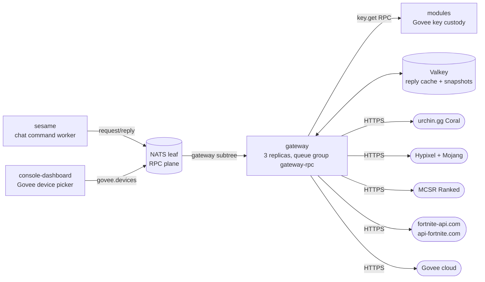
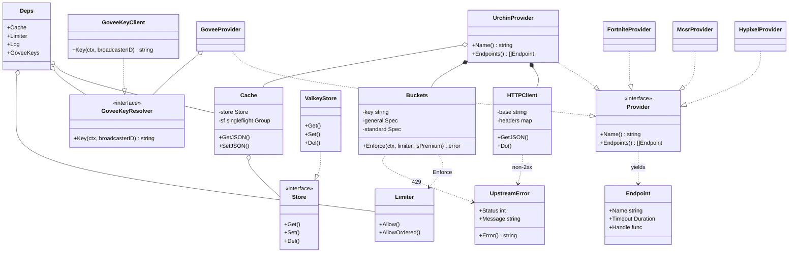
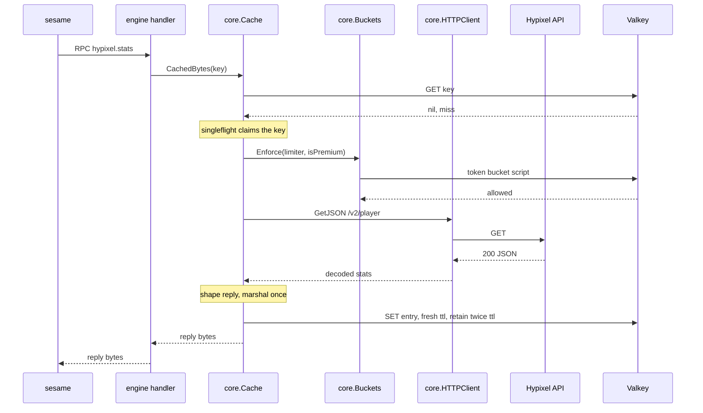
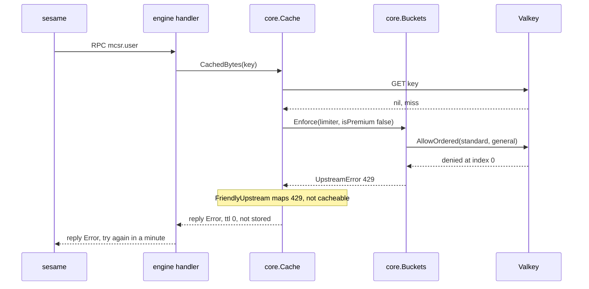
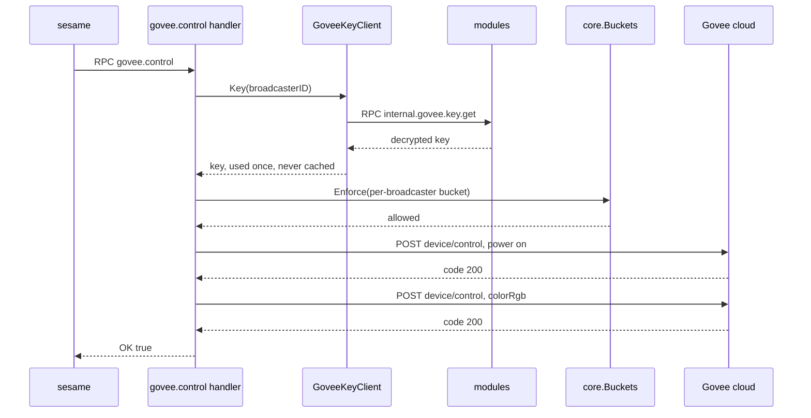
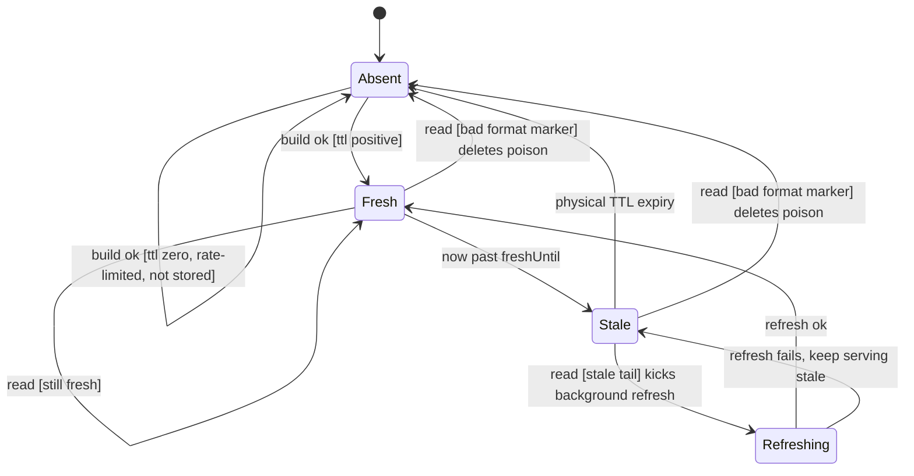

The gateway is the fleet's single door to the public internet. Chat-path services never dial a third-party API themselves: they ask the gateway over **NATS request-reply**, and the gateway fetches from the upstream (urchin.gg Coral, Hypixel, Mojang, MCSR Ranked, fortnite-api.com, api-fortnite.com, Govee), normalizes the answer into a small typed reply, and caches it in Valkey. Concentrating outbound HTTP in one service means one place owns the API keys, the rate budgets, the retry and cache policy, and the only egress to those hosts.

The communication substrate is justified in [ADR 0003](/adr/0003-adoption-of-nats-as-communication-bridge/); the read-through caching discipline in [ADR 0008](/adr/0008-caching-and-write-behind-strategy/). The service mirrors sesame's authoring model (see [sesame](/microservices/sesame/)): a `provider` is the authoring surface, `internal/providers` holds one package per external system plus a one-line registration in `providers.All`, and `engine` is the runtime that indexes and serves them. `main` only wires infrastructure, so adding an external system never touches it.

## Responsibilities

- Front third-party HTTP APIs behind `bagel.rpc.gateway.<provider>.<endpoint>` request-reply, so no other service dials those hosts.
- Normalize each upstream's large, provider-specific JSON into the small typed replies in `internal/domain/rpc/gateway`.
- Cache replies in Valkey with stale-while-revalidate, singleflight miss collapsing, and negative caching of "not found" answers.
- Rate limit toward each upstream under the fleet's premium/standard lane discipline, keeping a reserve for premium callers.
- Resolve each broadcaster's own Govee API key just-in-time from the modules service and use it for exactly one call, never caching or logging it.
- Hold per-channel stream-start snapshots for the MCSR and Fortnite session-delta commands.

What the gateway does **not** do. It parses no chat and dispatches no commands: sesame decides which endpoint a command maps to and passes the parsed arguments. It owns no MySQL schema and writes no durable data; its only state is the Valkey cache and the short-lived session snapshots. It holds no JetStream connection and consumes no streams: the account is **RPC-only** (no BUS user), so the gateway answers requests and publishes nothing. It does not custody Govee keys at rest; the modules service owns them, sealed with Tink AEAD, and hands over a decrypted copy only to the gateway.

## External context

Callers reach the gateway on the node-local NATS leaf (the RPC plane). The primary caller is sesame, which turns chat commands (`!bwstats`, `!session`, `!fnstats`, `!store`, the Govee color reward) into gateway RPCs. The console dashboard reaches exactly one endpoint, `govee.devices`, to render the broadcaster's device picker. The only credential the gateway imports over NATS is the decrypted per-broadcaster Govee key from modules; everything else it needs is a service-wide key in its own Doppler project.

## Internal design

The runtime is a thin subscription loop over a set of providers. `engine.Serve` walks every provider's `Endpoints()` and queue-subscribes each at `<prefix>.<provider>.<endpoint>` in the `gateway-rpc` queue group, then flushes once so a fresh replica never answers a subject list it has not fully registered. Each request runs through one handler closure: decode the shared `gatewayrpc.Request` with sonic, open a New Relic transaction, bound the run with the endpoint's timeout, call `Handle`, and respond. The hot-path discipline is byte-level: a handler that answers with a `json.RawMessage` (a cache hit already holding wire bytes) is responded verbatim, with no re-encode.

Every provider composes the same provider-neutral `core` pieces: `Cache` (the Valkey-backed reply cache), `HTTPClient` (the outbound fetcher on a shared pooled transport), and `Buckets` (one upstream budget under the premium/standard split). A provider captures the services it needs from `provider.Deps` by closure, so the authoring surface stays small and unit-testable.

The five concrete provider classes are each the `Provider` struct in their own package under `app/gateway/internal/providers`. They differ only in which upstream shapes they read and which reply types they build; the shape (own an `HTTPClient` and a `Buckets`, share the one `Cache`) is identical. The Fortnite provider is the exception that holds two `HTTPClient` values, one per upstream (shop and stats), and the Hypixel provider holds a second client for Mojang uuid resolution.

## Key flows

### Cache miss that hits the upstream

The load-bearing read path. A cold key runs the full fetch through the byte-flow cache; the reply is shaped and marshaled once, then stored as ready-to-send wire bytes.

A concurrent second caller for the same key does not make a second upstream call: `singleflight` collapses it onto the in-flight fetch. A subsequent read inside the fresh window returns the stored bytes with zero JSON work; a read in the stale tail returns them immediately and kicks a single background revalidation (see the state machine below).

### Rate-limited or failed upstream

When the upstream budget is exhausted, the denial never reaches the wire. `Buckets.Enforce` returns a typed 429 `UpstreamError`, `FriendlyUpstream` maps it to a chat-safe message, and the reply is answered with a TTL of zero so it is not cached and the very next request retries the bucket.

A standard-lane request must clear both its restricted 75% bucket and the general bucket in one atomic script (a denial consumes neither), so premium keeps a 25% reserve. A premium request consumes only the general bucket. The same friendly, non-caching path handles an upstream 429 and a 403 key-permission failure; a 400 or 404 "not found" answer is friendly but negatively cached (see failure modes).

### Govee control with a just-in-time key

The Govee provider holds no service key. Each redemption resolves the broadcaster's own key from modules, spends one action from that broadcaster's own budget, and drives the device with two sequential calls (power on, then color). The plaintext key lives only inside the handler run.

A power-off redemption runs a single off step instead of the power-plus-color pair. The per-broadcaster budget is spent as one action even though control costs two upstream calls, so the ceiling is set on the redemption, not the raw HTTP call.

## Cache entry lifecycle

The byte-flow cache is a genuine state machine per key. An entry is stored with a fresh window (the build's TTL) and physically retained for twice that, so it outlives its fresh window into a stale tail where it is served while a background refresh runs.

- **Absent to Fresh** on a successful build whose TTL is positive: `storeEntry` writes the entry with fresh window `ttl` and physical retention `2*ttl`.
- **Absent to Absent** when the build answers with TTL zero (a friendly rate-limit or key-permission failure): the reply is returned but not stored, so the next request retries.
- **Fresh to Stale** by the passage of time, when `now` crosses the stored `freshUntil` stamp. No event triggers this; the guard is read on the next access.
- **Stale to Refreshing** on a read in the stale tail: the caller is answered from the stale bytes immediately, and a single background revalidation is launched, deduped through `c.refreshing` so only one refresh runs per key.
- **Refreshing to Fresh** when the background build succeeds and rewrites the entry; **Refreshing to Stale** when it fails, leaving the stale entry to expire on its physical TTL, so an upstream blip degrades to slightly-old data rather than an error.
- **Stale to Absent** at the physical TTL (Valkey evicts the key).
- **Fresh or Stale to Absent** when a read finds an entry that fails the `{"gw2":...}` format marker (legacy shape, foreign writer, drift after a version bump): the poison entry is deleted and refetched rather than served as a zero-value reply.

The typed `core.Cached` path (used for the shared uuid, account, season, and MCSR user lookups) uses the same states without the stale tail: it stores a `{"v":...,"e":...}` envelope and requires the `v`/`e` marker on read, dropping any entry that lacks it.

## NATS contracts

The gateway connects only on the RPC plane with its `gateway_rpc` account; it opens no BUS or JetStream connection.

### Published and consumed subjects

None. The gateway is a pure responder: it publishes to no stream and runs no JetStream consumer.

### Request-reply surface (served)

All endpoints subscribe in the `gateway-rpc` queue group under the prefix `bagel.rpc.gateway` (env `NATS_GATEWAY_SUBJECT_PREFIX`). Every request is the one shared `gatewayrpc.Request`; every reply embeds the conventional `{"error": ""}` envelope, so a `bus.RequestJSON` caller gets a Go error instead of a zero-valued success. Providers register only when configured; an unconfigured provider's subjects simply time out at the caller.

| Subject | Request fields | Reply type | Enabled when |
|---|---|---|---|
| `bagel.rpc.gateway.urchin.daily` / `.weekly` / `.monthly` | `account`, `is_premium` | `UrchinSessionReply` | `URCHIN_API_KEY` set |
| `bagel.rpc.gateway.urchin.sniper` | `account`, `is_premium` | `UrchinSniperReply` | `URCHIN_API_KEY` set |
| `bagel.rpc.gateway.urchin.tags` | `account`, `is_premium` | `UrchinTagsReply` | `URCHIN_API_KEY` set |
| `bagel.rpc.gateway.hypixel.stats` | `account`, `is_premium` | `HypixelStatsReply` | `HYPIXEL_API_KEY` set |
| `bagel.rpc.gateway.mcsr.user` | `account`, `is_premium` | `McsrUserReply` | `MCSR_ENABLED` (default true) |
| `bagel.rpc.gateway.mcsr.session_start` | `account`, `channel_id`, `is_premium` | `McsrSnapshotReply` | `MCSR_ENABLED` |
| `bagel.rpc.gateway.mcsr.session` | `account`, `channel_id`, `is_premium` | `McsrSessionReply` | `MCSR_ENABLED` |
| `bagel.rpc.gateway.fortnite.shop` | `is_premium` | `FortniteShopReply` | `FORTNITE_ENABLED` |
| `bagel.rpc.gateway.fortnite.stats` | `account`, `account_type`, `time_window`, `is_premium` | `FortniteStatsReply` | `FORTNITE_ENABLED` and `FORTNITE_API_KEY` set |
| `bagel.rpc.gateway.fortnite.session_start` | `account`, `channel_id`, `is_premium` | `FortniteSnapshotReply` | `FORTNITE_ENABLED` and key set |
| `bagel.rpc.gateway.fortnite.session` | `account`, `channel_id`, `is_premium` | `FortniteSessionReply` | `FORTNITE_ENABLED` and key set |
| `bagel.rpc.gateway.govee.devices` | `channel_id` | `GoveeDevicesReply` | Govee key resolver wired |
| `bagel.rpc.gateway.govee.control` | `channel_id`, `device`, `sku`, `color_rgb`, `power_off` | `GoveeControlReply` | Govee key resolver wired |
| `bagel.rpc.health.gateway` | (empty) | `RPCHealthReply` | always |

The Fortnite provider always serves `shop` when enabled but only registers `stats`, `session_start`, and `session` when `FORTNITE_API_KEY` is set (shop-only mode otherwise). The default per-endpoint handler timeout is 15s (the bus default is 5s), except the Govee endpoints, which run 8s for `devices` and 12s for `control`.

### Request-reply surface (called)

| Subject | Request / reply | Timeout | Peer |
|---|---|---|---|
| `bagel.rpc.internal.govee.key.get` | `KeyGetRequest` / `KeyGetReply` | 2s | [modules](/microservices/modules/) |

This is the one secret the gateway imports. The NATS account config exports `bagel.rpc.internal.govee.key.>` from `MODULES_RPC` and import-gates it to `GATEWAY_RPC` alone, mirroring how the users service scopes its token and email RPCs. An empty key with no error means the broadcaster has none on file, which the govee provider reports as a friendly "not set up".

## Data

The gateway owns no MySQL schema. Its only state is Valkey, reached through the fleet's read-local, write-Sentinel client (node-local replica reads, which may lag; writes route to the elected master).

| Key pattern | Contents | TTL |
|---|---|---|
| `gateway:<provider>:<endpoint>:<id>` | byte-flow reply entry `{"gw2":<freshUntilMs>,"p":<bytes>}` | fresh `ttl`, retained `2*ttl` |
| `gateway:<provider>:<lookup>:<id>` | typed envelope `{"v":...,"e":...}` for shared uuid/account/user lookups | per lookup (see below) |
| `gateway:mcsr:session:<channelID>` | MCSR stream-start snapshot | 49h |
| `gateway:fortnite:session:<channelID>` | Fortnite stream-start snapshot (lifetime counters) | 49h |
| `gateway:hypixel:uuid:<name>` | Mojang name to uuid binding | 24h |
| `gateway:fortnite:account:<name>` | Epic display name to account id binding | 24h |
| `gateway:fortnite:season:start` | resolved current-season start epoch | 1h |
| `ratelimit:gateway:<provider>` (+ `:standard`) | token bucket state (general and standard lanes) | derived from spec |
| `ratelimit:gateway:govee:<broadcaster>` | per-broadcaster Govee action budget | derived from spec |

Reply TTLs are short where the data moves: 2 min for urchin session deltas, 1 min for MCSR user standings, 10 min for lifetime stats and blacklist state, 15 min for the Fortnite shop, and 10 seconds (govee) to 5 minutes for negative ("not found") entries. Snapshot keys use a 49h window that outlives any single Twitch broadcast (capped at 48h). Session snapshots are keyed by channel so two channels tracking the same player never share a session.

## Configuration

Every knob is a plain environment variable read by `config.Load`, with a development-friendly default. A provider with no credentials configured is skipped at boot, so a missing key degrades to "provider offline" rather than a crash loop.

| Env var | Default | Purpose |
|---|---|---|
| `APP_ENV` | `development` | logger mode |
| `NATS_URL` | `nats://127.0.0.1:4222` | fallback NATS endpoint (local dev) |
| `NATS_RPC_URL` | `NATS_URL` | RPC plane endpoint (node-local leaf in production) |
| `NATS_GATEWAY_SUBJECT_PREFIX` | `bagel.rpc.gateway` | subject prefix for provider endpoints |
| `VALKEY_ADDR` | `127.0.0.1:6379` | Valkey/Sentinel address (Doppler in production) |
| `VALKEY_PASSWORD` | (empty) | Valkey auth |
| `URCHIN_BASE_URL` | `https://api.urchin.gg` | Coral base URL |
| `URCHIN_API_KEY` | (empty) | Coral key; empty disables the urchin provider |
| `URCHIN_RATE_LIMIT` | `600` | Coral budget per 5 min |
| `HYPIXEL_BASE_URL` | `https://api.hypixel.net` | Hypixel base URL |
| `MOJANG_BASE_URL` | `https://api.mojang.com` | Mojang uuid resolver base URL |
| `HYPIXEL_API_KEY` | (empty) | Hypixel key; empty disables the provider (`!bwstats` stays dark) |
| `HYPIXEL_RATE_LIMIT` | `300` | Hypixel budget per 5 min |
| `MCSR_BASE_URL` | `https://api.mcsrranked.com` | MCSR base URL |
| `MCSR_API_KEY` | (empty) | optional; unlocks expanded rate limits |
| `MCSR_ENABLED` | `true` | `false` disables the mcsr provider |
| `MCSR_RATE_LIMIT` | `500` | MCSR budget per 10 min |
| `FORTNITE_BASE_URL` | `https://fortnite-api.com` | shop upstream |
| `FORTNITE_STATS_BASE_URL` | `https://prod.api-fortnite.com` | stats upstream |
| `FORTNITE_API_KEY` | (empty) | api-fortnite.com key; empty runs shop-only |
| `FORTNITE_ENABLED` | `false` | gate for the whole provider |
| `FORTNITE_RATE_LIMIT` | `120` | shop budget per minute |
| `FORTNITE_STATS_RATE_LIMIT` | `9000` | stats budget per day |
| `FORTNITE_SEASON_START_UNIX` | `0` | manual season-start override; 0 auto-resolves hourly |
| `GOVEE_BASE_URL` | `https://openapi.api.govee.com` | Govee base URL |
| `GOVEE_RATE_LIMIT` | `8` | actions per minute per broadcaster |
| `NATS_INTERNAL_GOVEE_KEY_SUBJECT_PREFIX` | `bagel.rpc.internal.govee.key` | modules key RPC prefix; empty disables the govee provider |
| `LISTEN_ADDR` | `:8080` | health server address |

The infrastructure packages read further environment set in the manifest: `pkg/valkey` reads `NODE_IP`, `VALKEY_LOCAL_ADDR`, and `VALKEY_TLS_*` for the node-local TLS read path; `pkg/bus` reads `NATS_LEAF_URL`, `NATS_RPC_USER` / `NATS_RPC_PASSWORD`, and `NATS_CA_PEM` for the leaf-first RPC connection over the fleet CA. The manifest also sets `GOMEMLIMIT=96MiB`. `NATS_HUB_URL` is present in the shared template but inert here, since the gateway opens no JetStream connection.

## Deployment

From `deploy/k8s/gateway.yaml`. The image is a distroless static, nonroot build (`gcr.io/distroless/static-debian12:nonroot`, uid 65532), built from the repo root and pulled digest-pinned from GHCR by Flux (`ImagePolicy` filtering `main-<ts>-<sha>` tags, newest by timestamp).

- **Replicas:** 3, one responder co-located near sesame on each node. Hard `podAntiAffinity` on `kubernetes.io/hostname` plus a `DoNotSchedule` topology spread keep exactly one pod per node.
- **Rollout:** `RollingUpdate` with `maxSurge: 0` and `maxUnavailable: 1`, `minReadySeconds: 10`, so the one-per-node anti-affinity cannot deadlock a roll. A `PodDisruptionBudget` allows at most one unavailable.
- **Probes:** `/healthz` (liveness and startup, process-alive only, so a reconnecting NATS dependency never restarts the container), `/readyz` (readiness, gated on `nc.IsConnected`, returns 503 until NATS is connected), and a `/drain` preStop that sleeps 10s so endpoints drain before SIGTERM. `terminationGracePeriodSeconds` is 45.
- **Resources:** requests 10m CPU / 32Mi, limits 250m / 128Mi, `GOMEMLIMIT=96MiB`. The working set is one set of HTTP clients and a Valkey connection.
- **Placement:** tolerates the `worker-pool` taint and carries 60s `unreachable` / `not-ready` tolerations.
- **Secrets:** a `DopplerSecret` (`gateway-env`) with `secrets.doppler.com/reload: "true"`, so a key rotation auto-restarts the pods.

There is no service mesh: Linkerd is removed fleet-wide, and the wire is encrypted by NATS-native TLS (verified against the fleet CA) and Valkey native TLS on 6380. The manifest still carries `linkerd.io/inject: disabled` and `config.linkerd.io/*` annotations left over from before the mesh removal; they are inert.

## Observability

The gateway registers a New Relic Go application at boot (`monitor.New`) and wraps its zap logger so log lines are forwarded. Each RPC opens a transaction named `rpc <subject>`; an undecodable request body records a `NoticeError`. Structured zap logging carries the operational signal: a warn on every upstream fetch failure (with provider, account, and error), and a debug line when a handler runs longer than 250ms, matching the slow-call logging the rest of the fleet's RPC surface emits. The `bagel.rpc.health.gateway` responder gives the admin Analytics page a side-effect-free latency probe that exercises the same account, leaf route, and dispatch path as the real handlers.

## Failure modes and how the service responds

| Failure | Response |
|---|---|
| Undecodable request body | fixed `{"error":"bad request"}` reply, `NoticeError` on the transaction |
| Missing `account` or `channel_id` | reply with a friendly `error`, no upstream call |
| Upstream 400 / 404 (player not found) | friendly reply, negatively cached for `negativeTTL` so repeat lookups do not hammer the upstream |
| Upstream 403 (key lacks permission) | friendly "not permitted right now", not cached, retried next request |
| Upstream 429 (upstream rate limited) | friendly "busy, try again", not cached |
| Local budget denied by `Buckets.Enforce` | typed 429 `UpstreamError`, friendly reply, not cached (bucket retried next call) |
| Upstream 5xx, transport error, or timeout | infrastructure error; handler returns a generic "lookup failed" reply. On a stale hit the old bytes are kept and the failed background refresh is swallowed |
| Valkey read/write error | degrade to a direct fetch or build; the lookup still answers, only the cache is bypassed |
| Poison cache entry (format drift) | detected by the missing format marker, deleted, and refetched |
| Govee key resolve fails / no key on file | "could not read your Govee key" / "no Govee API key on file" |
| Provider not configured | subject not subscribed; caller times out, the same failure mode as the upstream being down |
| NATS reconnecting | `/readyz` returns 503 while `/healthz` keeps the container alive; the client reconnects endlessly and ignores auth-error aborts so a lagging credential rotation cannot permanently strand the pod |

## Design notes

The service is a small, deliberate exercise in the GRASP responsibilities and a handful of GoF patterns.

- **Pure Fabrication:** `engine`, `core.Cache`, `core.HTTPClient`, and `core.Buckets` map to no domain concept. They exist to concentrate the subscription loop, caching, outbound HTTP, and budget arithmetic away from the providers, which keeps coupling low and cohesion high.
- **Information Expert:** each `Provider` is the expert on its own upstream's JSON shape and owns both the fetch and the normalization. `Buckets` is the expert on turning an allowance and a window into two strictly-bounded token buckets.
- **Controller:** the closure `engine.subscribe` installs is the use-case controller for one RPC: decode, transaction, timeout, dispatch, respond.
- **Protected Variations:** three interfaces shield the stable core from what varies. `provider.Provider` and `Endpoint` hide each upstream from the engine (adding one never touches `main` or `engine`); `core.Store` hides Valkey from the cache (tests swap an in-memory map); `provider.GoveeKeyResolver` hides the key source from the govee provider.
- **Polymorphism:** the engine iterates `[]provider.Provider` uniformly.

GoF patterns that genuinely appear: **Strategy** (interchangeable `Provider` implementations behind one engine, plus the first-class `fetch` and `errReply` functions `BuildReply` and `Cached` run their fixed skeleton over), **Adapter** (each provider adapts a foreign API to the `gatewayrpc` reply types; `HTTPClient` adapts `net/http` to the fetch surface), **Facade** (the gateway is a facade over many third-party APIs; `core.Cache` is a facade over `Store`, `singleflight`, and the SWR entry format), **Proxy** (a caching and protection proxy for the upstreams; `GoveeKeyClient` is a remote proxy for the modules key store), and a small **Registry** in `providers.All`.

Architecture tactics (SEI/Bass vocabulary) the code actually implements: **caching** and **stale-while-revalidate** for performance; **rate limiting** with a premium reserve in `core.Buckets`; **introduce concurrency control** via `singleflight` miss collapsing (a chat spike on one player costs one upstream call); **bound resource consumption** with the 4 MiB response read cap, `GOMEMLIMIT`, and the `sync.Pool` scratch buffers; **sharding** via the `gateway-rpc` queue group across the 3 replicas; **heartbeat / ping** on the NATS connection and the RPC health responder; **removal from service** through the readiness gate, PDB, and drain preStop; and **graceful degradation** everywhere a missing key or a Valkey error steps down to a lesser answer instead of a failure.

## References

- [ADR 0003: adoption of NATS as communication bridge](/adr/0003-adoption-of-nats-as-communication-bridge/)
- [ADR 0008: caching and write-behind strategy](/adr/0008-caching-and-write-behind-strategy/)
- [ADR 0010: adoption of New Relic for observability](/adr/0010-adoption-of-new-relic-for-observability/)
- [sesame](/microservices/sesame/): the primary caller, and the architecture the gateway mirrors
- [modules](/microservices/modules/): custodian of the per-broadcaster Govee keys the gateway imports
- [console](/microservices/console/): the dashboard that reads `govee.devices`
- [twitch-ingress](/microservices/twitch-ingress/): where the premium/standard lane a request rides is decided
