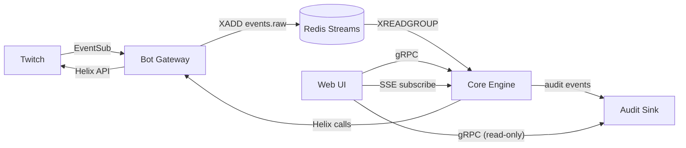

The platform is split into a small number of services with **clear ownership boundaries** and a single shared event bus. The rule of thumb: a service owns its data (its Postgres schema, its Redis keys), and other services reach it via a well-typed API or via events on the bus — never by reaching directly into its tables.

## Registry

| Service | Repo path | Language | Owns | Public to |
| --- | --- | --- | --- | --- |
| **Bot Gateway** | `services/bot-gateway/` | Go | `gateway.*` schema, EventSub subscription state, Helix rate-limit shaping | Cloudflare Tunnel (EventSub only); internal: core engine, web UI |
| **Core Engine** | `services/core-engine/` | Kotlin (native-image) | `core.*` schema, `events.raw` consumer group, module execution | Internal: web UI, bot gateway |
| **Web UI** | `services/web-ui/` | TypeScript / Astro | UI state only — no domain ownership | Cloudflare Tunnel + Cloudflare Access |
| **Audit Sink** | `services/audit-sink/` | Go | `audit.*` schema | Internal: core engine (writes), web UI (reads) |
| **cloudflared** | (vendored) | — | Ingress | External |

Detail pages:

- **[Core Engine →](/microservices/core-engine/)**
- **[Bot Gateway →](/microservices/bot-gateway/)**

(Web UI and Audit Sink are intentionally small enough that they don't yet warrant their own pages; this will change as the system grows.)

## Service-to-service shape



Two transport flavors are in play:

- **Event bus** (Redis Streams) for **asynchronous, durable, fan-in** traffic — the EventSub firehose.
- **gRPC** for **synchronous, request/response** traffic between services — UI reads, Helix-call delegation, audit writes.

We don't use REST internally. gRPC's schema-first contracts catch breakage at build time, which is worth more than its complexity tax for the dozens of internal endpoints we'll ever have.

Helix calls from the core engine go **through the bot gateway** rather than direct to Twitch. The reason: Helix rate-limit state belongs to one service (the gateway), and centralizing outbound Twitch traffic gives us one place to do shaping, retries, and circuit-breaking. See [Bot gateway → rate limiting](/microservices/bot-gateway/).

## Inter-service authentication

There is **no anonymous internal traffic**. Even though every service is on the same Kubernetes cluster behind a Tailscale-gated control plane, we don't grant trust by network position — that's the whole point of [ADR-0001](/adr/0001-zero-trust-network/), and it applies inside the cluster too.

### Identity: SPIFFE-style workload IDs via SPIRE

Each pod gets a **workload identity** issued by [SPIRE](https://spiffe.io/), in the form of a SPIFFE ID:

```
spiffe://bagelbot.cluster/ns/bagelbot-app/sa/core-engine
spiffe://bagelbot.cluster/ns/bagelbot-app/sa/bot-gateway
```

The SPIRE agent on each node attests the pod (via Kubernetes ServiceAccount + image SHA) and issues a short-lived **SVID** (mTLS certificate) the pod can present.

### gRPC: mTLS with SPIFFE IDs

gRPC services authenticate clients via the peer SVID. Authorization is an explicit allow-list per RPC:

```go
// illustrative
authz := authz.Rules{
    "/bagelbot.core.v1.ModuleService/GetModuleConfig": authz.Allow(
        "spiffe://bagelbot.cluster/ns/bagelbot-app/sa/web-ui",
    ),
    "/bagelbot.core.v1.EventService/Subscribe": authz.Allow(
        "spiffe://bagelbot.cluster/ns/bagelbot-app/sa/web-ui",
    ),
    "/bagelbot.core.v1.HelixDelegate/SendChat": authz.Allow(
        "spiffe://bagelbot.cluster/ns/bagelbot-app/sa/core-engine",
    ),
}
```

A compromised pod with the *wrong* identity can connect but cannot make any of the calls — its SVID doesn't match the rule.

SVIDs rotate every hour. There are **no long-lived bearer tokens** between services.

### Event bus: Redis ACLs

Redis itself doesn't speak mTLS in our deployment. Instead, each service connects with a **scoped Redis ACL user** whose permissions match its role:

| Service | Redis user | Can | Cannot |
| --- | --- | --- | --- |
| Bot gateway | `bagelbot-gateway` | `XADD events.raw`; `SET` on `eventsub:msg:*`; `GET/SET` on `gateway:*` cache keys | Read other services' cache namespaces; `XREADGROUP` |
| Core engine | `bagelbot-engine` | `XREADGROUP` on `events.raw`; `XACK`, `XCLAIM`; full access to `core:*` cache namespace | `XADD events.raw`; touch `gateway:*` keys |
| Audit sink | `bagelbot-audit` | Read-only on `events.raw` for back-fill; full access to `audit:*` namespace | Anything outside `audit:*` |

ACL definitions live in a `redis.conf` snippet committed to the ops repo. Passwords are SOPS-encrypted.

### Postgres: per-service roles

Already covered under [Primary databases](/data-and-state/primary-databases/) — each service's connection role is scoped to its schema, with column-level grants where helpful.

## Adding a new service

Checklist:

1. **Create a Postgres schema** and a service role with grants scoped to it.
2. **Define a Redis ACL user** if the service touches Redis; bound to a key prefix.
3. **Allocate a SPIFFE ID** in the SPIRE configuration and provision the Kubernetes ServiceAccount.
4. **Define the gRPC contract** in `proto/bagelbot/<service>/v1/*.proto` and add it to the build.
5. **Add the authz allow-list entries** — both sides; the new service's server, and any service that calls it.
6. **Add the deploy manifest** to the ops repo under `apps/<service>/`.
7. **Write the ADR** if the service introduces a new pattern, dependency, or boundary that isn't covered already.

## Where to next

- **[Core Engine →](/microservices/core-engine/)** — the heavy-lifter.
- **[Bot Gateway →](/microservices/bot-gateway/)** — WebSockets and rate limits.
- **[Event flow →](/architecture/event-flow/)** — how these services collaborate on a single event.
