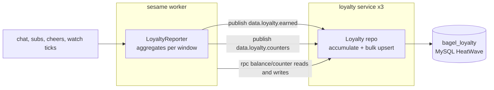
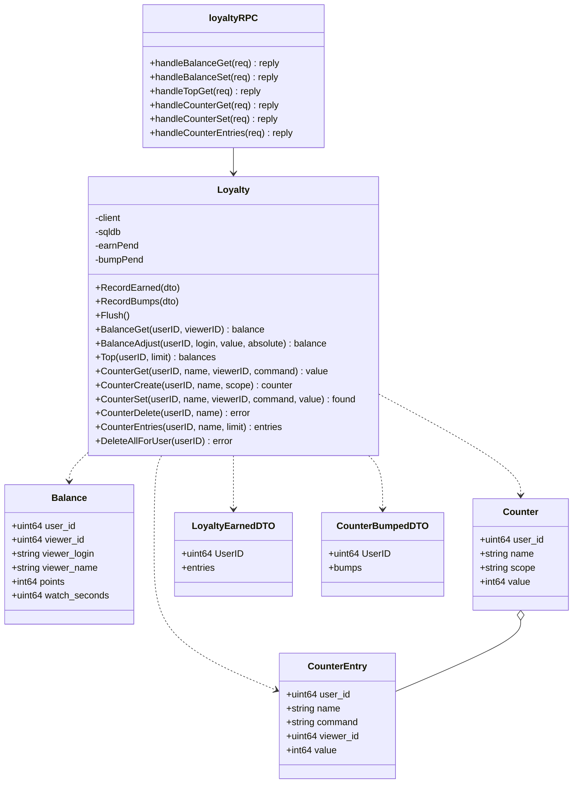
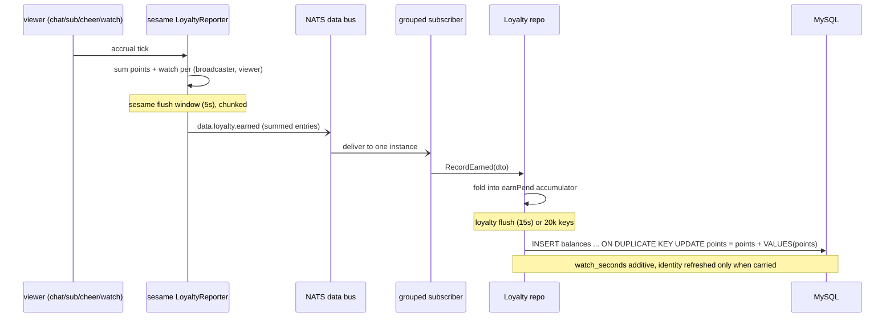
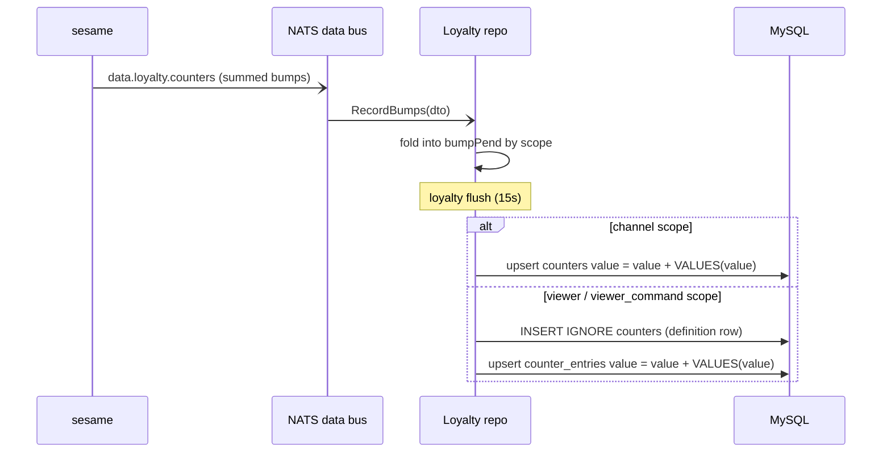
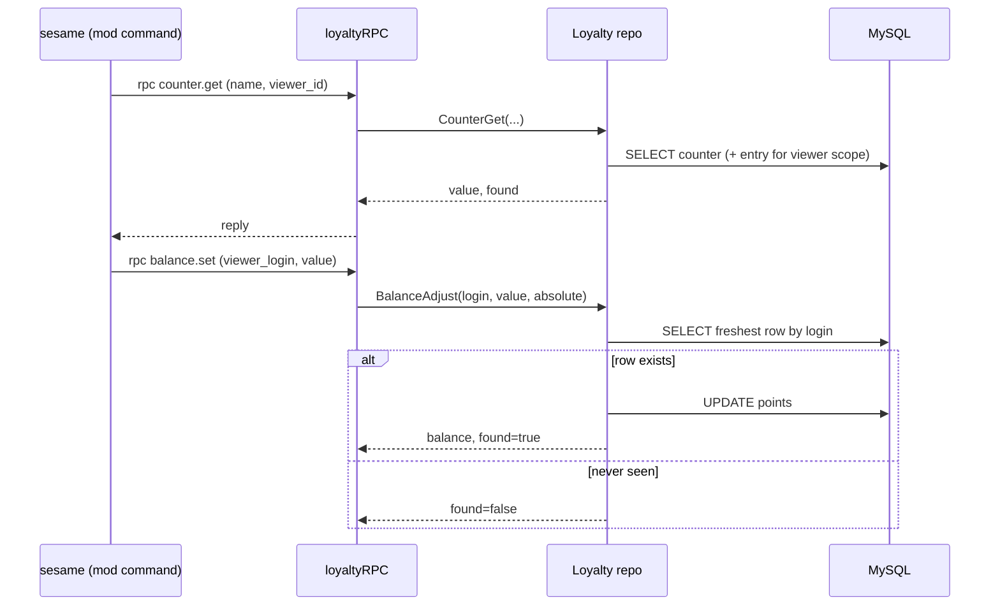
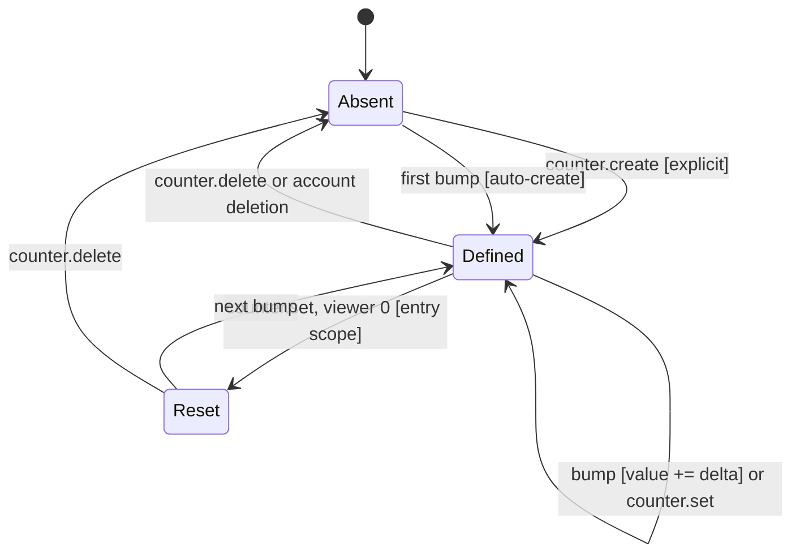

The Loyalty service (`app/loyalty/`) owns the points, watch-time, and counter standings behind sesame's loyalty
module. It is a per-schema, single-writer data service ([ADR 0007](/adr/0007-adoption-of-per-schema-data-microservices/)),
but it is shaped differently from [commands](/microservices/commands/) and [modules](/microservices/modules/): those
are edited from a console and streamed to a projection, while loyalty is fed by a high-volume firehose of accruals
from [sesame](/microservices/sesame/) and read back over RPC. Every high-volume write arrives as a summed delta,
accumulates in memory, and lands in bulk additive upserts, so the tables only ever hold one row per standing and
grow with distinct viewers, never with activity. It sits on the NATS bus
([ADR 0003](/adr/0003-adoption-of-nats-as-communication-bridge/)) over MySQL HeatWave
([ADR 0005](/adr/0005-adoption-of-mysql-heatwave/)).

## Responsibilities

- Own the `bagel_loyalty` schema (three tables: `balances`, `counters`, `counter_entries`) and be its only writer.
- Fold the summed `data.loyalty.earned` and `data.loyalty.counters` deltas from sesame into additive standings on a
  batch flush window.
- Auto-create a viewer's balance row on their first accrual, and a counter row on its first bump, so a counter
  referenced straight from a command template just works.
- Serve balance and counter reads over RPC on a sesame cache miss (`balance.get`, `top.get`, `counter.get`,
  `counter.list`, `counter.entries`).
- Serve moderator-facing writes over RPC: point grants by login (`balance.set`, `balance.add`) and counter
  management (`counter.create`, `counter.set`, `counter.delete`).
- Sweep every balance, counter, and counter entry of a deleted account when `data.users.deleted` arrives.

What this service does **not** do:

- It does not publish change events. Unlike commands and modules, loyalty has no `data.loyalty.*` output, no
  projection to feed, and no cache to invalidate. It is a sink for deltas and a read/write RPC store.
- It does not accrue points itself. Deciding who earned what per chat, sub, cheer, or watch tick is sesame's job;
  loyalty only sums the deltas sesame reports.
- It does not read another service's schema. Broadcaster and viewer identities arrive as ids and logins on the wire.
- It does not run an in-process read cache. RPC reads hit ent directly; sesame owns the caching in front of them.

## External context

The delta events are asynchronous JetStream traffic; the reads and moderator writes are request-reply RPC on the
leaf plane. There is no projector and no change-event fan-out on the way out.

## Internal design

The `Loyalty` repository holds both the ent client (for RPC reads and the low-volume management writes) and the raw
`*sql.DB` handle the ent driver was built from. The bulk flush statements go through the raw handle because ent's
typed upserts are per-row constants and cannot express `value = value + VALUES(value)` across a multi-row insert.

A counter aggregates its entries by the natural key `(user_id, name)` rather than an ent edge: the entries are
written by additive bulk upserts on the flush path, and a flat natural key keeps that one statement with no id
lookups. A counter name is normalized (lower-cased, leading `!` stripped) by an ent hook and at every RPC boundary,
so `{counter:Deaths}` in a command template and `!counter add deaths` hit the same row.

Counters come in three scopes, all per channel:

- **channel**: one global value per `(broadcaster, name)`, stored in `counters.value`.
- **viewer**: one value per `(broadcaster, name, viewer)`, stored in `counter_entries`.
- **viewer_command**: one value per `(broadcaster, name, command, viewer)`, so the same counter keeps a separate
  per-viewer tally for each command or channel-point reward that bumps it.

## Key flows

### Earn path: chat to balance

The earn path is two batch windows back to back. Sesame's `LoyaltyReporter` sums per-viewer accruals over a 5-second
window and publishes chunked summed events; loyalty folds them and lands them on its own 15-second window.

Deltas are loss-tolerant end to end: sesame rate-limits the bus to one summed event per broadcaster per window, and
a dropped event costs at most one window of deltas, never a corrupt balance. Display identity (login, name) is
refreshed opportunistically only when an event actually carried it, using `IF(VALUES(col) = '', keep, new)` so an
event without identity never blanks the stored one.

### Counter bump: fold and auto-create

Entry-scoped bumps first ensure the definition row exists (an `INSERT IGNORE` seeded with the bump's own scope, so a
counter bumped straight from a command template appears in `counter.list`), then upsert the per-viewer buckets.
Bulk writes are chunked at 500 rows per statement to stay under MySQL's placeholder and packet limits.

### Read and moderator write

Reads and management writes hit ent directly (no cache). A moderator grant addresses the target by login, because
chat knows a login, not an id: the freshest matching balance row wins, and an unseen login returns `found=false`
so the bot can answer "haven't seen them yet" instead of inventing an id-less row. A trust-boundary rejection
(bad name or scope) is echoed to the caller as `ErrInvalidInput`; any other error is logged and masked.

## Counter lifecycle

A named counter is a genuine entity state machine.

- **Absent to Defined [explicit]**: `counter.create` upserts the definition with a chosen scope. Create is
  idempotent: an existing counter keeps its value and scope, so create is never a reset.
- **Absent to Defined [auto-create]**: the first bump the worker reports creates the definition row implicitly
  (channel scope upserts the row, entry scopes seed it with `INSERT IGNORE`).
- **Defined to Defined**: a bump adds its delta (channel scope to `counters.value`, entry scopes to a
  `counter_entries` bucket), or `counter.set` writes an absolute value.
- **Defined to Reset [entry scope, viewer 0]**: `counter.set` with no viewer on an entry-scoped counter deletes
  every entry (the `!counter reset` semantics) while keeping the definition row.
- **Defined to Absent**: `counter.delete` removes the counter and its entries; the account-deletion sweep does the
  same for every counter of the broadcaster.

## NATS contracts

Two planes, as in [ADR 0003](/adr/0003-adoption-of-nats-as-communication-bridge/): request-reply RPC on the
per-service account through the leaf, and JetStream events on the shared BUS account against the hub. The delta
subjects live on the `BAGEL_DATA` stream (R1, 5-minute retention), owned by the users service. Loyalty publishes
nothing.

### Consumed

| Subject                  | Subscriber | Queue group | Delivery                    | Handler                                              |
|--------------------------|------------|-------------|-----------------------------|------------------------------------------------------|
| `data.loyalty.earned`    | grouped    | `loyalty`   | durable, one pod per event  | Fold summed point and watch deltas into the accumulator. |
| `data.loyalty.counters`  | grouped    | `loyalty`   | durable, one pod per event  | Fold summed counter bumps into the accumulator.      |
| `data.users.deleted`     | grouped    | `loyalty`   | durable, one pod per event  | Sweep the account's balances, counters, and entries. |

All three ride the durable group subscriber (exactly one instance folds each event, retried on another on failure),
on the shared fleet redelivery budget (NAK paced 3 seconds, 5 redeliveries, then TERM). Handlers are idempotent; a
malformed payload is dropped rather than redelivered.

### Request-reply (RPC)

All under the `bagel.rpc.loyalty` prefix, queue group `loyalty-rpc`, using `loyaltyrpc.Request` / `loyaltyrpc.Reply`.

| Verb                | Request fields                                 | Reply                | Purpose                                        |
|---------------------|------------------------------------------------|----------------------|------------------------------------------------|
| `balance.get`       | `user_id, viewer_id`                           | `balance`            | One viewer's standing (zero when unseen).      |
| `balance.set`       | `user_id, viewer_login, value`                 | `balance, found`     | Mod grant, absolute, by login.                 |
| `balance.add`       | `user_id, viewer_login, value`                 | `balance, found`     | Mod grant, delta, by login.                    |
| `top.get`           | `user_id, limit`                               | `top`                | Channel leaderboard by points.                 |
| `counter.get`       | `user_id, name [, viewer_id, command]`         | `counter, found`     | Effective counter value.                       |
| `counter.create`    | `user_id, name, scope`                         | `counter`            | Idempotent counter definition.                 |
| `counter.set`       | `user_id, name, value [, viewer_id, command]`  | `found`              | Absolute value; viewer 0 resets an entry scope. |
| `counter.delete`    | `user_id, name`                                | `found`              | Remove a counter and its entries.              |
| `counter.list`      | `user_id`                                       | `counters`           | Channel's counter definitions.                 |
| `counter.entries`   | `user_id, name, limit`                         | `entries, found`     | An entry-scoped counter's buckets, highest first. |
| `bagel.rpc.health.loyalty` | health ping                             | ok                   | Liveness of the RPC responder.                 |

Handlers enforce a 2-second processing timeout and reply with a JSON `{"error": "..."}` envelope on failure. A
missing row is not an error: `balance.get` returns a zero balance and `counter.get` sets `found=false`, so the
caller can tell "0" from "no such counter".

## Data

The service owns three tables in `bagel_loyalty`.

### `balances`

| Column          | Type   | Notes                                                            |
|-----------------|--------|------------------------------------------------------------------|
| `user_id`       | uint64 | Broadcaster Twitch id. Immutable.                               |
| `viewer_id`     | uint64 | Viewer Twitch id (a plain chatter, no account). Immutable.     |
| `viewer_login`  | string | Display login, refreshed opportunistically. Max 64.            |
| `viewer_name`   | string | Display name. Max 64.                                          |
| `points`        | int64  | Spendable points. Signed so a future spend path cannot underflow. |
| `watch_seconds` | uint64 | Lifetime watch time, summed from watch ticks.                  |
| `created_at`    | time   |                                                                |
| `updated_at`    | time   | Auto-updated on write.                                         |

Unique index on `(user_id, viewer_id)`; a second index on `(user_id, points)` backs the leaderboard read.

### `counters`

| Column       | Type   | Notes                                                            |
|--------------|--------|------------------------------------------------------------------|
| `user_id`    | uint64 | Broadcaster Twitch id. Immutable.                               |
| `name`       | string | Normalized counter key. Not empty, max 64.                     |
| `scope`      | string | channel, viewer, or viewer_command. Default channel.           |
| `value`      | int64  | The channel-scope value; 0 for entry scopes (definition only). |
| `created_at` | time   |                                                                |
| `updated_at` | time   | Auto-updated on write.                                         |

Unique index on `(user_id, name)`.

### `counter_entries`

| Column       | Type   | Notes                                                            |
|--------------|--------|------------------------------------------------------------------|
| `user_id`    | uint64 | Broadcaster Twitch id. Immutable.                               |
| `name`       | string | The counter this bucket belongs to. Max 64.                    |
| `command`    | string | The command/reward bucket of a viewer_command counter; "" for plain viewer scope. Immutable, max 64. |
| `viewer_id`  | uint64 | Viewer Twitch id. Immutable.                                   |
| `value`      | int64  | This bucket's value.                                          |
| `updated_at` | time   | Auto-updated on write.                                         |

Unique index on `(user_id, name, command, viewer_id)`, the flush upsert's conflict target.

## Configuration

Env-driven, read once at boot.

| Variable                                     | Purpose                                             | Default                                 |
|----------------------------------------------|-----------------------------------------------------|-----------------------------------------|
| `APP_ENV`                                    | Logger profile.                                    | `development`                           |
| `DB_ADDR`                                    | MySQL address.                                     | `127.0.0.1:3306`                        |
| `DB_USER` / `DB_PASS`                        | Schema-scoped credentials (required).             | (none)                                  |
| `DB_SCHEMA`                                  | Owned schema.                                     | `bagel_loyalty`                         |
| `DB_AUTO_MIGRATE`                            | Run ent auto-migration at boot.                   | `true`                                  |
| `DB_MAX_OPEN_CONNS` / `DB_QUERY_CONCURRENCY` | Pool and query gate size.                         | `4` (from the manifest)                 |
| `NATS_URL`                                   | Local-dev fallback endpoint.                      | `nats://127.0.0.1:4222`                 |
| `NATS_HUB_URL`                               | JetStream hub for the event fold.                 | (manifest: `nats://nats:4222`)          |
| `NATS_RPC_URL` / `NATS_LEAF_URL`             | RPC plane, node-local leaf.                       | (manifest: `nats://nats-leaf:4222`)     |
| `NATS_CA_PEM`                                | Fleet CA to verify the broker TLS cert.           | (fleet-ca ConfigMap)                    |
| `NATS_USER` / `NATS_PASSWORD`                | Shared BUS account.                               | (secret)                                |
| `NATS_RPC_USER` / `NATS_RPC_PASSWORD`        | Per-service RPC account.                          | (falls back to `NATS_USER`)             |
| `NATS_JS_DOMAIN`                             | JetStream domain.                                 | `hub`                                   |
| `NATS_LOYALTY_SUBJECT_PREFIX`                | RPC verb prefix.                                  | `bagel.rpc.loyalty`                     |
| `LISTEN_ADDR`                                | Health server bind.                               | `:8080`                                 |
| `NEW_RELIC_LICENSE_KEY`                      | Enables the APM agent; absent makes it a no-op.   | (secret)                                |

The service has no publisher, so it sets no `NATS_HUB_PUBLISH_URL`.

## Deployment

From `deploy/k8s/loyalty.yaml`, delivered by Flux from a digest-pinned GHCR image. The service is live in production
(the `bagel_loyalty` schema and `loyalty_svc` user were onboarded in July 2026); it is referenced from the fleet
kustomization and is not deploy-gated.

- **Image**: multi-stage build on `golang:1.26.5-bookworm`, shipped on `gcr.io/distroless/static-debian12:nonroot`.
  Ent clients regenerated at build with `--feature sql/upsert`.
- **Replicas**: 3, one per hot-path node. The intent is a local RPC responder beside sesame on every node; the event
  folds stay queue-grouped across the three replicas, so exactly one folds each delta event. Required pod
  anti-affinity plus a topology spread constraint keep one pod per host.
- **Rollout**: `RollingUpdate`, `maxSurge: 0`, `maxUnavailable: 1`, `minReadySeconds: 10`; PDB `maxUnavailable: 1`.
- **Placement**: tolerates the `worker-pool` taint and short unreachable windows; node affinity excludes node1.
- **Probes**: `/healthz` liveness, `/readyz` readiness (503 while NATS is disconnected), `/drain` preStop (10 s
  sleep). `terminationGracePeriodSeconds: 45`.
- **Runtime**: `GOMEMLIMIT=160MiB` against a 256Mi limit; requests 25m CPU and 64Mi memory.
- **Secrets**: the Doppler operator manages `loyalty-env` and restarts on change.

On shutdown the repository's `Close` stops the flush ticker and drains both accumulators one last time, so pending
deltas land before exit.

## Observability

- **Logging**: structured zap to stdout, New Relic wrapped.
- **Tracing and metrics**: New Relic Go agent ([ADR 0010](/adr/0010-adoption-of-new-relic-for-observability/)). Each
  consumed event and RPC runs inside its own transaction; the batch flush reports as `flush loyalty deltas`, so the
  accumulate-then-upsert latency is visible apart from request latency. Per-chunk upsert failures are noticed on the
  transaction and logged.
- **Health**: the RPC health responder answers on `bagel.rpc.health.loyalty`.

## Failure modes and how the service responds

| Failure                               | Response                                                                                                    |
|---------------------------------------|------------------------------------------------------------------------------------------------------------|
| A bulk upsert chunk fails             | Logged and dropped. Retrying would double-apply the sibling chunks that already landed; deltas are loss-tolerant. |
| Accumulator overflows a cap           | An early flush is triggered (single-flight guarded); entries are never dropped, the map keeps absorbing while the flush drains a snapshot. |
| Malformed delta payload               | Dropped (handler returns nil), not retried.                                                                |
| Oversized counter/source name         | Clamped to the column width before the flush, so one bad name cannot fail a whole chunk.                    |
| `data.users.deleted` DB failure       | Return the error so JetStream redelivers, up to the budget; the sweep is idempotent.                       |
| RPC read of a missing row             | Not an error: a zero balance or `found=false`, so the caller can answer chat correctly.                     |
| Invalid RPC input (name/scope)        | Echoed as a "bad request"; other errors are logged and masked to a generic failure.                        |
| NATS disconnect                       | `pkg/bus` reconnects endlessly; `/readyz` reports 503 until reconnected.                                    |

## Design notes

- **Information Expert / High Cohesion**: the `Loyalty` repository is the single authority on standings and the only
  writer of the three tables; `loyaltyRPC` handlers are thin Controllers that parse ids and delegate.
- **Pure Fabrication**: the in-memory accumulators (`earnPend`, `bumpPend`) and the raw `*sql.DB` bulk-upsert path
  are fabricated mechanisms with no domain identity, introduced so a firehose of accruals becomes one bulk statement
  per window.
- **Low Coupling**: no cross-schema reads, no change-event output, no projection. The service is coupled to the rest
  of the fleet only through the delta DTOs it consumes and the RPC verbs it answers.
- **Architecture tactics**: queue-based load leveling (the accumulate-then-bulk-upsert flush, one statement per
  table per window), rate limiting (sesame's summed delta events plus the loyalty accumulator), retry with capped
  budget and paced NAK (JetStream redelivery on the folds), removal from service (readiness 503 plus `/drain`), and
  heartbeat (the RPC health responder). The single-flight overflow guard is a bounded-resource tactic against a
  hot channel growing the accumulator without bound.

## References

- [ADR 0003](/adr/0003-adoption-of-nats-as-communication-bridge/): the bus, subject space and delivery semantics.
- [ADR 0005](/adr/0005-adoption-of-mysql-heatwave/): the relational database.
- [ADR 0007](/adr/0007-adoption-of-per-schema-data-microservices/): the per-schema, single-writer data-service model.
- [ADR 0010](/adr/0010-adoption-of-new-relic-for-observability/): observability.
- Related services: [sesame](/microservices/sesame/), [commands](/microservices/commands/),
  [modules](/microservices/modules/), [users](/microservices/users/).
