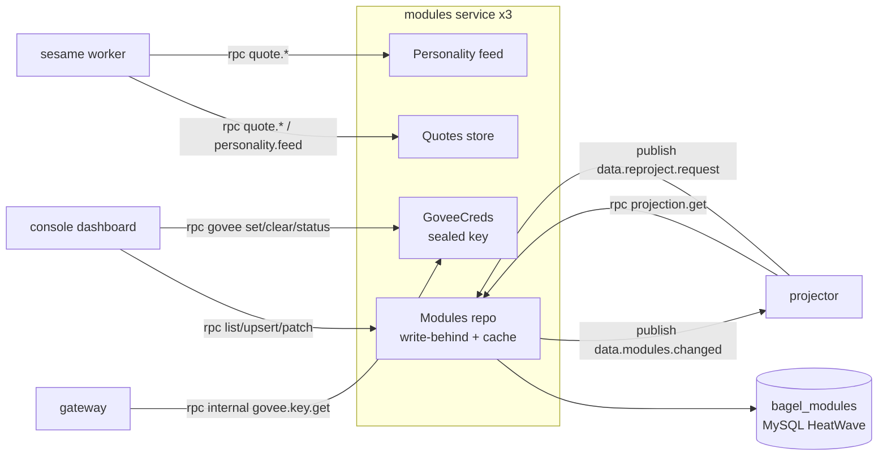
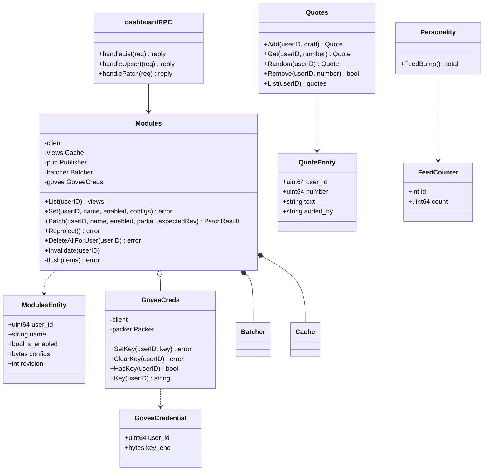
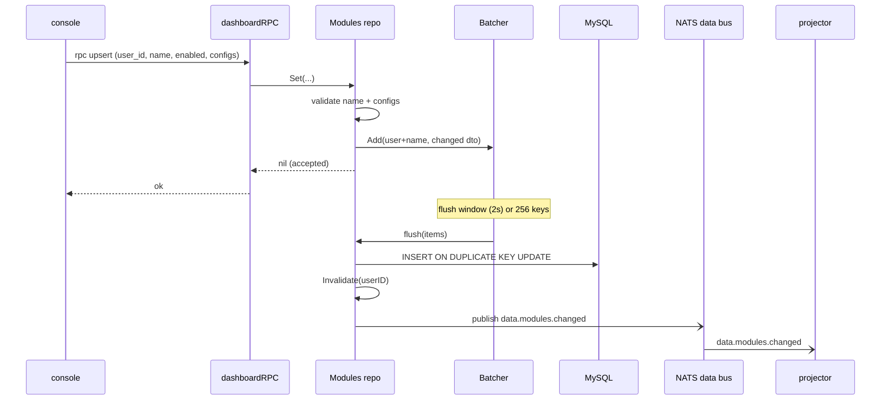
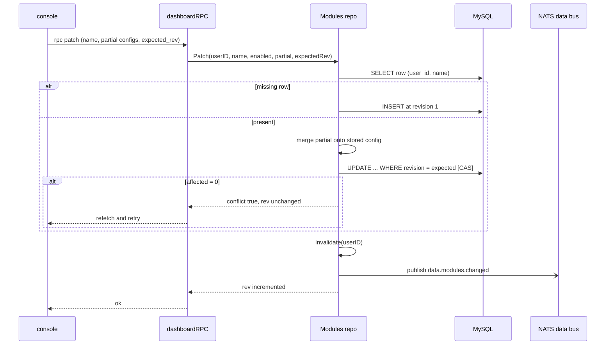
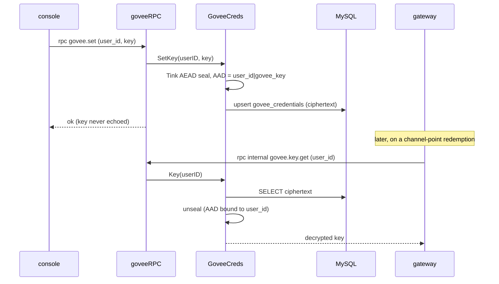
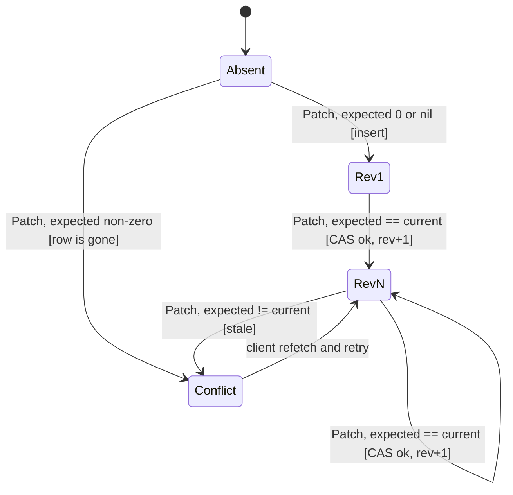

The Modules service (`app/modules/`) owns everything a broadcaster turns on, off, or configures. Its core job is the
per-broadcaster module state: an enable flag and a JSON config blob per module, edited from the
[console](/microservices/console/) and streamed to the projection like the [commands](/microservices/commands/)
service. On top of that core it hosts three smaller stores that share its ent client but keep their own tables and
RPC surfaces: the channel quote book, the fleet-wide "feed the bagel" counter, and the sealed custody of each
broadcaster's Govee API key. It is a per-schema, single-writer data service
([ADR 0007](/adr/0007-adoption-of-per-schema-data-microservices/)) on the NATS bus
([ADR 0003](/adr/0003-adoption-of-nats-as-communication-bridge/)) over MySQL HeatWave
([ADR 0005](/adr/0005-adoption-of-mysql-heatwave/)), with the caching and write-behind posture of
[ADR 0008](/adr/0008-caching-and-write-behind-strategy/).

## Responsibilities

- Own the `bagel_modules` schema (four tables: `modules`, `quotes`, `feed_counters`, `govee_credentials`) and be
  its only writer.
- Persist module toggles and configs write-behind, coalescing rapid edits into one row write per flush window.
- Serve a field-level config patch under optimistic concurrency (a revision compare-and-swap) so two clients
  editing the same module cannot silently clobber each other.
- Emit `data.modules.changed` as full state so the Valkey projection and the in-process caches converge from the
  event alone, and answer the projector's projection read on a cache miss.
- Republish every module row as change events on demand, so the projector can rebuild its projection from a cold
  start without reading this schema.
- Serve the channel quote book verbs (add, get, random, remove, list) behind sesame's `!quote`.
- Serve the fleet-wide feed-counter bump, an atomic single-row increment.
- Hold each broadcaster's Govee API key encrypted at rest (Tink AEAD) and hand it out decrypted only to the gateway.
- Sweep every module row, quote, and stored Govee key of a deleted account.

What this service does **not** do:

- It does not execute modules. Whether a module's handler runs on a chat event is sesame's decision from the
  projected state; this service only stores toggles and configs.
- It does not read another service's schema, and it never puts a Govee key into the module config blob (which is
  projected and cached in cleartext). The key lives only in its own sealed table.
- It does not dial Govee. Only the gateway does, using the decrypted key this service returns over an internal RPC.
- It does not own the read-side projection; the projector writes Valkey.

## External context

The console and sesame reach the service over request-reply RPC on the leaf plane; `data.modules.changed` and
`data.reproject.request` are JetStream traffic on the `data.>` subjects.

## Internal design

The `Modules` repository is the core store (write-behind toggles and configs, the read-through cache, and the
optimistic-concurrency patch). `Quotes`, `Personality`, and `GoveeCreds` are separate types sharing the same ent
client, each with its own RPC handler, so the crypto dependency and the low-frequency stores stay out of the hot
path.

The composition to `GoveeCreds` is an aggregation (`o--`): the modules repo holds a reference, but the credential
store is optional and nil-safe. When `TINK_KEYSET_PATH` is unset or the keyset file is not yet provisioned, key
custody is simply disabled and the govee verbs are never wired, so a missing secret degrades the feature instead of
crash-looping the service.

## Key flows

### Toggle or config replace: write-behind

`Set` (the `upsert` verb) is the write-behind path, identical in shape to the commands service: validate, queue into
the batcher keyed by user and module name, acknowledge immediately, and let the flush window coalesce a burst of
clicks into a single upsert. The flush publishes `data.modules.changed` for every landed row and invalidates the
local cache; peers invalidate off the same broadcast event.

### Config patch: optimistic concurrency

`Patch` is deliberately not write-behind. It merges a subset of config keys into the stored blob under a revision
compare-and-swap, so it needs the current row and cannot be a queued edit. It is synchronous and low-frequency.

The revision is mirrored into the config blob under a reserved `__rev` key so it rides the existing config
projection to the client, but the authoritative value for the compare-and-swap is the column, not the mirror. The
merge ignores any client-sent `__rev`: the server owns it.

### Reprojection from a cold start

The projector rebuilds its Valkey projection two ways. On demand, it calls `projection.modules.get` for one
broadcaster (served from the read-through cache, exactly like the commands projection read). To rebuild wholesale
after losing Valkey, it publishes `data.reproject.request`; the modules service answers by paging every module row
(500 at a time, ordered by id) and republishing each as an ordinary `data.modules.changed`, so the projector never
needs a special path and never reads this schema.

### Govee key custody

The dashboard verbs (`set`, `clear`, `status`) never return the key; `status` reports only presence. The decrypt
verb lives under an internal prefix scoped at the NATS account level to the gateway alone, mirroring how the users
service hands out tokens. The associated data binds each ciphertext to its owner id, so an envelope copied onto
another row fails to open.

## Module patch revision state machine

One module row's `revision` column is a genuine optimistic-concurrency state machine.

- **Absent to Rev1**: a patch on a missing row creates it at revision 1, but only if the caller expected 0 or sent
  no expectation. A non-zero expectation on a missing row is a conflict, because the row the client thought it was
  editing is gone.
- **RevN to RevN [CAS ok]**: the conditional `UPDATE ... WHERE revision = expected` lands, incrementing the
  revision. A concurrent patch that already bumped the revision makes this update affect zero rows.
- **RevN to Conflict [stale]**: the expected revision no longer matches (either the guard rejected it or the CAS
  update hit zero rows), so no mutation happens and the client is told to refetch and retry.
- **Conflict to RevN**: the client re-reads the current revision and reissues the patch. `Set` (write-behind) and
  the reprojection path bypass this machine entirely; only `Patch` participates.

## NATS contracts

Two planes, as in [ADR 0003](/adr/0003-adoption-of-nats-as-communication-bridge/): request-reply RPC on the
per-service account through the leaf, and JetStream events on the shared BUS account against the hub. The `data.>`
subjects live on the `BAGEL_DATA` stream (R1, 5-minute retention), owned by the users service.

### Published

| Subject                 | Plane          | Payload             | Notes                                                            |
|-------------------------|----------------|---------------------|-----------------------------------------------------------------|
| `data.modules.changed`  | JetStream bus  | `ModuleChangedDTO`  | Full state. One per landed toggle, patch, and reprojection row.  |

### Consumed

| Subject                   | Subscriber | Queue group | Delivery                                  | Handler                                              |
|---------------------------|------------|-------------|-------------------------------------------|------------------------------------------------------|
| `data.modules.changed`    | broadcast  | none        | ephemeral consumer, DeliverNew, every pod | Invalidate the changed user's cached view.           |
| `data.reproject.request`  | grouped    | `modules`   | durable, one pod per event                | Republish every module row as change events.         |
| `data.users.deleted`      | grouped    | `modules`   | durable, one pod per event                | Sweep the account's module rows, quotes, Govee key.  |

Grouped consumers use the shared fleet redelivery budget (NAK paced 3 seconds, 5 redeliveries, then TERM); handlers
are idempotent.

### Request-reply (RPC)

| Subject                                     | Queue group   | Request / Reply                       | Purpose                                        |
|---------------------------------------------|---------------|---------------------------------------|------------------------------------------------|
| `bagel.rpc.modules.list`                    | `modules-rpc` | `DashboardRequest` / `DashboardReply` | List a broadcaster's modules.                  |
| `bagel.rpc.modules.upsert`                  | `modules-rpc` | `DashboardRequest` / `DashboardReply` | Toggle or replace a module's config.           |
| `bagel.rpc.modules.patch`                   | `modules-rpc` | `DashboardRequest` / `DashboardReply` | Merge config keys under a revision CAS.         |
| `bagel.rpc.internal.projection.modules.get` | `modules-rpc` | `projection.Request` / `ModulesReply` | Projector hydration read.                      |
| `bagel.rpc.modules.quote.add/get/random/remove/list` | `modules-rpc` | `QuoteRequest` / `QuoteReply` | Channel quote book (sesame `!quote`).      |
| `bagel.rpc.modules.personality.feed`        | `modules-rpc` | `FeedBumpRequest` / `FeedBumpReply`   | Fleet-wide feed-counter bump.                  |
| `bagel.rpc.modules.govee.set/clear/status`  | `modules-rpc` | govee key requests / replies          | Dashboard key custody (never echoes the key).  |
| `bagel.rpc.internal.govee.key.get`          | `modules-rpc` | `KeyGetRequest` / `KeyGetReply`       | Gateway-only decrypt of the stored key.        |
| `bagel.rpc.health.modules`                  | `modules-rpc` | health ping                           | Liveness of the RPC responder.                 |

The personality verb needs its own import line in the NATS ACL: a bare account export does not let sesame's
per-subtree import cross into it. The govee verbs are a no-op subscription when key custody is disabled.

## Data

The service owns four tables in `bagel_modules`.

### `modules`

| Column       | Type   | Notes                                                                 |
|--------------|--------|-----------------------------------------------------------------------|
| `user_id`    | uint64 | Broadcaster Twitch id. Immutable.                                     |
| `name`       | string | Module identity. Not empty.                                          |
| `is_enabled` | bool   | Default false.                                                       |
| `configs`    | JSON   | Module config blob (optional). Carries the mirrored `__rev` key.     |
| `revision`   | int    | Optimistic-concurrency token. Default 0. Bumped by every patch.      |
| `updated_at` | time   | Auto-updated on write.                                               |

Unique index on `(user_id, name)`, the upsert conflict target.

### `quotes`

| Column       | Type   | Notes                                                                 |
|--------------|--------|-----------------------------------------------------------------------|
| `user_id`    | uint64 | Broadcaster Twitch id. Immutable.                                     |
| `number`     | uint64 | Channel-local quote number, assigned max+1. Immutable. Holes are kept. |
| `text`       | string | Quote body, max 450 (fits one chat message with the readout).        |
| `added_by`   | string | Login of the mod who saved it; audit only, max 64.                   |
| `created_at` | time   | Save date, immutable.                                               |

Unique index on `(user_id, number)`.

### `feed_counters`

A single global row (fixed id 1) whose `count` (uint64) only goes up. It is deliberately not per-channel: there is
one bagel and every channel feeds it. The daily count lives in sesame's Valkey with a TTL; this row is the lifetime
source of truth.

### `govee_credentials`

| Column    | Type   | Notes                                                             |
|-----------|--------|-------------------------------------------------------------------|
| `user_id` | uint64 | Broadcaster Twitch id. Immutable. Unique.                        |
| `key_enc` | bytes  | Tink AEAD ciphertext of the Govee API key. Sensitive; never logged. |

The plaintext key never touches the database, the config blob, or logs; the AAD binds each ciphertext to its owner.

The only other datastore is the in-process read model cache (key `modules:{user_id}`, one entry per broadcaster).
Valkey is written by the projector.

## Configuration

Env-driven, read once at boot.

| Variable                                    | Purpose                                             | Default                                         |
|---------------------------------------------|-----------------------------------------------------|-------------------------------------------------|
| `APP_ENV`                                    | Logger profile.                                    | `development`                                   |
| `DB_ADDR`                                    | MySQL address.                                     | `127.0.0.1:3306`                                |
| `DB_USER` / `DB_PASS`                        | Schema-scoped credentials (required).             | (none)                                          |
| `DB_SCHEMA`                                  | Owned schema.                                     | `bagel_modules`                                 |
| `DB_AUTO_MIGRATE`                            | Run ent auto-migration at boot.                   | `true`                                          |
| `DB_MAX_OPEN_CONNS` / `DB_QUERY_CONCURRENCY` | Pool and query gate size.                         | `4` (from the manifest)                         |
| `NATS_URL`                                   | Local-dev fallback endpoint.                      | `nats://127.0.0.1:4222`                         |
| `NATS_HUB_URL` / `NATS_HUB_PUBLISH_URL`      | JetStream hub (consume / publish).                | (manifest: `nats://nats:4222`)                  |
| `NATS_RPC_URL` / `NATS_LEAF_URL`             | RPC plane, node-local leaf.                       | (manifest: `nats://nats-leaf:4222`)             |
| `NATS_CA_PEM`                                | Fleet CA to verify the broker TLS cert.           | (fleet-ca ConfigMap)                            |
| `NATS_USER` / `NATS_PASSWORD`                | Shared BUS account.                               | (secret)                                        |
| `NATS_RPC_USER` / `NATS_RPC_PASSWORD`        | Per-service RPC account.                          | (falls back to `NATS_USER`)                     |
| `NATS_JS_DOMAIN`                             | JetStream domain.                                 | `hub`                                           |
| `NATS_MODULES_SUBJECT_PREFIX`                | Dashboard RPC prefix (quote/personality nest under it). | `bagel.rpc.modules`                       |
| `NATS_INTERNAL_PROJECTION_MODULES_SUBJECT`   | Projection read subject.                          | `bagel.rpc.internal.projection.modules.get`     |
| `NATS_MODULES_GOVEE_SUBJECT_PREFIX`          | Govee dashboard verbs prefix.                     | `bagel.rpc.modules.govee`                       |
| `NATS_INTERNAL_GOVEE_KEY_SUBJECT_PREFIX`     | Gateway-only decrypt prefix.                      | `bagel.rpc.internal.govee.key`                  |
| `TINK_KEYSET_PATH`                           | AEAD keyset file for Govee key custody; unset or absent disables it. | `/etc/tink/keyset.json` (manifest) |
| `LISTEN_ADDR`                                | Health server bind.                               | `:8080`                                         |
| `NEW_RELIC_LICENSE_KEY`                      | Enables the APM agent; absent makes it a no-op.   | (secret)                                        |

## Deployment

From `deploy/k8s/modules.yaml`, delivered by Flux from a digest-pinned GHCR image.

- **Image**: multi-stage build on `golang:1.26.5-bookworm`, shipped on `gcr.io/distroless/static-debian12:nonroot`.
  Ent clients regenerated at build with `--feature sql/upsert`.
- **Replicas**: 3, one per hot-path node (node2, node3, worker1), required pod anti-affinity plus a topology spread
  constraint.
- **Rollout**: `RollingUpdate`, `maxSurge: 0`, `maxUnavailable: 1`, `minReadySeconds: 10`; PDB `maxUnavailable: 1`.
- **Placement**: tolerates the `worker-pool` taint and short unreachable windows; node affinity excludes node1.
- **Probes**: `/healthz` liveness, `/readyz` readiness (503 while NATS is disconnected), `/drain` preStop (10 s
  sleep). `terminationGracePeriodSeconds: 45`.
- **Runtime**: `GOMEMLIMIT=160MiB` against a 256Mi limit; requests 25m CPU and 64Mi memory.
- **Secrets**: the Doppler operator manages `modules-env` and restarts on change. The Tink keyset is mounted from
  the same secret as an optional file, so a not-yet-provisioned keyset leaves the file absent and the service starts
  with govee custody disabled.

## Observability

- **Logging**: structured zap to stdout, New Relic wrapped.
- **Tracing and metrics**: New Relic Go agent ([ADR 0010](/adr/0010-adoption-of-new-relic-for-observability/)).
  Consumed events and RPCs each run inside their own transaction joined to the publisher trace; the write-behind
  flush reports as `flush modules`. Slow RPC handlers (over 250 ms) log at debug.
- **Health**: the RPC health responder answers on `bagel.rpc.health.modules`; startup logs whether govee key
  custody is enabled.

## Failure modes and how the service responds

| Failure                                | Response                                                                                                   |
|----------------------------------------|-----------------------------------------------------------------------------------------------------------|
| Bulk upsert statement fails            | Fall back to per-item writes; validation/constraint errors dropped, transient errors requeued next window. |
| Patch CAS loses the race               | Zero rows affected, reported as a conflict; the client refetches the current revision and retries.         |
| Change event fails to publish          | The row is committed; log and move on. The next change or a reprojection reconverges Valkey.               |
| Feed-counter first-bump race           | Two instances race the insert; the loser hits the primary-key conflict and retries the update (3 attempts). |
| Quote number race                      | Two adds collide on the unique index; the loser re-reads the max number and retries (3 attempts).          |
| Govee keyset missing at boot           | Key custody disabled, govee verbs never wired; the rest of the service runs normally.                      |
| Govee key sweep fails on user delete   | Logged, not propagated: the module rows are already gone and the key is unreadable without its keyset.      |
| `data.users.deleted` DB failure        | Return the error so JetStream redelivers, up to the budget; the sweep is idempotent.                       |
| NATS disconnect                        | `pkg/bus` reconnects endlessly; `/readyz` reports 503 until reconnected.                                   |

## Design notes

- **Information Expert / High Cohesion**: `Modules` owns module state; `Quotes`, `Personality`, and `GoveeCreds`
  each own their slice, keeping the crypto and low-frequency concerns off the hot path.
- **Pure Fabrication**: the `Batcher`, the `Cache`, and the `GoveeCreds` custody store are fabricated collaborators.
- **Protected Variations**: the `__rev` mirror lets the revision reach the client through the unchanged config
  projection without a new field on the wire; event-carried state transfer decouples consumers from the schema.
- **Optimistic offline lock**: `Patch` implements the pattern as a portable, lock-free conditional UPDATE (a
  compare-and-swap on `revision`, no `FOR UPDATE`).
- **Observer**: `data.modules.changed` fans one write out to the projector and every peer cache.
- **Architecture tactics**: queue-based load leveling (write-behind batcher), retry with capped budget and paced NAK
  (JetStream redelivery), removal from service (readiness 503 plus `/drain`), heartbeat (RPC health responder), and
  a security tactic, encrypt-at-rest with per-record associated data, for the Govee key custody.

## References

- [ADR 0003](/adr/0003-adoption-of-nats-as-communication-bridge/): the bus and subject space.
- [ADR 0005](/adr/0005-adoption-of-mysql-heatwave/): the relational database.
- [ADR 0007](/adr/0007-adoption-of-per-schema-data-microservices/): the per-schema, single-writer model.
- [ADR 0008](/adr/0008-caching-and-write-behind-strategy/): caching and write-behind.
- [ADR 0009](/adr/0009-adoption-of-valkey-for-the-settings-projection/): the read-side projection this service feeds.
- [ADR 0010](/adr/0010-adoption-of-new-relic-for-observability/): observability.
- Related services: [sesame](/microservices/sesame/), [projector](/microservices/projector/),
  [commands](/microservices/commands/), [loyalty](/microservices/loyalty/), [users](/microservices/users/),
  [console](/microservices/console/).
