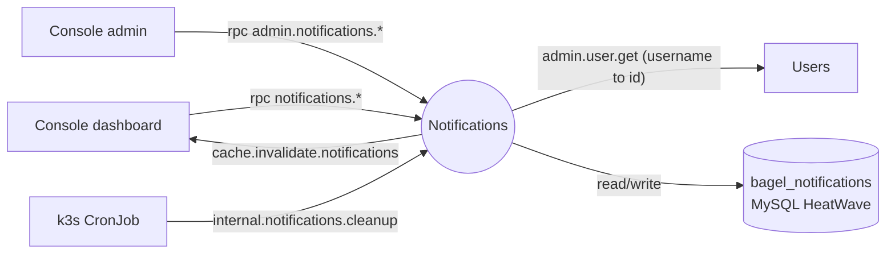
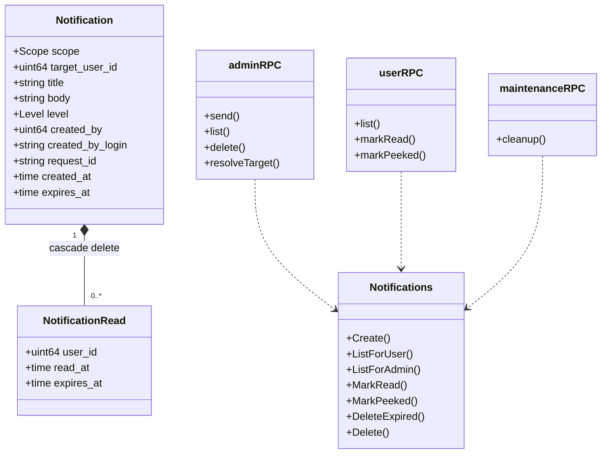
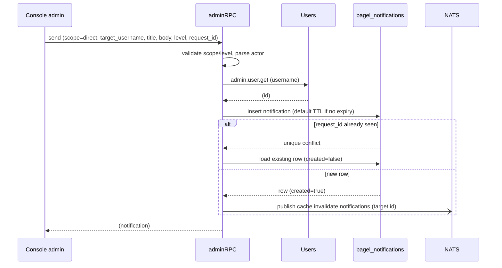
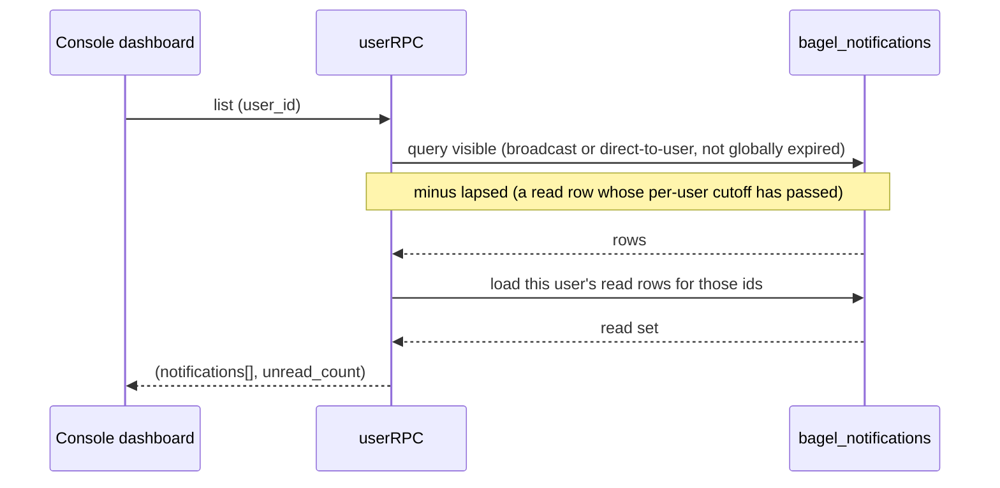
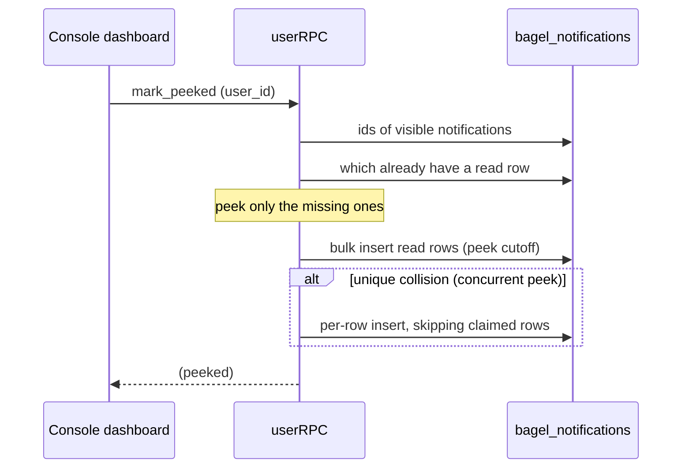
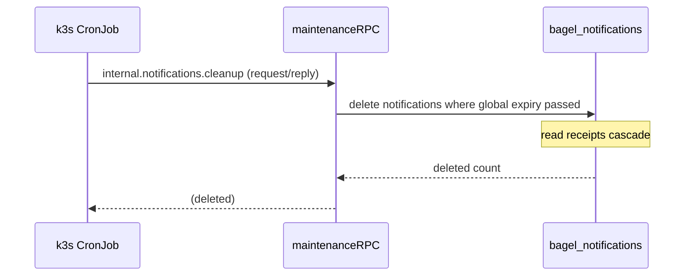
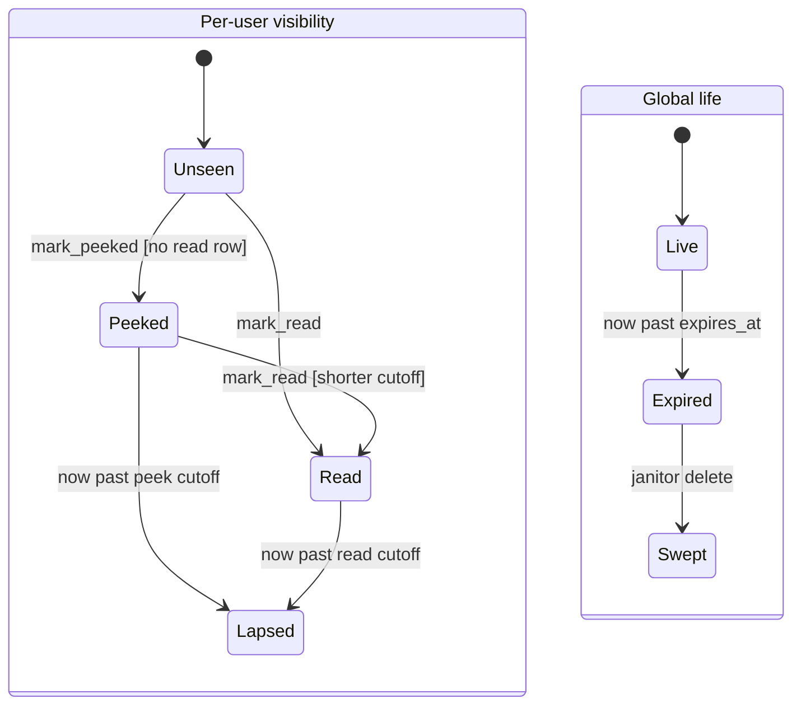

The Notifications service (`app/notifications/`) owns the in-app notification system: the bell dropdown on
the broadcaster dashboard and the announcements operators broadcast from the admin console. It owns the
`bagel_notifications` MySQL schema and serves it entirely over NATS request-reply. There is no event
stream and no HTTP surface beyond the health probes; every read and write is an RPC.

Two ideas shape the design. First, a notification has a global life and a per-user life: it can expire for
everyone (an explicit or default TTL), and it can drop out of one user's list once that user has read or
peeked it, without disappearing for anyone else. Second, storage is bounded by a janitor rather than by
on-read deletion, so a Kubernetes CronJob fires an internal sweep verb on a schedule. The substrate is NATS
([ADR 0003](/adr/0003-adoption-of-nats-as-communication-bridge/)); the store is MySQL HeatWave
([ADR 0005](/adr/0005-adoption-of-mysql-heatwave/)); the schema-per-service rule is
[ADR 0007](/adr/0007-adoption-of-per-schema-data-microservices/).

## Responsibilities

- Serve the broadcaster dashboard: list what a user can see (broadcast plus notifications directed at
  them), report the unread count, mark one fully read, and soft-acknowledge (peek) the whole list when the
  bell dropdown opens.
- Serve the admin console: compose and send a notification (broadcast or direct), page the sent history,
  and retract one.
- Resolve a direct notification's target by username through the users service, so operators can address a
  user by login and not only by numeric id.
- Deduplicate redelivered admin sends by `request_id`, so a retried RPC produces one row and one delivery.
- Enforce the tiered expiry model: a global TTL, a short per-user cutoff on a full read, and a longer
  per-user cutoff on a dropdown peek.
- Run the janitor: an internal cleanup verb, driven by a daily CronJob, hard-deletes globally-expired
  notifications and cascades their read receipts.

### What this service does not do

- It does not own a JetStream stream or publish `data.*` events. Its only publish is a core-NATS cache
  invalidation ping.
- It does not push. The dashboard polls the list and unread count over RPC; there is no server-sent
  channel.
- It does not resolve identities itself. Username targeting is delegated to the users service.
- It does not evaluate expiry on the fly for storage reclamation. Per-user cutoffs only hide rows;
  reclamation happens when the janitor sweeps the parent notification.

## External context

All traffic rides the node-local NATS leaf on the per-service `NOTIFICATIONS_RPC` account. The cleanup
subject is internal to that account (not exported), so only a client holding the service's own credentials
can reach it. The CronJob reuses the service image and creds, so there is no extra image or NATS account to
maintain for the janitor.

## Internal design

`main.go` opens the store, connects the RPC plane, and binds three surfaces, all in the queue group
`notifications-rpc`: the admin surface, the user surface, and the internal maintenance verb. The same
binary also runs as the cron entrypoint: invoked as `notifications cleanup`, it dials NATS, fires the
cleanup verb as a request/reply, and exits with the swept count. The `Notifications` repository is the
Information Expert and the schema's only writer; each RPC surface is a thin controller over it.

`Notification` composes `NotificationRead` (the edge is `OnDelete: Cascade`, real composition), with a
unique index on `(notification, user)` so a user has at most one read row per notification. `request_id`
is a nullable unique immutable column: the stable idempotency key across every delivery of one admin send.

## Key flows

### Admin send (direct, by username)

The console composes a notification. A direct send resolves the target through the users service, and the
`request_id` makes the whole operation idempotent.

If the sender pins no expiry, the service stamps the default TTL so the row is eventually reachable by the
janitor instead of living forever. A duplicate `request_id` returns the earlier row without a second insert
or a second invalidation, so every delivery of the same logical send yields the same reply. A broadcast
send skips the user lookup and invalidates the wildcard (`*`) so every dashboard replica drops its cached
list.

### User fetch (list with read and peek filtering)

The dashboard asks for the list and the unread count in one round trip.

The candidate set is everything the user is allowed to see whose global expiry has not passed, minus
anything the user has already let lapse (a read row with a per-user cutoff in the past). Each returned row
is tagged read or unread from the user's own read rows, and the unread ones are counted for the badge.

### Mark peeked (dropdown open)

Opening the bell counts as "seen": every currently-visible notification with no read row yet gets the
reduced peek cutoff, and the badge clears.

A peek only ever shortens a notification's life for a user, so it never overwrites an existing (shorter,
full-read) cutoff. The fast path is one bulk insert; a concurrent peek by the same user collides on the
unique index, so the service falls back to per-row inserts that skip the rows another writer already
claimed.

### TTL sweep (janitor)

Storage is reclaimed off-line by a daily CronJob that fires the internal cleanup verb.

The queue group means exactly one replica runs the sweep per tick. The cron job runs the request/reply so
it surfaces the swept count and exits non-zero on failure (the CronJob then retries within its backoff
budget). Per-user cutoffs are only visibility filters; their storage is reclaimed when the parent
notification is swept here.

## State machines

A notification has a genuine two-level lifecycle: a global life shared by everyone, and a per-user life
recorded in `NotificationRead.expires_at`.

Per-user transitions:

- `Unseen to Peeked` when the user opens the bell (`mark_peeked`). Guard: the user has no read row for that
  notification yet. The read row is stamped with the longer peek cutoff (`NOTIF_PEEK_TTL`, 7 days).
- `Unseen to Read` on an explicit `mark_read`. The read row is stamped with the short full-read cutoff
  (`NOTIF_FULL_READ_TTL`, 24 hours).
- `Peeked to Read` when a peeked notification is then fully read. Guard: a full read only ever pulls the
  cutoff in (24 hours is shorter than the 7 day peek), never extends it.
- `Peeked to Lapsed` and `Read to Lapsed` when the current time passes the per-user cutoff. A lapsed
  notification drops out of that user's list (the `Not(lapsed)` filter in `ListForUser`) while the row and
  the notification still exist for everyone else.

Global transitions:

- `Live to Expired` when the current time passes `expires_at` (the sender's explicit expiry, or the default
  TTL stamped at send). An expired notification is invisible to every user (the visibility filter drops
  it).
- `Expired to Swept` when the janitor's `DeleteExpired` hard-deletes it, cascading its read receipts. This
  is the only path that reclaims storage.

A notification with no `expires_at` never globally expires; a read row with no cutoff (a legacy row) never
lapses.

## NATS contracts

Every handler subscribes in the queue group `notifications-rpc`. The health responder answers
`bagel.rpc.health.notifications`. The service publishes no events.

### Request-reply served: user (`bagel.rpc.notifications.*`)

| Subject | Request | Reply |
|---|---|---|
| `bagel.rpc.notifications.list` | `{user_id}` | `{notifications[], unread_count}` |
| `bagel.rpc.notifications.mark_read` | `{user_id, notification_id}` | `{}` or `{error}` |
| `bagel.rpc.notifications.mark_peeked` | `{user_id}` | `{peeked}` |

### Request-reply served: admin (`bagel.rpc.admin.notifications.*`)

| Subject | Request | Reply |
|---|---|---|
| `bagel.rpc.admin.notifications.send` | `SendRequest` `{scope, target_user_id?/target_username?, title, body, level, expires_at?, actor_id, actor_login, request_id?}` | `{notification}` or `{error}` |
| `bagel.rpc.admin.notifications.list` | `{page, limit}` | `{notifications[], page, page_size, max_pages, has_more}` |
| `bagel.rpc.admin.notifications.delete` | `{id}` | `{}` or `{error}` |

### Request-reply served: internal maintenance

| Subject | Request | Reply | Notes |
|---|---|---|---|
| `bagel.rpc.internal.notifications.cleanup` | empty | `{deleted}` | Not exported from the account; only the service's own creds (the CronJob) can call it. |

### Request-reply issued

| Subject | Peer | Purpose |
|---|---|---|
| `bagel.rpc.admin.user.get` | Users | Resolve a direct notification's target by username (3 s). |

### Published (core NATS, not JetStream)

| Subject | When | Payload |
|---|---|---|
| `bagel.cache.invalidate.notifications` | On send and delete | `{broadcaster_id}` where the id is the target user, or `*` for a broadcast/delete flush. |

## Data

The service owns the `bagel_notifications` schema, two tables.

| Table | Columns | Notes |
|---|---|---|
| `notifications` | `id` (auto PK), `scope` (`broadcast` / `direct`), `target_user_id` (null for broadcast), `title`, `body` (text), `level` (`info` / `success` / `warning` / `critical`, default `info`), `created_by`, `created_by_login`, `request_id` (nullable unique immutable), `created_at`, `expires_at` (nullable) | Indexed on `(scope, target_user_id)` and `created_at`. Null `expires_at` means never globally expires. |
| `notification_reads` | `user_id`, `read_at`, `expires_at` (nullable per-user cutoff); unique `(notification, user)` | One acknowledgement per user per notification. Cascade-deletes with the notification. |

## Configuration

| Variable | Default | Purpose |
|---|---|---|
| `APP_ENV` | `development` | Logger profile. |
| `LISTEN_ADDR` | `:8080` | Health/probe listener. |
| `NATS_URL` | `nats://127.0.0.1:4222` | Bus URL (hub in the manifest). |
| `NATS_RPC_URL` | (leaf-local in manifest) | The RPC plane the service actually binds. |
| `NATS_CA_PEM` | (fleet CA) | Verifies the broker's TLS cert. |
| `NATS_RPC_USER` / `NATS_RPC_PASSWORD` | falls back to `NATS_USER` | Per-service `NOTIFICATIONS_RPC` account. |
| `DB_ADDR` / `DB_USER` / `DB_PASS` | | MySQL connection. |
| `DB_SCHEMA` | `bagel_notifications` | Owned schema. |
| `DB_AUTO_MIGRATE` | `true` | Run ent migrations at startup. |
| `NOTIF_DEFAULT_TTL` | `90d` (2160h) | Global life stamped when the sender pins no expiry. |
| `NOTIF_FULL_READ_TTL` | `24h` | Per-user cutoff on a full read. |
| `NOTIF_PEEK_TTL` | `7d` (168h) | Per-user cutoff on a dropdown peek. |
| `GOMEMLIMIT` | `160MiB` | Go soft memory limit. |
| `NEW_RELIC_LICENSE_KEY` / `NEW_RELIC_APP_NAME` | | New Relic agent; absent, it is a no-op. |

Subject overrides: `NATS_ADMIN_NOTIFICATIONS_SUBJECT_PREFIX`, `NATS_NOTIFICATIONS_SUBJECT_PREFIX`,
`NATS_NOTIFICATIONS_CLEANUP_SUBJECT`, `NATS_CACHE_INVALIDATION_PREFIX`, `NATS_ADMIN_USER_SUBJECT_PREFIX`.

## Deployment

From `deploy/k8s/notifications.yaml`. Distroless Go image, Flux digest-pinned from GHCR, Doppler-injected
secrets that auto-restart the pods on change.

- **Replicas:** 3, one per schedulable node, spread with a `ScheduleAnyway` hostname topology constraint.
  It tolerates the `worker-pool` taint.
- **Rollout:** `maxSurge: 0`, `maxUnavailable: 1`; a `PodDisruptionBudget` of `maxUnavailable: 1`.
- **Probes:** liveness `/healthz`, readiness `/readyz` (reports NATS connectivity), startup `/healthz` with
  a 90 second window. `preStop` hits `/drain` (10 seconds); grace period 45 seconds.
- **Janitor:** a `CronJob` (`17 3 * * *`, daily, `concurrencyPolicy: Forbid`) runs the same image with the
  `cleanup` argument and the service's own creds, firing the internal cleanup verb; `backoffLimit: 2` and a
  120 second active deadline bound a failed run.
- **Resources:** deployment requests `15m` CPU / `64Mi`, limits `500m` / `256Mi`, `GOMEMLIMIT=160MiB`; the
  cron pod is smaller (`10m` / `32Mi`, limit `250m` / `64Mi`).

The fleet is three Intel nodes with no service mesh and native NATS TLS; the Linkerd annotations left in the
manifest are inert.

### Deployment note: NATS credential rotation

NATS credentials arrive env-injected from the Doppler-managed `notifications-env` secret (the RPC user and
password ride in via `envFrom`). The bus client reads them once at connect and the connection keeps
reconnecting with the cached credentials, so a rotation of the `NOTIFICATIONS_RPC` account is not picked up
until the pods restart. A Doppler change does trigger a rolling restart (the deployment carries
`secrets.doppler.com/reload: "true"`), which is what re-reads the rotated credentials; the CronJob picks
up the new value on its next scheduled run.

## Observability

- **Logging:** structured zap wrapped by the New Relic logger. Sends log the scope, notification id, and
  actor; a duplicate `request_id` logs a suppressed-duplicate warning; the janitor logs the swept count.
- **Tracing/metrics:** New Relic Go agent
  ([ADR 0010](/adr/0010-adoption-of-new-relic-for-observability/)); every RPC handler runs inside an
  `rpc <subject>` transaction, and the instrumented database driver reports the queries into it.

## Failure modes and how the service responds

| Failure | Response |
|---|---|
| Invalid scope or level, or missing title/body | Reply `{error}`; nothing written. |
| Direct send with no target, or target not found | Reply `{error}` from the users lookup. |
| Duplicate `request_id` | Return the earlier row (`created=false`), no second insert or invalidation. |
| Bulk peek unique collision | Fall back to per-row inserts, skipping rows another writer already claimed. |
| Non-numeric user or notification id | Reply `<field> must be numeric`. |
| Cleanup sweep fails | The cleanup reply carries the error; the cron entrypoint exits non-zero and the CronJob retries within `backoffLimit`. |
| NATS disconnect | Endless reconnect on the RPC plane; auth-error abort disabled, so a credential-rotation lag never permanently strands a pod. |

## Design notes

- **GRASP.** The `Notifications` repository is the **Information Expert** and the schema's only writer. The
  three RPC structs are use-case **Controllers**, each cohesive to one audience (dashboard, admin,
  janitor). Delegating username resolution to the users service keeps identity ownership where it belongs
  (**Low Coupling**). The tiered TTL policy lives in the repository, not scattered across handlers (**High
  Cohesion**).
- **GoF.** `Create`'s insert-then-lookup-on-conflict is the **idempotent receiver** built on the unique
  `request_id`. The `MarkPeeked` bulk-then-per-row path is a **fast-path/fallback** for the concurrent
  writer. The repository is a **Facade** over ent.
- **Architecture tactics.** Heartbeat (`bagel.rpc.health.notifications`), queue-based load leveling (the
  `notifications-rpc` queue group means one replica answers each request and, for cleanup, one replica
  sweeps per tick), removal from service (the PDB and drain hook), and a scheduled janitor as the
  storage-bounding tactic (reclamation is a periodic batch, not an on-read cost).

## References

- [ADR 0003](/adr/0003-adoption-of-nats-as-communication-bridge/): the NATS substrate.
- [ADR 0005](/adr/0005-adoption-of-mysql-heatwave/): the relational store.
- [ADR 0007](/adr/0007-adoption-of-per-schema-data-microservices/): one schema per service.
- [ADR 0010](/adr/0010-adoption-of-new-relic-for-observability/): observability.
- Related services: [Users](/microservices/users/) (username-to-id resolution),
  [Transactions](/microservices/transactions/) (sends the gift notification),
  [Console](/microservices/console/) (the dashboard bell and the admin announcement composer).
