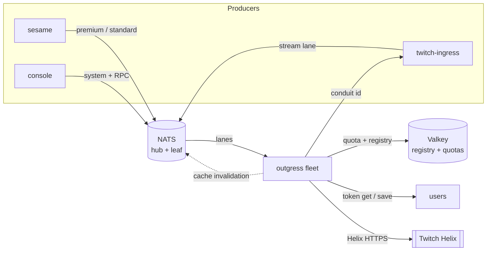
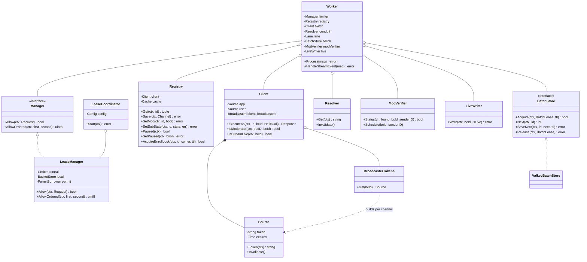
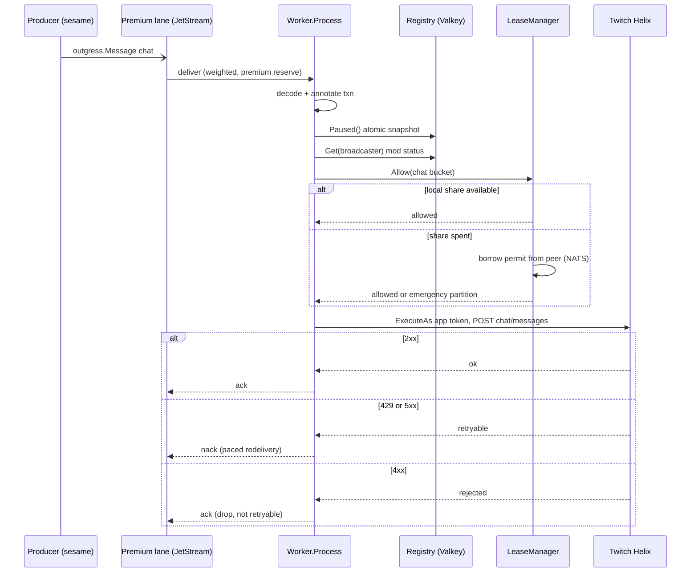
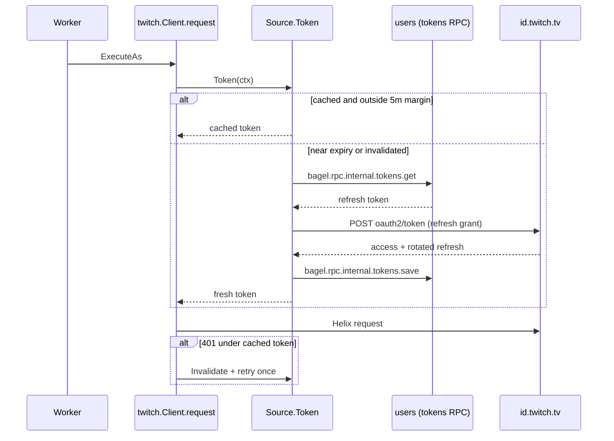
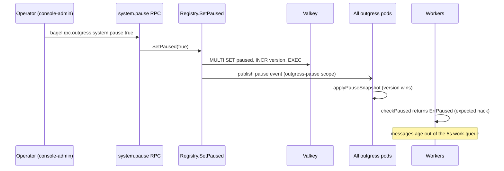
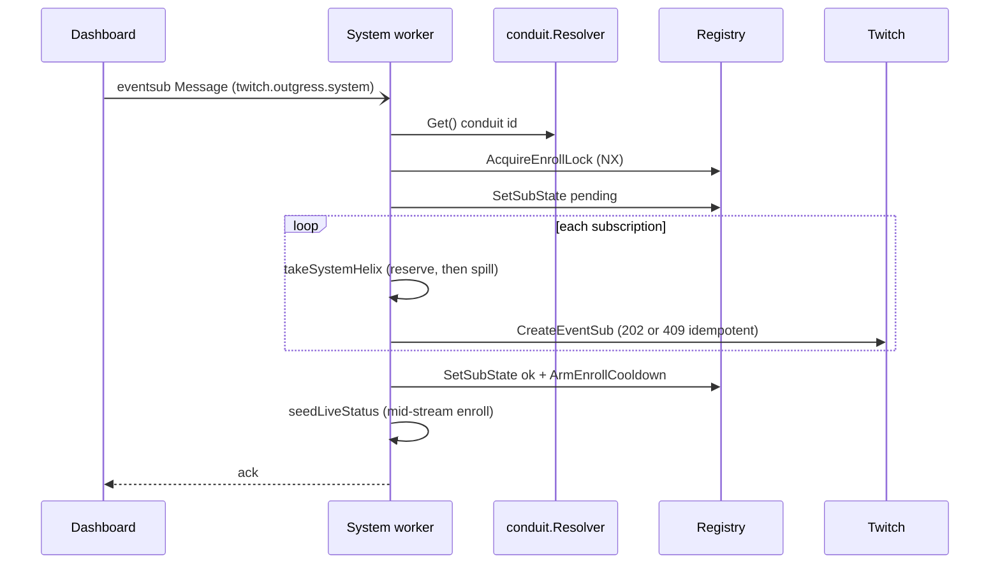
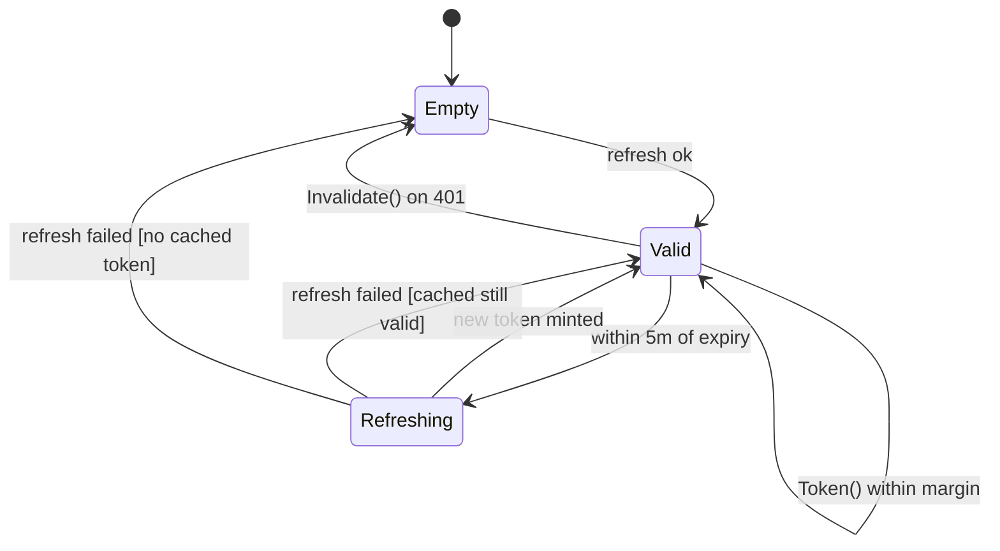
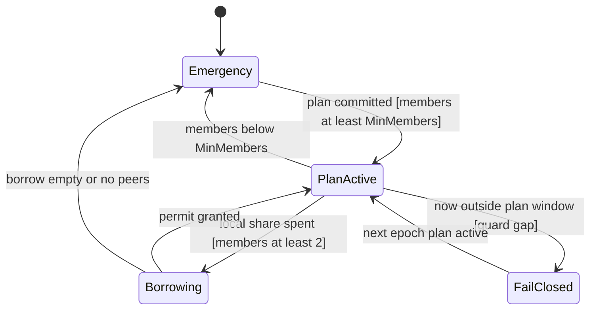
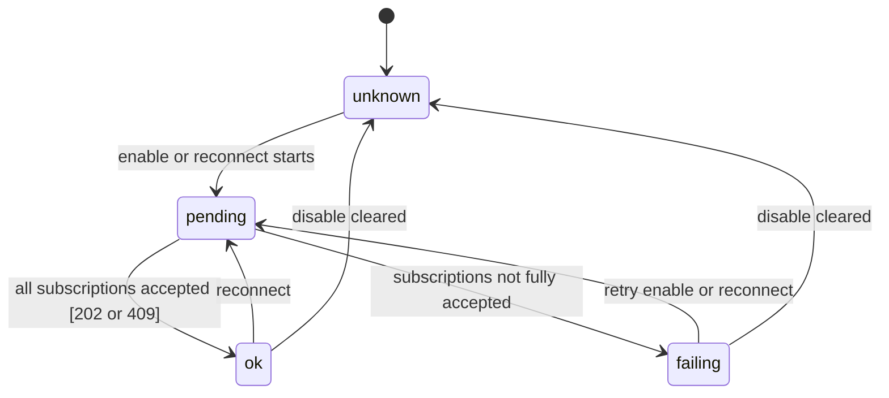

Outgress (`app/outgress/`) is the only service that talks to the Twitch Helix API and the only writer of chat. Every
producer that needs a Twitch call (a chat send, a moderator action, an ad, a clip, an EventSub enrollment, a
channel-points resolution) publishes an intent onto one of the outgress lanes; outgress decodes it, admits it through
the rate limiters, routes it to the token Twitch expects, and executes the HTTP request. Concentrating egress in one
place is what lets the fleet stay inside Twitch's quotas no matter how many producers or pods exist, because the
quota is accounted once, fleet-wide, in Valkey rather than guessed per producer.

The bus it sits behind is [ADR 0003](/adr/0003-adoption-of-nats-as-communication-bridge/); the caching and
write-behind posture it shares with the rest of the fleet is [ADR 0008](/adr/0008-caching-and-write-behind-strategy/);
the observability it is instrumented with is [ADR 0010](/adr/0010-adoption-of-new-relic-for-observability/). The
warm-cache send path is the subject of an ongoing acceptance plan, the
[outgress hot-path canary](/qa/outgress-hot-path-canary/).

## Responsibilities

- Drain three action lanes (premium, standard, system) plus one ingress stream lane, decoding the shared
  `outgress.Message` wire type and executing the Helix call each type maps to.
- Enforce Twitch's rate limits: the per-broadcaster chat limit, the fleet-wide app and user Helix budgets, and a
  reserved partition for onboarding traffic, all tracked in Valkey so the whole pod fleet shares one quota.
- Partition the shared Twitch quota across the pod fleet with a leased-share protocol, so N pods divide one budget
  instead of each claiming all of it.
- Own the OAuth token lifecycle: the app token, the bot account's user token, and one user token per broadcaster,
  each refreshed ahead of expiry and persisted through the users service.
- Manage each channel's EventSub enrollment on the conduit (create, delete, reconnect, ensure-optional) under a
  single-flight lock, with persisted enrollment state for the dashboard.
- Maintain a per-broadcaster channel registry (enabled flag, moderator status, enrollment state) in Valkey, kept
  coherent across pods by cache invalidation.
- Expose a kill switch and management, followage, account-age, channel-points, and chatter RPCs.

## What this service does not do

- It does not decide whether a message should be sent. By the time an action reaches a lane it is already
  authorized: [Sesame](/microservices/sesame/) gates chat before emit. Outgress reads the registry only for the
  bot's moderator status (which sets the chat rate capacity), never to re-run business logic.
- It does not lane traffic. Lane selection is a broadcaster-status decision made upstream; outgress only uses the
  lane to pick which rate-limit buckets a message pays and how routines are reserved.
- It does not write live state on the stream lane. When it re-verifies moderator status on a go-live, the live key
  is owned by the [Projector](/microservices/projector/); outgress only writes the live key as the result of its own
  Twitch re-check (the system lane's `stream_status` job).
- It owns no MySQL schema. Its only durable stores are Valkey keyspaces.

## External context

## Internal design

`main` assembles the process once: the Valkey client, the channel registry, the NATS RPC and JetStream connections,
the Twitch client over its three token sources, the lease-based limiter, three lane workers, and the RPC surfaces. A
`Worker` drains one lane. The three workers share the same collaborators (registry, Twitch client, limiter, conduit
resolver, mod verifier); only the system worker additionally holds the `LiveWriter`. The lane a worker drains
selects which rate-limit buckets it pays and, for the standard lane, holds its Helix draw to half of the shared
budget so premium always finds capacity.

The limiter handed to the workers is a `LeaseManager`, which satisfies the `ratelimit.Manager` interface. It fronts a
central Valkey token-bucket limiter with a per-pod leased share, borrows from peers over NATS when its share is
spent, and falls back to a globally serialized emergency partition when no plan is active. A `LeaseCoordinator`
maintains fleet membership and proposes the share plan once per epoch.

## Key flows

### A laned chat send with rate-limit check and lease membership

The hot path. A chat action arrives on the premium or standard lane, is admitted through the pause snapshot, the
channel registry, and the rate limiter, then executes as a Helix send under the app token. The premium and standard
lanes share one weighted consumer whose routine pool reserves a slice for premium, so a standard flood never starves
premium.

The `Allow` call is where fleet membership matters. The `LeaseManager` admits against this pod's leased share of the
bucket; when that share is spent it borrows a permit from a peer over the permit micro service, and only if no plan
is active (or the fleet is under its member floor) does it fall to the shared, serialized emergency partition in
Valkey. Rate-limit denials and the pause state are expected backpressure: they nack quietly (the bus recognizes the
`ExpectedNack` marker) rather than logging one warning and one New Relic error per attempt.

### A token refresh

The Twitch client refreshes a token before Twitch would reject it, and retries exactly once on a 401. A user token
is loaded from and persisted back to the users service, so a token the operator installs through the admin panel
takes effect without a restart and a rotation survives a pod restart.

`Source.Token` collapses concurrent refreshes with singleflight, and if a refresh fails while the cached token is
still inside its lifetime it serves the cached token, so a transient `id.twitch.tv` outage does not take egress down.
A 401 whose body says the scope is missing is not retried: refreshing cannot add a scope, so the grant is discarded
for a later re-authorization instead of looping into a guaranteed second 401.

### Kill-switch behavior

An operator can sever all outbound traffic instantly. The pause state is one versioned Valkey key, read from a
lock-free in-process snapshot on the message path and reconciled on a jittered interval, so pausing never puts Valkey
I/O in front of every send.

While paused, every worker nacks with `ErrPaused`. The chat streams are perishable work queues with a five-second
`MaxAge`, so held messages age out rather than replaying as stale chat when the pause lifts, which is the right call
for chat. The pause snapshot carries a version so a stale reconciler read can never revert a newer pause, and a
missing or stale snapshot fails safe: `Paused` returns `ErrPauseStateUnavailable`, which nacks the message rather
than sending while the kill-switch state is unknown.

### A system-lane EventSub enrollment

Onboarding traffic rides the system lane, which pays its own reserved Helix partition so an enrollment burst never
competes with chat for the general budget. Each enrollment is single-flighted on a Valkey lock and its outcome
persisted for the dashboard.

A job that loses the enroll-lock race nacks (the holder may be running a different operation for the same channel),
and a job that re-runs inside the cooldown window while the registry still reports the channel healthy is acked
without spending Helix budget, which absorbs a user hammering the dashboard restart button.

## State machines

### Token lifecycle

Each `Source` (app, bot user, and one per broadcaster) is a small state machine around a cached access token.

- `Empty` to `Valid`: the first `Token` call, or any call after `Invalidate`, mints a token through the client
  credentials grant (app) or the refresh grant (user), and caches it with its expiry.
- `Valid` to `Refreshing`: a `Token` call inside the five-minute refresh margin triggers a renewal, singleflight
  collapsed so only one runs per source.
- `Refreshing` to `Valid` on failure with a cached token: a transient token-endpoint outage serves the still-valid
  cached token rather than failing the send.
- `Valid` to `Empty`: a 401 under the cached token means Twitch revoked it early, so it is discarded and the next
  call renews.

### Lease admission

The `LeaseManager` decides how a bucket request is admitted, driven by whether the coordinator has a committed plan
for the current epoch and whether this pod's share is spent.

- `Emergency` is the startup and degraded state: with no active plan, every request runs on the shared, serialized
  central bucket in Valkey, which fails closed (no over-send) because Valkey is the single source of truth.
- `Emergency` to `PlanActive`: the coordinator discovers at least `MinMembers` peers in the presence set and commits
  an epoch plan, giving each pod a fraction of the leased share (capacity minus a 10 percent emergency reserve,
  divided by member count).
- `PlanActive` to `Borrowing`: this pod's local share is spent and there are at least two members, so it asks a peer
  for a permit over the permit micro service (local-region peers first, bounded attempts).
- `PlanActive` to `FailClosed`: the epoch boundary is inside the guard interval, a deliberate fail-closed gap so two
  plan generations never spend concurrently across an epoch edge.
- `PlanActive` to `Emergency`: membership drops below `MinMembers` (deployed at 2), so the coordinator defers
  proposing a plan and admission falls back to the serialized emergency partition rather than letting a lone member
  claim the full quota.

### EventSub enrollment state

The channel registry persists each channel's enrollment state (`sub_state`) so the dashboard can show it without
polling Twitch.

`ok` also arms an enroll cooldown, so an immediately repeated enable or reconnect that finds the channel still `ok`
is acked without new Helix calls. `failing` persists the last error for the dashboard; a disable clears the state so
a later re-enable starts clean rather than inheriting a stale outcome.

## NATS contracts

### Streams provisioned by outgress

`main` reconciles both outgress streams at startup (narrowing the chat stream off the system subject first) so their
retention and lifetimes are guaranteed before any consumer attaches.

| Stream | Subjects | Retention | MaxAge | Storage | Replicas | Notes |
|---|---|---|---|---|---|---|
| `TWITCH_OUTGRESS` | `twitch.outgress.premium`, `twitch.outgress.standard` | WorkQueue | 5s | Memory | 1 | 256 MiB, placement pin `nats-1`, dedup window clamped to the 5s MaxAge. |
| `TWITCH_OUTGRESS_SYSTEM` | `twitch.outgress.system` | WorkQueue | 5m | File | 3 | 64 MiB, no placement pin (R3 needs all peers), 2m dedup. |

The chat lanes are R1 memory work queues: perishable by design, so a nacked chat send cannot survive a restart and
reappear later as stale output. The control lane keeps a longer life and R3 so an EventSub enrollment survives a
rollout gap.

### Consumed lanes (JetStream)

| Subject | Stream | Durable / consumer | Queue group | NakDelay | MaxDeliver |
|---|---|---|---|---|---|
| `twitch.outgress.premium` | `TWITCH_OUTGRESS` | `outgress-premium_twitch_outgress_premium` | `outgress-premium` | 1s | 4 |
| `twitch.outgress.standard` | `TWITCH_OUTGRESS` | `outgress-standard_twitch_outgress_standard` | `outgress-standard` | 1s | 4 |
| `twitch.outgress.system` | `TWITCH_OUTGRESS_SYSTEM` | `outgress-system_twitch_outgress_system` | `outgress-system` | 15s | 7 |
| `twitch.ingress.event.stream` | `TWITCH_INGRESS` | `outgress_twitch_ingress_event_stream` | `outgress` | 3s | 6 |

Every lane consumer runs `AckExplicit`, `DeliverAll`, `AckWait` 4s, `MaxAckPending` 20000, and `ReplayInstant`, with
no server-side backoff (pacing lives in the per-message nak delay). The stream lane is bound under outgress's own
durable group, separate from the projector's, so both get every stream event once: the projector writes the live key
and outgress re-verifies the bot's moderator status on go-live.

### RPC surface (request-reply, queue group `outgress-rpc`)

| Subject | Request | Reply |
|---|---|---|
| `bagel.rpc.outgress.channel.get` | `{broadcaster_id}` | `{channel, found}` |
| `bagel.rpc.outgress.channel.set` | `{broadcaster_id, enabled?, is_mod?}` | `{channel, found}` |
| `bagel.rpc.outgress.channel.list` | (empty) | `{channels}` |
| `bagel.rpc.outgress.system.status` | (empty) | `{paused, app_token_expires_in_seconds, has_user_token}` |
| `bagel.rpc.outgress.system.pause` | `{paused}` | `{paused}` |
| `bagel.rpc.outgress.followage.get` | `{broadcaster_id, target_id?, target_login?}` | `{following, followed_at, user_found}` |
| `bagel.rpc.outgress.accountage.get` | `{target_id?, target_login?}` | `{created_at, user_found}` |
| `bagel.rpc.outgress.channelpoints.list` | `{broadcaster_id}` | `{rewards}` |
| `bagel.rpc.outgress.channelpoints.create` | `{broadcaster_id, reward}` | `{reward, missing_scope?}` |
| `bagel.rpc.outgress.channelpoints.update` | `{broadcaster_id, reward_id, reward}` | `{reward, missing_scope?}` |
| `bagel.rpc.outgress.channelpoints.delete` | `{broadcaster_id, reward_id}` | `{}` |
| `bagel.rpc.outgress.chatters.get` | `{broadcaster_id}` | `{chatters, missing_scope?}` |
| `bagel.rpc.health.outgress` | (empty) | `{service, ok}` |

### Outbound RPC (outgress as client)

| Subject | Purpose |
|---|---|
| `bagel.rpc.internal.tokens.get` | Load a stored refresh token (bot or broadcaster) from the users service. |
| `bagel.rpc.internal.tokens.save` | Persist a rotated token pair back to the users service. |
| `bagel.rpc.ingress.conduit.get` | Resolve the active conduit id ingress owns (cached, env fallback). |

### Published and peer subjects

| Subject | Transport | Meaning |
|---|---|---|
| `bagel.cache.invalidate.outgress` | core NATS | Channel-registry invalidation, keeping moderator status coherent across pods. |
| `bagel.cache.invalidate.outgress-pause` | core NATS | Kill-switch state fan-out (versioned). |
| `bagel.cache.invalidate.live` | core NATS | Live-state change fanned to worker replicas after a re-check write-back. |
| `bagel.outgress.permit.v2.<region>.<pod>` | NATS micro (queue group disabled) | The per-pod permit borrow endpoint; borrows are point-to-point to a specific donor, not load balanced. |

### The `outgress.Message` wire type

Producers set `Message.Type` and outgress owns the Helix endpoint each maps to. The load-bearing types:

| Type | Helix action | Token identity |
|---|---|---|
| `chat`, `announce`, `shoutout`, `pin` | Send / announce / shoutout / pin chat | app (cloud-bot badge) |
| `ban`, `timeout`, `unban`, `delete`, `warn`, `shield_mode` | Moderation | bot user token |
| `ad`, `commercial`, `clip` | Channel actions | broadcaster token |
| `redemption_update` | Update a channel-points redemption | broadcaster token |
| `api` | Generic passthrough (carries its own endpoint) | routed by endpoint |
| `eventsub` | Conduit subscription enable / disable / reconnect / ensure-optional | app token |
| `stream_status` | Resolve live state and write it back | app token |
| `batch` | Ordered, at-most-once group of the above | per item |

## Data

Outgress owns no MySQL schema. Its state lives in Valkey.

| Key pattern | Type | Purpose |
|---|---|---|
| `outgress:channel:<id>` | hash | Per-channel state: `enabled`, `is_mod`, `mod_checked_at`, `updated_at`, `sub_state`, `sub_error`, `sub_checked_at`. |
| `outgress:channels` | set | Index of every registered channel for `channel.list`. |
| `outgress:paused` / `outgress:paused:version` | string | The kill switch and its monotonic version. |
| `outgress:enroll:lock:<id>` | string (NX) | Single-flight enroll lock, owner-valued. |
| `outgress:mod-check:lock:<id>` | string (NX) | Single-flight moderator-check lock, doubling as a fleet-wide error backoff. |
| `outgress:enroll:cooldown:<id>` | string (TTL) | Marks a fresh, healthy enroll so a redundant repeat is skipped. |
| `outgress:batch:<id>:lock` / `outgress:batch:<id>:next` | string | At-most-once batch lease and progress cursor. |
| `outgress:members:v2` | sorted set | Fleet presence registry; score is the pod's presence expiry, member is `podID|region`. |
| `outgress:plan:v2:<epoch>` / `:committed` | string | The committed lease share plan for an epoch and its replication commit marker. |
| `ratelimit:chat:<id>` | hash | Per-broadcaster chat token bucket (20/30s, 100/30s when the bot moderates). |
| `ratelimit:helix:app` / `:app:standard` | hash | Shared general Helix budget (700/min) and the standard-lane half-reserve. |
| `ratelimit:helix:system` | hash | Reserved system-lane Helix partition (100/min). |
| `ratelimit:helix:user:bot` / `:bot:standard` | hash | Bot user-token budget (800/min) and its standard-lane half. |
| `ratelimit:helix:user:<id>` / `:standard:<id>` | hash | Per-broadcaster user-token budget and standard half. |
| `live:<id>` | string (TTL) | The live projection key, written by the system lane's re-check and read by the workers and Sesame. |

The Twitch limits modeled here: chat is per channel and is the real Twitch per-channel limit (a standard channel
spending its own budget takes nothing a premium channel could use), so the lane restriction does not apply to it.
The 800/min Helix app budget is split into a disjoint 100/min system reserve and a 700/min general partition, with
the standard lane held to half the general partition so premium always finds at least half free. The system lane
tries its reserve first and spills into the general partition when momentarily drained, so an onboarding burst is
never blocked but the fleet total still cannot exceed the real limit.

## Configuration

Read once at startup by `config.Load`. Twitch credentials are required (`MustGet`); the rest have defaults.

| Variable | Purpose | Default |
|---|---|---|
| `NATS_URL` / `NATS_RPC_URL` | Bus and RPC URLs. | `nats://127.0.0.1:4222` |
| `NATS_OUTGRESS_PREMIUM_SUBJECT` | Premium lane. | `twitch.outgress.premium` |
| `NATS_OUTGRESS_STANDARD_SUBJECT` | Standard lane. | `twitch.outgress.standard` |
| `NATS_OUTGRESS_SYSTEM_SUBJECT` | System lane. | `twitch.outgress.system` |
| `NATS_OUTGRESS_RPC_PREFIX` | Management RPC prefix. | `bagel.rpc.outgress` |
| `NATS_SUBJECT_LANE_STREAM` | Ingress stream event lane. | `twitch.ingress.event.stream` |
| `NATS_CONDUIT_SUBJECT` | Conduit id resolution RPC. | `bagel.rpc.ingress.conduit.get` |
| `NATS_INTERNAL_TOKENS_SUBJECT_PREFIX` | Token store RPC prefix. | `bagel.rpc.internal.tokens` |
| `NATS_CACHE_INVALIDATION_PREFIX` | Invalidation prefix (registry, pause, live). | `bagel.cache.invalidate` |
| `VALKEY_ADDR` / `VALKEY_PASSWORD` | Valkey address and auth. | `127.0.0.1:6379` |
| `TWITCH_CLIENT_ID` / `TWITCH_CLIENT_SECRET` | App credentials (required). | (none) |
| `TWITCH_BOT_USER_ID` | Bot account id for moderation lookups. | (empty) |
| `TWITCH_BOT_REFRESH_TOKEN` | Bot user-token seed (stored copy wins). | (empty) |
| `TWITCH_CONDUIT_ID` | Conduit id fallback when the RPC is unreachable. | (empty) |
| `WORKER_LIVE_TTL` | TTL stamped on a live key by a re-check. | `12h` |
| `OUTGRESS_MIN_ROUTINES` / `OUTGRESS_MAX_ROUTINES` | Routine pool bounds per chat consumer. | `2` / `8` (deploy `50` / `250`) |
| `OUTGRESS_MAX_CONSUMERS` | Extra consumer cap once routines are maxed. | `3` |
| `OUTGRESS_SCALE_UP_AFTER` / `OUTGRESS_SCALE_DOWN_AFTER` | Autoscale pacing. | `5s` / `30s` (deploy `1s` / `60s`) |
| `OUTGRESS_PREMIUM_RESERVE_PERCENT` | Routine share kept for premium. | `25` |
| `OUTGRESS_SYSTEM_WORKERS` | Fixed system-lane pool size. | `2` (deploy `4`) |
| `OUTGRESS_REGION` | Locality boundary for the lease protocol (deploy: node name). | `local` |
| `OUTGRESS_LEASE_EPOCH` | Plan time quantum. | `30s` |
| `OUTGRESS_LEASE_GUARD` | Fail-closed guard at epoch edges. | `250ms` |
| `OUTGRESS_LEASE_MIN_MEMBERS` | Member floor before committing a plan. | `1` (deploy `2`) |
| `OUTGRESS_LEASE_REPLICAS` | Replication barrier on plan commit. | `0` |
| `OUTGRESS_LEASE_REPLICA_TIMEOUT` | Replication barrier timeout. | `2s` |
| `GOMEMLIMIT` | Go soft memory limit. | (deploy `512MiB`) |
| `LISTEN_ADDR` | Health server address. | `:8080` |

## Deployment

From `deploy/k8s/outgress.yaml`.

- **Replicas:** owned by a KEDA `ScaledObject`, not a static count. Floor 3 (one per hot-path node), ceiling 9.
  Triggers: CPU at 75 percent utilization plus JetStream consumer lag on all three lanes (premium, standard, system
  durables). Because outgress is ultimately Twitch-rate-limited, the ceiling buys burst-drain resilience under
  backlog, not more Twitch throughput.
- **Placement:** a soft topology spread scoped to the current ReplicaSet (`matchLabelKeys: pod-template-hash`) keeps
  a roll spreading one per node instead of piling onto whichever node freed capacity first, while staying soft so a
  node outage never wedges scheduling. Worker-pool tolerations let a pod land on `worker1`.
- **Rollout:** `RollingUpdate` with `maxSurge: 0` and `maxUnavailable: 1`, `minReadySeconds: 10`, and a
  `PodDisruptionBudget` of `maxUnavailable: 1`.
- **DNS:** `ndots: 1` with a short timeout and a retry, because resolving `api.twitch.tv` is on the hot path and the
  default `ndots: 5` fans an external name into cluster-domain lookups first, each a chance at the cross-node DNS
  stall.
- **Image:** `gcr.io/distroless/static-debian12:nonroot`, a CGO-disabled static Go binary, `runAsNonRoot` (uid
  65532), all capabilities dropped, seccomp `RuntimeDefault`. Delivered by Flux from a digest-pinned GHCR tag.
- **Probes:** liveness on `/healthz`, readiness on `/readyz` (gated on the NATS connection), a startup probe, and a
  `preStop` GET to `/drain` that holds for 10 seconds so in-flight sends finish before `SIGTERM`.
  `terminationGracePeriodSeconds` is 45.
- **Resources:** requests 75m CPU / 128Mi, limits 1000m CPU / 512Mi. `GOMEMLIMIT` 512MiB.
- **Split NATS planes:** the JetStream lanes dial `nats-1` directly (the stream is placement-pinned there) while the
  RPC and cache plane stays on the node-local leaf. The Doppler operator restarts the pod on a secret change.

## Observability

- **Logging:** structured zap to stdout, shipped by the cluster Fluent Bit pipeline. Expected backpressure (pause,
  rate-limit) logs at debug, not warn, and is not reported to New Relic.
- **Metrics and tracing:** the New Relic Go agent runs when `NEW_RELIC_LICENSE_KEY` is set (app name
  `ItsBagelBot-outgress`). Each message runs inside a transaction labeled with `node.region` and `node.name`, and the
  Twitch call is recorded as an external segment, so Twitch latency splits from in-process work and faceting by node
  separates node latency from code latency. Stage timings are added as transaction attributes: `outgress.decode_ms`,
  `outgress.pause_ms`, `outgress.registry_ms`, `outgress.limiter_ms`, `outgress.twitch_ms`, and `outgress.total_ms`
  ([ADR 0010](/adr/0010-adoption-of-new-relic-for-observability/)).

## Failure modes and how the service responds

| Failure | Response |
|---|---|
| Twitch 429 (rate limited) | Nack for paced redelivery; the `Ratelimit-Reset` header is logged. |
| Twitch 5xx | Nack for paced redelivery. |
| Twitch 401 or 403 after a fresh-token retry | Drop (ack) and surface loudly to New Relic: a fresh token still refused is a permanent authorization problem (missing scope, bot not a moderator), not a recoverable expiry, so redelivering would loop forever. |
| Other Twitch 4xx | Drop (ack); a rejected request can never succeed on retry. |
| Rate bucket exhausted | Expected nack (quiet); the paced redelivery retries once the bucket refills. |
| Service paused | Expected nack; held messages age out of the 5s work queue rather than replaying stale. |
| Pause snapshot missing or stale | `ErrPauseStateUnavailable` nacks the message, failing safe rather than sending while the kill-switch state is unknown. |
| Conduit id unresolvable | EventSub jobs nack and retry (stale cache then env fallback then error); chat and api traffic are unaffected. |
| Enroll lock held by another op | Nack (`errEnrollLockBusy`); redelivery re-applies once the lock frees, preserving the newer intent. |
| Fleet members below `MinMembers` | Admission fails closed onto the serialized emergency partition; no over-send, no fail-open 429 storm. |
| Token refresh fails, cached still valid | Serve the cached token; both unavailable returns an error that nacks. |
| Batch already owned by a peer | Expected nack (`errBatchBusy`); the owner finishes the ordered group. |
| Crash mid-batch | At-most-once: the checkpoint is written before each send, so an ambiguous item is skipped on retry, not repeated. |

## Design notes

Outgress is where rate limiting, queue-based load leveling, and token management concentrate, so the pattern
vocabulary is dense and grounded in concrete types.

- **Information Expert (GRASP):** `channels.Registry` owns per-channel state and its coherence; `twitch.Client` owns
  which token each endpoint needs; `ratelimit` owns the bucket math.
- **Controller (GRASP):** `Worker.Process` is the use-case controller that decodes, admits, routes, and executes one
  action; `resolveHelixRoute` plus the `typeRoutes` / `helixHandlers` maps are its dispatch table.
- **Pure Fabrication and Protected Variations (GRASP):** the `ratelimit.Manager` and `BatchStore` interfaces, the
  `StoredTokenIO` indirection, and the `conduit.Resolver` isolate the workers from Valkey, the users service, and
  ingress, so each can vary without touching the send path.
- **Low Coupling (GRASP):** the duck-typed `ExpectedNack` marker lets `pkg/bus` treat backpressure quietly without
  depending on the worker package.
- **Strategy and Adapter (GoF):** `helixHandlers` selects a per-type request-assembly strategy; `ValkeyBatchStore`
  adapts the `BatchStore` interface to Valkey; `tokenstore` adapts the users RPC to the `Source` load/persist
  closures.
- **Object Pool and Singleflight (GoF and idiom):** `BroadcasterTokens` is an LRU pool of per-channel token sources,
  `BucketStore` a presized pool of lease buckets, and `Source.Token` collapses concurrent refreshes.
- **Architecture tactics (SEI/Bass):** *rate limiting* (the whole service), *queue-based load leveling* (the
  JetStream work-queue lanes), *sharding* of one Twitch quota across the pod fleet via the leased-share protocol,
  *heartbeat* (the presence sorted set), *removal from service* (the kill switch and the drain hook), and *retry*
  (paced redelivery plus the bounded in-process `retryTransient`).

## References

- [ADR 0003](/adr/0003-adoption-of-nats-as-communication-bridge/): the bus and idempotent-consumer contract.
- [ADR 0008](/adr/0008-caching-and-write-behind-strategy/): the caching and write-behind strategy.
- [ADR 0010](/adr/0010-adoption-of-new-relic-for-observability/): the observability stack.
- [Outgress hot-path canary](/qa/outgress-hot-path-canary/): the acceptance plan for the warm-cache send path.
- Related services: [Sesame](/microservices/sesame/), [Projector](/microservices/projector/),
  [Twitch Ingress](/microservices/twitch-ingress/), [Users](/microservices/users/),
  [Commands](/microservices/commands/), [Modules](/microservices/modules/).
