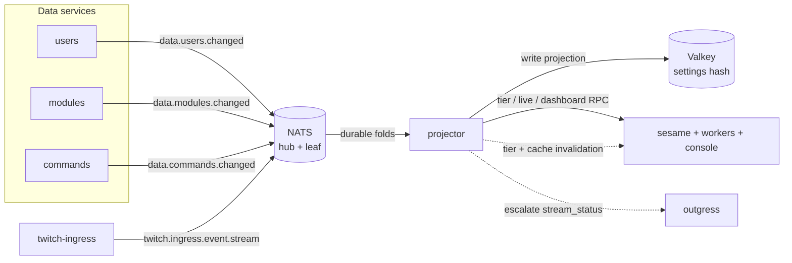
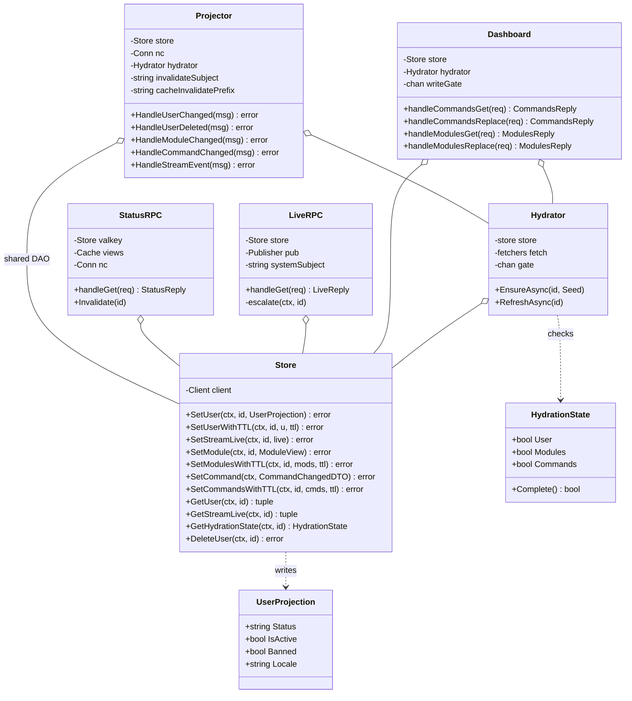
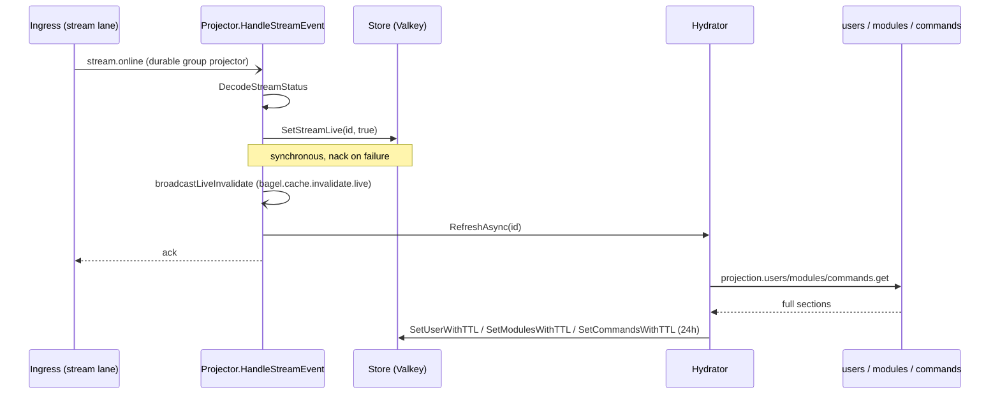
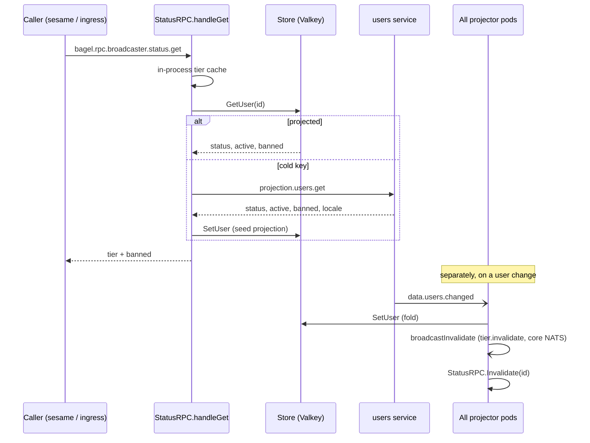
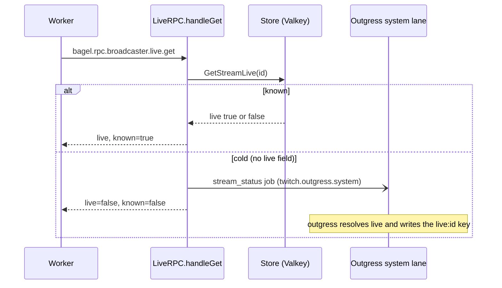
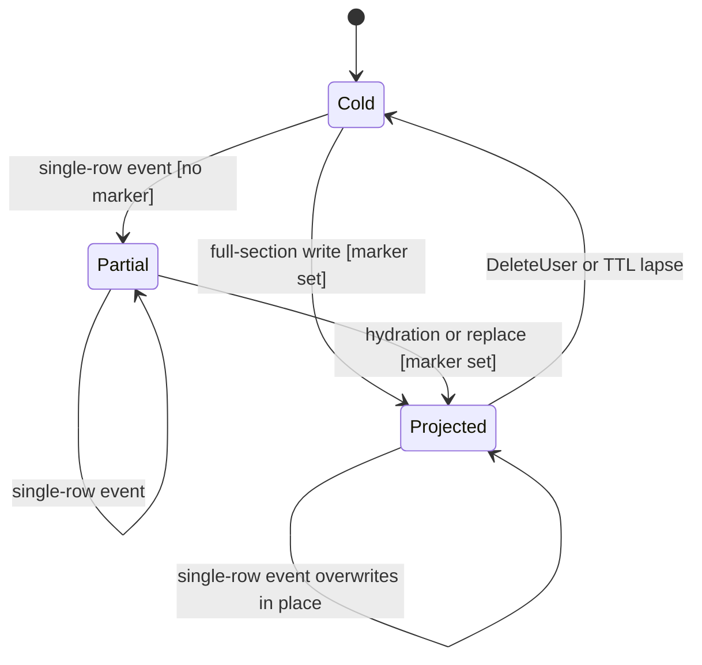
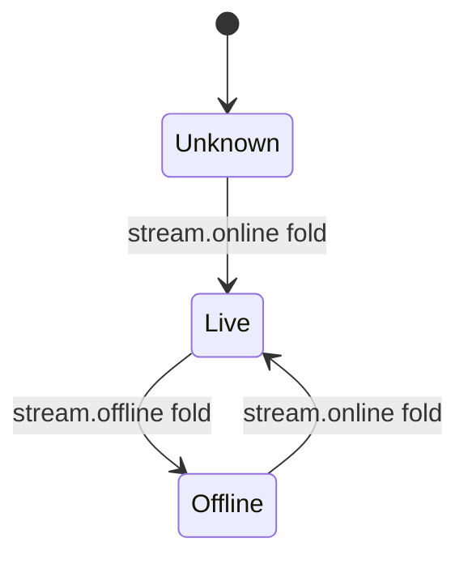

The Projector (`app/projector/`) owns the write side of the shared settings projection. It folds the change events
the data services publish (`data.users.changed`, `data.modules.changed`, `data.commands.changed`, and the deletes)
into one Valkey hash per user, so the high-throughput consumers ([Sesame](/microservices/sesame/) and the workers)
read a broadcaster's tier, modules, and custom commands from a single node-local hash instead of fanning SQL out to
three services on every chat message. The projection choice is argued in
[ADR 0009](/adr/0009-adoption-of-valkey-for-the-settings-projection/); the write-behind and read-model split it
belongs to are [ADR 0008](/adr/0008-caching-and-write-behind-strategy/) and
[ADR 0007](/adr/0007-adoption-of-per-schema-data-microservices/); the bus underneath is
[ADR 0003](/adr/0003-adoption-of-nats-as-communication-bridge/).

The projector never reads another service's schema. Everything it projects arrives as event-carried state (the full
new row travels in the event) or, on a cold key, over a projection RPC. That is what lets a service own its MySQL
schema outright while the read model stays a pure fold.

## Responsibilities

- Fold the data services' change events into the `settings:<user_id>` Valkey hash. Every handler is an overwrite of
  the state the event carries, so redeliveries and full replays are safe.
- Answer the broadcaster tier lookup on `bagel.rpc.broadcaster.status.get`, resolving free, paid, and vip status
  down to a premium or standard lane decision, fronted by a short in-process cache.
- Answer the live-state lookup on `bagel.rpc.broadcaster.live.get`. When the projection has not seen a stream event
  for the broadcaster, escalate to Twitch by publishing a `stream_status` job on the outgress system lane and reply
  unknown, so the worker treats the channel as offline until the escalation writes the live key.
- Serve the dashboard's projection reads and writes (`bagel.rpc.projector.dashboard.*`) so the console never queries
  Valkey directly, and hydrate a cold section from the owning data service on a miss.
- On a `stream.online` event, refresh the whole settings snapshot for the broadcaster so the first command of the
  stream reads a warm cache.
- Keep every projector pod's in-process tier and live caches coherent by fanning invalidations over core NATS.

## What this service does not do

- It does not own a MySQL schema and never reads one. The data services are the only writers of their own tables;
  the projector consumes their events and their projection RPCs.
- It does not decide command permissions, cooldowns, or run any module logic. It stores the rows; Sesame executes
  them.
- It does not lane chat traffic. Lane selection happens upstream in [Twitch Ingress](/microservices/twitch-ingress/)
  from the tier this service projects; the projector only answers the tier query.
- It is not the only reader of Valkey. The workers read the projection directly through a read-only client and only
  fall through to the projector RPC on a cold key.

## External context



## Internal design

`main` wires one `Store` over the Valkey client and hands it to every collaborator: the `Projector` fold handlers,
the `Hydrator`, and the three RPC surfaces. The fold consumers all bind on one durable group (`projector`) so each
event is folded into Valkey exactly once no matter how many pods run. The RPC surfaces bind on the `projector-rpc`
queue group so exactly one pod answers each request.

`Store` is the single data-access object for the projection. It hides the hash layout behind typed methods and folds
each write and its expiry into one pipelined round trip. The `Hydrator` bounds full-hydration concurrency and
collapses simultaneous fills for the same user, so a `stream.online` burst or a dashboard open never issues the same
three projection RPCs from every pod.



## Key flows

### Projection build on stream.online

A go-live event is the projection's warm-up trigger. Exactly one projector pod (the durable-group owner) folds it,
writes the live field synchronously, fans the change to the live-cache holders, and kicks a background refresh of the
full snapshot with the long (24h) TTL.



`SetStreamLive` stays synchronous on purpose: it writes the `live` field of the settings hash, a dropped write would
silently corrupt the live-RPC fallback, and there is no per-message latency to save here (this is a rare, low
frequency consumer). The hydration that follows is best-effort and only logs on failure, because the live write
already succeeded and a later dashboard read will fill any section it missed.

### Broadcaster status RPC with cache invalidation

The tier query is read-mostly, so it is served from a 30-second in-process cache backed by the Valkey projection,
with a users-service RPC as the last resort on a cold key. The cache is not left to age out on a change: a fold of a
user event fans a tier invalidation over core NATS (no queue group) so every pod drops its cached decision at once.



### Live RPC cold-key escalation

When a worker asks for a broadcaster's live state and the projection has no `live` field yet (the projector has not
seen a stream event for that channel), the projector cannot answer authoritatively. It escalates to Twitch through
outgress and replies unknown, which the worker treats as offline until the escalation writes the live key.



## State machines

### Projection section seeding

Completeness is a trust decision, not a row count. The `modules:projected` and `commands:projected` markers are
written only by a full-section write (`SetModules`, `SetCommands`, or their TTL variants). A single-row event
(`SetModule`, `SetCommand`) never sets the marker, so a partial hash correctly reads as not-yet-projected and the
caller falls through to the projector RPC, whose miss path hydrates the full list.



- `Cold` to `Partial`: a `data.modules.changed` or `data.commands.changed` event lands on a hash with no marker. The
  row is written but the section stays unprojected, so a reader escalates rather than trusting a partial list.
- `Cold` or `Partial` to `Projected`: a full-section write (a stream-online refresh, a dashboard replace, or a
  cold-read hydration) writes every row plus the marker. An empty list is still marked, so an intentionally empty
  section reads as known data, not a miss.
- `Projected` to `Cold`: `HandleUserDeleted` deletes the whole hash, or the hash TTL lapses.

### Live field



`Unknown` is the absence of the `live` field in the settings hash, which is what makes the live RPC escalate instead
of answering a false offline. Only the stream events, folded through `HandleStreamEvent` into `SetStreamLive`, move
this field: the escalation does not write it. The escalation instead refreshes the dedicated `live:<id>` key the
worker actually reads for live-gated commands, and the projection's own field fills when Twitch delivers the next
`stream.online` or `stream.offline`.

## NATS contracts

The projector consumes on one durable group, answers on one RPC queue group, publishes invalidations and one
JetStream escalation, and makes projection RPCs to the data services on a cold key. It provisions no streams: a
projector credential cannot mutate a stream it reads (the owners are users for `BAGEL_DATA`, ingress for
`TWITCH_INGRESS`, and outgress for its work queues).

### Consumed (durable JetStream folds)

All folds bind through `bus.NewSubscriber` under the `projector` group. Each subject gets its own durable named
`projector_<tokenized-subject>`; every pod shares the one durable per subject, so exactly one pod folds each event
and the position survives restarts.

| Subject | Stream | Durable | Payload |
|---|---|---|---|
| `data.users.changed` | `BAGEL_DATA` | `projector_data_users_changed` | `UserChangedDTO` |
| `data.users.deleted` | `BAGEL_DATA` | `projector_data_users_deleted` | `UserDeletedDTO` |
| `data.modules.changed` | `BAGEL_DATA` | `projector_data_modules_changed` | `ModuleChangedDTO` |
| `data.commands.changed` | `BAGEL_DATA` | `projector_data_commands_changed` | `CommandChangedDTO` |
| `twitch.ingress.event.stream` | `TWITCH_INGRESS` | `projector_twitch_ingress_event_stream` | Twitch EventSub `stream.online` / `stream.offline` |

Consumer settings (from `pkg/bus` `laneConsumerConfig`, applied to every durable-group binding): `AckPolicy`
`AckExplicit`, `DeliverPolicy` `DeliverAll`, `AckWait` 4s, `MaxDeliver` 6 (the fleet default of five redeliveries
plus the first delivery), `MaxAckPending` 20000, per-message `NakDelay` 3s, no server-side `BackOff`. `BAGEL_DATA`
is R1 placement-pinned to `nats-1`; the deploy dials `NATS_HUB_URL` at that ordinal directly so the folds skip an
intra-hub route hop.

### RPC surface (request-reply, queue group `projector-rpc`)

| Subject | Request | Reply |
|---|---|---|
| `bagel.rpc.broadcaster.status.get` | `{broadcaster_id}` | `{broadcaster_id, tier, banned}` |
| `bagel.rpc.broadcaster.live.get` | `{broadcaster_id}` | `{broadcaster_id, live, known}` |
| `bagel.rpc.projector.dashboard.commands.get` | `{user_id}` | `{user_id, commands}` |
| `bagel.rpc.projector.dashboard.commands.replace` | `{user_id, commands}` | `{user_id, commands}` |
| `bagel.rpc.projector.dashboard.modules.get` | `{user_id}` | `{user_id, modules}` |
| `bagel.rpc.projector.dashboard.modules.replace` | `{user_id, modules}` | `{user_id, modules}` |
| `bagel.rpc.health.projector` | (empty) | `{service, ok}` |

Dashboard verbs run a 2-second handle timeout; status and live run 1.5s. The two `.replace` verbs answer the caller
immediately and write Valkey on a bounded background gate (`PROJECTOR_WRITE_CONCURRENCY`), then broadcast the cache
invalidation.

### Outbound RPC (projector as client, on a cold key)

| Subject | Purpose |
|---|---|
| `bagel.rpc.internal.projection.users.get` | Hydrate the user section from the users service. |
| `bagel.rpc.internal.projection.modules.get` | Hydrate or fill the module section. |
| `bagel.rpc.internal.projection.commands.get` | Hydrate or fill the command section. |

### Published (core NATS and JetStream)

| Subject | Transport | Meaning |
|---|---|---|
| `bagel.internal.projector.tier.invalidate` | core NATS, no queue group | Every pod drops its cached tier and ban decision for the user. |
| `bagel.cache.invalidate.modules` | core NATS | Section-scoped console/worker cache eviction after a module fold or replace. |
| `bagel.cache.invalidate.commands` | core NATS | Command eviction carrying the changed name and its aliases as granular keys. |
| `bagel.cache.invalidate.live` | core NATS | Live-state change fanned to every live-cache holder (both go-live and go-offline). |
| `twitch.outgress.system` | JetStream (`TWITCH_OUTGRESS_SYSTEM`) | The cold-live escalation `stream_status` job. |

## Data

The projector owns no MySQL schema. Its only store is the Valkey settings projection, one hash per user, read by the
whole fleet.

```
settings:<user_id>
  status                  free | paid | vip
  active                  0 | 1
  banned                  0 | 1
  locale                  en | fr
  live                    0 | 1
  modules:projected       1        (only on a full module-section write)
  module:<name>:enabled   0 | 1
  module:<name>:config    raw JSON
  commands:projected      1        (only on a full command-section write)
  command:<name>          command JSON, keyed by lower-cased primary name
  cmdalias:<alias>        pointer to the primary command name
```

A chat-path reader gets tier, active, ban, live, and every module in one `HGETALL`; a command lookup is one `HGET`
on `command:<name>` (or an alias pointer plus one more `HGET`), so editing one command never forces a
whole-dictionary reload. Every write folds its expiry into the same pipeline. Expiry is monotonic: a write sets the
TTL with `EXPIRE NX` and extends a shorter one with `EXPIRE GT`, computing `max(current, requested)` without a
read-modify-write race, so a 2-hour query hydration can never shorten a 24-hour live-event projection. `DefaultTTL`
is 24 hours; query-triggered hydration uses 2 hours.

## Configuration

Read once at startup. Subjects and TTLs come from `loadTopics`; the connection and Valkey handles from `main`.

| Variable | Purpose | Default |
|---|---|---|
| `APP_ENV` | Logger profile. | `development` |
| `NATS_URL` | Bus / JetStream URL (local-dev fallback). | `nats://127.0.0.1:4222` |
| `NATS_HUB_URL` | Hub-direct URL for the folds. | (deploy: `nats-1` headless) |
| `NATS_RPC_URL` / `NATS_LEAF_URL` | RPC and cache plane, node-local leaf. | falls back to `NATS_URL` |
| `VALKEY_ADDR` | Valkey address. | `127.0.0.1:6379` |
| `VALKEY_PASSWORD` | Valkey auth. | (empty) |
| `NATS_SUBJECT_LANE_STREAM` | Ingress stream event lane. | `twitch.ingress.event.stream` |
| `NATS_INTERNAL_PROJECTION_USERS_SUBJECT` | Users hydration RPC. | `bagel.rpc.internal.projection.users.get` |
| `NATS_INTERNAL_PROJECTION_MODULES_SUBJECT` | Modules hydration RPC. | `bagel.rpc.internal.projection.modules.get` |
| `NATS_INTERNAL_PROJECTION_COMMANDS_SUBJECT` | Commands hydration RPC. | `bagel.rpc.internal.projection.commands.get` |
| `NATS_PROJECTOR_TIER_INVALIDATE_SUBJECT` | Tier cache fan-out. | `bagel.internal.projector.tier.invalidate` |
| `NATS_CACHE_INVALIDATION_PREFIX` | Console cache-bus prefix. | `bagel.cache.invalidate` |
| `NATS_BROADCASTER_STATUS_SUBJECT` | Tier RPC subject. | `bagel.rpc.broadcaster.status.get` |
| `NATS_PROJECTOR_DASHBOARD_SUBJECT_PREFIX` | Dashboard verb prefix. | `bagel.rpc.projector.dashboard` |
| `NATS_BROADCASTER_LIVE_SUBJECT` | Live RPC subject. | `bagel.rpc.broadcaster.live.get` |
| `NATS_OUTGRESS_SYSTEM_SUBJECT` | Escalation lane. | `twitch.outgress.system` |
| `PROJECTOR_HYDRATION_CONCURRENCY` | Full-hydration gate width. | `8` |
| `PROJECTOR_QUERY_HYDRATION_TTL` | TTL for dashboard-driven fills. | `2h` |
| `PROJECTOR_LIVE_HYDRATION_TTL` | TTL for stream-online refreshes. | `24h` |
| `PROJECTOR_WRITE_CONCURRENCY` | Dashboard replace write gate. | `8` |
| `GOMEMLIMIT` | Go soft memory limit. | (deploy: `256MiB`) |
| `LISTEN_ADDR` | Health server address. | `:8080` |

## Deployment

From `deploy/k8s/projector.yaml`.

- **Replicas:** a static 3, one per hot-path node (`node2`, `node3`, `worker1`). No autoscaler: the projector is
  read-model maintenance, not a rate-limited egress, so it is sized by node count, not lag.
- **Placement:** required pod anti-affinity on hostname plus a `DoNotSchedule` topology spread, so old and new
  ReplicaSets never stack two projector pods on one node during a roll.
- **Rollout:** `RollingUpdate` with `maxSurge: 0` and `maxUnavailable: 1`, `minReadySeconds: 10`, and a
  `PodDisruptionBudget` of `maxUnavailable: 1`. The anti-affinity plus `maxSurge: 0` avoids the two-node deadlock a
  surging pod would hit.
- **Image:** `gcr.io/distroless/static-debian12:nonroot`, a CGO-disabled static Go binary, `runAsNonRoot` (uid
  65532), all capabilities dropped, seccomp `RuntimeDefault`. Delivered by Flux from a digest-pinned GHCR tag.
- **Probes:** liveness on `/healthz` (process liveness only), readiness on `/readyz` (gated on the NATS connection),
  a startup probe on `/healthz`, and a `preStop` GET to `/drain` that holds for 10 seconds so in-flight RPCs finish
  before `SIGTERM`. `terminationGracePeriodSeconds` is 45.
- **Resources:** requests 50m CPU / 96Mi, limits 750m CPU / 256Mi. `GOMEMLIMIT` 256MiB.
- **Config reload:** the Doppler operator restarts the pod on a secret change.

## Observability

- **Logging:** structured zap to stdout, shipped by the cluster Fluent Bit pipeline. Invalid fold events log at
  warn with the subject and message id before being dropped.
- **Tracing / metrics:** the New Relic Go agent runs when `NEW_RELIC_LICENSE_KEY` is set (app name
  `ItsBagelBot-projector`, distributed tracing on). Each fold and RPC runs inside a transaction, and every Valkey
  operation is recorded as a datastore segment (reported under the Redis product, wire-compatible) on the
  `settings` collection, so projection latency separates from bus latency in the fleet dashboards
  ([ADR 0010](/adr/0010-adoption-of-new-relic-for-observability/)).

## Failure modes and how the service responds

| Failure | Response |
|---|---|
| Malformed or invalid fold payload | Dropped (logged and acked). Validation runs before Valkey, so a buggy or compromised publisher cannot forge a projection field, and a poison message is never redelivered forever. |
| `SetStreamLive` write fails | Return the error to nack for redelivery. The live write is a durability property, not best-effort. |
| User / module / command fold write fails | Return the error to nack. The event carries full state, so the redelivery re-applies cleanly. |
| Hydration RPC or write fails | Logged, best-effort. The section stays unprojected and the next read hydrates it; a transient blip never caches an empty set. |
| Invalidation publish fails | Warn only. Valkey is already written, so a missed ping only delays cache staleness until the TTL. |
| Live RPC Valkey read error | Reply offline and unknown without escalating, so a Valkey blip cannot flood outgress with escalations. |
| Cold live key | Escalate a `stream_status` job to outgress and reply unknown. Outgress writes the `live:<id>` key the worker reads; the projection's own live field fills when Twitch delivers the next stream event. |
| Dashboard get on a cold section | One singleflight-collapsed RPC to the owning data service fills the reply and seeds a background hydration, so a 50-pod fleet does not issue 50 identical fills. |

## Design notes

The projector is a textbook CQRS read model fed by event-carried state transfer. The event carries the full new row,
so the fold is an idempotent overwrite and the read side never touches a write-side schema.

- **Information Expert (GRASP):** `Store` owns the hash layout and every read/write decision; the tier rule
  (`tierFromStatus`) and the completeness markers live with the data they describe.
- **Pure Fabrication (GRASP):** `Projector`, `Hydrator`, and the RPC handlers are behavior objects with no
  real-world counterpart, introduced to keep folding, hydration, and request handling cohesive and decoupled.
- **Indirection and Protected Variations (GRASP):** the unexported `store` interface the `Hydrator` depends on, and
  the `fetchers` struct of RPC closures, let hydration be tested without Valkey or NATS and shield it from the
  concrete transports.
- **Observer (GoF):** the durable-group fold plus the core-NATS invalidation fan-out is a publish-subscribe observer
  chain: one pod folds, all pods drop their cached decision.
- **Adapter (GoF):** `Store` adapts the raw valkey-go command builder into a typed projection DAO.
- **Architecture tactics (SEI/Bass):** *maintain multiple copies of data* (the projection itself), *queue-based load
  leveling* (the durable JetStream group absorbs the fold firehose), *manage caches with invalidation* (the tier and
  live fan-outs backing a short TTL), and *bounded resource use* (the hydration and write gates, the singleflight
  collapse of cold-key fills).

## References

- [ADR 0003](/adr/0003-adoption-of-nats-as-communication-bridge/): the bus and the idempotent-consumer contract.
- [ADR 0007](/adr/0007-adoption-of-per-schema-data-microservices/): per-schema data services, the reason the
  projection is a fold and not a join.
- [ADR 0008](/adr/0008-caching-and-write-behind-strategy/): the caching and write-behind strategy.
- [ADR 0009](/adr/0009-adoption-of-valkey-for-the-settings-projection/): the settings projection in Valkey.
- [ADR 0010](/adr/0010-adoption-of-new-relic-for-observability/): the observability stack.
- Related services: [Sesame](/microservices/sesame/), [Outgress](/microservices/outgress/),
  [Twitch Ingress](/microservices/twitch-ingress/), [Users](/microservices/users/),
  [Commands](/microservices/commands/), [Modules](/microservices/modules/).
