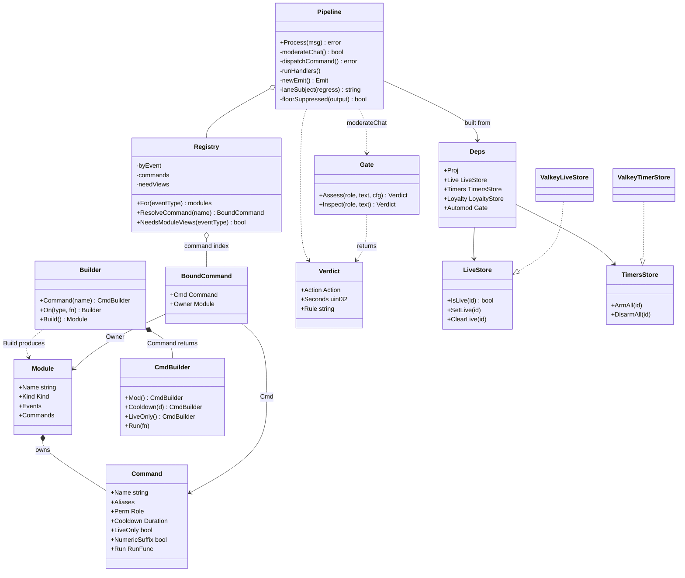
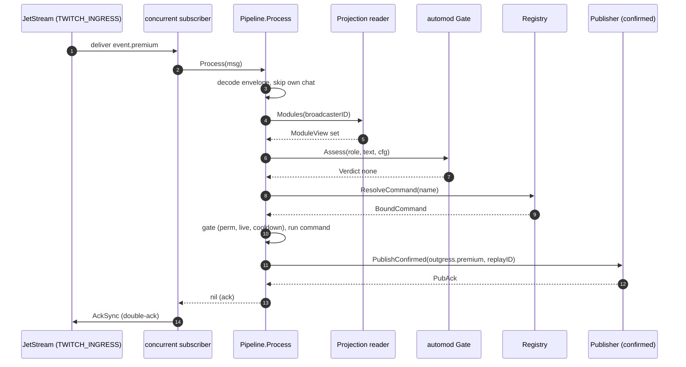
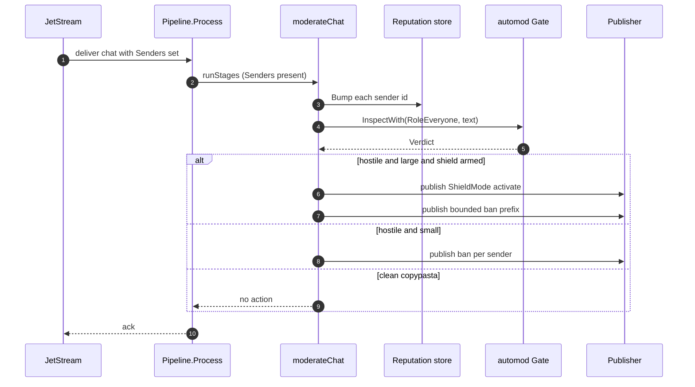
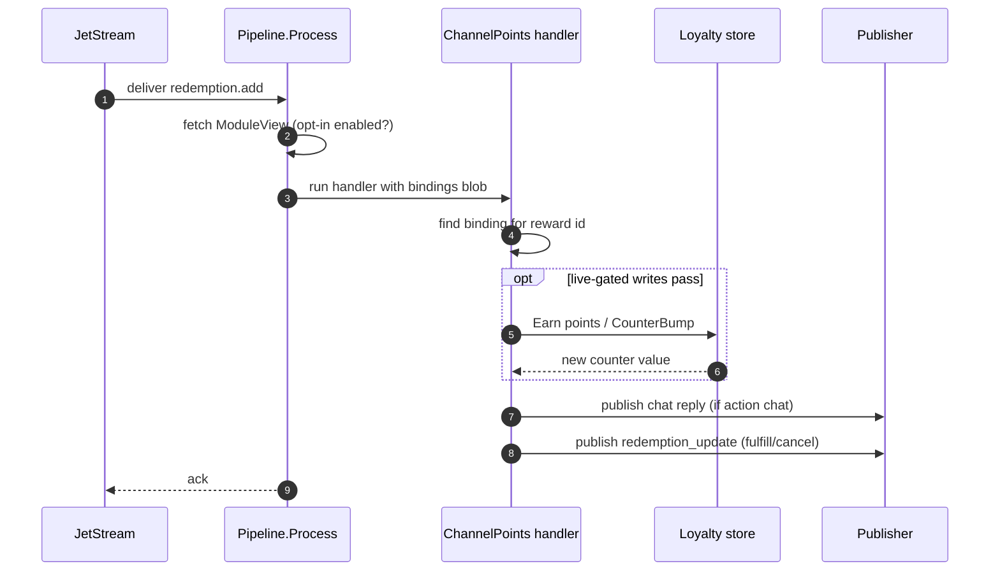
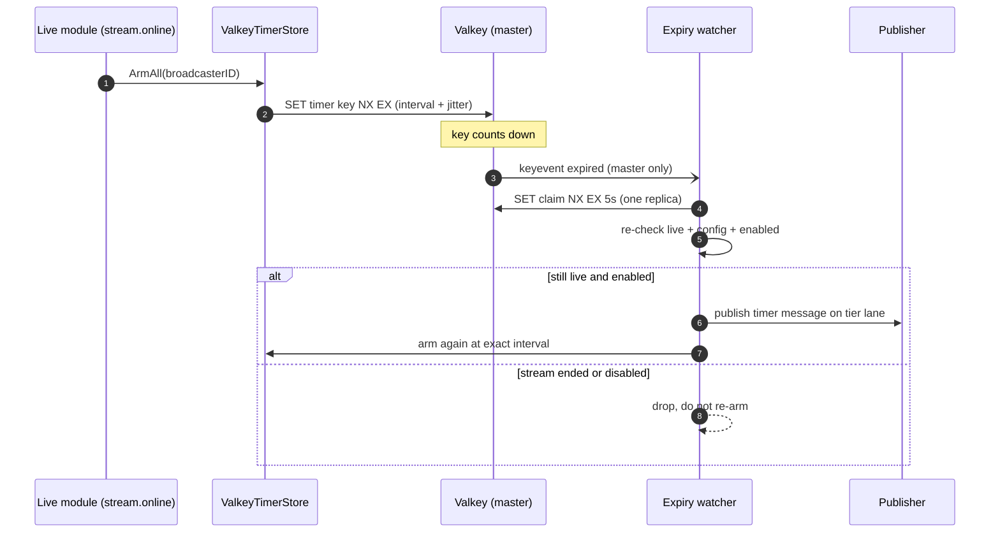
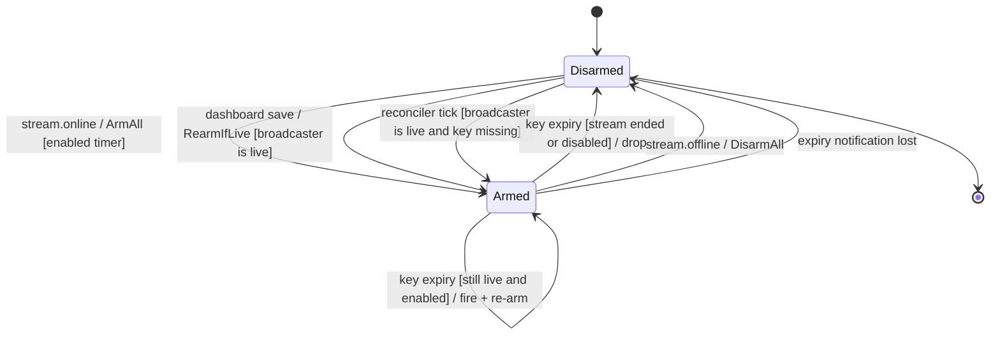

Sesame is the production Twitch event worker and the largest service in the fleet. It drains the premium and
standard ingress lanes, decodes each event, moderates chat inline, dispatches commands, runs the pluggable
modules a broadcaster has enabled, and publishes the resulting actions onto the outgress lanes. Everything a
viewer sees the bot do (a command reply, a shoutout, a clip, a channel-points reaction, a scheduled timer, a
moderation action) is decided here.

Sesame is a Go service, per [ADR 0002](/adr/0002-adoption-of-go-as-primary-service-language/), and one of the
microservices carved out of the monolith in [ADR 0001](/adr/0001-rewriting-to-microservices/). It never touches
MySQL directly: every input arrives over NATS and every side effect leaves over NATS, the substrate justified in
[ADR 0003](/adr/0003-adoption-of-nats-as-communication-bridge/). Its hot-path settings reads come from the Valkey
settings projection ([ADR 0009](/adr/0009-adoption-of-valkey-for-the-settings-projection/)), and the counters and
points it accrues are written behind through summed events ([ADR 0008](/adr/0008-caching-and-write-behind-strategy/)).

## Responsibilities

- Drain the two ingress lanes (`twitch.ingress.event.premium` and `twitch.ingress.event.standard`) with one
  autoscaling, weighted consumer, reserving a slice of the routine pool for premium so a standard flood never
  starves premium broadcasters.
- Decode each `lane.Envelope`, skip the bot's own chat, and resolve the broadcaster's enabled modules from the
  Valkey settings projection (in-process cache, then Valkey, then a projector RPC on a cold key).
- Run the inline automod gate on every chat line before dispatch: a trust tier, a content tier, and cross-sender
  jurors (campaign and reputation) that escalate coordinated abuse.
- Parse and dispatch commands through one shared gate (permission, live-only, cooldown), resolving baked commands
  from the registry and then the broadcaster's custom commands.
- Run each enabled module's event handlers for the event type, in registration order.
- Translate every module `Output` onto the outgress wire contract and publish it on the lane the broadcaster's
  status resolves to, after a send-time floor guard.
- Keep per-broadcaster live state, repeating-message timers, and the loyalty watch tick as Valkey key-expiry
  clocks, armed on `stream.online` and torn down on `stream.offline`.
- Report command usage and loyalty accrual as summed `data.*` events for the owning services to persist.

### What this service does not do

- It does not own a MySQL schema and never reads or writes the database directly. Custom commands, quotes, loyalty
  balances and module settings are read through projections and RPC and written back through the owning services.
- It does not talk to Twitch. Every Helix call is described as an outgress `Message` and executed by the
  [outgress](/microservices/outgress/) service, which owns the token budget and rate limiting.
- It does not filter which chat reaches it or pick a lane. The [twitch-ingress](/microservices/twitch-ingress/)
  service lanes events by broadcaster status and folds plain chat before publish; sesame consumes what arrives.
- It does not persist events or maintain replay history. The ingress firehose is a short, memory-backed replay
  buffer that sesame consumes and acks.
- It does not manage its own replica count: KEDA owns that field.

## External context

```mermaid
flowchart LR
    ING[twitch-ingress]
    subgraph SESAME [sesame]
        direction TB
        CONS[weighted consumer]
        PIPE[engine pipeline]
        STORES[valkey stores<br/>live, timers, loyalty]
        CONS --> PIPE
        PIPE --> STORES
    end
    OUT[outgress]
    PROJ[projector]
    USERS[users]
    CMDS[commands]
    MODS[modules]
    GW[gateway]
    VK[(Valkey)]

    ING -- event.premium / event.standard --> CONS
    PIPE -- outgress.premium / standard / system -.-> OUT
    PIPE -- data.commands.used / data.loyalty.* -.-> PROJ
    PIPE -- rpc: live, modules, commands --> PROJ
    PIPE -- rpc: users projection --> USERS
    PIPE -- rpc: command upsert/delete --> CMDS
    PIPE -- rpc: quotes --> MODS
    PIPE -- rpc: external providers --> GW
    STORES <--> VK
    PIPE <--> VK
```

Ingress dual-publishes the stream lifecycle events (`stream.online` / `stream.offline`) onto both lanes, so sesame
needs no separate stream consumer. The dashed arrows are asynchronous NATS publishes onto JetStream streams; the
solid RPC arrows are core-NATS request-reply. Reads that must reflect a just-written value use a primary-pinned
Valkey client; ordinary reads default to the node-local replica.

## Internal design

The service is three layers, each a package, deliberately stacked so the authoring surface stays free of runtime
wiring:

- `module` is the authoring surface. A feature declares itself with a fluent `Builder`: it names itself, picks a
  `Kind`, lists the commands it owns with chained gates, and registers non-command event handlers. `Build` returns
  an immutable `Module`. This package carries no pipeline, consumer, projection or Valkey types, so a module fn
  captures whatever services it needs from `engine.Deps` by closure.
- `modules` holds the shipped features, one file per module, listed in `modules.All`. Adding a feature is writing
  its file and adding one line to `all.go`.
- `engine` is the runtime. It indexes the built modules in a `Registry`, drains the lanes, and runs the interested
  modules for each message in the consumer's own goroutine. Command dispatch is an engine stage that reads the
  registry's command index directly, not a module, which removes the old worker's command-router init-order
  footgun.

The pipeline is the Controller: one `Process` per message flows through decode, module-view fetch, the automod
gate, command dispatch, event handlers, and emit. The hot path for a plain chat line that emits nothing is
allocation-free above the JSON decoder floor: the envelope and the module `Context` are pooled, and the emit sink
only builds an outgress message when a handler actually emits.



### Modules and enablement

Every module declares one of three kinds, which is the whole of its enablement logic:

- **Core** (`KindCore`): always on, never listed on the dashboard, never configured. The engine skips the
  projection fetch for a core module entirely. A core module's name is optional. The core primitives (`!ping`,
  `!itsbagelbot`, `!source`, the bagel greeter, the live tracker, the `!cmd` custom-command manager, `!clip`,
  `!followage`) are registered first so their reserved triggers win the registry's first-wins de-duplication.
- **Default** (`KindDefault`): a named module that ships enabled and runs unless the broadcaster's `ModuleView`
  disables it. The `alerts` and `automod` modules are default.
- **Opt-in** (`KindOptIn`): a named module that ships disabled and runs only when its `ModuleView` enables it.
  Shoutout, channel points, loyalty, Govee, Fortnite, MCSR, Urchin, queue, quotes, time-of-day and triggers are
  opt-in.

There is deliberately no premium gate on a module. Premium versus standard is a routing lane (which outgress
subject a reply rides), not a feature switch, so every feature is available on both lanes. A broadcaster's enabled
set arrives as the `ModuleView` list from the Valkey settings projection, keyed by module name, carrying the enable
toggle and a raw JSON `Configs` blob the module decodes. The pipeline fetches that set only when the event type has
a name-gated handler or command owner; plain chat with only core owners skips the projection read entirely.

The full module set, in registration order, is: `Core`, `Live`, `Cmd`, `Shoutout`, `Alerts`, `Clip`, `Followage`,
`Urchin`, `Mcsr`, `Fortnite`, `Queue`, `Quotes`, `Automod`, `ChannelPoints`, `Loyalty`, `Govee`, `TimeOfDay`,
`Triggers`.

### Command gate

Baked commands and custom commands share one gate, applied as three linear steps: permission, then live-only, then
cooldown. Permission compares the chatter's resolved `Role` (parsed once from the event badges, with the channel
owner always resolving to `RoleBroadcaster`) against the command's minimum, unless the command pins an exact
allowed user id. Live-only consults the live store. Cooldown claims a shared per-command window in Valkey. A baked
command is gated first by its owning module's enable state, so a command on a disabled module falls through to the
broadcaster's custom commands: an opt-in module can ship friendly triggers without reserving them fleet-wide.

### Automod

Automod is an inline chat guard at sery-bot strength with no database. It runs before command dispatch on every
chat line and returns a `Verdict`. With enforcement off (the default) it shadow-logs the verdict and takes no
action; with enforcement on it emits the moderation action and skips dispatch and handlers for the actioned line.
The gate is a pure function over the line plus the channel's automod config; the cross-sender jurors live outside
it in the engine:

- **Tier 0 (trust):** VIP, moderator, lead moderator and broadcaster are exempt and return clean without
  allocating.
- **Clean path:** a short, mostly-ASCII line with no heuristic signal and no channel block-terms bails before the
  deep path, preserving the zero-allocation hot path. A folded prescan of the hate floor still routes a bare short
  slur onto the deep path.
- **Deep path:** normalize into a pooled skeleton buffer, then run the council in order: the immovable floor
  (abusive-infrastructure and scam blocklists plus the hate lexicon, enforced under every profile and never
  suppressed by an allow-term), a language juror (reliably non-Latin text is judged only by the floor), the
  profile-gated lexicon categories, the channel's own block-terms, then the caps/symbol/repeat heuristics with
  emote and allow-term suppression.
- **Campaign juror:** the engine consults a Valkey distinct-sender count keyed by the line's SimHash band.
  Corroboration across senders escalates a delete to a timeout for a reworded flood, and on its own only ever adds
  the mildest action.
- **Reputation juror:** a repeat offender climbs a ladder (warn to timeout to ban), then this hit is recorded
  against the chatter with a bounded TTL.

A separate send-time floor guard (`floorSuppressed`) runs on the emit path: the bot must never say floor content,
no matter what a runtime variable injected into a saved-clean template, so every outbound text carrier is
re-checked against the floor before publish.

## Key flows

### Premium-lane chat command



The command's output carries a deterministic replay id (`sesame:<hash>:<ordinal>`, derived from the broadcaster id
and the EventSub event id) as the outgress `Nats-Msg-Id`, so a redelivery after an uncertain ack collapses into the
outgress stream's dedup window rather than double-sending. Only after the confirmed publish returns its PubAck does
`Process` return nil, and only then does the subscriber double-ack to prove the consumer cursor advanced.

### Squash-folded cohort



Plain chat arrives from ingress squash-folded: identical non-command lines from many chatters collapse into one
`channel.chat.message` carrying every duplicate sender in `Senders`. When `Senders` is present the line is never a
command, so dispatch is skipped; the engine fans reputation out over every sender, then inspects the shared text
once. A hostile cohort large enough to be a mass raid (fifteen or more distinct senders with a timeout-or-ban
verdict) escalates to one channel-level Shield Mode activation (deduped per channel by a raid gate) plus a bounded
prefix of per-account bans, rather than blowing the Helix budget banning account by account. Commands and
special-user messages are never folded and arrive unfolded on their own path.

### Channel-points redemption



Channel points is an opt-in, purely event-driven module: it owns no commands because a redemption is not a chat
command. The dashboard owns the Twitch-side reward and mirrors the reward-to-action binding into the module's
`Configs` blob, so sesame acts on a redemption with no RPC of its own. The loyalty writes (a points award, a
counter bump) are the only live-gated part and fail closed on a live-check error; the chat reply and the queue
resolution run either way. Resolution publishes an outgress `redemption_update` that marks the redemption
`FULFILLED` or `CANCELED` in Twitch's queue, or leaves it for a human moderator.

### Timer arm and fire



The timer clock is the expiry of a Valkey key, not a running goroutine. Each enabled timer gets one schedule key
`SET` with `NX EX`, its first fire offset by a small random phase so timers armed together do not post as one wall
of chat; re-arms use the exact interval so the cadence holds. Keyspace expiry notifications only fire on the Valkey
master, so the expiry watcher subscribes through a master-pinned pub/sub client. The same idiom drives the live
store's key-expiry re-check and the loyalty watch tick.

## State machines

### Timer lifecycle



- **Disarmed to Armed (stream.online):** `stream.online` calls `ArmAll`, which reads the broadcaster's `timers`
  `ModuleView` and `SET`s one key per enabled timer with `NX EX` at the interval plus jitter. `NX` means a
  redelivered `stream.online` leaves a still-counting key alone. Guard: the timers module is enabled and the timer
  itself is enabled.
- **Disarmed to Armed (dashboard save):** a dashboard edit changes the broadcaster's modules blob, which the
  `StartRearmWatcher` subscription turns into a `RearmIfLive` call. Guard: the broadcaster is currently live, so a
  timer added mid-stream starts counting this session instead of waiting for the next stream.
- **Disarmed to Armed (reconciler):** a one-minute reconciler sweep re-arms every live broadcaster's timers under
  a fleet-wide `NX` claim. Guard: the broadcaster is live and the key is missing (a stall). This recovers a timer
  whose expiry notification was lost to a Sentinel failover or a watcher reconnect, without a stream restart.
- **Armed to Armed (fire):** the key expires, the watcher claims the expiry with an `NX` guard so exactly one
  replica acts, then re-validates. Guard: the broadcaster is still live and the timer is still enabled. It posts
  the message on the broadcaster's tier lane (after the send-time floor guard) and re-arms at the exact interval.
- **Armed to Disarmed (fire-time drop):** the same expiry, but the re-validation finds the stream ended or the
  timer disabled or deleted since arming. The key is dropped and not re-armed.
- **Armed to Disarmed (stream.offline):** `stream.offline` calls `DisarmAll`, which deletes every configured
  timer's key so the stream stops immediately rather than waiting out the longest interval.
- **Armed to Disarmed (lost notification):** Valkey pub/sub is fire-and-forget with no replay, so a dropped
  notification silently stalls one timer. The reconciler is what brings it back within a minute.

The live store and the loyalty watch tick are the same state machine over their own keys: armed on `stream.online`,
disarmed on `stream.offline`, fired on key expiry, with the same claim-and-revalidate discipline and one-minute
reconciler.

## NATS contracts

Sesame binds the shared durable consumer group named `worker` (its `SESAME_CONSUMER_NAME` default) so it is a true
drop-in for the deleted worker: no `DeliverAll` replay on rollout, and overlap load-balances across the group
instead of double-processing. Within that group each lane is its own server-owned durable consumer.

### Consumed lanes

| Subject                          | Stream          | Consumer (durable)                      | Settings                                                                 |
|----------------------------------|-----------------|------------------------------------------|--------------------------------------------------------------------------|
| `twitch.ingress.event.premium`   | `TWITCH_INGRESS`| `worker_twitch_ingress_event_premium`    | queue group `worker`, `AckExplicit`, `AckWait` 4s, `MaxDeliver` 6, `MaxAckPending` 20000, `DeliverAll`, `ReplayInstant`, no `BackOff` |
| `twitch.ingress.event.standard`  | `TWITCH_INGRESS`| `worker_twitch_ingress_event_standard`   | same as premium                                                          |

The consumer deliberately sets no `BackOff`: the server clamps `AckWait` down to `backoff[0]`, and a short first
step would redeliver every handler merely slower than it to another replica while the first is still working,
fanning one job (a chat send, a clip) across the fleet. Redelivery pacing lives instead in the subscriber's
per-message `NakWithDelay` (three seconds between attempts, five redeliveries past the first), which leaves
`AckWait` as the sole in-flight redelivery clock. Handlers send `InProgress` once per second so a genuinely slow
RPC-backed command keeps ownership past the short `AckWait`. `TWITCH_INGRESS` is a memory-backed, single-replica
(R1) firehose with five-minute and one-gigabyte retention and a per-lane cap of 400,000 messages; sesame owns its
stream reconciliation because it is the primary consumer.

### Published subjects

| Subject                     | Stream           | Payload                                   | Purpose                                                             |
|-----------------------------|------------------|-------------------------------------------|--------------------------------------------------------------------|
| `twitch.outgress.premium`   | `TWITCH_OUTGRESS`| `outgress.Message`                        | Actions for premium broadcasters and special users.                |
| `twitch.outgress.standard`  | `TWITCH_OUTGRESS`| `outgress.Message`                        | Actions for standard broadcasters.                                 |
| `twitch.outgress.system`    | `TWITCH_OUTGRESS`| `outgress.Message` (`stream_status`)      | Off-budget system lane: the live key-expiry re-check job.          |
| `data.commands.used`        | `BAGEL_DATA`     | `data.CommandUsedDTO`                     | Summed command-use ticks, flushed per window for persistence.      |
| `data.loyalty.earned`       | `BAGEL_DATA`     | loyalty earn entries, chunked per user    | Summed point and watch accrual, write-behind.                      |
| `data.loyalty.counters`     | `BAGEL_DATA`     | counter bump entries, chunked per user    | Summed counter bumps, write-behind.                                |

An `outgress.Message` carries a `Type` (`chat`, `announce`, `shoutout`, `pin`, `clip`, `ban`, `timeout`,
`shield_mode`, `delete`, `warn`, `redemption_update`, `batch`, `stream_status`), the target `BroadcasterID`, and a
typed JSON `Payload` (or dedicated fields for moderation and redemption actions). A multi-line custom response is
packed into one `batch` job so one outgress worker owns the send order. The lane is chosen from the broadcaster's
status, not the feature. The `data.*` subjects are the write-behind path: sesame never writes those rows itself,
it emits summed events the owning services persist.

### Request-reply surface

Sesame is a client of these RPCs; it serves none of them except its own health probe.

| Subject                                           | Peer            | Used for                                                          |
|---------------------------------------------------|-----------------|------------------------------------------------------------------|
| `bagel.rpc.broadcaster.live.get`                  | projector       | Live state on a cold Valkey key.                                 |
| `bagel.rpc.projector.dashboard.modules.get`       | projector       | The broadcaster's `ModuleView` set (cold-cache fallback).       |
| `bagel.rpc.projector.dashboard.commands.get`      | projector       | A custom command lookup (cold-cache fallback).                  |
| `bagel.rpc.internal.projection.users.get`         | users           | The broadcaster's tier and locale.                              |
| `bagel.rpc.commands.upsert` / `.delete`           | commands        | The `!cmd` module writing custom commands.                      |
| `bagel.rpc.modules.quote.<verb>`                  | modules         | The quotes module reading and writing the channel quote book.   |
| `bagel.rpc.gateway.<provider>.<endpoint>`         | gateway         | External providers (Fortnite, MCSR, Urchin, Govee).             |
| `bagel.rpc.loyalty.<verb>`                         | loyalty         | Counter and balance management verbs.                           |
| `bagel.rpc.outgress.chatters.get`                 | outgress        | The loyalty watch tick listing a live channel's chatters.       |
| `bagel.rpc.health.sesame`                          | (served)        | Health probe, answered on queue group `sesame-rpc`.             |

Sesame also subscribes to the cache-invalidation prefix (`bagel.cache.invalidate.*`): the `*.live` scope drops a
replica's cached live bool, and the `*.modules` scope drives both the projection cache eviction and the timer and
loyalty-tick mid-stream rearm watchers.

## Data

Sesame owns no MySQL schema (its non-goal), which is why every database-shaped read is a projection or an RPC and
every write is a summed `data.*` event. Its own state lives in Valkey, split between the settings projection it
reads on the hot path and the domain state it owns.

| Key pattern                              | Owner path        | Purpose                                                              |
|------------------------------------------|-------------------|---------------------------------------------------------------------|
| `live:<broadcasterID>`                   | live store        | Live flag with a TTL backstop; expiry triggers a Twitch re-check.   |
| `live:recheck:<broadcasterID>`           | live store        | Per-broadcaster `NX` guard so one replica fires the re-check.       |
| `timer:<broadcasterID>:<timerID>`        | timer store       | One schedule key per enabled repeating message.                     |
| `timer:claim:<...>`                      | timer store       | Per-expiry and per-reconcile-tick single-replica claim.             |
| `loyaltick:<broadcasterID>`              | loyalty tick      | Watch-tick schedule key per live loyalty broadcaster.               |
| `loyaltick:claim:<...>`                  | loyalty tick      | Single-replica claim for a tick.                                     |
| `cooldown:cmd:<broadcasterID>:<name>`    | cooldown store    | Shared per-command cooldown window.                                 |
| `bagel:greeted:<...>`                    | greet store       | Which special users have been greeted this stream.                  |
| `am:acct:<chatterID>`                    | reputation store  | Per-chatter strike score (6h TTL) for the reputation juror.         |
| `am:tmpl:<band>`                         | campaign store    | Distinct-sender HyperLogLog per SimHash band for the campaign juror.|
| `queue:open:<...>` / `queue:line:<...>`  | queue store       | Per-broadcaster play queue (24h).                                   |
| `loyal:cnt:c:<...>` / `loyal:cnt:v:<...>` / `loyal:bal:<...>` | loyalty view | Local counter and balance view fronting the loyalty service. |

Reads default to the node-local Valkey replica and are replica-lagged; the live store, cooldown claim and other
read-after-write paths run against the Sentinel-elected master. Keyspace expiry notifications fire only on the
master, so the timer, live and loyalty watchers subscribe through a dedicated master-pinned pub/sub client.

## Configuration

All settings arrive as environment variables read once at boot. Pod-tuning knobs are `SESAME_*`; the secret-provided
values (`VALKEY_*`, `NATS_CACHE_INVALIDATION_PREFIX`, `TWITCH_SPECIAL_USER_IDS`, `TWITCH_BOT_USER_ID`) keep the
worker's names so the same Doppler config supplies them unchanged.

| Variable                         | Default                                            | Purpose                                                              |
|----------------------------------|----------------------------------------------------|---------------------------------------------------------------------|
| `NATS_URL`                       | `nats://127.0.0.1:4222`                            | JetStream connection (lanes, publishing).                           |
| `NATS_RPC_URL`                   | `NATS_URL`                                         | Core-NATS RPC connection (projector fallback, invalidation).        |
| `SESAME_CONSUMER_NAME`           | `worker`                                           | Durable queue group bound on both lanes.                            |
| `NATS_INGRESS_PREMIUM_SUBJECT`   | `twitch.ingress.event.premium`                     | Premium lane subject.                                               |
| `NATS_INGRESS_STANDARD_SUBJECT`  | `twitch.ingress.event.standard`                    | Standard lane subject.                                              |
| `SESAME_MIN_ROUTINES`            | `2`                                                | Routine-pool floor per consumer.                                    |
| `SESAME_MAX_ROUTINES`            | `8`                                                | Routine-pool ceiling per consumer.                                  |
| `SESAME_MIN_CONSUMERS`           | `1`                                                | Consumer-unit floor.                                                |
| `SESAME_MAX_CONSUMERS`           | `3`                                                | Consumer-unit ceiling.                                              |
| `SESAME_SCALE_UP_AFTER`          | `5s`                                               | Sustained-load window before adding a routine.                      |
| `SESAME_SCALE_DOWN_AFTER`        | `30s`                                              | Idle window before shrinking.                                       |
| `SESAME_PREMIUM_RESERVE_PERCENT` | `25`                                               | Share of the pool reserved for the premium lane.                    |
| `SESAME_DRAIN_TIMEOUT`           | `25s`                                              | Shutdown wait for in-flight handlers (below the grace period).      |
| `NATS_OUTGRESS_PREMIUM_SUBJECT`  | `twitch.outgress.premium`                          | Premium outgress lane.                                              |
| `NATS_OUTGRESS_STANDARD_SUBJECT` | `twitch.outgress.standard`                         | Standard outgress lane.                                             |
| `NATS_OUTGRESS_SYSTEM_SUBJECT`   | `twitch.outgress.system`                           | System lane for the live re-check job.                              |
| `NATS_BROADCASTER_LIVE_SUBJECT`  | `bagel.rpc.broadcaster.live.get`                   | Projector live RPC (cold key).                                      |
| `TWITCH_SPECIAL_USER_IDS`        | (empty)                                            | Comma-separated special (bagel-crew) user ids.                      |
| `TWITCH_BOT_USER_ID`             | (empty)                                            | The bot's own id, so it never reacts to itself.                     |
| `SESAME_AUTOMOD_ENFORCE`         | `false`                                            | Arms automod; false is shadow mode (log only).                      |
| `SESAME_AUTOMOD_SHIELD`          | `false`                                            | Allows a mass raid to escalate to Shield Mode (requires enforce).   |
| `SESAME_AUTOMOD_EMOTES`          | `true`                                             | Runs the third-party emote-set refresher for caps suppression.      |
| `SESAME_AUTOMOD_LEXICON_DIR`     | (empty)                                            | Optional lexicon override directory (a mounted ConfigMap).          |
| `SESAME_LIVE_TTL`                | `12h`                                              | Live key TTL backstop.                                              |
| `NATS_INTERNAL_PROJECTION_USERS_SUBJECT` | `bagel.rpc.internal.projection.users.get`  | Users projection RPC.                                               |
| `NATS_INTERNAL_PROJECTION_MODULES_SUBJECT` | `bagel.rpc.projector.dashboard.modules.get` | Modules projection RPC.                                         |
| `NATS_INTERNAL_PROJECTION_COMMANDS_SUBJECT` | `bagel.rpc.projector.dashboard.commands.get` | Commands projection RPC.                                     |
| `NATS_CACHE_INVALIDATION_PREFIX` | `bagel.cache.invalidate`                           | Push-invalidation subject prefix.                                   |
| `NATS_COMMANDS_DASHBOARD_PREFIX` | `bagel.rpc.commands`                               | Commands service RPC prefix (`!cmd`).                               |
| `NATS_MODULES_SUBJECT_PREFIX`    | `bagel.rpc.modules`                                | Modules service RPC prefix (quotes).                                |
| `NATS_GATEWAY_SUBJECT_PREFIX`    | `bagel.rpc.gateway`                                | Gateway RPC prefix (external providers).                            |
| `NATS_LOYALTY_SUBJECT_PREFIX`    | `bagel.rpc.loyalty`                                | Loyalty service RPC prefix.                                         |
| `NATS_OUTGRESS_RPC_PREFIX`       | `bagel.rpc.outgress`                               | Outgress RPC prefix (chatters, followage, account age).             |
| `SESAME_PUBLIC_BASE_URL`         | `https://dashboard.itsbagelbot.com`                | Origin for the `!cmd` channel command-page link.                    |
| `VALKEY_ADDR`                    | `127.0.0.1:6379`                                   | Valkey address (Sentinel or standalone).                            |
| `VALKEY_PASSWORD`                | (empty)                                            | Valkey auth.                                                        |
| `LISTEN_ADDR`                    | `:8080`                                            | Health server address.                                              |

Production overrides in the manifest run the routine pool flat at 100 routines and four consumer units per pod, with
four ordered publisher connections hashed by broadcaster, a two-second scale-up and forty-five-second scale-down
window, and `GOMEMLIMIT` at 512 MiB.

## Deployment

The manifest is `deploy/k8s/sesame.yaml`. Sesame runs as a distroless, non-root (uid 65532) Deployment whose image
is digest-pinned by Flux from GHCR.

- **Replicas:** owned by a KEDA `ScaledObject`, not the Deployment. Floor 5, ceiling 10, with a CPU-utilization
  trigger at 75 percent and two JetStream lag triggers on the per-lane consumers (premium lag threshold 1500,
  standard 6000). The baseline shape at the floor is node3 two, worker1 two, node2 one.
- **Placement:** graded node preferences favor `node3` then `worker1` (the big-CPU hot-path pair), keeping node2
  light since it already carries the control plane and the Valkey master. A soft one-per-node topology spread scoped
  to the current ReplicaSet re-spreads on every rollout. Tolerations let it schedule onto the tainted worker pool.
- **Rollout:** `RollingUpdate` with `maxSurge` 0 and `maxUnavailable` 1, `minReadySeconds` 10, `revisionHistoryLimit`
  3, and a `PodDisruptionBudget` of `maxUnavailable` 1.
- **Probes:** liveness `GET /healthz` every 30s, readiness `GET /readyz` every 10s (gated on the NATS connection),
  a startup probe that allows up to 90 seconds, and a `preStop` `GET /drain`.
- **Shutdown:** `SIGTERM` cancels the consumer context so no new work is pulled, then `drainInflight` waits up to the
  25-second `DrainTimeout` for dispatched handlers to finish before the deferred closes flush the reporters and shut
  the publishers. The 45-second `terminationGracePeriodSeconds` leaves margin. A handler abandoned at the deadline
  leaves its message unacked for redelivery, and its already-stored outputs keep their deterministic ids so the
  broker folds them.
- **Resources:** requests 500m CPU and 128Mi memory; limits 2 CPU and 768Mi.

## Observability

- **Logging:** structured `zap` to stdout, wrapped by the New Relic logger. Verdicts, dispatch failures, timer and
  live watcher lifecycle, and cache occupancy each log with the broadcaster id and event context. A one-line startup
  banner records the effective consumer tuning and the count of configured special users.
- **New Relic** ([ADR 0010](/adr/0010-adoption-of-new-relic-for-observability/)): the Go agent wraps the consumer,
  so each message runs as a transaction tagged with the event type and broadcaster id. A failed handler records the
  module name and notices the error on the transaction; the malformed-envelope and dispatch-error paths notice too.
- **KEDA lag telemetry:** the autoscaler reads `num_pending + num_ack_pending` on the two per-lane durables from the
  NATS monitoring endpoint, which is also the operator's lane-telemetry view.

## Failure modes and how the service responds

| Failure                                          | Response                                                                                                             |
|--------------------------------------------------|--------------------------------------------------------------------------------------------------------------------|
| Malformed envelope (decode fails)                | Logged as poison and acked (dropped). Redelivering an unparseable message forever helps no one.                     |
| `ModuleView` read fails (infrastructure)         | `Process` returns an error, so the message is nacked and redelivered, paced three seconds apart, up to five times.  |
| Command gate store error (cooldown or live read) | Logged and skipped, never nacked, so one misbehaving gate cannot re-fire the siblings that already ran.             |
| Module handler logic error                       | Logged and noticed on the New Relic transaction, then skipped. Not nacked, to avoid re-running succeeded siblings.  |
| Publish or marshal failure on the emit path      | Captured in the emit state, which nacks. Deterministic replay ids collapse any outputs already published.          |
| Slow handler exceeds `AckWait`                   | `InProgress` pings extend ownership each second; past that the server owns redelivery and the subscriber does not nack.|
| Redelivery budget exhausted (past five)          | The final delivery is terminated and the message ages out of the memory-backed stream.                             |
| Live check fails (Valkey or projector)           | Treated as offline (fail closed), so a live-only command and the bagel greet skip rather than fire on an outage.    |
| Timer expiry notification lost                   | The one-minute reconciler re-arms the stalled timer under an `NX` claim without a stream restart.                   |
| Valkey master failover                           | The master-pinned pub/sub client reconnects and the watcher loop resubscribes after a one-second backoff.          |
| Duplicate command trigger across modules         | The registry keeps the first registration (core wins), logs the collision, and ignores the shadowing module.       |
| Outgoing text carries floor content              | The send-time floor guard suppresses that one output and warns, without blocking the rest of the response.         |
| SIGTERM mid-flight                               | The consumer stops pulling and the drain waits out in-flight handlers; abandoned messages redeliver and fold.      |

## Design notes

Sesame reads as the four architectural views the [architecture index](/architecture/) uses: the class diagram is the
logical view, the sequence diagrams the process view, the deployment section the physical view, and the key flows the
scenarios. The patterns and tactics below are the ones the code actually embodies.

- **Controller (GRASP):** `engine.Pipeline` is the single per-message controller. It owns orchestration (decode,
  moderate, dispatch, run handlers, emit) and delegates behavior to the modules.
- **Pure Fabrication (GRASP):** the `module` package is a fabricated authoring layer with no runtime dependencies, so
  features stay unit-testable and cheap to import. `SpecialSet`, `Registry` and the Valkey stores are fabrications
  that concentrate one responsibility each.
- **Information Expert (GRASP):** `lane.Envelope` resolves its own broadcaster id and display names; the automod
  `Gate` owns the verdict; the `Registry` owns command resolution and the needs-module-views decision.
- **Protected Variations (GRASP):** `engine.Deps` is a bundle of interfaces (`LiveStore`, `TimersStore`,
  `LoyaltyStore`, `CooldownStore`, `CommandManager`, `Reputation`, `Campaign`), so a module binds to a contract, not
  a Valkey or NATS type. The narrow `IsLiveChecker` (Interface Segregation) is the read-only slice the command gate
  and greeter depend on.
- **Builder (GoF):** `module.Builder` and `CmdBuilder` are a fluent builder that validates at `Build` and returns an
  immutable `Module`.
- **Strategy and Registry (GoF):** each `Module` is a strategy the `Registry` indexes by event type and command
  trigger; `outgressBuilders` is a strategy table mapping an output type to its wire construction.
- **Object Pool (GoF):** the envelope, module `Context`, output and scratch buffers are pooled to keep the no-output
  chat path allocation-free.
- **Queue-based load leveling (SEI tactic):** the memory-backed ingress firehose absorbs bursts; the weighted
  consumer drains it into an autoscaling pool.
- **Rate limiting and resource governance (SEI tactic):** the premium reserve protects a class of traffic; the
  mass-raid escalation swaps per-account bans for one Shield Mode call to stay inside the Helix budget.
- **Sharding (SEI tactic):** four publisher connections hashed by broadcaster keep one channel's outputs ordered
  while unrelated channels overlap confirmation cohorts.
- **Heartbeat and removal from service (SEI tactic):** `InProgress` pings are the per-message heartbeat that keeps a
  slow handler owned; the readiness probe and drain remove a pod from service cleanly.
- **Redundancy with claim (SEI tactic):** every key-expiry action is claimed with an `NX` guard so exactly one
  replica of the fleet acts, and a one-minute reconciler recovers a lost notification.

## References

- [ADR 0001](/adr/0001-rewriting-to-microservices/): the rewrite that carved sesame out of the monolith.
- [ADR 0002](/adr/0002-adoption-of-go-as-primary-service-language/): Go as the service language.
- [ADR 0003](/adr/0003-adoption-of-nats-as-communication-bridge/): the NATS subject space sesame consumes and
  publishes into.
- [ADR 0008](/adr/0008-caching-and-write-behind-strategy/): the write-behind strategy behind the summed `data.*`
  events.
- [ADR 0009](/adr/0009-adoption-of-valkey-for-the-settings-projection/): the settings projection sesame reads on the
  hot path.
- [ADR 0010](/adr/0010-adoption-of-new-relic-for-observability/): the observability stack.
- [twitch-ingress](/microservices/twitch-ingress/): the upstream service that lanes and folds the events sesame
  consumes.
- [outgress](/microservices/outgress/): the downstream service that executes the Helix actions sesame publishes.
- [projector](/microservices/projector/): the owner of the Valkey settings projection and the live and dashboard
  RPCs sesame falls back to.
- [commands](/microservices/commands/) and [modules](/microservices/modules/): the services behind the custom-command
  and quote RPCs.
- [users](/microservices/users/): the source of broadcaster tier and locale.
