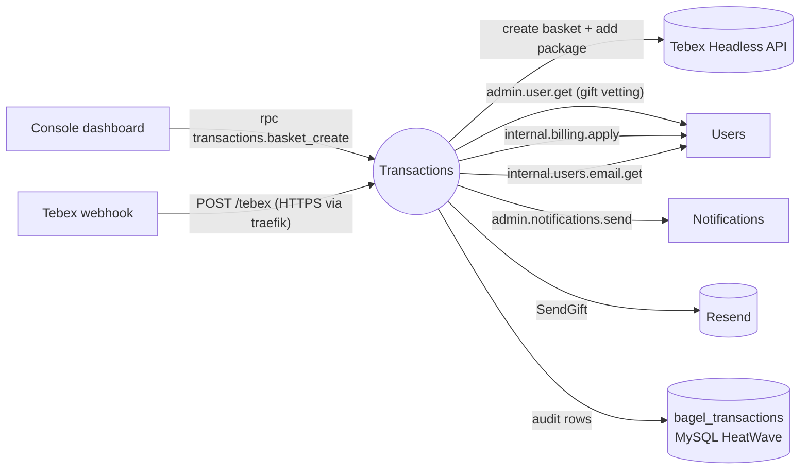
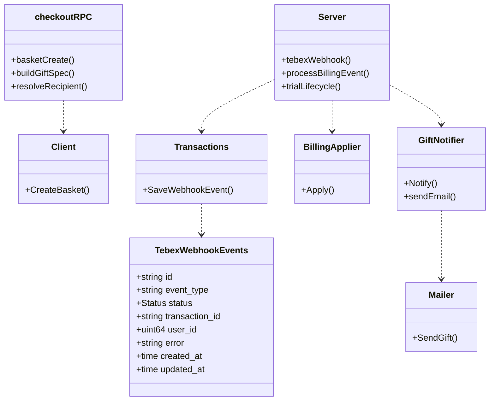
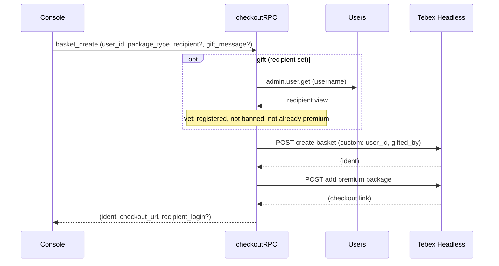
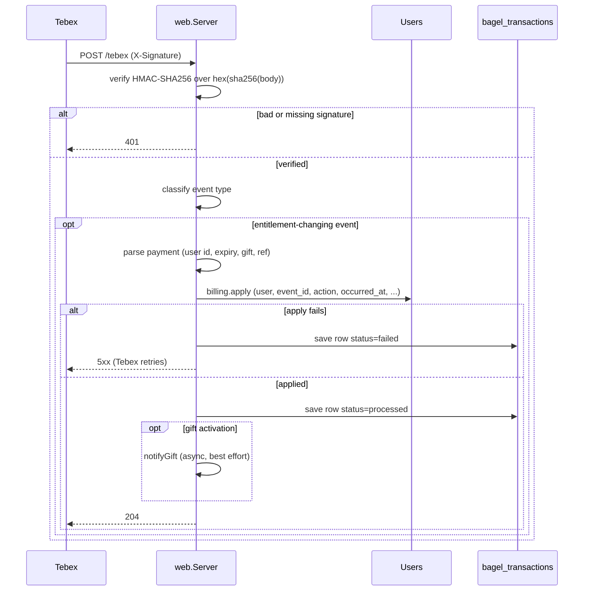
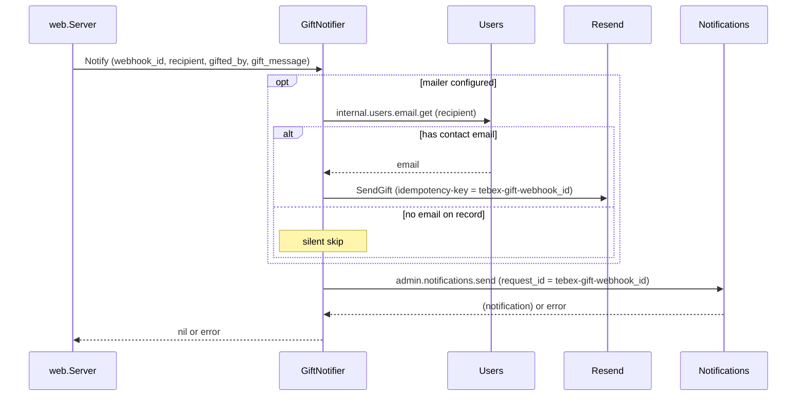

The Transactions service (`app/transactions/`) is the boundary between ItsBagelBot and Tebex, the payment
processor. It does two jobs: it mints Tebex Headless checkout baskets so the console can redirect a
broadcaster to hosted checkout, and it receives Tebex webhooks, verifies their signatures, and turns each
verified event into an entitlement change. Tebex is the merchant of record, so no payment or card data is
ever stored here. The service owns a single MySQL table, an append-only webhook audit log, and applies the
actual tier change by calling the private billing subject on [Users](/microservices/users/).

Entitlement never depends on this service's own database. The webhook is the trigger, the synchronous
`billing.apply` RPC to users is the effect, and the local audit rows are forensics only. Idempotency and
ordering are the users service's job (keyed by Tebex event id), which is why a webhook the service fails to
persist can be safely retried. The communication substrate is NATS
([ADR 0003](/adr/0003-adoption-of-nats-as-communication-bridge/)); the store is MySQL HeatWave
([ADR 0005](/adr/0005-adoption-of-mysql-heatwave/)); the schema-per-service rule is
[ADR 0007](/adr/0007-adoption-of-per-schema-data-microservices/).

## Responsibilities

- Mint Tebex Headless baskets on the dashboard-facing `basket_create` RPC: create the basket, add the
  premium package, and return the ident plus the hosted-checkout URL.
- Support gifting: resolve and vet a recipient against the users service, then build a one-month gift
  basket that carries the buyer as gifter in the basket custom payload.
- Terminate the Tebex webhook: verify the HMAC signature, classify the event, and apply the resulting
  billing action through the users service.
- Keep an append-only audit trail of every webhook processed, failed, ignored, or validated.
- Notify a gift recipient on two independent channels (an in-app notification and, when a mailer is
  configured, an email through Resend).

### What this service does not do

- It does not store payments, cards, receipts, or subscription state. Those live on Tebex; the local table
  is a processing-outcome log keyed by webhook id.
- It does not own the tier. It asks the users service to apply an entitlement; the tier state machine, its
  idempotency, and its ordering guards live there.
- It does not read entitlement back out of its own table to decide anything. The audit rows are never a
  source of truth.
- It does not run a creator-code rev-share backend. The `creator_code` is a user attribute stored and
  edited on the users service; no revenue-share logic exists in this service or in the Tebex client.
- It does not own a JetStream stream. All of its NATS traffic is core request-reply.

## External context

The webhook arrives over HTTPS: a traefik `IngressRoute` routes `webhooks.itsbagelbot.com` under
`/tebex` and `/webhooks/tebex` to the service. The checkout RPC and the outbound calls to users and
notifications ride the node-local NATS leaf on the per-service `TRANSACTIONS_RPC` account.

## Internal design

`main.go` wires two faces of the service. The HTTP face is a chi router (`web.Server`) that terminates the
webhook and serves the probes. The RPC face is a core NATS connection (`TRANSACTIONS_RPC` account) that
answers `basket_create` and issues the outbound requests. Two collaborators are optional and degrade
cleanly: without the Tebex Headless credentials the checkout RPC is simply not bound (webhook-only mode),
and without a Resend key the gift email channel is skipped while the in-app notification still fires.

The webhook path separates concerns by file: `web/server.go` owns HTTP and signature verification,
`web/tebexevent.go` owns the Tebex wire shapes and the classification of an event type into a billing
action, `web/signature.go` owns the HMAC check. A new Tebex event type is one entry in the
`billingEventActions` map, not a new branch (Open/Closed).

## Key flows

### Checkout basket creation

The dashboard asks for a basket. For a self-purchase it is two upstream Tebex calls; a gift adds a recipient
lookup and rebuilds the spec.

The basket custom payload carries the recipient's `user_id` (and, for a gift, `gifted_by` /
`gifted_by_login` / `gift_message`); Tebex echoes it back on the payment webhook, which is the whole
attribution chain. Gift baskets are always the one-time `single` package (never a recurring subscription
on someone else's behalf). The gift note is sanitized and link-checked before it can ride the basket:
control characters are stripped, the note is capped at 280 runes, and a note containing a link is rejected
(a gift note is emailed to another user). An oversized recipient login is rejected before the lookup even
runs, so attacker-supplied junk never reaches the NATS request or the basket.

### Webhook: signature, entitlement, audit

Every webhook follows one authenticated path. Verification comes first; classification and the per-outcome
work follow.

The signature is HMAC-SHA256 over the hex of the body's SHA-256, compared in constant time. Classification
routes to one of four outcomes: a `validation.webhook` ping is recorded and echoed, an entitlement-changing
type in `billingEventActions` runs the billing path, a `recurring-payment.trial*` type (matched by prefix,
because trials exist in the Tebex panel but not their docs) runs the trial lifecycle, and everything else
is audited as `ignored`. The billing action is derived from the event type: activations
(`payment.completed`, `recurring-payment.started/renewed`), cancellation-requested/aborted, and revokes
(`recurring-payment.ended`, `payment.refunded`, disputes). Because entitlement is applied by the RPC and
not by the audit row, a persist failure alone returns 500 and Tebex simply retries; the users service
deduplicates on the event id.

### Gift notification

After a gift activation is applied, the recipient is told on two independent channels. The in-app
notification is the propagated failure; the email is best-effort.

The webhook id doubles as the notification `request_id` and the Resend idempotency key, so Tebex's webhook
retries collapse into exactly one in-app notification and one email. A recipient who has never logged in
since email capture shipped has no address on record and is skipped without error. Only the in-app leg's
failure propagates back (and only that far, since the entitlement is already durable at that point).

## NATS contracts

The service answers one RPC verb and issues several outbound requests. There is no published event stream.

### Request-reply served (`bagel.rpc.transactions.*`, queue group `transactions-rpc`)

| Subject | Request | Reply | Timeout |
|---|---|---|---|
| `bagel.rpc.transactions.basket_create` | `BasketCreateRequest` `{user_id, username?, recipient_username?, ip_address?, package_type?, gift_message?}` | `BasketCreateReply` `{ident, checkout_url, recipient_login?, error?}` | 15 s (two upstream HTTP calls plus a lookup) |
| `bagel.rpc.health.transactions` | empty | `{service, ok}` | health probe |

### Request-reply issued

| Subject | Peer | Purpose |
|---|---|---|
| `bagel.rpc.admin.user.get` | Users | Resolve and vet a gift recipient (3 s). |
| `bagel.rpc.internal.billing.apply` | Users | Apply the entitlement for a verified event (5 s). |
| `bagel.rpc.internal.users.email.get` | Users | Fetch the recipient's decrypted contact email for the gift email (3 s). |
| `bagel.rpc.admin.notifications.send` | Notifications | Send the in-app gift notification (5 s). |

### HTTP surface

| Route | Method | Purpose |
|---|---|---|
| `/tebex`, `/webhooks/tebex` | POST | The Tebex webhook (signature-verified). |
| `/tebex`, `/webhooks/tebex` | GET | Reachability check for the Tebex panel. |
| `/healthz`, `/readyz`, `/drain` | GET | Liveness, readiness, and the preStop drain. |

## Data

The service owns the `bagel_transactions` schema, a single table.

| Table | Columns | Notes |
|---|---|---|
| `tebex_webhook_events` | `id` (Tebex webhook id, PK), `event_type`, `status` (`processed` / `failed` / `ignored` / `validation`), `transaction_id`, `user_id`, `error` (max 500), `created_at`, `updated_at` | Append-only audit log, upserted by id so a webhook retry updates the same row. Indexed on status, event type, user id, and transaction id. |

The row records what happened to each webhook, never the payment itself. It exists for entitlement
forensics, not for driving entitlement.

## Configuration

| Variable | Default | Purpose |
|---|---|---|
| `APP_ENV` | `development` | Logger profile. |
| `LISTEN_ADDR` | `:8080` | HTTP listener (webhook + probes). |
| `NATS_URL` | `nats://127.0.0.1:4222` | Bus fallback URL. |
| `NATS_RPC_URL` / `NATS_LEAF_URL` | (manifest) | RPC plane on the node-local leaf. |
| `NATS_CA_PEM` | (fleet CA) | Verifies the broker's TLS cert. |
| `NATS_RPC_USER` / `NATS_RPC_PASSWORD` | falls back to `NATS_USER` | Per-service `TRANSACTIONS_RPC` account. |
| `DB_ADDR` / `DB_USER` / `DB_PASS` | | MySQL connection. |
| `DB_SCHEMA` | `bagel_transactions` | Owned schema. |
| `DB_AUTO_MIGRATE` | `true` | Run ent migrations at startup. |
| `TEBEX_WEBHOOK_SECRET` | (empty) | HMAC secret; the webhook returns 503 until it is set. |
| `TEBEX_WEBSTORE_TOKEN` (or `TEBEX_HEADLESS_TOKEN`) | (empty) | Public Headless token; without it and a package id, checkout is disabled. |
| `TEBEX_PRIVATE_KEY` (or `TEBEX_SECRET_KEY` / `TEBEX_API_PRIVATE_KEY`) | (empty) | Headless private key; enables backend baskets that accept the customer IP. |
| `TEBEX_PACKAGE_ID` | `0` | The premium package placed in every basket. |
| `TEBEX_PACKAGE_TYPE` | `subscription` | Default package type; gifts override to `single`. |
| `TEBEX_INCLUDE_USERNAME` | `false` | Send the store username at Tebex top level (Universal stores reject it). |
| `DASHBOARD_ORIGIN` | `https://dashboard.itsbagelbot.com` | Builds the checkout complete/cancel return URLs and the email dashboard link. |
| `RESEND_API` (or `RESEND_API_KEY`) | (empty) | Enables the gift email channel; absent, email is skipped. |
| `RESEND_FROM` | `ItsBagelBot <no-reply@itsbagelbot.com>` | Verified Resend sender. |
| `GOMEMLIMIT` | `160MiB` | Go soft memory limit. |
| `NEW_RELIC_LICENSE_KEY` / `NEW_RELIC_APP_NAME` | | New Relic agent; absent, it is a no-op. |

Subject prefixes (`NATS_TRANSACTIONS_SUBJECT_PREFIX`, `NATS_ADMIN_USER_SUBJECT_PREFIX`,
`NATS_ADMIN_NOTIFICATIONS_SUBJECT_PREFIX`, `NATS_INTERNAL_USERS_EMAIL_SUBJECT`,
`NATS_INTERNAL_BILLING_SUBJECT`) are overridable and default to the contract-table values.

## Deployment

From `deploy/k8s/transactions.yaml`. Distroless Go image, Flux digest-pinned from GHCR, Doppler-injected
secrets that auto-restart the pods on change.

- **Replicas:** 3, one per schedulable node, spread with a `ScheduleAnyway` hostname topology constraint
  (DaemonSet-like placement). It tolerates the `worker-pool` taint.
- **Rollout:** `maxSurge: 0`, `maxUnavailable: 1`; a `PodDisruptionBudget` of `maxUnavailable: 1`.
- **Ingress:** a `Service` with `PreferClose` traffic distribution plus a traefik `IngressRoute` on
  `webhooks.itsbagelbot.com` (native load balancing). The webhook secret is mounted optional, so the
  service still boots without it (returning 503 on the webhook).
- **Probes:** liveness `/healthz`, readiness `/readyz` (the readiness hook is unset, so it reports ok as
  long as the process is up), startup `/healthz` with a 90 second window. `preStop` hits `/drain` (10
  seconds), and the HTTP `WriteTimeout` (15 s) deliberately outlasts the drain sleep. Grace period 45 s.
- **Resources:** requests `15m` CPU / `64Mi`, limits `500m` / `256Mi`, `GOMEMLIMIT=160MiB`.

The fleet is three Intel nodes with no service mesh and native NATS TLS; the Linkerd annotations left in
the manifest are inert.

## Observability

- **Logging:** structured zap, wrapped by the New Relic logger. Webhook outcomes log the webhook id, type,
  and (on failure) the transaction id and user id, never the payment body. Gift email outcomes log the
  webhook id and recipient, never the address.
- **Tracing/metrics:** New Relic Go agent
  ([ADR 0010](/adr/0010-adoption-of-new-relic-for-observability/)); the checkout RPC handler runs inside an
  `rpc bagel.rpc.transactions.basket_create` transaction, and the instrumented database driver reports the
  audit writes.
- **Ready log:** on boot the service logs whether the webhook secret, checkout credentials, checkout auth,
  and username inclusion are configured, so a misconfigured deploy is obvious.

## Failure modes and how the service responds

| Failure | Response |
|---|---|
| Missing or invalid Tebex signature | Verified body check fails; respond 401, nothing recorded. |
| Webhook secret not configured | Respond 503 `webhook not configured`. |
| Body over 256 KiB | Respond 413. |
| Malformed webhook JSON, or missing id/type | Respond 400. |
| Payment cannot be attributed (no user id) | Record `failed` with the cause and respond 4xx; a trial with no attributable payment is recorded `ignored` and acknowledged (retries cannot fix it). |
| `billing.apply` RPC fails (users/NATS blip) | Record `failed`, respond 500, Tebex retries; entitlement is never silently lost. |
| Audit row write fails | Respond 500 so Tebex retries the delivery. |
| Gift email lookup or send fails | Logged and skipped; the entitlement and the in-app notification are unaffected. |
| Gift in-app send fails | Propagated to the webhook handler (but the entitlement is already durable). |
| Checkout upstream (Tebex) fails | The RPC replies `checkout is unavailable right now`; the dashboard surfaces it. |
| Tebex credentials absent | The checkout RPC is not bound; the service runs webhook-only. |
| NATS disconnect | Endless reconnect on the RPC plane; auth-error abort disabled. |

## Design notes

- **GRASP.** `web.Server` is the **Controller** for the webhook use case; `checkoutRPC` for the checkout
  use case. The `Transactions` repository is the **Information Expert** for the audit log and the schema's
  sole writer. `tebex.Client`, `GiftNotifier`, `BillingApplier`, and `Mailer` are **Pure Fabrications**
  that isolate the upstream and cross-service concerns. The gift-vetting rule (registered, not banned, not
  already premium) is enforced here rather than trusting the caller, keeping the recipient policy cohesive.
- **GoF.** `billingEventActions` plus `trialAction` is a **Strategy table**: classification is data, so a
  new event type is one map entry (Open/Closed). `basketLinks.UnmarshalJSON` is an **Adapter** that
  tolerates the several shapes Tebex returns for the checkout link. `BillingApplier` and `GiftNotifier` are
  small **Facades** over their NATS round trips. The webhook id used as both the notification request id
  and the Resend idempotency key is the **idempotent receiver** tactic.
- **Architecture tactics.** Heartbeat (`bagel.rpc.health.transactions`), retry (a failed apply or persist
  returns non-2xx so Tebex re-delivers; the users service deduplicates), removal from service (the PDB and
  the drain hook, with the write timeout outlasting the drain), queue-based load leveling (the
  `transactions-rpc` queue group), and defense in depth (the gift note is link-checked at checkout and
  again in the mailer).

## References

- [ADR 0003](/adr/0003-adoption-of-nats-as-communication-bridge/): the NATS substrate.
- [ADR 0005](/adr/0005-adoption-of-mysql-heatwave/): the relational store.
- [ADR 0007](/adr/0007-adoption-of-per-schema-data-microservices/): one schema per service.
- [ADR 0010](/adr/0010-adoption-of-new-relic-for-observability/): observability.
- Related services: [Users](/microservices/users/) (the entitlement authority and gift recipient lookup),
  [Notifications](/microservices/notifications/) (the in-app gift notification),
  [Console](/microservices/console/) (the checkout and billing dashboard).
