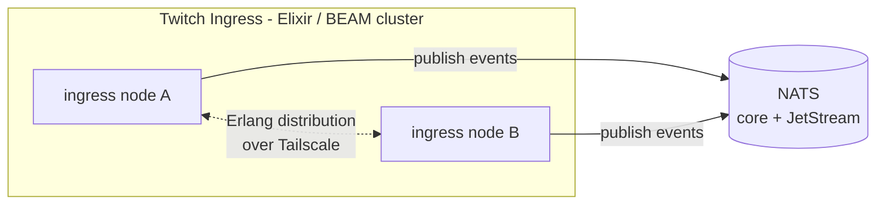
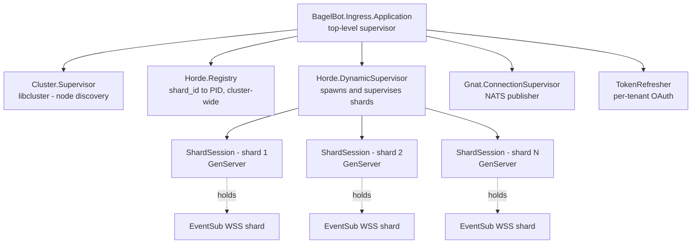

The Twitch Ingress holds the WebSocket shards of a single Twitch **EventSub Conduit**, keeps them alive across
resets, filters incoming payloads, and pushes the survivors onto the NATS bus as normalized events. It is the only
service in the system written in **Elixir on the BEAM VM**; the rest is Go.

The language choice is justified in [ADR 0006](/adr/0006-adoption-of-elixir-for-twitch-ingress/). The communication
substrate (NATS) it sits behind is justified in
[ADR 0003](/adr/0003-adoption-of-nats-as-communication-bridge/). The hardware it runs on is described in
[ADR 0004](/adr/0004-adoption-of-oracle-cloud/).

## Responsibilities

- Maintain a **Twitch EventSub Conduit** comprising a small fleet of WebSocket shards. Twitch routes events across
  the shards on its side; we only have to keep them connected.
- Keep each shard's WebSocket alive: handle the `session_welcome` / `reconnect` dance, reconnect with backoff on
  close or reset, restart a single shard in isolation when it fails.
- Refresh per-tenant OAuth tokens before expiry and re-authenticate when tokens roll over.
- **Filter** incoming Twitch payloads and publish the survivors to NATS as normalized events. Chat messages have
  exactly three outcomes: messages from the special user IDs (secret-store list) always go to the **premium lane**;
  messages starting with `!` go to the lane matching the **broadcaster's** status (premium or standard); everything
  else is dropped.
- Resolve broadcaster status over **NATS request-reply** from the service that owns broadcaster data (the ingress
  never reads MySQL directly), behind an in-process read-through cache evicted by invalidation keys on NATS.
- Distribute shard ownership across ingress replicas in the BEAM cluster so that exactly one node owns each shard's
  WSS at any time, with re-assignment in seconds when a node leaves.

What this service does **not** do: process commands of any kind (chat commands or operator commands), persistence,
business logic, rate-limit accounting. Anything that needs to react to events lives in Go services downstream and
subscribes to the NATS subjects this service publishes.

## External shape

Ingress nodes form a single BEAM cluster over Erlang distribution. The distribution port is reachable only inside
the tailnet from [ADR 0004](/adr/0004-adoption-of-oracle-cloud/); no public port is exposed. The only thing leaving
the cluster is published NATS messages.

## Internal shape (OTP supervision tree)

- **`BagelBot.Ingress.Application`** is the top-level supervisor. Restart strategy: `:one_for_one`.
- **`Cluster.Supervisor` (libcluster)** discovers peer nodes and triggers `Node.connect/1` against them. EPMD
  strategy in production, with the peer list passed via config.
- **`Horde.Registry`** is a CRDT-backed, cluster-wide registry. Each shard is registered under a key like
  `{:shard, shard_id}`. Cross-node process lookup is a `Horde.Registry.lookup/2` call.
- **`Horde.DynamicSupervisor`** spawns shards and re-assigns them to surviving nodes on node loss.
- **`ShardSession`** is a `GenServer` per shard. It owns one WebSocket, drives the EventSub protocol state machine,
  runs the filter on each incoming payload, and publishes survivors to NATS.
- **`Gnat.ConnectionSupervisor`** owns the NATS connection pool (Gnat is the Elixir NATS client). The ingress only
  publishes; it does not subscribe.
- **`TokenRefresher`** is one process per tenant. It holds the current OAuth refresh token, schedules a refresh
  ahead of expiry, and notifies shards when a new access token is available.

The filter itself is a pure function module (no state, no supervisor child). Each `ShardSession` calls it inline
before deciding whether to publish.

### Restart strategies

| Process                         | Strategy        | Notes                                                                                |
|---------------------------------|-----------------|--------------------------------------------------------------------------------------|
| `Application`                   | `:one_for_one`  | A subsystem crash does not take down siblings.                                       |
| `Horde.DynamicSupervisor`       | `:one_for_one`  | One shard crashing only restarts that shard.                                         |
| `ShardSession`                  | `:transient`    | Normal shutdown (shard removed) does not restart; crash does, with backoff.          |
| `TokenRefresher`                | `:permanent`    | Always restart; without tokens the tenant cannot work.                               |
| `Gnat.ConnectionSupervisor`     | `:permanent`    | Always restart; ingress is useless without NATS.                                     |

Reconnect backoff inside a shard uses jittered exponential backoff capped at 60 seconds.

## Sharding and ownership

Twitch handles the routing of events across the Conduit's shards on its side; we do not pick which channel goes
where. What we own is keeping each shard's WebSocket connected and re-assigning that ownership across BEAM nodes
when the cluster changes.

The flow is:

1. At boot, the cluster reads the Conduit's shard count and ensures one `ShardSession` per shard exists in the
   cluster, started via `Horde.DynamicSupervisor.start_child` and registered in `Horde.Registry` under
   `{:shard, shard_id}`.
2. When a node leaves the cluster, `Horde` re-assigns its shards to surviving nodes. The new owner re-opens the
   WebSocket and re-registers it with Twitch via the EventSub API.
3. When a node joins, `Horde` may migrate some shards to it to rebalance.

We deliberately do **not** use NATS KV for this. The BEAM cluster's registry is authoritative, in-memory, and
updates synchronously across nodes. See [ADR 0006](/adr/0006-adoption-of-elixir-for-twitch-ingress/) for the
reasoning.

## NATS contracts

The ingress publishes events and status, issues request-reply calls for broadcaster status, and subscribes to one
subject: cache invalidation keys.

Subject prefixes:

- **`twitch.ingress.event.<lane>`**: outbound, normalized events the ingress publishes after filtering. Exactly
  three subjects: `premium` / `standard` (laned by broadcaster status) and `stream` (only stream online/offline
  events); the EventSub `type` travels in the payload, not the subject.
- **`twitch.ingress.status.*`**: outbound, lifecycle and health signals.
- **`bagel.rpc.broadcaster.status.get`**: request-reply, broadcaster status lookups against the owning Go service.
- **`bagel.cache.invalidate.broadcaster`**: inbound, evicts entries from the in-process broadcaster status cache.

### Outbound: events

| Subject                                      | Payload (JSON)                                                                                | Notes                                |
|----------------------------------------------|-----------------------------------------------------------------------------------------------|--------------------------------------|
| `twitch.ingress.event.premium`               | chat: `{type, lane, broadcaster_user_id, chatter_user_id, chatter_user_login, text, ts, msg_id}`; non-chat: EventSub payload as delivered by Twitch, plus `{type, lane, received_at, shard_id, msg_id}` | Premium broadcasters + special IDs.  |
| `twitch.ingress.event.standard`              | same shapes as premium                                                                        | Standard broadcasters, and events with no extractable broadcaster. |
| `twitch.ingress.event.stream`                | EventSub payload plus `{type, lane, received_at, shard_id, msg_id}`                           | **Only** `stream.online` / `stream.offline`, regardless of broadcaster status. |

Chat notices and every other subscribed EventSub type travel on the premium/standard subjects; consumers dispatch
on the payload's `type` field. Payloads carry `msg_id` so consumers can de-duplicate Twitch redeliveries.

### Outbound: status

| Subject                                      | Payload                                                                                       |
|----------------------------------------------|-----------------------------------------------------------------------------------------------|
| `twitch.ingress.status.shard.up`             | `{tenant, shard_id, node, since}`                                                             |
| `twitch.ingress.status.shard.down`           | `{tenant, shard_id, node, reason}`                                                            |
| `twitch.ingress.status.node.joined`          | `{node, version, ts}`                                                                         |
| `twitch.ingress.status.node.left`            | `{node, reason, ts}`                                                                          |

Status is a JetStream stream with short retention (10 minutes is enough for any observer to catch up).

## Configuration

Environment-driven. All values arrive as env vars and are read once at boot.

| Variable                       | Purpose                                                                  | Example                                     |
|--------------------------------|--------------------------------------------------------------------------|---------------------------------------------|
| `BAGELBOT_NODE_NAME`           | Erlang long-name of this node.                                           | `ingress-a@10.42.0.7`                       |
| `BAGELBOT_ERLANG_COOKIE`       | Shared cookie for distribution. Provided by the secret store.            | (opaque)                                    |
| `BAGELBOT_CLUSTER_HOSTS`       | Comma-separated peer long-names for libcluster EPMD strategy.            | `ingress-a@10.42.0.7,ingress-b@10.42.0.8`   |
| `NATS_URL`                     | NATS connection URL inside the VCN.                                      | `nats://nats.internal:4222`                 |
| `NATS_CREDS_FILE`              | Path to the NATS credentials file (JWT + nkey).                          | `/run/secrets/nats.creds`                   |
| `TWITCH_CLIENT_ID`             | App client ID for Twitch API calls.                                      | (opaque)                                    |
| `TWITCH_CLIENT_SECRET`         | App client secret.                                                       | (opaque)                                    |
| `TWITCH_CONDUIT_ID`            | The Conduit this ingress owns.                                           | `conduit_abc123`                            |
| `TWITCH_CONDUIT_SHARD_COUNT`   | Desired number of shards in the Conduit.                                 | `4`                                         |
| `TWITCH_EVENTSUB_WSS_URL`      | Twitch EventSub WebSocket endpoint. Pinned via config.                   | `wss://eventsub.wss.twitch.tv/ws`           |
| `TWITCH_SPECIAL_USER_IDS`      | Chatter IDs that always route to the premium lane. From the secret store. | `1001,1002`                                |
| `NATS_SUBJECT_LANE_PREMIUM`    | Premium lane subject (all event types).                                  | `twitch.ingress.event.premium`              |
| `NATS_SUBJECT_LANE_STANDARD`   | Standard lane subject (all event types).                                 | `twitch.ingress.event.standard`             |
| `NATS_SUBJECT_LANE_STREAM`     | Dedicated lane for stream.online / stream.offline events only.           | `twitch.ingress.event.stream`               |
| `NEW_RELIC_LICENSE_KEY`        | Enables New Relic monitoring; absent, the agent is a no-op.              | (opaque)                                    |
| `NEW_RELIC_APP_NAME`           | New Relic application name.                                              | `itsbagelbot-twitch-ingress`                |
| `NATS_BROADCASTER_STATUS_SUBJECT` | Request-reply subject for broadcaster status lookups.                 | `bagel.rpc.broadcaster.status.get`          |
| `NATS_CACHE_INVALIDATION_SUBJECT` | Subject carrying broadcaster cache invalidation keys.                 | `bagel.cache.invalidate.broadcaster`        |
| `BROADCASTER_CACHE_TTL_SECONDS`| TTL of the in-process broadcaster status cache.                          | `300`                                       |
| `LOG_LEVEL`                    | `debug` / `info` / `warn` / `error`.                                     | `info`                                      |
| `OTEL_EXPORTER_OTLP_ENDPOINT`  | Optional OTLP target for traces and metrics.                             | `http://otel-collector:4318`                |

Per-tenant credentials (OAuth refresh tokens, EventSub subscription configuration) come from the relational database
described in [ADR 0005](/adr/0005-adoption-of-mysql-heatwave/).

## Deployment

- **Architecture:** `linux/arm64` primary (Oracle ARM node), `linux/amd64` available for emergency runs on the
  DigitalOcean droplet. Container images are multi-arch.
- **Runtime:** OTP 27+, Elixir 1.17+. Released as a Mix release (`mix release`), running on a `distroless` Erlang
  base image.
- **Process model:** one container per node. The BEAM is the concurrency runtime; we do not run multiple BEAM VMs
  per pod.
- **Networking:** Erlang distribution binds to the Tailscale interface only. EPMD bound to the same address. No
  public port. NATS is reached over the internal VCN.
- **Health checks:**
  - Liveness: a small HTTP endpoint on localhost that confirms the application supervisor is alive.
  - Readiness: `Gnat.ping/1` to NATS plus `Node.list/0` containing at least one peer when scaled beyond one node.
- **Rolling updates:** one node at a time. `SIGTERM` triggers `:init.stop/0`, which runs Application stop callbacks
  and lets Horde drain shards to surviving nodes before exit.

## Observability

- **Logs:** JSON to stdout, structured via `Logger` with metadata. Fields: `tenant`, `shard_id`, `node`, `event`.
- **Metrics:** Telemetry events emitted by Gnat, Horde, and our own `:telemetry.execute/3` calls. Exported via the
  OpenTelemetry SDK to the collector at `OTEL_EXPORTER_OTLP_ENDPOINT`.
- **Traces:** Each shard's payload-handling path opens a span; outbound NATS publishes carry the trace context as a
  header so downstream Go services see continuity.
- **Key metrics:**
  - `ingress.shard.count{state}` (gauge): live shards by state (`connected`, `reconnecting`).
  - `ingress.shard.reconnects_total` (counter): reconnect attempts; sustained spikes flag a Twitch outage.
  - `ingress.filter.dropped_total{reason}` (counter): events dropped by the filter, by reason.
  - `ingress.nats.publish_latency_ms{subject}` (histogram).
  - `ingress.token.refreshes_total{tenant, outcome}` (counter).
  - `ingress.cluster.members` (gauge): nodes in `Node.list/0`.

## Failure modes and how the service responds

| Failure                                            | What happens                                                                                                  |
|----------------------------------------------------|---------------------------------------------------------------------------------------------------------------|
| A shard's WebSocket drops                          | `ShardSession` traps the close, restarts via supervisor, reconnects with backoff. Sibling shards untouched.   |
| Twitch returns 401 on a shard                      | Shard asks `TokenRefresher` for a fresh token; on success it re-authenticates, on failure it crashes and is restarted by the supervisor. |
| One ingress node dies                              | `Horde` re-assigns its shards to surviving nodes. New owners re-open WebSockets and re-register them with Twitch. Status events emitted. |
| NATS unreachable                                   | `Gnat.ConnectionSupervisor` reconnects. Outbound events are buffered (bounded) and dropped on overflow with a warn-level log; we prefer drop over unbounded memory growth. |
| Erlang distribution partitions                     | Each side becomes its own quorum-less cluster. Horde may end up with split ownership; on heal, CRDT merge resolves to one owner and the loser shuts down its shards cleanly. |
| Single bad message format from Twitch              | Shard crashes, supervisor restarts, Twitch will resend through the Conduit. No retry storm on bad payloads.   |

## References

- [ADR 0001](/adr/0001-rewriting-to-microservices/): the rewrite to microservices, originally surfaced the Twitch
  zombie-socket problem this service exists to solve.
- [ADR 0003](/adr/0003-adoption-of-nats-as-communication-bridge/): NATS as the communication substrate; defines the
  subject space this service publishes into.
- [ADR 0004](/adr/0004-adoption-of-oracle-cloud/): the fleet this service runs on, including the tailnet that BEAM
  distribution rides over.
- [ADR 0005](/adr/0005-adoption-of-mysql-heatwave/): the database that holds per-tenant Twitch credentials.
- [ADR 0006](/adr/0006-adoption-of-elixir-for-twitch-ingress/): the language and runtime choice for this service.
