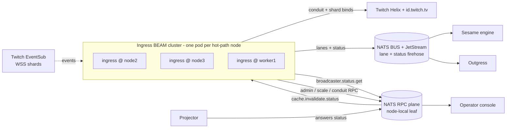
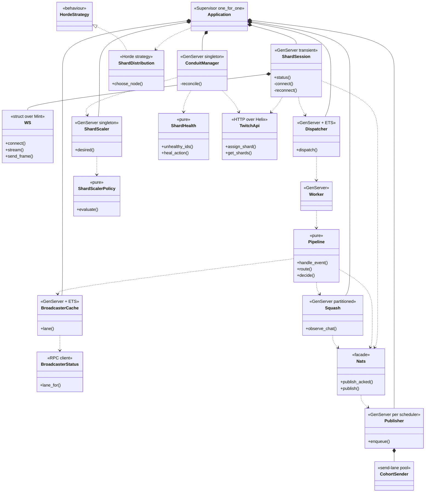
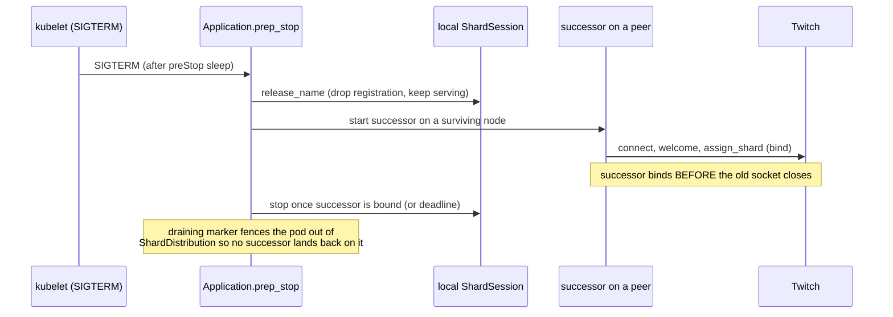
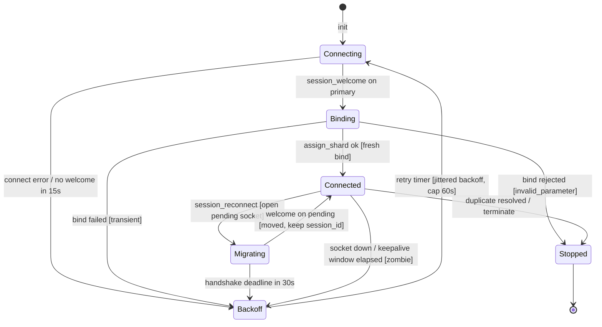
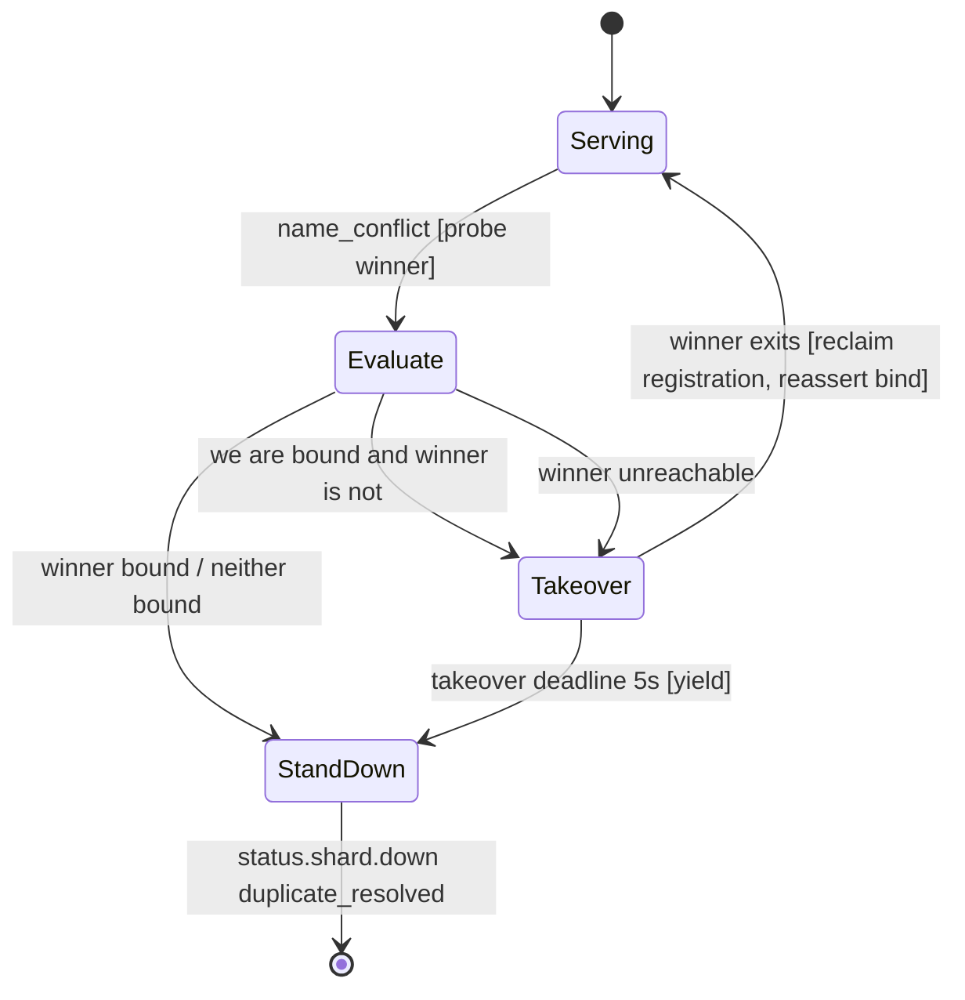

Twitch Ingress holds the WebSocket shards of a single Twitch **EventSub Conduit**, keeps them alive across
resets and reconnect handshakes, folds and lanes each event, and publishes the result onto the NATS bus. It is
the only service in the platform written in **Elixir on the BEAM VM**; every other service is Go.

The language and runtime choice is argued in
[ADR 0006](/adr/0006-adoption-of-elixir-for-twitch-ingress/): a fleet of long-lived, independently supervised
WebSocket sessions with fine-grained failure isolation is exactly what OTP is for. The communication substrate it
publishes into is [ADR 0003](/adr/0003-adoption-of-nats-as-communication-bridge/), and the reason it asks a peer
service for broadcaster status over NATS rather than reading a database is the data-ownership rule in
[ADR 0007](/adr/0007-adoption-of-per-schema-data-microservices/). The zombie-socket problem this service exists to
solve was first surfaced in [ADR 0001](/adr/0001-rewriting-to-microservices/).

## Responsibilities

- Own one **EventSub Conduit** on Twitch and keep exactly one live WebSocket per shard. Twitch load-balances
  subscriptions across the Conduit's shards on its side; we keep the sockets connected and bound.
- Drive the EventSub session protocol per shard: the `session_welcome` and Helix bind on a fresh connect, the
  keepalive watchdog that tears down a silent socket, and the make-before-break `session_reconnect` handshake.
- Reconcile the Conduit against Twitch (create it, resize it, heal dead shard slots) from a cluster-singleton, and
  autoscale the shard count from measured load.
- Distribute shard ownership across the BEAM cluster so exactly one node owns each shard, and re-home shards to
  survivors in seconds when a node leaves.
- Fold and lane each event: route by broadcaster status (premium or standard), dual-publish live events, squash
  identical plain chat into sender cohorts, and publish everything onto NATS.
- Resolve broadcaster status over **NATS request-reply** from the service that owns it, behind an in-process
  read-through cache invalidated over NATS.

### What this service does not do

- **No commands and no business logic.** It never interprets a chat command or runs a module. It folds and lanes;
  the [Sesame](/microservices/sesame/) engine reacts.
- **No persistence and no database.** It owns no MySQL schema and uses no Valkey. All of its state is in memory
  (ETS, `persistent_term`, and the Horde CRDT registry). Broadcaster status comes over RPC, never from the database.
- **No per-user OAuth.** Keeping shards bound needs only the Twitch **app** access token (client-credentials
  grant). Per-broadcaster consent, enrollment, and go-live reconnection are [Outgress](/microservices/outgress/)'s
  job; ingress only forwards the `user.authorization.*` and revocation signals that drive them.
- **No rate-limit accounting.** Downstream consumers gate abuse by cooldown; ingress bounds itself with admission
  control and load shedding, not per-user quotas.

## External context



The pods form one BEAM cluster over Erlang distribution on the pod network (the kernel WireGuard mesh described in
[ADR 0004](/adr/0004-adoption-of-oracle-cloud/), not the tailnet). Two NATS planes leave the pod: a per-service
RPC account on the node-local leaf, and the shared BUS account dialed straight to the JetStream hub for the
firehose. Nothing else is exposed.

## Internal design

The process tree is a strict `:one_for_one` supervisor (`Ingress.Application`). Its children fall into four groups:
the cluster fabric (libcluster + Horde), the two NATS planes and the lane publisher pool, the hot-path pipeline
(dispatcher, squash, broadcaster cache, metrics), and the control-plane RPC consumers plus the singleton
bootstrapper. Shard sessions are not static children; they are spawned into a Horde dynamic supervisor so ownership
can move across nodes.



The hot path is deliberately split so no single process is a throughput bottleneck. A `ShardSession` does the least
possible work per frame: decode JSON, re-arm its watchdog, and hand the notification to `Ingress.Dispatcher`.
Admission is a lock-free ETS and atomics check performed on the shard's own scheduler, and accepted work goes
straight into one of a fixed pool of `Ingress.Dispatcher.Worker` mailboxes (the mailboxes are the queue; there is
no central event process). A worker runs `Ingress.Pipeline`, which reads the broadcaster lane, folds plain chat
through `Ingress.Squash`, and publishes through `Ingress.Nats`. Publishing is itself sharded: one
`Ingress.Nats.Publisher` and one BUS connection per online scheduler, each with its own asynchronous PubAck
collector.

### Supervision tree and restart strategies

| Process                       | Kind                          | Restart      | Notes                                                                 |
|-------------------------------|-------------------------------|--------------|-----------------------------------------------------------------------|
| `Ingress.Application`         | supervisor `:one_for_one`     | n/a          | A subsystem crash never takes down siblings.                          |
| `Cluster.Supervisor`          | libcluster                    | `:permanent` | Node discovery; strategy chosen by environment (see below).           |
| `Ingress.Registry`            | Horde registry                | `:permanent` | CRDT `{:shard, id}` and singleton registry, cluster-wide.             |
| `Ingress.ShardSupervisor`     | Horde dynamic supervisor      | `:permanent` | `process_redistribution: :passive`, `distribution_strategy: Ingress.ShardDistribution`. |
| `Ingress.ShardSession`        | GenServer                     | `:transient` | A crash restarts and heals via a fresh connect; a clean stop does not. |
| `Gnat.ConnectionSupervisor` (`:gnat`) | NATS connection       | `:permanent` | RPC plane, node-local leaf, `twitch_ingress` account.                 |
| `Gnat.ConnectionSupervisor` (`:gnat_bus`) | NATS connection   | `:permanent` | BUS plane, hub-direct, shared BUS account; status firehose.           |
| `Ingress.Nats.PublisherPool` | supervisor `:one_for_one`      | `:permanent` | N BUS connections plus N cohort collectors, one pair per scheduler.   |
| `Ingress.Dispatcher.Supervisor` | supervisor `:rest_for_one`  | `:permanent` | The dispatcher owns the admission table; the worker pool depends on it. |
| `Ingress.Squash.Pool`         | supervisor `:one_for_one`     | `:permanent` | One cohort owner per scheduler, partitioned by cohort key.            |
| `Ingress.BroadcasterCache`    | GenServer + ETS               | `:permanent` | Read-through lane cache over the status RPC.                          |
| `Ingress.Metrics`             | GenServer + ETS               | `:permanent` | Batches counters into New Relic once per flush.                       |
| `Ingress.Twitch.AppToken`     | GenServer                     | `:permanent` | Caches the Helix app access token.                                    |
| `Ingress.NatsFailback`        | GenServer                     | `:permanent` | Returns a displaced RPC connection to the same-node leaf.             |
| `Ingress.Bootstrapper`        | GenServer                     | `:permanent` | Ensures the two cluster singletons stay alive somewhere.              |

The cluster singletons, `Ingress.ShardScaler` and `Ingress.ConduitManager`, are not static children: they run under
`Ingress.ShardSupervisor` and are registered in `Ingress.Registry`, so Horde keeps at most one of each and fails it
over with the shards. `Ingress.Bootstrapper` runs on every node and guarantees at least one by probing a registered
singleton for **process liveness** (not a mailbox call, so a busy reconcile is never mistaken for dead) and
replacing one that stays unreachable across two ticks.

## Key flows

### A chat message, from Twitch frame to NATS

```mermaid
sequenceDiagram
    participant TW as Twitch WSS
    participant SS as ShardSession
    participant DP as Dispatcher
    participant WK as Worker
    participant PL as Pipeline
    participant BC as BroadcasterCache
    participant SQ as Squash
    participant PUB as Publisher (NATS)

    TW-)SS: notification channel.chat.message
    SS->>SS: JSON.decode, pet_watchdog
    SS->>DP: dispatch(payload, meta)
    DP->>DP: admit [under capacity and per-broadcaster cap]
    DP-)WK: send to worker mailbox
    WK->>PL: handle_event(payload, meta)
    PL->>PL: size guard [text within limit]
    PL->>PL: decide(text, chatter, special_ids)
    BC-->>PL: lane(broadcaster) [ETS hit, else RPC]
    alt special user
        PL-)PUB: publish_acked premium
    else command (starts with !)
        PL-)PUB: publish_acked broadcaster lane
    else plain chat, first in window
        SQ-->>PL: observe_chat = :first
        PL-)PUB: publish_acked broadcaster lane
    else plain chat, duplicate
        SQ-->>PL: observe_chat = :buffered
        Note over SQ: fold sender into cohort;<br/>flush window publishes senders array
    end
    PUB--)PL: PubAck reconciled asynchronously
```

`Ingress.Pipeline.route/2` is the single decision point. Chat has three outcomes: a **special user** (a Twitch id
from the secret list) always goes premium; a **command** (text trimmed then starting with `!`) goes to the
broadcaster's own lane and is never folded, because a repeated command is a legitimate second invocation the worker
gates by cooldown; **plain chat** goes to the broadcaster's lane and is squash-folded. A banned broadcaster
(`lane == :drop`) is discarded. Non-chat events ride the premium or standard lane by broadcaster status and default
to standard when no broadcaster is extractable. Every payload carries its EventSub `type`, so consumers dispatch on
the payload, not the subject.

### A shard reconnect (session_reconnect move)

```mermaid
sequenceDiagram
    participant TW as Twitch
    participant SS as ShardSession
    participant P1 as primary socket
    participant P2 as pending socket

    TW-)P1: session_reconnect(reconnect_url)
    SS->>P2: WS.connect(reconnect_url)
    Note over SS: arm handshake_deadline (30s);<br/>primary keeps delivering events
    TW-)P1: events (still flowing)
    TW-)P2: session_welcome
    SS->>P1: WS.close (old socket)
    SS->>SS: promote pending, keep session_id (no re-bind)
    SS-)NATS: status.shard.bound kind=moved
    Note over SS: if handshake_deadline fires first,<br/>fall back to full fresh reconnect (re-bind)
```

A reconnect is never skipped or shortcut. The replacement socket is opened while the old one keeps serving, and the
old socket is closed only after the new one's `session_welcome`. The session id is preserved, so no Helix re-bind is
needed and no events are dropped in the gap.

### Node loss and shard re-assignment

```mermaid
sequenceDiagram
    participant N1 as ingress @ node A (dying)
    participant HD as Horde ShardSupervisor
    participant N2 as ingress @ node B
    participant TW as Twitch Helix
    participant NATS as NATS

    N1--xHD: node down (no drain)
    HD->>HD: ShardDistribution.choose_node [alive, not draining]
    HD->>N2: start ShardSession for the orphaned shard
    N2->>TW: connect, session_welcome
    N2->>TW: assign_shard (Helix PATCH bind)
    Note over N2,TW: the last successful PATCH is authoritative;<br/>Twitch routes the shard to whoever bound last
    N2-)NATS: status.shard.up + status.shard.bound kind=fresh
    Note over HD: ConduitManager health pass is the floor<br/>for any slot Horde could not re-home
```

An unplanned death (crash, OOM, node loss) skips the drain path entirely. Horde re-places the shard with
`Ingress.ShardDistribution` (round-robin by shard id over alive, non-draining members), the new owner does a full
fresh connect and Helix bind, and Twitch's routing follows that bind. The `ConduitManager` health pass, which polls
Twitch's per-shard view every reconcile tick, is the backstop for anything Horde could not re-home on its own.

### Rollout drain (make-before-break)



On SIGTERM, `Ingress.Drain` hands every local shard to a surviving node before the local socket closes: it releases
the cluster registration (so a successor can take the name without a conflict), starts the successor on a peer,
waits for it to bind, then stops the old session. A `{:draining, node}` marker keeps `ShardDistribution` from
placing the successor back on the dying pod. Every failure path degrades to "keep serving until the tree stops."

## State machines

### Shard session lifecycle

Each `ShardSession` is a state machine over the EventSub protocol. The state a snapshot reports (`derive_state/1`)
is one of `backoff`, `connecting`, `binding`, `connected`, or `migrating`.



- **Connecting.** `WS.connect/2` opens the socket and a 15s `welcome_deadline` arms. If the deadline fires with no
  `session_id` yet, or the connect errors, the session enters **Backoff**.
- **Binding.** On `session_welcome` from a fresh primary socket, the session records `session_id` and
  `keepalive_timeout_seconds`, then calls `Api.assign_shard/3` (the Helix `PATCH /eventsub/conduits/shards`). Twitch
  routes nothing to the shard until this bind succeeds.
- **Connected.** On a successful bind, `bound?` becomes true, `status.shard.up` and `status.shard.bound` (kind
  `fresh`) publish, and the keepalive watchdog arms. Every inbound frame pets the watchdog. If neither an event nor
  a `session_keepalive` arrives within `keepalive_timeout_seconds` plus a 5s grace, the socket is a **zombie**: it
  is torn down and the session re-enters Backoff.
- **Migrating.** A `session_reconnect` opens a second socket to `reconnect_url` and arms a 30s handshake deadline
  while the primary keeps serving. The pending socket's `session_welcome` promotes it (kind `moved`, session id
  preserved, no re-bind). If the deadline fires first, the session falls back to a full fresh reconnect.
- **Backoff.** `schedule_retry/1` waits `min(1000 * 2^min(attempts-1,6), 60000)` milliseconds plus up to 1s of
  jitter, then returns to Connecting.
- **Stopped.** A bind rejected as permanent (`invalid_parameter`, meaning the shard id is past the Conduit's shard
  count after a scale-down), a duplicate that stood down, or a `terminate` ends the session for good. Because the
  restart strategy is `:transient`, a clean stop is not restarted; the reconciler owns re-creation if the slot is
  still wanted.

### Duplicate-shard resolution after a netsplit heal

When a partition heals, both halves may be running the same shard. The Horde registry keeps one registration and
signals the other with a `:name_conflict` exit (the session traps exits, so it arrives as a message). The registry's
pick is arbitrary; ours is not. Because **the last successful Helix bind is authoritative** and Twitch routes to
whichever socket bound last, the copy that is actually serving (bound) wins, regardless of which one the registry
kept.



- **StandDown.** If the winner is bound (or neither copy is), this copy asks the winner to reassert its binding (so
  Twitch's routing follows the survivor), publishes `status.shard.down` with reason `duplicate_resolved`, and stops
  cleanly.
- **Takeover.** If we are the bound copy and the registry picked an unbound (or unreachable) one, we tell it to
  stand down, monitor it, and arm a 5s deadline. When it exits we reclaim the registration and reassert our bind. If
  the deadline fires first (the pick may have bound in the meantime), we yield and stand down rather than fight.

This is the same guard machinery that closes the orphan-shard bind-loop: a copy re-registered directly by a
takeover is not tracked by the Horde dynamic supervisor, so `ConduitManager` stops such an orphan with
`GenServer.stop` during a scale-down instead of letting it bind-loop against a Conduit that no longer has a slot for
it.

## Sharding, scaling, and self-healing

Twitch owns broadcaster-to-shard placement; we own how many shards exist and which node runs each one.

**Ownership.** `Ingress.ShardDistribution` places shard sessions round-robin by shard id across alive members
sorted by node name, so five shards on two nodes split 3/2 rather than the default hash ring's 4/1. Placement is
deterministic given the membership, and the Horde supervisor runs `process_redistribution: :passive`: a moved shard
only relocates when its node dies, never to rebalance on a join. Rebalancing on join would stop-then-start a shard
on every membership change (a 2 to 5 second event gap per moved shard) and race the drain handoff during rollouts.

**Desired count.** `Ingress.ShardScaler` is a cluster singleton that owns the target count. The manual floor never
falls below `min_shards` (one per BEAM node, so the floor tracks the fleet size automatically) and never exceeds
`max_shards`. `Ingress.ConduitManager` reads the scaler's live answer, resizes the Conduit on Twitch when the
desired count changes, then converges the running sessions to match.

**Autoscaler.** When enabled (the default), the scaler samples aggregate load across shards every 30 seconds
(notifications received in the last 60 seconds, collected from each session). Twitch load-balances across enabled
shards, so aggregate load is the signal: the needed count is `ceil(aggregate / budget)`, where the budget is the
per-shard WebSocket rating times the target utilization. Ratings are measured, not guessed (see
`Ingress.Capacity` and the WebSocket shard benchmark): the per-socket rating is **16,000 events/s**, the operating
target at 75 percent is **12,000 events/s per shard**, and the shared NATS ceiling is **123,000 events/s**, which
caps the useful shard count at `ceil(123000 / 12000)` = **11**.

| Condition                                              | Decision                                            |
|--------------------------------------------------------|-----------------------------------------------------|
| needed > target for 2 consecutive ticks                | scale up: jump target straight to needed            |
| aggregate load exceeds the fleet's full rating         | scale up immediately, no tick wait                  |
| needed < target for 3 consecutive ticks (full sample)  | scale down one shard                                |
| otherwise, or sample incomplete                        | hold                                                |

Hysteresis (2 ticks up, 3 down) keeps a brief lull from mass-removing capacity a returning spike would need back. A
single shard carrying a disproportionate share of load is flagged as **concentration** (a hot broadcaster Twitch has
pinned to one shard) but never changes a scaling decision, because more shards cannot move an already-placed
broadcaster.

**Self-healing.** Twitch silently drops events routed to a shard slot whose transport is not `enabled`, and a slot
can die without any local process noticing (the socket keeps receiving keepalives after the binding moved). So every
reconcile tick reads Twitch's per-shard snapshot once and uses it twice: to gate shard starts (never start into a
slot Twitch reports served, which is how rolling deploys used to spawn duplicates) and to repair every slot Twitch
reports unhealthy. `Ingress.ShardHealth` decides: `:skip` while a session is still settling, `:force_rebind` when a
session claims a settled binding Twitch says is dead, `:restart` when nothing answers or a slot stays unhealthy past
two ticks. When a slot cannot even be replaced in place (registration or supervision wedged on a dead pid), an
**unnamed rescue session** is started; it binds the shard on Twitch and serves until a named session can take over.

## NATS contracts

Ingress runs two NATS planes on two accounts (per-account isolation). The **RPC plane** (`:gnat`, the
`twitch_ingress` account) stays on the node-local leaf and carries request-reply. The **BUS plane** (the shared BUS
account) dials the hub directly and carries the `twitch.ingress.*` firehose captured by the hub's JetStream streams;
the status-plane connection is `:gnat_bus`, and `Ingress.Nats.PublisherPool` opens further hub connections for the
acked lane firehose.

### Published: lane events (BUS plane, JetStream, acked)

Lane events go through `Ingress.Nats.publish_acked/2`: the publish returns once the event is on the wire and its
PubAck is awaited asynchronously, bounded by an in-flight window per shard.

| Subject                          | When                                            | Payload (JSON)                                                                                              |
|----------------------------------|-------------------------------------------------|------------------------------------------------------------------------------------------------------------|
| `twitch.ingress.event.premium`   | premium broadcasters and all special users      | chat: `{type, lane, broadcaster_user_id, broadcaster_user_login, broadcaster_user_name, chatter_user_id, chatter_user_login, chatter_user_name, text, badges, msg_id, shard_id, ts}` |
| `twitch.ingress.event.standard`  | standard broadcasters, and no-broadcaster events | same shapes as premium                                                                                     |
| `twitch.ingress.event.stream`    | `stream.online` / `stream.offline` only          | `{type, lane, event, shard_id, msg_id, received_at}`                                                       |

Non-chat events carry `{type, lane, event, shard_id, msg_id, received_at}`. A squash cohort is a
`channel.chat.message` carrying only the duplicate senders: `{type, lane, broadcaster_user_id,
broadcaster_user_login, text, msg_id, senders, count, distinct_users}`, where `senders` is the array of folded
`{chatter_user_id, chatter_user_login, msg_id, ts, badges}`. Live events are **dual-published**: every
`stream.online` / `stream.offline` rides the stream lane unconditionally and the broadcaster's own lane (unless
banned), so a consumer draining chat also sees the channel go live.

### Published: status and authz (BUS plane, fire-and-forget)

Status and telemetry use `Ingress.Nats.publish/2`, a fire-and-forget core publish that drops into batched counters
if the connection is down (we prefer drop over unbounded buffering).

| Subject                                     | Payload                                                                 |
|---------------------------------------------|-------------------------------------------------------------------------|
| `twitch.ingress.status.shard.up`            | `{shard_id, node, session_id, since}`                                   |
| `twitch.ingress.status.shard.bound`         | `{shard_id, node, session_id, kind, at}`; `kind` is `fresh` or `moved`  |
| `twitch.ingress.status.shard.down`          | `{shard_id, node, reason}`; `reason` is `reconnecting`, `duplicate_resolved`, or `terminating` |
| `twitch.ingress.status.authz.granted`       | `{user_id, user_login, at}` (user reconsented via the dashboard)        |
| `twitch.ingress.status.authz.revoked`       | `{user_id, user_login, at}` (Twitch invalidated the authorization)      |
| `twitch.ingress.status.authz.subrevoked`    | `{broadcaster_id, type, status, at}` (one subscription revoked)         |

### Consumed (RPC plane)

| Subject                          | Handler                    | Queue group           | Notes                                                     |
|----------------------------------|----------------------------|-----------------------|-----------------------------------------------------------|
| `bagel.cache.invalidate.status`  | `Ingress.CacheInvalidator` | none (broadcast)      | Deliberately no queue group so every replica evicts its own cache. Accepts `{broadcaster_id}`, `{all: true}`, or a bare id. |

### Request-reply served (RPC plane, queue group `twitch-ingress-admin`)

Any replica can answer, via the Horde registry, so exactly one replies per request.

| Subject                                 | Handler                | Request            | Reply                                             |
|-----------------------------------------|------------------------|--------------------|---------------------------------------------------|
| `twitch.ingress.admin.shards.get`       | `Ingress.AdminRpc`     | ignored            | full cluster + shard snapshot                     |
| `twitch.ingress.admin.shards.scale`     | `Ingress.ScaleRpc`     | `{count: N}`       | snapshot, or `{error}`                            |
| `twitch.ingress.admin.shards.autoscale` | `Ingress.AutoscaleRpc` | `{enabled: bool}`  | snapshot, or `{error}`                            |
| `bagel.rpc.ingress.conduit.get`         | `Ingress.ConduitRpc`   | `{}`               | `{conduit_id}`, or `{error}`                      |
| `bagel.rpc.health.ingress`              | `Ingress.HealthRpc`    | ignored            | `{"service":"ingress","ok":true}`                 |

### Request-reply issued (RPC plane, client)

| Subject                            | Caller                     | Request              | Reply                                                    |
|------------------------------------|----------------------------|----------------------|----------------------------------------------------------|
| `bagel.rpc.broadcaster.status.get` | `Ingress.BroadcasterStatus` | `{broadcaster_id}`  | `{tier}` and/or `{banned}`; `premium` maps to premium, `banned:true` to `:drop`, anything else to standard |

The broadcaster-status owner is a Go service (the [Projector](/microservices/projector/) that materializes settings
into a projection). Ingress never reads the database, per
[ADR 0007](/adr/0007-adoption-of-per-schema-data-microservices/). The lane firehose feeds
[Sesame](/microservices/sesame/); the authz status subjects feed [Outgress](/microservices/outgress/); the admin
snapshot feeds the [operator console](/microservices/console/).

The firehose streams are provisioned on the hub, not by ingress, so their retention and replica settings live with
the NATS config (the firehose lanes are single-replica). What ingress controls is the **publisher** discipline: an
in-flight window (`publish_max_pending`), a bounded attempt budget (`publish_attempts`), and a per-attempt PubAck
timeout (`publish_ack_timeout_ms`). Ingress deliberately does **not** attach `Nats-Msg-Id`: EventSub WebSocket
delivery is not replayed and the broker-side dedup index is a material ingest tax (removing it took the sustained
rating from 86k to 123k events/s). An ambiguous ack timeout is therefore **dropped, not retried**, preserving
at-most-once behavior; only a definite negative PubAck is retried.

## Data and state

Ingress owns no MySQL schema (it is not in the data-service set) and uses no Valkey. All state is in the BEAM:

- **Horde CRDT registry** (`Ingress.Registry`): cluster-wide `{:shard, id}` ownership, the two singleton
  registrations, and the transient `{:draining, node}` marker.
- **ETS tables**: the broadcaster lane cache, the dispatcher admission table (pod-wide and per-broadcaster
  counters), the squash generation keys (one table per partition), the metrics counters, and per-publisher pending
  PubAck rows.
- **`persistent_term`**: the hot-path snapshot (special ids, lane subjects, size guard), the dispatcher and squash
  partition contexts, and the publisher shard count and contexts, so the firehose reads them without a message or a
  lock.

## Configuration

Every operational value is read once at boot from an environment variable (`config/runtime.exs` plus the per-concern
`Ingress.Config.*` accessors).

### Cluster and release

| Variable                        | Purpose                                                                            | Default            |
|---------------------------------|------------------------------------------------------------------------------------|--------------------|
| `BAGELBOT_K8S_HEADLESS_SERVICE` | Set: libcluster uses the Kubernetes.DNS strategy against this headless service.     | (unset)            |
| `BAGELBOT_K8S_APP_NAME`         | Application name for the DNS strategy node names.                                   | `ingress`          |
| `BAGELBOT_CLUSTER_HOSTS`        | Set (and no headless service): EPMD strategy against these long names. Else Gossip. | (unset)            |
| `RELEASE_DISTRIBUTION`          | `name` for long-name distribution.                                                 | (set in manifest)  |
| `RELEASE_NODE`                  | This node's long name, `ingress@<pod-ip>`.                                          | (from `POD_IP`)    |
| `BAGELBOT_ERLANG_COOKIE` / `RELEASE_COOKIE` | Distribution cookie; from the secret store.                            | (opaque)           |
| `POD_IP` / `NODE_NAME`          | Pod IP for the node name; worker node name shown in the admin snapshot.            | (downward API)     |
| `ERL_FLAGS`                     | VM tuning; caps schedulers to the CPU limit (`+S 2:2 ...`) and pins dist ports.    | (set in manifest)  |

### Twitch and conduit

| Variable                     | Purpose                                                        | Default                                          |
|------------------------------|---------------------------------------------------------------|--------------------------------------------------|
| `TWITCH_CLIENT_ID` / `TWITCH_CLIENT_SECRET` | App credentials for the Helix app token.       | (required)                                       |
| `TWITCH_CONDUIT_ID`          | The Conduit to own; a shared contract with Outgress.          | (required in prod)                               |
| `TWITCH_CONDUIT_SHARD_COUNT` | Desired shard count (autoscaler floor at boot).               | `2`                                              |
| `TWITCH_CONDUIT_MAX_SHARDS`  | Hard ceiling on manual and automatic shard counts.            | `11`                                             |
| `TWITCH_EVENTSUB_WSS_URL`    | EventSub WebSocket endpoint.                                  | `wss://eventsub.wss.twitch.tv/ws?keepalive_timeout_seconds=30` |
| `TWITCH_SPECIAL_USER_IDS`    | Comma-separated chatter ids that always route premium.        | (empty)                                          |

### NATS connection and TLS

| Variable                       | Purpose                                                              | Default                                   |
|--------------------------------|---------------------------------------------------------------------|-------------------------------------------|
| `NATS_HOST` / `NATS_PORT`      | Fallback host and port for both planes.                             | `127.0.0.1` / `4222`                      |
| `NATS_LEAF_HOST`               | RPC-plane host (node-local leaf).                                   | (falls back to `NATS_HOST`)               |
| `NATS_HUB_HOST`                | BUS-plane host (hub-direct firehose).                              | (falls back to the leaf host)             |
| `NATS_CA_PEM`                  | Fleet CA (PEM) to verify the NATS server cert; enables TLS.        | (unset: plaintext, dev only)              |
| `NATS_USER` / `NATS_PASSWORD`  | Shared BUS account credentials.                                    | (opaque)                                  |
| `NATS_RPC_USER` / `NATS_RPC_PASSWORD` | `twitch_ingress` RPC account credentials.                   | (falls back to `NATS_USER`/`NATS_PASSWORD`) |
| `NATS_LOCAL_LEAF_HEALTH_URL`   | Health endpoint proving this node's leaf recovered, for failback.  | `http://nats-leaf-local:8222/healthz`     |
| `NATS_FAILBACK_INTERVAL_MS` / `NATS_FAILBACK_SUCCESSES` / `NATS_FAILBACK_PROBE_TIMEOUT_MS` | Failback cadence, streak, and probe timeout. | `30000` / `3` / `1000` |

### NATS subjects

| Variable                          | Purpose                                     | Default                                |
|-----------------------------------|---------------------------------------------|----------------------------------------|
| `NATS_SUBJECT_LANE_PREMIUM`       | Premium lane subject.                        | `twitch.ingress.event.premium`         |
| `NATS_SUBJECT_LANE_STANDARD`      | Standard lane subject.                       | `twitch.ingress.event.standard`        |
| `NATS_SUBJECT_LANE_STREAM`        | Live lane (stream.online/offline only).      | `twitch.ingress.event.stream`          |
| `NATS_BROADCASTER_STATUS_SUBJECT` | Broadcaster-status request-reply subject.    | `bagel.rpc.broadcaster.status.get`     |
| `NATS_CACHE_INVALIDATION_SUBJECT` | Lane-cache invalidation subject (status scope). | `bagel.cache.invalidate.status`     |
| `NATS_ADMIN_SUBJECT`              | Read-only shard snapshot RPC.                | `twitch.ingress.admin.shards.get`      |
| `NATS_SCALE_SUBJECT`              | Manual shard-count RPC.                       | `twitch.ingress.admin.shards.scale`    |
| `NATS_AUTOSCALE_SUBJECT`          | Autoscaler toggle RPC.                        | `twitch.ingress.admin.shards.autoscale`|
| `NATS_CONDUIT_SUBJECT`            | Live conduit-id RPC.                          | `bagel.rpc.ingress.conduit.get`        |
| `NATS_RPC_HEALTH_SUBJECT`         | Side-effect-free latency probe.               | `bagel.rpc.health.ingress`             |

### Pipeline, capacity, and cache

| Variable                                 | Purpose                                                     | Default                    |
|------------------------------------------|-------------------------------------------------------------|----------------------------|
| `INGRESS_CAPACITY_POD_RATED_EPS`         | Measured per-pod full-path capacity.                        | `140000`                   |
| `INGRESS_CAPACITY_NATS_RATED_EPS`        | Shared hub-direct PubAck ceiling.                           | `123000`                   |
| `INGRESS_CAPACITY_WEBSOCKET_RATED_EPS`   | Per-shard read/decode/enqueue rating.                       | `16000`                    |
| `INGRESS_CAPACITY_TARGET_UTILIZATION_PCT`| Autoscale and dashboard operating target.                   | `75`                       |
| `INGRESS_DISPATCHER_MAX_RUNNING`         | Fixed dispatch worker count.                                | `512`                      |
| `INGRESS_DISPATCHER_MAX_QUEUE`           | Total bounded worker-mailbox allowance.                     | `20000`                    |
| `INGRESS_DISPATCHER_MAX_PER_BROADCASTER` | Cap on one broadcaster's share of the dispatcher budget.    | `2048`                     |
| `INGRESS_DISPATCHER_COMPLETION_BATCH_SIZE` / `INGRESS_DISPATCHER_COMPLETION_FLUSH_MS` | Worker completion batch size and flush. | `4` / `25` |
| `INGRESS_SQUASH_PARTITIONS`              | Independent squash cohort owners.                           | online scheduler count     |
| `INGRESS_PUBLISH_CONNECTIONS`            | BUS connections and PubAck collectors.                      | online scheduler count     |
| `INGRESS_PUBLISH_MAX_PENDING`            | In-flight PubAck window per publisher shard.                | `16384`                    |
| `INGRESS_PUBLISH_BATCH_SIZE` / `INGRESS_PUBLISH_BATCH_WAIT_MS` | Scheduler-local cohort size and wait.  | `128` / `1`                |
| `INGRESS_PUBLISH_SEND_CONCURRENCY`       | Persistent Gnat send lanes per connection.                  | `22`                       |
| `INGRESS_PUBLISH_WIRE`                   | `single` (per-event PubAck) or `atomic` (ADR-050 batch commit). | `single`               |
| `INGRESS_PUBLISH_ACK_TIMEOUT_MS` / `INGRESS_PUBLISH_ATTEMPTS` | Per-attempt PubAck wait and total attempts. | `2000` / `3`           |
| `INGRESS_TRACE_SAMPLE_RATE`              | One in N notifications gets a transaction and trace headers. | `1024`                    |
| `BROADCASTER_STATUS_TIMEOUT_MS`          | Broadcaster-status RPC timeout.                             | `2000`                     |
| `BROADCASTER_CACHE_TTL_SECONDS`          | Lane cache TTL.                                             | `300`                      |

The chat size guard (oversized text is dropped) is fixed at 4096 bytes; a well-formed Twitch line is under 500.

### Observability

| Variable                  | Purpose                                                       | Default                       |
|---------------------------|---------------------------------------------------------------|-------------------------------|
| `NEW_RELIC_LICENSE_KEY`   | Enables the agent; absent, every instrumentation call is a no-op. | (empty)                   |
| `NEW_RELIC_APP_NAME`      | New Relic application name.                                    | `itsbagelbot-twitch-ingress`  |
| `NEW_RELIC_LOGS_IN_CONTEXT` | Log forwarding mode.                                        | `forwarder`                   |
| `LOG_LEVEL`               | Logger level (`debug`/`info`/`warn`/`error`).                 | (inherited)                   |

## Deployment

From `deploy/k8s/twitch-ingress.yaml`, delivered by Flux (digest-pinned images from GHCR, tag pattern
`main-<ts>-<sha>`) with secrets synced by the Doppler operator (`secrets.doppler.com/reload: "true"`).

- **Image.** A Mix release (`strip_beams`) built on `elixir:1.17-otp-27`, running on a `debian:trixie-slim` runtime
  with `libssl3` and `libncurses6`. OTP 27 is required for the native `:json` codec on the firehose. One BEAM node
  per container.
- **Placement.** `replicas: 3`, one per eligible hot-path node (node2, node3, worker1). `nodeAffinity` keeps
  ingress off node1, and a `topologySpreadConstraints` with `maxSkew: 1`, `DoNotSchedule`, and
  `matchLabelKeys: [pod-template-hash]` makes steady state exactly 1/1/1 and re-spreads on every rollout. The
  worker-pool taint is tolerated so worker1 is eligible.
- **Rollout.** `RollingUpdate` with `maxSurge: 0`, `maxUnavailable: 1`, and `minReadySeconds: 60`, so exactly one
  drain is in flight at a time and the Horde registry converges between swaps. A `PodDisruptionBudget` of
  `maxUnavailable: 1` protects voluntary disruptions. A `preStop` sleep of 10s plus a 45s termination grace bounds
  the make-before-break drain (worst case around 12s).
- **Probes.** Liveness and readiness both exec `/app/bin/ingress pid` (there is no HTTP server). Node readiness
  tolerations of 60s keep a brief `NotReady`/`unreachable` blip from evicting a pod prematurely.
- **NATS wiring.** The RPC plane dials the node-local leaf (`nats-leaf`); the BUS firehose dials the hub (`nats`,
  whose PreferSameNode routing lands each publisher on the co-located hub member). Both verify the server cert
  against the fleet CA (`NATS_CA_PEM` from the `fleet-ca` ConfigMap). There is no service mesh; NATS provides its
  own TLS.
- **Cluster formation.** A headless service (`twitch-ingress-headless`, `publishNotReadyAddresses: true`) resolves
  to pod IPs for the libcluster Kubernetes.DNS strategy. Distribution rides EPMD (4369) and a fixed dist port range
  (9100 to 9110) over the pod network.
- **Resources.** Requests 250m CPU / 256Mi; limits 2 CPU / 512Mi. `ERL_FLAGS` caps the VM to two schedulers to
  match the CPU budget, because the BEAM sizes schedulers from host CPUs, not the cgroup quota.

## Observability

New Relic via the official `new_relic_agent`; with `NEW_RELIC_LICENSE_KEY` unset the agent is disabled and every
call is a no-op, so dev and test run unchanged.

- **Counters** are public ETS increments drained into New Relic once per flush by `Ingress.Metrics`, so a firehose
  event never calls the agent directly. They land under `Custom/Ingress/*`: `Published/<lane>`, `Dropped`,
  `Squashed`, `Oversized`, `Cohorts/Emitted`, `Cohorts/Senders`, `Shard/Reconnects`, `Shard/ZombieTimeouts`,
  `Shard/SessionReconnects`, `Shard/ForcedRebinds`, `Shard/Revocations`, `Dispatcher/Dropped/<reason>`,
  `Cache/Loads`, `Cache/LoadErrors`, `Nats/PublishAcked`, `Nats/PublishRetried`, `Nats/PublishFailed`,
  `Nats/PublishOverloaded`, `Nats/PubAckLatency/<bucket>`, `Conduit/ShardRestarts`, `Conduit/ShardRescues`.
- **Lifecycle events** are reported immediately as the `IngressEvent` custom event (`ShardUp`, `ShardDown` with
  `shard_id`/`node`/`reason`, `ShardLoadConcentration`, `Nats/PublishInflight` gauges).
- **Traces.** A sampled one-in-`trace_sample_rate` notification runs inside a short New Relic transaction on the
  worker; spans cover route, encode, and publish-admit, and distributed-trace headers ride the sampled publish so
  downstream Go services see continuity. Full tracing at firehose rate is deliberately sparse.
- **Logs.** Structured `Logger` output with `shard_id` and `node` metadata; observability rationale is
  [ADR 0010](/adr/0010-adoption-of-new-relic-for-observability/).

## Failure modes and how the service responds

| Failure                                   | Response                                                                                                            |
|-------------------------------------------|--------------------------------------------------------------------------------------------------------------------|
| A shard's WebSocket drops                 | `socket_down` reconnects with jittered exponential backoff (cap 60s). Siblings untouched (`:one_for_one`).          |
| Silent socket (no frame in the window)    | The keepalive watchdog declares a zombie, tears the socket down, and reconnects. `Shard/ZombieTimeouts` counts it.  |
| `session_reconnect` from Twitch           | Open a replacement socket while the old one serves; promote on its welcome (kind `moved`). Handshake past 30s falls back to a fresh reconnect. |
| Helix bind rejected (`invalid_parameter`) | The shard id is past the Conduit's count (scale-down leftover); the session stops cleanly and is not restarted.     |
| Malformed Twitch frame                    | The session crashes; the supervisor restarts it and Twitch redelivers through the Conduit. No retry storm.          |
| Node loss (unplanned)                     | Horde re-homes shards to survivors; each does a fresh connect and Helix bind. The health pass is the floor.         |
| Netsplit heal, duplicate shard            | Health-based resolution: the bound copy keeps the shard and reasserts its bind; the redundant copy stands down with `duplicate_resolved`. |
| Twitch reports a slot unhealthy           | The reconciler forces a re-bind (if a session claims a stale binding) or replaces the session; a rescue session is the last resort. |
| Broadcaster-status RPC fails or times out | `BroadcasterCache` fails open to the standard lane and negative-caches for 5s, degrading lanes rather than dropping. |
| Ambiguous lane PubAck (timeout)           | Dropped, not retried (dedup-free, at-most-once). Only a definite negative PubAck retries, within the attempt budget. |
| Publisher in-flight window full           | The event is shed as `:overloaded` (`Nats/PublishOverloaded`) rather than buffered without bound.                   |
| NATS status connection down               | Fire-and-forget status publishes drop into batched counters; no per-event log, no unbounded buffer.                |
| RPC leaf displaced after recovery         | `Ingress.NatsFailback` moves the RPC connection back to the same-node leaf one connection at a time; the hub-direct BUS plane is left pinned. |

## Design notes

**GRASP.** `Ingress.ConduitManager` is the reconciliation **Controller**: it owns the "converge the Conduit" system
operation and delegates decisions to pure experts. `Ingress.ShardHealth` and `Ingress.ShardScaler.Policy` are
**Information Experts** over healing and scaling, kept as pure functions so they are trivially testable.
`Ingress.BroadcasterCache` is the expert on lane status. `Ingress.Squash`, `Ingress.Dispatcher`, and
`Ingress.Nats.Publisher` are **Pure Fabrications**: none is a domain concept, each exists to meet a throughput or
decoupling need. `Ingress.WS` (over `Mint.WebSocket`), `Ingress.JSON` (over OTP `:json`), and the `Ingress.Config.*`
accessors are **Protected Variations**, shielding callers from library and environment changes behind a stable
surface. **Low coupling** shows in the two-account, two-plane NATS split and the injected cache loader; **high
cohesion** in the per-concern config modules and the pure-policy split from the scaler process.

**GoF patterns.** `Ingress.ShardDistribution` is a **Strategy** realizing the `Horde.DistributionStrategy` behaviour
(pluggable placement), and the publish `wire` (`:single` vs `:atomic`) is a second strategy selection.
`Ingress.Nats.CohortSender` is an **Object Pool** of send-lane workers, and the dispatcher worker pool and publisher
pool are the same tactic. `ShardSession` is a **State** machine dispatched by message type. `Ingress.Nats` and
`Ingress.Twitch.Api` are **Facades** over Gnat and Helix; `Ingress.BroadcasterCache` is a read-through **Proxy**.

**Architecture tactics** (SEI/Bass): **heartbeat** (the keepalive watchdog and ping/pong), **ping/echo**
(`HealthRpc`, the bootstrapper liveness probe, the Twitch shard-health poll), **removal from service** (the
make-before-break drain, `stop_excess_shards`, duplicate stand-down), **sharding** (Conduit shards, squash
partitions, per-scheduler publishers, the worker pool), **rate limiting and queue-based load leveling** (dispatcher
admission with a per-broadcaster cap, bounded worker mailboxes, the publisher in-flight window), **active
redundancy** (Horde failover and rescue sessions), and **retry with bounded attempts** paired with at-most-once
**load shedding** on ambiguous acks.

## References

- [ADR 0001](/adr/0001-rewriting-to-microservices/): the microservices rewrite that surfaced the zombie-socket
  problem this service solves.
- [ADR 0003](/adr/0003-adoption-of-nats-as-communication-bridge/): the NATS substrate and subject space.
- [ADR 0004](/adr/0004-adoption-of-oracle-cloud/): the fleet and the WireGuard data plane this cluster runs on.
- [ADR 0006](/adr/0006-adoption-of-elixir-for-twitch-ingress/): the language and runtime choice.
- [ADR 0007](/adr/0007-adoption-of-per-schema-data-microservices/): why broadcaster status comes over RPC, never
  from the database.
- [ADR 0010](/adr/0010-adoption-of-new-relic-for-observability/): the observability stack.
- Related services: [Sesame](/microservices/sesame/) (consumes the lanes), [Outgress](/microservices/outgress/)
  (acts on authz and revocation), [Projector](/microservices/projector/) (answers broadcaster status), and the
  [operator console](/microservices/console/) (reads the admin snapshot).
