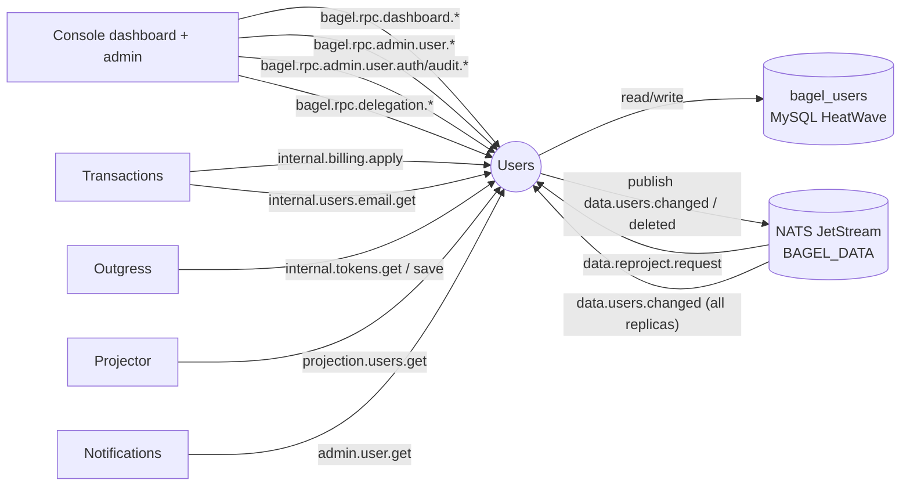
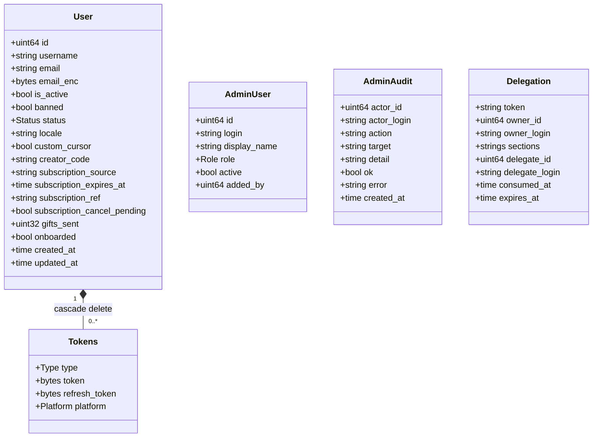
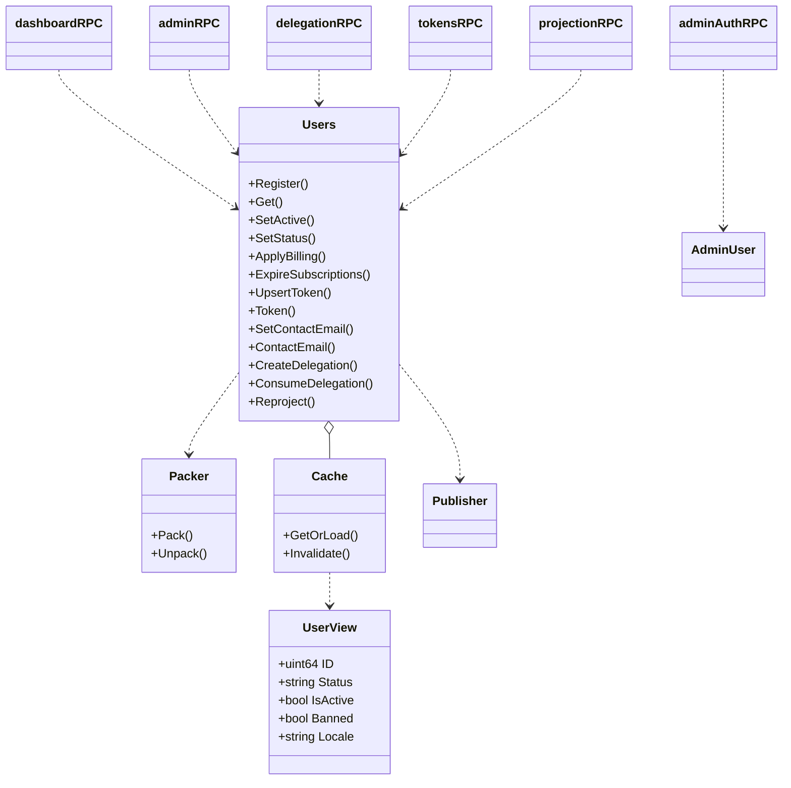
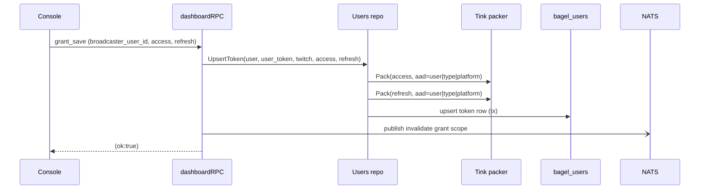
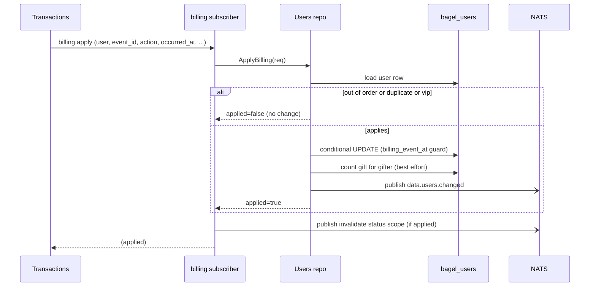
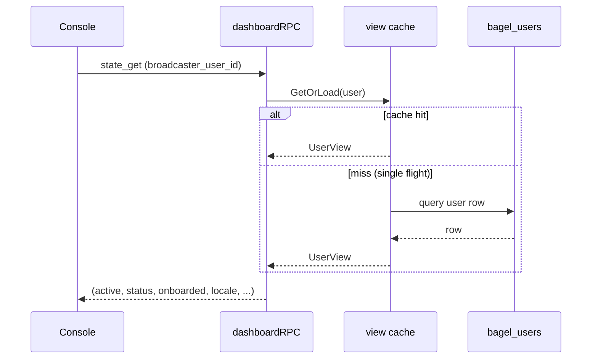
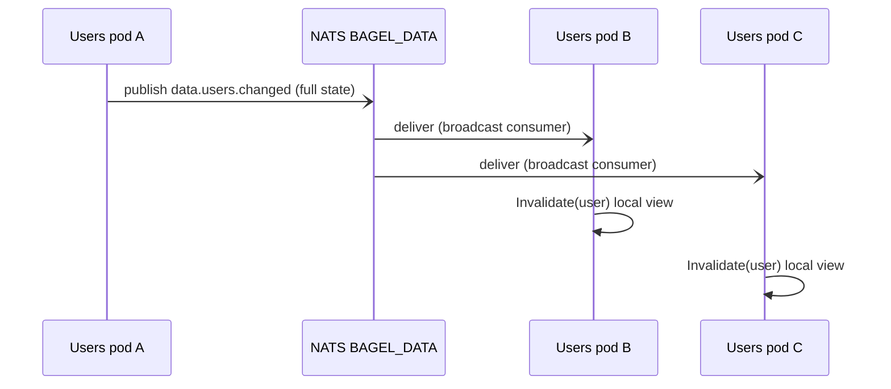
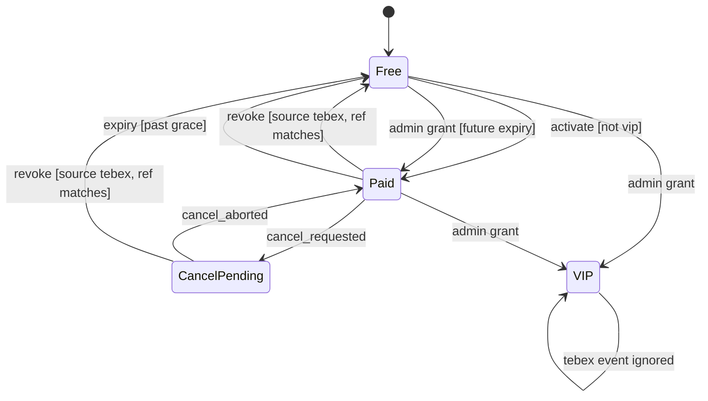
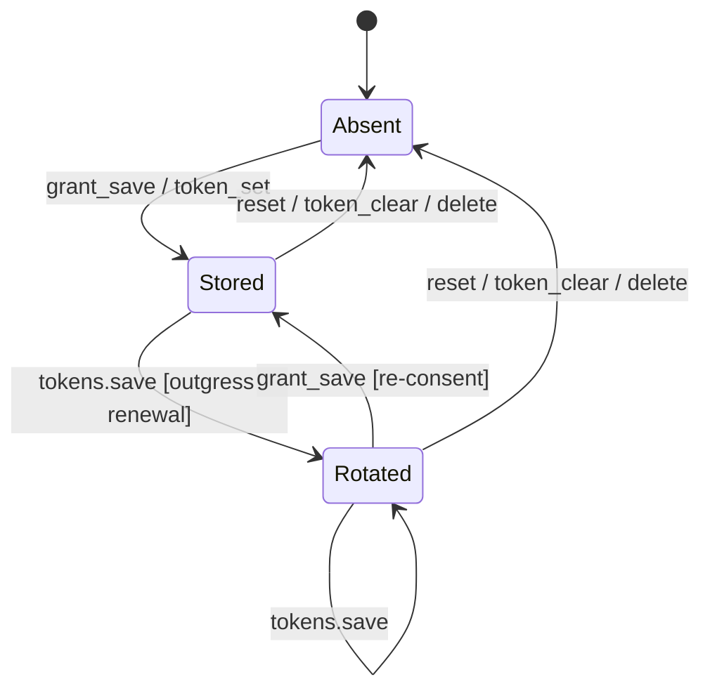
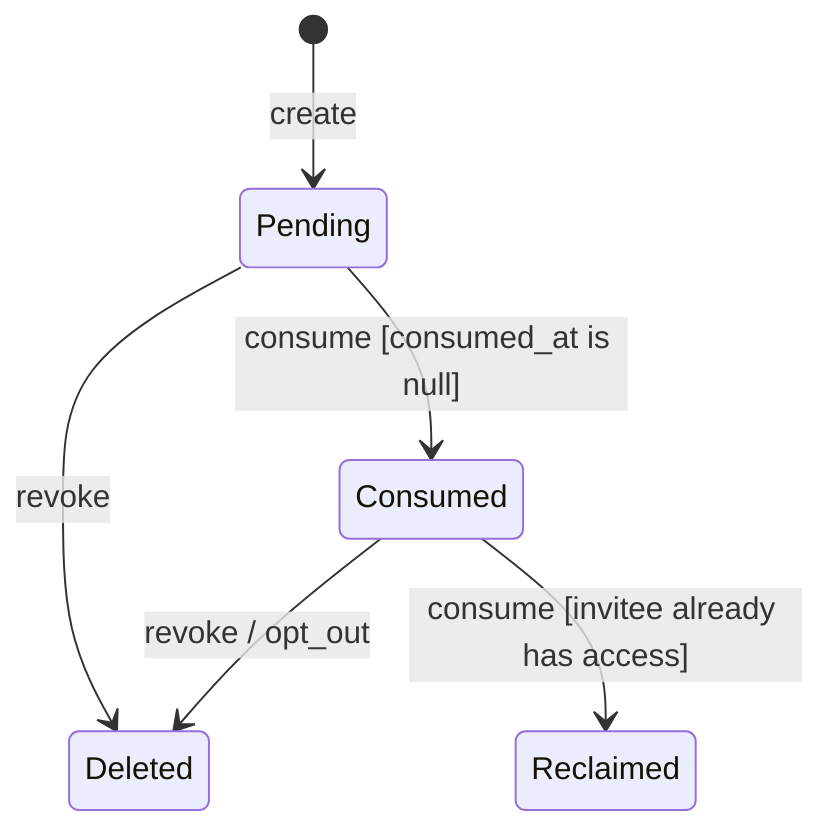

The Users service (`app/users/`) is the identity authority of ItsBagelBot. It owns the `bagel_users`
MySQL schema and is its only writer: every account, every encrypted Twitch OAuth token, the staff
allowlist that gates the admin console, and the single-use dashboard delegations all live here. Other
services never open this schema. They ask over NATS request-reply, and they learn about account changes
from the `data.users.*` events this service emits (event-carried state transfer, see
[ADR 0003](/adr/0003-adoption-of-nats-as-communication-bridge/) and
[ADR 0007](/adr/0007-adoption-of-per-schema-data-microservices/)).

Reads are billing- and auth-relevant, so the service leans on an in-process read-through cache with
stampede protection ([ADR 0008](/adr/0008-caching-and-write-behind-strategy/)) while writes go straight
to the database and announce themselves on the bus. The relational store is MySQL HeatWave
([ADR 0005](/adr/0005-adoption-of-mysql-heatwave/)).

## Responsibilities

- Own the user record: Twitch id as primary key, username, status tier (`free`, `paid`, `vip`), the
  receive toggle (`is_active`), the ban flag, console preferences (`locale`, `custom_cursor`), the public
  `creator_code`, and the billing/subscription columns.
- Custody the Twitch OAuth tokens as an encrypted vault. Tokens are sealed with a Tink AEAD keyset before
  they touch the database and are only ever handed back over export-scoped internal RPC subjects.
- Persist the broadcaster grant (`grant_save`) written by the console after a Twitch OAuth consent, and
  answer whether a grant is present (`grant_has`).
- Apply verified Tebex billing events onto the tier, idempotently and monotonically, on a private subject
  only the transactions service can reach.
- Back the admin console: the DB-backed staff roster (`moderator` / `admin` / `owner`) that replaces the
  old static env allowlist, plus an append-only audit log of every operator action.
- Serve the console's admin user-management surface (search, stats, enrollment histogram, status/ban/token
  operations) and the broadcaster self-serve dashboard surface.
- Mint and consume single-use dashboard delegations that grant a scoped subset of another owner's board.
- Capture a real contact email at login (encrypted at rest) and hand it, decrypted, to the internal
  callers that send transactional mail.
- Emit `data.users.changed` / `data.users.deleted` so the Valkey projection and every peer cache converge
  without reading this schema, and answer the projector's cold-start reproject.

### What this service does not do

- It does not talk to Twitch. Token refresh and Twitch API calls belong to outgress and sesame; this
  service only stores, rotates on request, and hands back tokens.
- It does not decide EventSub subscription state or handle revocation. A revoked authorization is detected
  and re-enrolled downstream (see [Sesame](/microservices/sesame/)); here a re-consent simply overwrites
  the stored grant row.
- It does not send email. It only unseals the address; [Transactions](/microservices/transactions/) owns
  the Resend send.
- It does not process payments. Tebex is the merchant of record and
  [Transactions](/microservices/transactions/) verifies the webhook; this service only applies the
  resulting entitlement.
- It does not read the Valkey projection or any other service's schema.

## External context

The service runs two NATS planes. The request-reply and cache-invalidation traffic rides the node-local
leaf on the service's per-service RPC account (`NATS_RPC_USER` / `NATS_RPC_PASSWORD`); the durable event
plane (the `BAGEL_DATA` JetStream stream) dials the hub directly on the shared `BUS` account. Users is the
declared owner of `BAGEL_DATA` and is the one credential allowed to reconcile it.

## Internal design

`main.go` is pure wiring. It reads the Tink keyset and opens the store, reconciles the `BAGEL_DATA`
stream, opens the RPC connection and the JetStream publisher, starts the two event-plane consumers and the
subscription-expiry ticker, binds every RPC surface, seeds the bootstrap staff, and serves the health
endpoint. The `Users` repository is the Information Expert: it is the only type that writes the schema, and
it fronts the database with an in-process `cache.Cache[UserView]` and the crypto packer.

Each RPC surface is a small controller struct bound in its own file (`dashboardRPC`, `adminRPC`,
`adminAuthRPC`, `tokensRPC`, `delegationRPC`, `projectionRPC`) plus the billing and email subscribers. They
share a `Wiring` bundle (the NATS connection, the repository, the New Relic app, the queue group, the
logger) so each subscriber only has to declare the subjects it owns. `adminAuthRPC` is the exception: it
holds the ent `Client` directly because staff and audit rows are not part of the cached user view.

### Persistence model

`User` composes `Tokens`: the edge is annotated `OnDelete: Cascade`, so deleting a user erases the token
rows with it (real composition, not aggregation). `Tokens` carries a unique index on `(type, platform,
user)`, so a user holds at most one token row per platform per type. `AdminUser`, `AdminAudit`, and
`Delegation` are standalone tables with no edges to `User`.

### Service composition

`Packer` is an interface (`internal/domain/crypto.Packer`), so the concrete Tink AEAD implementation
(`pkg/crypto`) is a Protected Variations seam: swapping the keyset backend never touches the repository.
`UserView` is the read model held in cache; it deliberately carries no secret field, so keeping it resident
is safe.

## Key flows

### OAuth grant save

The console runs the Twitch OAuth handshake (arctic). On a successful consent it calls `grant_save`, and
the service seals both tokens and upserts the single `user_token` row.

The associated data binds each ciphertext to `(userID, tokenType, platform)`, so a token row copied onto
another user fails to decrypt. `UpsertToken` runs inside a transaction and tolerates the create/update
race: a unique-constraint hit falls back to updating the existing row. `grant_has` answers the reverse
question (is a decryptable access token present) without returning the token itself.

### Applying a verified Tebex billing event

The transactions service verifies the Tebex webhook signature, then calls the private
`bagel.rpc.internal.billing.apply` subject. The users service is the sole tier authority.

Idempotency and ordering live in the repository, not in a webhook table: `billing_event_at` makes delivery
monotonic (an event older than the last one applied is dropped), an exact `(occurred_at, event_id)` match
re-announces the state so a lost change-event publish self-heals on Tebex's retry, VIP is terminal
(entitlement never revoked by Tebex), and a revoke is ignored unless the source is `tebex` and the
recurring reference matches. Gift activations bump the gifter's `gifts_sent` once, best-effort so a counter
failure never forces a re-apply.

### A dashboard read (state_get)

The console coalesces the account panel into one round trip. `state_get` loads the cached view once and
projects the receive toggle, tier, onboarding flag, preferences, and subscription fields together.

Concurrent misses on the same id collapse into one query (`GetOrLoad` is single-flight), so a burst of
dashboard loads for one broadcaster costs one database read.

### Cross-replica cache coherence

Every write publishes `data.users.changed` with the full new state. A groupless (broadcast) JetStream
consumer on every replica drops its local cached view for that user, so a change made on one pod is visible
on the others without any of them re-querying the writer.

## State machines

### Subscription and tier lifecycle

The `status` enum plus the subscription columns genuinely model a state machine, driven by `ApplyBilling`,
`SetAdminStatus`, and the expiry ticker.

- `Free to Paid` fires on a Tebex `activate` (`payment.completed`, `recurring-payment.started/renewed`, a
  started trial). Guard: the row is not already VIP. Source is set to `tebex`, and an activation with no
  expiry defaults to one month.
- `Paid to CancelPending` fires on `cancel_requested` (or a cancelled trial): the entitlement stays live
  but `subscription_cancel_pending` is set, so the UI can show the pending cancellation.
- `CancelPending to Paid` fires on `cancel_aborted` (or a won dispute), clearing the pending flag.
- `to Free (revoke)` fires on `recurring-payment.ended`, `payment.refunded`, or a lost/opened dispute.
  Guard: the current source is `tebex` and, when the event carries a recurring reference, it matches the
  stored one, so a late event from an old subscription cannot revoke a newer grant.
- `to Free (expiry)` is the safety net for a terminal event that never arrives.
  `ExpireSubscriptions` runs each minute: operator (`admin`) grants expire exactly on time, Tebex grants
  get a 24 hour grace so a briefly delayed renewal webhook does not interrupt a paying customer.
- `to VIP (admin grant)` is a permanent operator grant. VIP is terminal on the Tebex path:
  `ApplyBilling` returns early for a VIP row, so no Tebex lifecycle event can demote it. An admin paid grant
  requires a future expiry and is marked `source=admin` so Tebex can never revoke it.

### OAuth grant custody

The token vault is a second genuine lifecycle. The users schema models custody (present, rotated, absent),
not grant health: a dead or revoked refresh token is detected downstream by outgress at renewal, and healed
here by a fresh grant that overwrites the row.

- `Absent to Stored` on `grant_save` (broadcaster consent) or the admin `token_set` (the bot account's own
  token; the user row is provisioned on first sight).
- `Stored to Rotated` when outgress refreshes the token and writes the rotated pair back through
  `internal.tokens.save`, so a restart never resurrects a stale token.
- `Rotated to Stored` on a fresh `grant_save`: a dead refresh token is repaired by re-consent, which
  overwrites the row. Outgress owns the death detection (see [Outgress](/microservices/outgress/)).
- `to Absent` on the admin `reset` / `token_clear` (delete the token rows) or a user/account `delete`
  (tokens cascade with the row).

### Delegation single-use lifecycle

A delegation link is minted by a dashboard owner and consumed exactly once on the invitee's login.

The atomic bind updates the row only while `consumed_at IS NULL`, so two concurrent racers cannot both win:
the loser sees zero affected rows and errors out. If the invitee already manages that owner's board, the
redundant link is discarded and the grant they already hold is returned (reclaim) instead of minting a
duplicate. Section edits are owner-scoped, so an invitee holding only the token can never re-scope a grant.

## NATS contracts

Every RPC handler subscribes in the queue group `users-rpc`, so any of the three replicas can answer and
load spreads across the fleet. The health responder answers `bagel.rpc.health.users`.

### Request-reply: dashboard (`bagel.rpc.dashboard.*`)

| Verb | Request | Reply | Notes |
|---|---|---|---|
| `upsert_user` | `{user_id, username, email?}` | `{ok}` | Register on first sight, refresh username on rename, best-effort contact-email capture. |
| `grant_save` | `{broadcaster_user_id, access_token, refresh_token}` | `{ok}` | Seals and upserts the `user_token`. |
| `grant_has` | `{broadcaster_user_id}` | `{has_grant}` | Presence check, no token returned. |
| `active_set` | `{broadcaster_user_id, active}` | `{ok}` | Flips the receive toggle. |
| `active_get` / `status_get` / `state_get` | `{broadcaster_user_id}` | view fields | `state_get` coalesces active + tier + preferences. |
| `onboarded_set` | `{broadcaster_user_id, onboarded}` | `{ok}` | |
| `locale_set` | `{broadcaster_user_id, locale}` | `{ok}` | Validated against the supported locale set. |
| `cursor_set` | `{broadcaster_user_id, custom_cursor}` | `{ok}` | Console-only preference. |
| `delete_self` | `{user_id}` | `{ok}` | Deletes the user and all delegations they own. |

### Request-reply: admin user management (`bagel.rpc.admin.user.*`)

| Verb | Purpose |
|---|---|
| `get` / `list` / `stats` / `overview` / `enrollment` | Read: fetch, paginated search, tier counts, signup histogram. |
| `set_status` / `set_active` / `set_creator_code` | Operator writes on the tier, toggle, and public creator code. |
| `ban` / `unban` | Block or unblock (the ingress drops banned users). |
| `reset` / `token_set` / `token_status` / `token_clear` | Bot-account token custody. |
| `delete` | Remove a user row. |

`bagel.rpc.admin.user.get` is also the cross-service recipient lookup used by transactions (gift vetting)
and notifications (username targeting).

### Request-reply: staff auth and audit

| Subject | Purpose |
|---|---|
| `bagel.rpc.admin.user.auth.check` | Resolve whether a Twitch sign-in is active staff, refreshing login/display on rename. |
| `bagel.rpc.admin.user.auth.list` / `.upsert` / `.remove` | Manage the staff roster under the role ladder. |
| `bagel.rpc.admin.user.audit.append` / `.list` | Append and page the operator audit log. |

The prefixes sit under `bagel.rpc.admin.user.>`, so they reuse the console admin account's existing NATS
publish permission with no broker ACL change. The role ladder (`moderator < admin < owner`) is enforced
here as defense in depth: only managers change the roster, only an owner touches an owner, and the last
active owner can never be removed.

### Request-reply: internal (export/import-scoped)

| Subject | Caller | Payload | Guarding |
|---|---|---|---|
| `bagel.rpc.internal.billing.apply` | Transactions | `ApplyRequest` | Private entitlement contract; unavailable to dashboard/admin accounts. |
| `bagel.rpc.internal.tokens.get` / `.save` | Outgress | `{user_id, access_token, refresh_token}` | Plaintext transits only these subjects; ACL restricts subscribers. |
| `bagel.rpc.internal.users.email.get` | Transactions | `{user_id}` | Returns the decrypted contact email or empty (never an error carrying the address). |
| `bagel.rpc.internal.projection.users.get` | Projector | `{user_id}` | Returns tier, active, banned, locale for the Valkey projection. |

### Request-reply: delegation (`bagel.rpc.delegation.*`)

`create`, `get`, `consume`, `list`, `revoke`, `update`, `access`, `opt_out`. Mutations publish a
`delegation`-scope cache invalidation for each affected user.

### Published events (JetStream `BAGEL_DATA`, subject `data.>`)

| Subject | Payload | When |
|---|---|---|
| `data.users.changed` | `{user_id, username, is_active, status, banned, locale}` | Every write (full new state). |
| `data.users.deleted` | `{user_id}` | On user delete. |

`data.users.changed` carries the full state so consumers update themselves from the event alone. The stream
is `BAGEL_DATA`: single replica (R1), file-backed, `data.>` subjects, 5 minute retention, 512 MiB cap, with
atomic/batch publish enabled. A broker restart drops at most a few minutes of change events, which the
projector re-derives via reproject.

### Consumed events

| Subject | Consumer | Group | Effect |
|---|---|---|---|
| `data.users.changed` | broadcast (ephemeral, `DeliverNew`) | none (every replica) | Drop the local cached view for the changed user. |
| `data.reproject.request` | durable queue consumer | `users` | Republish every user as a `data.users.changed`, paged by id. |

### Cache invalidation

Writes publish to `bagel.cache.invalidate.<scope>` (prefix `bagel.cache.invalidate`) with scopes `status`,
`grant`, `locale`, `cursor`, `delegation`, and the coarse `user` (a full per-user flush on delete). The
console evicts the matching cached prefix on every replica.

## Data

The service owns the `bagel_users` schema. Auto-migration runs at startup (`DB_AUTO_MIGRATE`, default on).

| Table | Key columns | Notes |
|---|---|---|
| `users` | `id` (Twitch id, PK), `username`, `email`, `email_enc`, `is_active`, `banned`, `status`, `locale`, `custom_cursor`, `creator_code`, `subscription_source`, `subscription_expires_at`, `subscription_ref`, `subscription_cancel_pending`, `billing_event_at`, `billing_event_id`, `gifts_sent`, `onboarded`, timestamps | `email` is a synthetic placeholder; `email_enc` is the real contact email as a Tink envelope. Billing columns are the tier state machine's memory. |
| `tokens` | `type` (`access_token` / `user_token`), `token`, `refresh_token`, `platform` (`twitch`); unique `(type, platform, user)` | AEAD ciphertext only; cascade-deletes with the user. |
| `admin_users` | `id`, `login`, `display_name`, `role` (`moderator` / `admin` / `owner`), `active`, `added_by`, timestamps | Staff allowlist; owners seeded at boot. |
| `admin_audits` | `actor_id`, `actor_login`, `action`, `target`, `detail`, `ok`, `error`, `created_at` | Append-only; read paths never write here. |
| `delegations` | `token` (unique), `owner_id`, `owner_login`, `sections`, `delegate_id`, `delegate_login`, `consumed_at`, `expires_at` | Single-use grant; `consumed_at IS NULL` gates the bind. |

At-rest encryption uses a Tink AEAD keyset loaded from `TINK_KEYSET_PATH`. Tokens and the contact email are
sealed with associated data that binds each ciphertext to the owning user, so a leaked envelope cannot be
replayed onto another row.

## Configuration

All configuration is environment-driven, read once at boot.

| Variable | Default | Purpose |
|---|---|---|
| `APP_ENV` | `development` | Logger profile. |
| `LISTEN_ADDR` | `:8080` | Health/probe listener. |
| `NATS_URL` | `nats://127.0.0.1:4222` | Bus fallback URL. |
| `NATS_HUB_URL` | (manifest) | JetStream plane, dialed directly. |
| `NATS_RPC_URL` / `NATS_LEAF_URL` | (manifest) | RPC plane on the node-local leaf. |
| `NATS_CA_PEM` | (fleet CA) | Verifies the broker's TLS server cert. |
| `NATS_USER` / `NATS_PASSWORD` | | Shared `BUS` account (JetStream). |
| `NATS_RPC_USER` / `NATS_RPC_PASSWORD` | falls back to `NATS_USER` | Per-service RPC account for the users service. |
| `DB_ADDR` | `127.0.0.1:3306` | MySQL address. |
| `DB_USER` / `DB_PASS` | (required) | Schema-scoped credentials. |
| `DB_SCHEMA` | `bagel_users` | Owned schema. |
| `DB_AUTO_MIGRATE` | `true` | Run ent migrations at startup. |
| `DB_MAX_OPEN_CONNS` / `DB_QUERY_CONCURRENCY` | `4` / `4` | Connection and query concurrency caps. |
| `TINK_KEYSET_PATH` | (required) | AEAD keyset file for at-rest encryption. |
| `OWNER_BOOTSTRAP_IDS` | `804932984` | Seed owners so a fresh DB is never locked out. |
| `ADMIN_BOOTSTRAP_IDS` | (empty) | Seed admins. |
| `GOMEMLIMIT` | `160MiB` | Go soft memory limit. |
| `NEW_RELIC_LICENSE_KEY` / `NEW_RELIC_APP_NAME` | | Enables the New Relic agent; absent, it is a no-op. |

Subject prefixes are overridable (`NATS_DASHBOARD_SUBJECT_PREFIX`, `NATS_ADMIN_USER_SUBJECT_PREFIX`,
`NATS_ADMIN_AUTH_SUBJECT_PREFIX`, `NATS_ADMIN_AUDIT_SUBJECT_PREFIX`, `NATS_INTERNAL_BILLING_SUBJECT`,
`NATS_INTERNAL_TOKENS_SUBJECT_PREFIX`, `NATS_INTERNAL_USERS_EMAIL_SUBJECT`,
`NATS_INTERNAL_PROJECTION_USERS_SUBJECT`, `NATS_DELEGATION_SUBJECT_PREFIX`, `NATS_CACHE_INVALIDATION_PREFIX`)
and default to the values shown in the contract tables.

## Deployment

From `deploy/k8s/users.yaml`. The image is a distroless Go binary pulled digest-pinned from GHCR by Flux;
secrets arrive through the Doppler operator, and a secret change auto-restarts the pods.

- **Replicas:** 3, one per hot-path node. `requiredDuringScheduling` pod anti-affinity plus a
  `DoNotSchedule` hostname topology spread pins exactly one users pod per node, including during rolls.
- **Rollout:** `maxSurge: 0`, `maxUnavailable: 1`, so a node is drained and replaced one at a time (there
  is no room to surge under the one-per-node constraint). A `PodDisruptionBudget` of `maxUnavailable: 1`
  guards voluntary disruptions.
- **Placement:** tolerates the `worker-pool` taint so it can land on `worker1`; 60 second toleration of
  `unreachable` / `not-ready` before eviction.
- **Probes:** liveness `GET /healthz`, readiness `GET /readyz` (reports NATS connectivity), startup
  `GET /healthz` with a 90 second window. A `preStop` hook hits `/drain` (10 second sleep) and the grace
  period is 45 seconds.
- **Secrets:** the Tink keyset is projected from the Doppler-managed secret into `/etc/tink/keyset.json`.
- **Resources:** requests `25m` CPU / `64Mi`, limits `500m` / `256Mi`, `GOMEMLIMIT=160MiB`.

The fleet is three Intel nodes with no service mesh; NATS carries native TLS verified against the fleet CA.
The Linkerd annotations still present in the manifest are inert.

## Observability

- **Logging:** structured zap to stdout, wrapped by the New Relic logger so log lines attach to the
  in-flight transaction.
- **Tracing/metrics:** New Relic Go agent ([ADR 0010](/adr/0010-adoption-of-new-relic-for-observability/)).
  Every RPC handler runs inside a transaction named `rpc <subject>`; JetStream consumers run inside
  `consume <subject>` and accept the publisher's distributed-trace headers, so a change event keeps its
  trace across services. The instrumented database driver reports queries into the active transaction.
- **Signals:** the ready log records the bound subject prefixes; slow RPC handlers (over 250 ms) log at
  debug; the expiry ticker logs the count when it demotes expired subscriptions.

## Failure modes and how the service responds

| Failure | Response |
|---|---|
| Malformed RPC payload | Handler replies `{"error":"bad request"}`; no state change. |
| Non-numeric id on the wire | Reply `<field> must be numeric`. |
| Handler exceeds its deadline | Dashboard/admin handlers run under a 3 second context; the repo call is cancelled and the error is returned. |
| DB write fails | The verb replies with the error; the cache is not invalidated, so no replica adopts a phantom state. |
| Billing event out of order | `ApplyBilling` returns `applied=false` (the `billing_event_at` guard drops it); Tebex is answered without a change. |
| Billing event replay | An exact `(occurred_at, event_id)` match re-announces the state (`applied=true`) so a lost change-event publish self-heals on retry. |
| Change-event publish fails after commit | Billing returns the error so Tebex retries; `onboarded_set` invalidates its local view so it does not serve a stale one. |
| Delegation consume race | The `consumed_at IS NULL` bind lets exactly one racer win; the loser gets `link already used`. |
| NATS disconnect | Endless reconnect with a 32 MiB buffer; auth-error abort is disabled so a credential-rotation lag never permanently strands a pod (readiness reports 503 while healthz keeps the container alive). |
| Reproject on projector cold start | The durable `users` group replays the table paged by id (500 rows per page) as ordinary change events. |

## Design notes

- **GRASP.** The `Users` repository is the **Information Expert** and the schema's sole writer. Each
  `*RPC` struct is a use-case **Controller**. The repository, the `cache.Cache`, the `bus.Publisher`, and
  the crypto packer are **Pure Fabrications**. Splitting the RPC surface per audience (dashboard, admin,
  auth, tokens, email, delegation, projection, billing) keeps each file highly cohesive and loosely coupled
  to the rest. The `Packer` interface and the `internal/domain/rpc/*` wire packages are **Protected
  Variations** seams; `locale` is a plain string, not an enum, so a new console language ships without a
  migration.
- **GoF.** `writeThenInvalidate` and `readView` are **Template Methods** shared by the setter and reader
  verbs; the generic `setBoolPref` is the same skeleton for the three boolean preferences. The admin
  `mutation` struct is a **Strategy** plus parameter object (log message, write, refreshed reply). The
  repository is a **Repository/Facade** over ent. Event-carried state transfer plus the broadcast
  invalidation consumer is the **Observer** pattern over NATS.
- **Architecture tactics.** Heartbeat (`bagel.rpc.health.users` and NATS ping/reconnect), retry (the
  billing reply drives Tebex's retry; the NATS client reconnects endlessly), removal from service
  (readiness gating, the PDB, and one-at-a-time rollout), queue-based load leveling (the `users-rpc` queue
  group spreads RPC across replicas; reproject pages the table), and caching with staleness bounded by TTL
  and popped by targeted invalidation.

## References

- [ADR 0001](/adr/0001-rewriting-to-microservices/): the move to microservices.
- [ADR 0003](/adr/0003-adoption-of-nats-as-communication-bridge/): the NATS substrate and subject space.
- [ADR 0005](/adr/0005-adoption-of-mysql-heatwave/): the relational store.
- [ADR 0007](/adr/0007-adoption-of-per-schema-data-microservices/): one schema per service, one writer.
- [ADR 0008](/adr/0008-caching-and-write-behind-strategy/): the caching and write strategy.
- [ADR 0010](/adr/0010-adoption-of-new-relic-for-observability/): observability.
- Related services: [Transactions](/microservices/transactions/),
  [Notifications](/microservices/notifications/), [Outgress](/microservices/outgress/),
  [Projector](/microservices/projector/), [Console](/microservices/console/).
