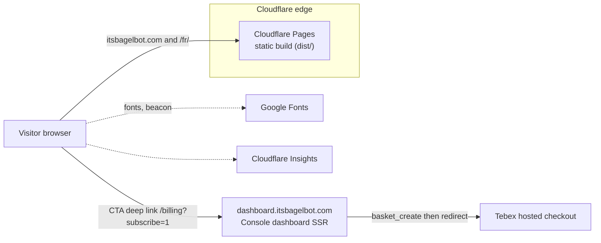
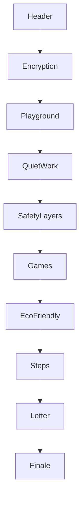
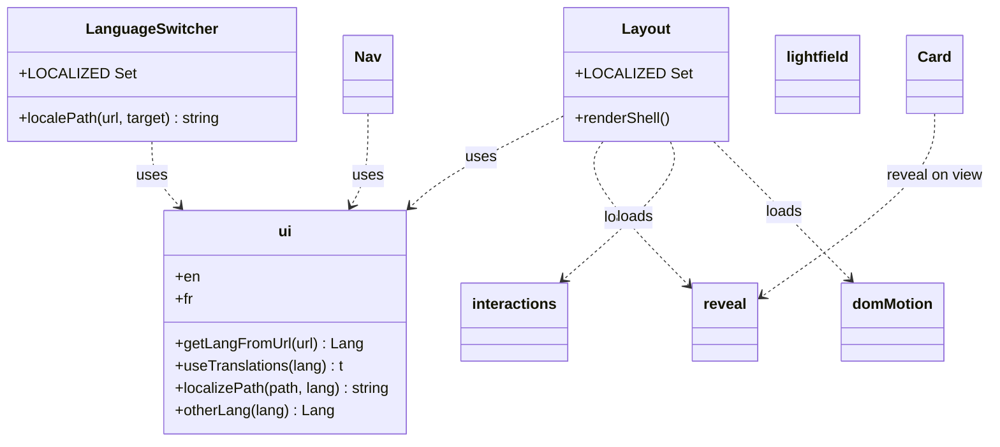
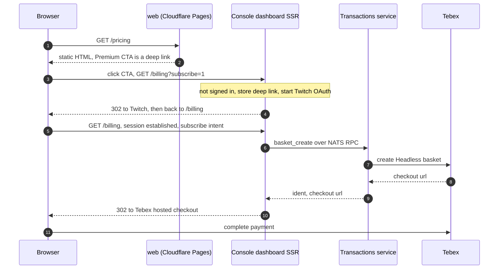

The Web project (`web/`) is the public marketing site at `itsbagelbot.com`. It is a static Astro build: every page is prerendered to HTML at build time, shipped to Cloudflare Pages, and served from the edge with no server-side rendering, no database, and no NATS. It exists to explain the product, rank in search, and hand a convinced visitor across to the [Console](/microservices/console/) dashboard, which owns everything stateful (accounts, billing, configuration).

Keeping the marketing surface static and off the cluster is deliberate: it shares no failure modes with the running platform. A NATS outage, a Valkey failover, or a full cluster roll leaves `itsbagelbot.com` untouched, because the marketing site never talks to any of them. The only dynamic behavior on the page is client-side animation and one interactive command builder, both pure browser code.

## Responsibilities

- Serve the landing experience: a cinematic hero plus the rebuilt narrative sections (encryption scene, an interactive Playground, the QuietWork bento, the SafetyLayers demo, the Games grid, an eco note, the how-it-works Steps, a closing letter and finale).
- Serve the static content pages: pricing, contact, the client-side command builder, and the legal pages (privacy, terms, creator terms).
- Present the site in English (root) and French (`/fr/`) from one hand-rolled string catalog.
- Route conversion intent to the dashboard: every "get started" and "chip in" call to action is a deep link into `dashboard.itsbagelbot.com`, where the actual sign-in and Tebex checkout happen.

## What this service does not do

- No server-side rendering. There is no adapter and no `output: 'server'`; Astro emits static HTML.
- No NATS, no RPC, no database, no session, no auth. Nothing on this site reads or writes platform state.
- No payment handling. The site never creates a Tebex basket or calls the transactions service. It links out to the dashboard, which mints the basket and redirects to Tebex.
- No command persistence. The command builder produces text you copy; it does not write a command anywhere, and it does not prefill the dashboard.
- It does not run in the k3s cluster. It has no manifests under `deploy/`; it is a Cloudflare Pages project.

## External context

The site is a leaf. It fans out only to the browser's own fetches (fonts, the Cloudflare Insights beacon) and to the dashboard host by ordinary hyperlink. The dashboard, not this site, is what reaches into the cluster and Tebex.

## Site structure

Pages live in `web/src/pages/`. English routes sit at the root; French routes mirror a subset under `web/src/pages/fr/`.

| Route | File | Locale |
|-------|------|--------|
| `/` | `pages/index.astro` | EN |
| `/pricing` | `pages/pricing.astro` | EN |
| `/contact` | `pages/contact.astro` | EN |
| `/command-builder` | `pages/command-builder.astro` | EN only |
| `/privacy` | `pages/privacy.astro` | EN |
| `/terms` | `pages/terms.astro` | EN |
| `/creator-terms` | `pages/creator-terms.astro` | EN |
| `/404`, `/500` | `pages/404.astro`, `pages/500.astro` | EN only |
| `/fr/` | `pages/fr/index.astro` | FR |
| `/fr/pricing`, `/fr/contact` | `pages/fr/*` | FR |
| `/fr/privacy`, `/fr/terms`, `/fr/creator-terms` | `pages/fr/*` | FR |

The command builder and the two error pages are English only; they have no `/fr/` counterpart, and the language switcher accounts for that (see i18n below).

The home page composes ten section components from `web/src/components/home/`, in order:

`Layout.astro` (`web/src/layouts/`) is the shared shell: it renders the head (meta, canonical, `hreflang` alternates, the CSP meta tag), the `Nav`, the page body, the `Footer`, and wires the global client scripts.

## Internal design

There is no server object graph to diagram; the interesting structure is the client runtime: the i18n helpers plus the progressive-enhancement scripts that decorate the static HTML. Names below are the real exports.

`ui.ts` is the single source of truth for copy. Everything else is presentation glue: `Layout` and `Nav` translate through `useTranslations`, and the script modules attach behavior to `data-*` hooks in the prerendered HTML.

### i18n architecture

The site uses Astro's native i18n routing plus a tiny hand-rolled catalog, no runtime i18n dependency.

- Astro config (`web/astro.config.mjs`): `defaultLocale: 'en'`, `locales: ['en', 'fr']`, `routing.prefixDefaultLocale: false`, `routing.redirectToDefaultLocale: false`. English keeps its bare URLs (nothing 301s); French lives under `/fr/`.
- Catalog (`web/src/i18n/ui.ts`): `en` is a flat object of dotted keys (`'nav.pricing'` and so on) declared `as const`, and it is the source of truth. `fr` is a `Partial` override. They combine into `catalog = { en, fr }`. Types derive from the source: `Lang = 'en' | 'fr'` and `UIKey = keyof typeof en`.
- Helpers: `getLangFromUrl(url)` reads the first path segment (`fr` picks French, everything else English). `useTranslations(lang)` returns `t(key)` resolving `catalog[lang][key] ?? en[key] ?? key`, so a missing French string falls back to English and, worst case, to the visible key rather than a blank. `localizePath(path, lang)` maps an English path to its French equivalent; `otherLang(lang)` gives the toggle target.

One subtlety worth knowing: there are two independent `LOCALIZED` sets. `Layout.astro` uses one to decide which pages emit `hreflang` alternate links, and it omits `/creator-terms`. `LanguageSwitcher.astro` uses its own to compute the toggle target, and it includes `/creator-terms`. The switcher also guards against dead links: for any page with no French counterpart (the command builder, the error pages) it keeps the English path instead of inventing a `/fr/` URL that would 404.

### Command builder

`web/src/pages/command-builder.astro` is a self-contained, English-only browser tool. It has no back end and no dashboard handoff.

The user picks a surface (a custom command, or one of the module message templates), types a bot response, and clicks variable chips to insert `{tokens}`. A live rehearsal renders the response as a chat line with sample substitutions. The output is either a paste-ready chat command (`!cmd add ...` for a custom command) or the raw template (for a module message), copied to the clipboard by the `[data-copy]` button (`navigator.clipboard.writeText`).

The variable catalog is a verified, hard-coded table in the page's inline script: an object `D` keyed by surface (`custom`, `triggers`, `clip`, `shoutout`, `follow`, `subscribe`, `cheer`, `raid`, `daily`, `bwstats`, `sniper`, `tags`, `elo`, `session`), each entry listing its variables as token, display name, description, and a sample value. A shared `dyn` list (`{random}`, `{random:1-100}`, `{choice:...}`) is spread into most surfaces. Because the catalog is authored to match what the sesame worker actually substitutes, the builder cannot advertise a token the bot does not understand.

The builder does not write anything and does not navigate to the dashboard. The instructions tell the user to paste the result into Twitch chat (for a custom command) or into the matching module field in their dashboard (for a module message).

### The conversion handoff and Tebex entry

The genuine handoff from the marketing site to the platform is a deep link, not a form post. The Premium tier button in `web/src/components/pricing/Tiers.astro` is a plain anchor to `https://dashboard.itsbagelbot.com/billing?subscribe=1` (with `&lang=fr` when the visitor is on the French pricing page), opened in a new tab. The dashboard owns everything from there: it signs the visitor in over Twitch OAuth (preserving the deep link through the login round trip), lands on the billing page with checkout intent, mints a Tebex Headless basket over NATS RPC (`bagel.rpc.transactions.basket_create`), and redirects to the Tebex-hosted checkout.

The marketing site's total contribution to billing is one `href`. It never sees a basket, a Tebex key, or a payment field. See the [Console](/microservices/console/) and [Transactions](/microservices/transactions/) pages for the dashboard and RPC side of this flow.

## Design system and client scripts

The static HTML carries `data-*` hooks; small ES modules loaded from `Layout.astro` progressively enhance them. Every motion primitive checks `prefers-reduced-motion` and degrades to a static, fully readable page.

| Hook | Script | Behavior |
|------|--------|----------|
| `data-reveal` | `script/reveal.js` | `IntersectionObserver` adds `.is-revealed` on first view; stagger via `--reveal-i`; falls back to reveal-all with no observer or reduced motion. |
| `data-card` | inline in `components/ui/Card.astro` | Cursor-tracked radial spotlight (`--mx`, `--my`). Renders as `div` or `a`. |
| `data-animated-button` | `components/ui/Buttons/AnimatedButton.astro` | Magnetic call-to-action button. |
| `data-copy` | `script/interactions.js` | Click copies the target text and flips `.is-copied` briefly. |
| `data-tilt` | `script/interactions.js` | Pointer-tracked 3D tilt on fine pointers only. |
| `data-field` | `script/lightfield.js` | Drifting warm particle field on a canvas, rAF gated by an observer, `data-warmth` tunes the palette. |
| `data-decode` | `script/decode.js` | Scramble-on-view text reveal. |
| page parallax | `script/dom-motion/` | Cursor parallax of header, footer, and page ornaments via CSS variables, on fine hover pointers only. |
| smooth scroll | `script/scroll.js` | Lenis smooth scroll, exposed as `window.lenis`. |

Note: there is no `data-magnetic` attribute; the magnetic button behavior lives under `data-animated-button`.

## Configuration and build

The site has no runtime config loader. Its behavior is fixed at build time by `astro.config.mjs` and `package.json`.

| Setting | Value | Source |
|---------|-------|--------|
| `site` | `https://itsbagelbot.com` | `astro.config.mjs` |
| Output | static (no adapter, no `output: 'server'`) | `astro.config.mjs` |
| Integrations | `@astrojs/sitemap` | `astro.config.mjs` |
| i18n | `defaultLocale: en`, `locales: [en, fr]`, `prefixDefaultLocale: false` | `astro.config.mjs` |
| `prefetch` | `true` | `astro.config.mjs` |
| `compressHTML` | `true` | `astro.config.mjs` |
| `build.inlineStylesheets` | `auto` | `astro.config.mjs` |
| `vite.build.assetsInlineLimit` | `0` (never inline script chunks, so the CSP can forbid inline scripts) | `astro.config.mjs` |
| Astro | `^7.0.6` | `package.json` |
| Package manager | `bun@1.3.10` | `package.json` |
| Notable deps | `three` (WebGL encryption scene), `motion`, `lenis` | `package.json` |

## Content security policy

The CSP is declared in two places, and they differ. This is intentional: the meta tag protects local preview and any context where the header is stripped, while the `_headers` file is the authoritative policy Cloudflare Pages serves.

| Directive | `Layout.astro` meta tag (production) | `public/_headers` (Cloudflare Pages) |
|-----------|--------------------------------------|--------------------------------------|
| `default-src` | `'self'` | `'self'` |
| `script-src` | `'self' https://static.cloudflareinsights.com` | `'self' 'unsafe-inline' https://static.cloudflareinsights.com` |
| `style-src` | `'self' 'unsafe-inline' https://fonts.googleapis.com` | same |
| `font-src` | `'self' https://fonts.gstatic.com` | same |
| `connect-src` | `'self'` plus Google Fonts and `cloudflareinsights.com` | same |
| `object-src`, `frame-src`, `frame-ancestors` | not set | all `'none'` |
| `X-Frame-Options` | not set | `DENY` |

The meta-tag build appends `'unsafe-inline' 'unsafe-eval'` to `script-src` in dev only. Because `assetsInlineLimit` is `0`, the production build emits no inline `<script>`, which is what lets the meta-tag policy drop `'unsafe-inline'` from `script-src`.

## Deployment

The site is not a cluster workload. It is a Cloudflare Pages project built with `bun run build` into `dist/` and served statically from the edge (`web/README.md`). The apex `itsbagelbot.com` (and `/fr/`) is entirely separate from the k3s ingress path: only `dashboard.itsbagelbot.com` and the operational hosts (webhooks, flux) ride cloudflared and traefik. There are no replicas, probes, PodDisruptionBudget, Doppler secrets, or Service objects for this app, because none exist: it has no `deploy/` manifests.

## Testing

Playwright drives the built site (`web/tests/site.spec.js`, `web/playwright.config.js`). The config previews the real build (`astro preview`) on port 4399 and runs three workers with one retry, keeping the timing-sensitive animation assertions stable.

| Scenario | What it asserts |
|----------|-----------------|
| home renders hero and Act II sections | hero copy, encryption section, Playground chat simulation, the QuietWork and SafetyLayers bentos, Steps, Letter, Finale. |
| pricing renders tiers, oath, and faq | three tiers (Free, Premium, Enterprise), the pricing oath, and the FAQ `details` set. |
| static gates open in sync | pauses Web Animations and samples packet and gate positions at fixed timestamps. |
| contact renders switchboard | four contact lines, each with a copy affordance. |
| production assets are emitted | favicon is the bot PNG (no Astro SVG), and referenced assets fetch OK. |
| legal pages render | privacy and terms tables of contents, links, and license copy. |
| active nav route is marked | the current page's nav link carries `is-active`. |
| client route changes start at top | scroll restoration across client-side navigations and back. |
| decode text animates after swaps | the decode reveal reruns after a client route swap. |
| encryption scene reboots on return | the WebGL scene re-initializes when navigating back home. |
| reduced motion | reveal content is visible with `opacity: 1` under `reducedMotion: reduce`. |

## Failure modes

The site is static, so most classic failure modes do not apply. The ones that matter are client-side and all degrade toward a readable page.

| Condition | Response |
|-----------|----------|
| JavaScript disabled or blocked | The prerendered HTML is the whole page; scripts only add motion and the copy affordances. Content stays readable. |
| No `IntersectionObserver` | `reveal.js` reveals everything immediately instead of on scroll. |
| `prefers-reduced-motion: reduce` | Reveal, parallax, tilt, lightfield, and decode all no-op to their final static state. |
| Missing French translation | `useTranslations` falls back to the English string, then to the key. |
| Unknown route or an app error | `404.astro` and `500.astro` render the shared `ErrorScene`. |

## Design notes

- **Low coupling at the app boundary.** The marketing surface shares nothing with the platform: no NATS, no database, no shared runtime. All stateful intent is delegated to the dashboard by hyperlink, so the site can never take the platform down and the platform can never take the site down. This is the clean-boundary payoff of keeping marketing static and off-cluster.
- **Information Expert / single source of truth.** The English catalog `en` in `ui.ts` owns every string; French is a partial override with deterministic fallback. Copy changes happen in one place and cannot drift between the two locales.
- **Progressive enhancement and graceful degradation (architecture tactic).** The build emits complete HTML; the client only decorates it. Every enhancement has a defined fallback (reveal-all, reduced motion, English fallback), so a missing capability degrades the experience without breaking the content.
- **Pure Fabrication.** The `i18n/ui.ts` module and the `script/` behavior modules exist to hold cross-cutting concerns (translation, motion) off the page components, so a section component stays declarative markup.

## References

- [Console](/microservices/console/): the dashboard the site hands conversions to (sign-in, billing, configuration).
- [Transactions](/microservices/transactions/): the service that mints the Tebex basket the dashboard redirects to.
- [Architecture overview](/architecture/): where this site sits in the wider system.
