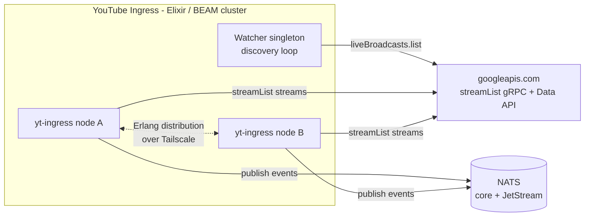

---
# Copyright (c) 2026 Adam Ousmer. All rights reserved.
# Proprietary. No license granted. See LICENSE.md.
title: YouTube Ingress
description: Elixir/BEAM service that owns the per-channel liveChatMessages.streamList gRPC streams, discovers active broadcasts, and forwards normalized events to NATS.
---

The YouTube Ingress holds one **server-streaming gRPC connection per active live
chat**, keeps each stream alive across failures, normalizes incoming chat events,
and pushes the survivors onto the NATS bus — the same contract shape the
[Twitch Ingress](/microservices/twitch-ingress/) publishes, with `platform:
"youtube"`.

It is the second service in the system written in **Elixir on the BEAM VM**; the
language choice carries over from [ADR 0006](/adr/0006-adoption-of-elixir-for-twitch-ingress/)
and is re-affirmed for this service in [ADR 0011](/adr/0011-separate-youtube-ingress-service/).

## Responsibilities

- **Discover** each watched channel's currently-active broadcast by polling
  `liveBroadcasts.list` (1 quota unit per channel per tick) and resolve its
  `liveChatId`. There is no Conduit equivalent: Twitch *pushes* every subscribed
  broadcaster into a pre-assigned shard fleet, while YouTube requires us to
  notice when a channel goes live.
- **Stream** every active live chat over the official
  [`liveChatMessages.streamList`](https://developers.google.com/youtube/v3/live/docs/liveChatMessages/streamList)
  server-streaming RPC (gRPC, proto2 contract vendored at
  `priv/protos/stream_list.proto`). No polling loops, no quota cost per message,
  no unofficial innertube endpoints.
- **Resume without replay**: every response carries a `nextPageToken`; reconnects
  pass the last token back so YouTube resumes exactly where we left off.
- Keep each stream alive: idle watchdogs, jittered exponential backoff capped at
  60 seconds, terminal-status detection (`NOT_FOUND`,
  `FAILED_PRECONDITION` = chat disabled/ended, response carrying `offline_at`),
  and one forced token refetch on auth failure before giving up.
- Lease short-lived Google OAuth access tokens over NATS RPC from the users
  service (the ingress never stores refresh tokens), with an API-key fallback for
  development.
- **Filter** incoming payloads exactly like Twitch: only `!` commands and special
  author IDs cross the bus as chat; paid/membership/poll events always publish;
  everything else is dropped with a counter.

What this service does **not** do: send anything to YouTube (that is outgress,
issue #619 part 2), process commands, persist state, or read MySQL directly.

## External shape



## Internal shape (OTP supervision tree)

Mirrors the Twitch ingress one-for-one, with the shard machinery replaced by its
YouTube counterpart:

| Twitch ingress | YouTube ingress | Difference |
|---|---|---|
| `ShardSession` (one WebSocket of a Conduit) | `ChatSession` (one gRPC server-stream) | Ownership key is `{:chat, channel_id}`, not a Twitch-assigned shard id |
| `ConduitManager` reconciles shards against Helix | `Watcher` singleton discovers broadcasts per channel | Discovery direction inverted: Twitch assigns, we must find |
| `ShardDistribution` round-robins integer shard ids | `ChatDistribution` hashes channel ids | Placement deterministic via `:erlang.phash2/1`, no upstream numbering |
| `Twitch.AppToken` (app credential for Helix) | `TokenSource` (per-channel OAuth lease over RPC) | Google credentials belong to the users service |

Shared verbatim in structure: libcluster topologies (Kubernetes DNS with the
error-tolerant `ClusterResolver`, EPMD, Gossip), Horde registry +
DynamicSupervisor (`:passive` redistribution), the two-plane NATS wiring
(RPC account on the leaf, BUS firehose direct to the hub), scheduler-batched
ETS metrics, broadcaster status cache with invalidation consumer, drain handoff
in `prep_stop`, and the Bandit health surface.

## Session lifecycle (`YtIngress.ChatSession`)

- Restart strategy `:transient`; crash restarts with jittered exponential
  backoff capped at 60 s (identical formula to the Twitch shard).
- The hot path (normalization + lane routing + JetStream publish) runs inside a
  supervised reader task, so blocking there applies TCP backpressure naturally
  and never wedges lifecycle control.
- Error classification:

| gRPC status | Meaning | Action |
|---|---|---|
| `NOT_FOUND` / `FAILED_PRECONDITION` | chat ended/disabled | exit cleanly; watcher reconciles |
| `PERMISSION_DENIED` / `UNAUTHENTICATED` | token problem | one forced refetch, then stop |
| `RESOURCE_EXHAUSTED` | polled too fast | back off from an elevated floor |
| anything else | transient | reconnect with backoff, resume from token |

- An idle watchdog (default 300 s) presumes dead any silent HTTP/2 stream and
  reconnects proactively — resuming is cheap, trust is not.

## NATS contracts

Subject prefixes (lane subjects env-overridable like Twitch):

- **`youtube.ingress.event.premium` / `.standard`**: filtered events, laned by
  broadcaster status (same `bagel.rpc.broadcaster.status.get` contract; unknown
  channels degrade to standard).
- **`youtube.ingress.event.stream`**: broadcast lifecycle only —
  `stream.online` / `stream.offline` published by the watcher on discovery
  transitions, dual-published to the broadcaster's own lane like Twitch.
- **`youtube.ingress.status.chat.up` / `.down`**: session lifecycle signals.
- **`youtube.ingress.admin.chats.get`**: request-reply snapshot of watchers and
  sessions cluster-wide (admin tool).
- **`bagel.cache.invalidate.status`**: inbound, evicts broadcaster-lane cache
  entries.
- **`bagel.rpc.youtube.token.get`**: outbound request-reply for per-channel
  OAuth access leases (`{"channel_id"} → {"access_token", "expires_at"}`),
  served by the users service once its YouTube side ships.

### Event payload shape

Chat events mirror the Twitch wire keys exactly, plus platform extras:

```json
{
  "type": "text_message_event",
  "platform": "youtube",
  "lane": "standard",
  "broadcaster_user_id": "UC...",
  "chatter_user_id": "UC...",
  "chatter_user_login": "lowercased display name",
  "chatter_user_name": "Display Name",
  "text": "!points",
  "ts": "2026-08-22T00:00:00Z",
  "received_at": "2026-08-22T00:00:01Z",
  "msg_id": "<YouTube message id>"
}
```

Type vocabulary (snake_case of YouTube's own enum): `text_message_event`,
`super_chat_event`, `super_sticker_event`, `new_sponsor_event`,
`member_milestone_chat_event`, `membership_gifting_event`,
`gift_membership_received_event`, `poll_event`, `gift_event`. Paid/membership
types carry their details flattened onto the event (`amount_micros`, `currency`,
`tier`, `member_level_name`, …). Consumers de-duplicate on `msg_id`.

## Configuration

Environment-driven, read once at boot (`config/runtime.exs`). Key variables:

| Variable | Purpose | Default |
|---|---|---|
| `YOUTUBE_CHANNEL_IDS` | Comma-separated watch list (until the users RPC ships) | empty |
| `YOUTUBE_LIVE_CHAT_IDS` | Dev escape hatch: pin chats, skip discovery | empty |
| `YOUTUBE_API_KEY` | Static dev credential | absent |
| `YOUTUBE_WATCH_POLL_SECONDS` | Discovery cadence (1 quota unit/channel/tick) | `30` |
| `YT_CHAT_IDLE_TIMEOUT_SECONDS` | Silence budget before proactive reconnect | `300` |
| `NATS_YT_TOKEN_SUBJECT` | Token lease RPC subject | `bagel.rpc.youtube.token.get` |
| `NATS_SUBJECT_LANE_*` | Lane subjects | `youtube.ingress.event.*` |
| Cluster/NATS/TLS vars | Same names and semantics as twitch-ingress | — |

## Quota arithmetic

The only recurring quota cost is discovery: `liveBroadcasts.list` costs 1 unit,
so 30 s polling is 2,880 units/channel/day against the default 10k/day project
budget — roughly three permanently-watched channels per default project. Chat
messages themselves ride the stream and cost nothing. Raising coverage means a
higher quota tier, not code changes; the watcher cadence is env-tunable to
trade latency for budget.

## Deployment

Identical posture to twitch-ingress: Mix release on distroless-style Debian,
ARM + Intel images built natively per node, BEAM distribution over the tailnet,
two replicas spread by topology constraints, `minReadySeconds: 60` rolling
updates with make-before-break drain, `/healthz` + `/readyz` + `/status`
probes, Doppler-managed secrets (project `youtube-ingress`).

## References

- [ADR 0006](/adr/0006-adoption-of-elixir-for-twitch-ingress/): the language and runtime choice, reused here.
- [ADR 0011](/adr/0011-separate-youtube-ingress-service/): why a second standalone Elixir service instead of extending the first.
- [Twitch Ingress](/microservices/twitch-ingress/): the structural template this service mirrors deliberately.
- [Streaming Live Chat guide](https://developers.google.com/youtube/v3/live/streaming-live-chat): the official streamList documentation.
