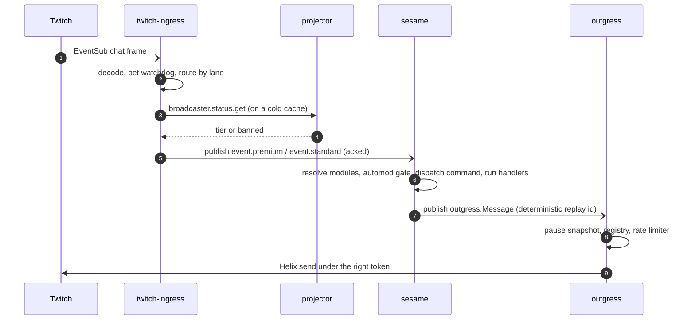
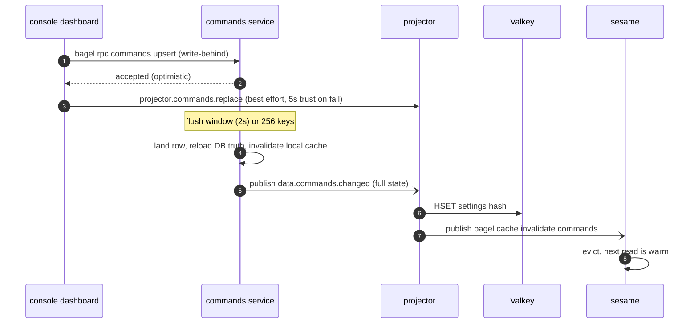
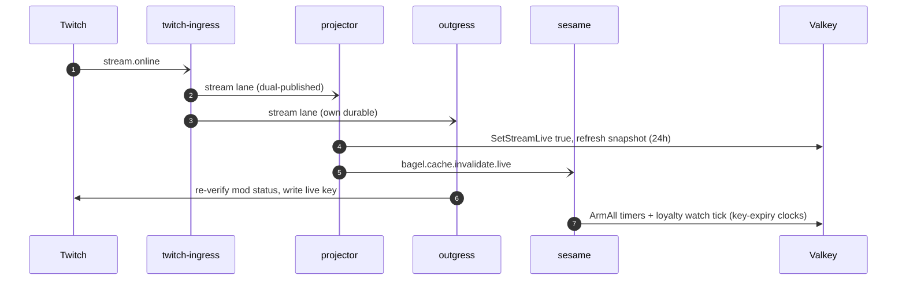

This page is the running system end to end. Where the [architecture overview](/architecture/) gives the views and
the [service registry](/microservices/) gives the parts, this page follows state as it moves: a chat message from
Twitch to a reply, a dashboard edit from a click to every cache, and a go-live from `stream.online` to warm timers.

## At a glance

- **Event-driven microservices**, one concern each, independently deployable for zero-downtime rollouts.
- **Go** for the data and worker services, **Elixir/OTP** for the Twitch ingress, **SvelteKit (SSR)** for the
  console, **Astro** for the marketing site.
- **NATS** is the only inter-service transport: subject-based pub/sub for events, request-reply for RPC. No service
  reads another service's database.
- **MySQL HeatWave**, one schema per data service, accessed through `ent`; each service is its schema's only writer.
- **Valkey** holds the settings projection the hot path reads, plus short-lived caches.
- Hosted on a three-node self-hosted fleet, delivered by **Flux GitOps** from GHCR, behind an outbound
  **cloudflared** tunnel, with management on a **Tailscale** tailnet and pod data on a kernel **WireGuard** mesh.

## Services

The [service registry](/microservices/) is the full table. The shape to hold in mind: an Elixir **ingress** at the
edge of Twitch; a Go event worker (**sesame**) that reacts; a single Go egress (**outgress**) that performs every
Twitch call; per-schema data services (**users, commands, modules, loyalty, transactions, notifications**) on MySQL;
a **projector** that folds their events into Valkey; a **gateway** fronting third-party APIs; and a SvelteKit
**console** (dashboard plus operator admin) that mutates the data services only over RPC.

## Data plane

- **Database.** MySQL HeatWave ([ADR 0005](/adr/0005-adoption-of-mysql-heatwave/)). Each data service owns its own
  schema and is the only writer; cross-service reads go over NATS RPC or arrive as `data.*` events, never as SQL.
- **ORM.** `ent`, generated per service under `app/<svc>/ent/`.
- **Projection.** Valkey holds the per-broadcaster settings hash the hot path reads
  ([ADR 0009](/adr/0009-adoption-of-valkey-for-the-settings-projection/)). Settings writes are write-behind (a
  roughly 2-second flush window): the dashboard gets an optimistic reply, the row lands on the window, a full-state
  `data.*` event reconverges the projection, and a scoped cache-invalidation publish evicts the exact stale entry
  ([ADR 0008](/adr/0008-caching-and-write-behind-strategy/)).
- **Caching.** Short-lived in-process caches sit in front of Valkey (for example the projector's 30-second tier
  cache), and reads default to the node-local Valkey replica with a primary-pinned client for read-after-write paths.

## Message bus

NATS carries two traffic classes on two account-isolated connections per runtime:

- **Events** (fire-and-forget). Domain change events `data.*`, ingress lanes `twitch.ingress.event.*`, shard and
  authorization status `twitch.ingress.status.*`, outgress action lanes `twitch.outgress.*`, and the scope-per-subject
  cache-invalidation family `bagel.cache.invalidate.<scope>` (the tier scope is `status`, not a single
  `broadcaster` subject).
- **RPC** (request-reply). Everything under `bagel.rpc.*` plus the ingress shard control subjects
  `twitch.ingress.admin.shards.*`. See [RPC contracts](/reference/rpc-contracts/) for the full surface.

### Premium and standard lanes

Ingress lanes every event by broadcaster status. Premium broadcasters (paid or vip) and a configured set of
always-premium special user ids ride `twitch.outgress.premium` downstream; everyone else rides
`twitch.outgress.standard`; system jobs ride `twitch.outgress.system`. There is no command-prefix filter: **all**
chat reaches the lanes. Plain chat is squash-folded into sender cohorts before publish so a copypasta flood is one
message carrying many senders, while commands and special-user messages are never folded. A banned broadcaster's
traffic is dropped at the ingress fold, not laned.

## The life of a chat message

A chat frame lands on one ingress shard, which decodes it, re-arms its keepalive watchdog, and hands it to the
dispatch pipeline. The pipeline reads the broadcaster's lane from an in-process cache (falling back to the projector's
`bagel.rpc.broadcaster.status.get` on a cold key), then routes: a special user always goes premium, a command goes
to the broadcaster's own lane and is never folded, plain chat goes to that lane squash-folded. The chosen lane event
is published acked onto `twitch.ingress.event.{premium,standard}`. [Sesame](/microservices/sesame/) drains the lane,
decodes the envelope, resolves the broadcaster's enabled modules from the Valkey projection, runs the inline automod
gate, dispatches the command through one gate (permission, live-only, cooldown), runs the module handlers, and
publishes the resulting `outgress.Message` with a deterministic replay id so a redelivery collapses in the outgress
dedup window. [Outgress](/microservices/outgress/) admits the action through the kill-switch snapshot, the channel
registry, and the fleet-wide rate limiter (its leased share, a peer borrow, or the serialized emergency partition),
then executes the Helix call under the token the action's type requires. See [Twitch Ingress](/microservices/twitch-ingress/)
for the fold and lanes and [Projector](/microservices/projector/) for the tier lookup.

## The life of a dashboard write

A broadcaster edits a command in the [console](/microservices/console/). The action calls
`bagel.rpc.commands.upsert`, which the [commands](/microservices/commands/) service validates and queues into its
write-behind batcher, acknowledging immediately. To make the change visible without waiting on the event pipeline,
the console merges the edit optimistically into its L1 cache and pushes the merged list to the projector so the
Valkey projection is correct now; if that push fails the optimistic entry is trusted for only 5 seconds. On the flush
window the commands service lands the row, reloads the database truth (so the event carries the `uses` counter the
edit never set), invalidates its own cache, and publishes `data.commands.changed` as full state. The
[projector](/microservices/projector/) folds that into the settings hash and fans a `bagel.cache.invalidate.commands`
ping; every cache holding that key evicts it. Change events carry correctness; invalidations carry latency. The same
shape drives module toggles, tier changes, and every other settings write (see
[Caching and write-behind](/data-and-state/caching/)).

## The life of a go-live

When a channel goes live, ingress dual-publishes `stream.online` on the dedicated stream lane and on the
broadcaster's own lane, so a consumer draining chat also sees the channel come up. The
[projector](/microservices/projector/), as the durable-group owner, folds it: it writes the live field synchronously,
fans a `bagel.cache.invalidate.live` ping, and kicks a background refresh of the whole settings snapshot with a
24-hour TTL so the first command of the stream reads a warm cache. [Outgress](/microservices/outgress/) binds its own
durable on the same stream lane to re-verify the bot's moderator status and write the live key it reads for rate
capacity. [Sesame](/microservices/sesame/)'s live module arms the broadcaster's repeating-message timers and the
loyalty watch tick as Valkey key-expiry clocks, all torn down on `stream.offline`.

## Infrastructure

- **Fleet.** Three Intel/x86_64 nodes. `node2` (OVH) is the single k3s server and control plane on a sqlite
  datastore; `node3` (OVH Montreal) is the hot-path node; `worker1` is a bare-metal home node on a Wi-Fi uplink,
  tainted into a worker pool. There is no ARM node, and `node1` left the cluster in July 2026 to run off-cluster as a
  PostgreSQL host on the tailnet ([ADR 0004](/adr/0004-adoption-of-oracle-cloud/)).
- **Network.** Pod and service data ride a kernel WireGuard mesh between nodes over public IPs on UDP 51820;
  management and SSH ride the Tailscale tailnet only; public ingress is the outbound cloudflared tunnel to per-node
  traefik. There is no service mesh: Linkerd is removed, and NATS carries its own native TLS (see
  [Networking](/infrastructure/networking/)).
- **NATS.** A central hub (JetStream enabled, domain `hub`, R1 firehose lanes) plus a `nats-leaf` DaemonSet
  (JetStream disabled) on every node; applications connect to the local leaf for RPC and dial the hub directly for
  the firehose.
- **Delivery.** Flux GitOps pulls digest-pinned images from GHCR (the old SSH build-and-deploy scripts are gone).
  Secrets come from the Doppler Kubernetes operator, and a secret change auto-restarts the consuming app; NATS is the
  exception and reloads config through a SIGHUP.

## Targets

- Console SSR p99 latency: 200 ms or under.
- Rollouts are zero-downtime. Under the one-per-node anti-affinity the roll patches `maxSurge: 0` /
  `maxUnavailable: 1` so it never deadlocks on a spare-node shortage, and images are digest-pinned before the roll
  (see [Hardware and cluster](/infrastructure/hardware-and-cluster/)).
