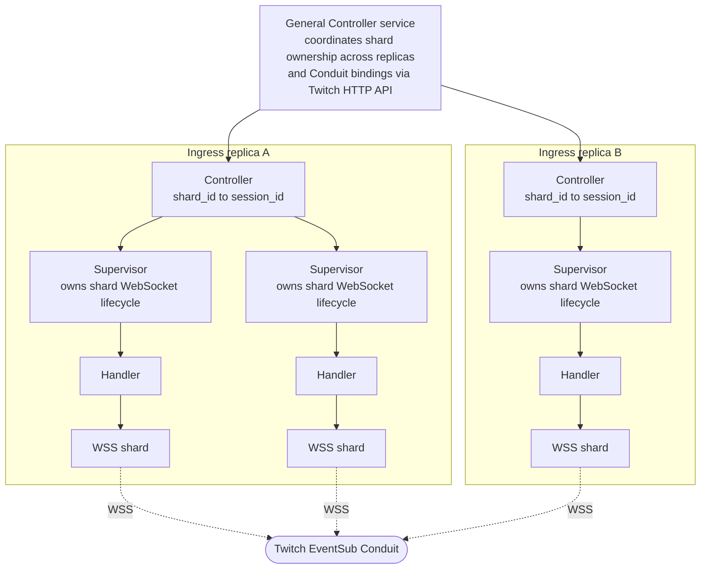

---
# Copyright (c) 2026 Adam Ousmer. All rights reserved.
# Proprietary. No license granted. See LICENSE.md.
title: "0006 - Adoption d'Elixir pour l'ingress Twitch"
description: "ADR : adoption d'Elixir pour l'ingress Twitch."
---

**Date :** 2026-05-23

## Statut

Accepté.

Remplace [l'ADR 0001](/fr/adr/0001-rewriting-to-microservices/).

## Contexte

[L'ADR 0001](/fr/adr/0001-rewriting-to-microservices/) a lancé la réécriture et signalé la difficulté réseau de la v1 : des sockets Twitch de longue durée qui dérivaient vers un état zombie lorsque les heartbeats cessaient d'arriver, une bibliothèque qui masquait le cycle de vie du socket brut et l'impossibilité d'écrire un véritable superviseur par-dessus. Résoudre cette classe de problème était l'une des motivations initiales de la réécriture.

Depuis, [l'ADR 0002](/fr/adr/0002-adoption-of-go-as-primary-service-language/) a choisi Go comme langage principal des services et [l'ADR 0003](/fr/adr/0003-adoption-of-nats-as-communication-bridge/) NATS comme substrat de communication, notamment JetStream KV pour la propriété des shards entre services Go. Pour la plupart des services, cette combinaison est la bonne. L'ingress Twitch est le service où elle cesse de l'être.

L'ingress consomme les événements Twitch par un **Twitch EventSub Conduit**. Un Conduit est un fan-in côté serveur possédé par Twitch : nous déclarons un nombre fixe de shards, attachons une session WebSocket à chaque shard, puis Twitch répartit les événements entre eux. Nous n'ouvrons pas un socket par chaîne. Nous conservons une petite flotte de shards WebSocket et Twitch décide quel événement va à quel shard. Les abonnements (par tenant et par type d'événement) vivent sur le Conduit et survivent aux déconnexions des shards.

Cette forme impose précisément :

- quelques shards WebSocket de longue durée, chacun étant une session que Twitch peut réinitialiser, fermer ou déplacer à tout moment ; le nombre est de l'ordre de l'unité à quelques dizaines, pas un par chaîne ;
- une petite machine d'état par shard : connexion, réception de `session_welcome`, récupération de `session_id`, appel de l'API HTTP Twitch pour associer ce `session_id` au shard du Conduit, gestion de `reconnect`, reconnexion avec backoff et récupération après un reset serveur. Twitch réinitialise régulièrement les connexions ; la panne n'est pas exceptionnelle ;
- l'isolation des pannes : un shard défectueux ne doit pas faire tomber ses frères et son redémarrage ne doit pas les perturber ;
- la répartition de la propriété entre plusieurs instances ingress. Il faut savoir quelle instance possède le shard `n` et, après la mort d'un nœud, rouvrir un WebSocket, obtenir un nouveau `session_id` et réassocier le shard via l'API Twitch en quelques secondes.

Nous pouvons construire tout cela en Go, mais cela revient à reconstruire le modèle de supervision OTP et une couche de clustering. L'écosystème Go fournit les pièces (`hashicorp/memberlist`, `serf`, superviseurs ad hoc et leases NATS KV de l'ADR 0003), mais ce sont des pièces, pas un runtime ; chacune serait à posséder et maintenir.

La forme Go envisagée avant le changement était la suivante : chaque réplique ingress enveloppe un shard WebSocket bas niveau dans un processus superviseur qui possède le cycle de vie de la connexion et expose une interface de gestionnaire ; un contrôleur par réplique mappe les identifiants de shard vers les identifiants de session et possède plusieurs superviseurs ; un service « contrôleur général » séparé coordonne enfin la propriété entre les répliques et les associations du Conduit via l'API HTTP Twitch.

Le diagramme rend explicite le coût du chemin Go : trois couches d'infrastructure écrite à la main (contrôleur général, contrôleur par réplique, superviseur par shard) avant le premier octet Twitch, plus un service chargé uniquement de coordonner les répliques et de réconcilier leur état avec le Conduit. Aucun de ces éléments ne fait de travail métier ; ils recréent seulement ce qu'un runtime fournit déjà.

La VM BEAM (Erlang/Elixir) est conçue pour cette forme. Elle vient des télécoms, où sessions permanentes, supervision par session et distribution transparente entre nœuds ne sont pas des fonctions annexes mais le but même de la plateforme. Sa maturité se mesure en décennies, dans ce même domaine (bords réseau, commutateurs, systèmes de chat). Les processus légers sont assez peu coûteux pour qu'un processus BEAM par shard soit la conception naturelle. La supervision est le modèle de panne par défaut. Les nœuds BEAM forment aussi leur propre cluster : avec `libcluster`, les nœuds se découvrent puis les groupes de processus (`:pg`, `Horde.Registry` ou équivalent) fournissent un registre distribué vivant de « qui possède quoi », sans coordinateur externe.

Cette dernière propriété est essentielle. Les leases NATS KV prévues par l'ADR 0003 pour la propriété des shards conviennent aux services Go dépourvus de clustering natif. Dans un cluster BEAM, la VM fournit déjà la primitive : les nœuds se connaissent, les processus sont localisables par nom et le transfert de propriété à la mort d'un nœud est intégré. Ajouter NATS KV créerait une seconde source de vérité, plus lente, pour quelque chose que la VM suit déjà en mémoire. La seule source externe à réconcilier reste Twitch via l'API HTTP du Conduit, ce qui est inévitable quel que soit le langage.

Le coût d'Elixir est la courbe d'apprentissage et celui d'un second langage dans la flotte. Ces deux coûts sont réels et doivent être évalués honnêtement.

## Décision

Le **service ingress Twitch est écrit en Elixir sur la VM BEAM**. Le reste du système reste en Go conformément à [l'ADR 0002](/fr/adr/0002-adoption-of-go-as-primary-service-language/). Les deux langages communiquent par NATS conformément à [l'ADR 0003](/fr/adr/0003-adoption-of-nats-as-communication-bridge/).

- **Un Conduit, supervisé par shard.** L'ingress possède un seul Conduit EventSub Twitch. Chaque shard WebSocket est un processus supervisé. Un crash redémarre un shard isolément, avec backoff et reconnexion encodés dans la stratégie du superviseur. La nouvelle association de `session_id` via l'API HTTP Twitch fait partie du démarrage. C'est ce que la v1 ne pouvait explicitement pas faire et ce contre quoi l'ADR 0001 a été écrite.
- **Clustering et propriété dans la VM.** Les nœuds ingress forment un cluster BEAM via `libcluster` sur le tailnet de [l'ADR 0004](/fr/adr/0004-adoption-of-oracle-cloud/). La propriété est suivie dans un registre distribué (`:pg` ou `Horde.Registry`), avec transfert à la mort d'un nœud géré par le runtime. Nous n'utilisons pas NATS KV pour les shards ingress.
- **Portée de la supersession.** Cette ADR remplace [l'ADR 0001](/fr/adr/0001-rewriting-to-microservices/) car son problème non résolu le plus visible (supervision et reconnexion des sockets Twitch) est maintenant traité par un autre choix de langage. Les décisions de l'ADR 0001 qui ne concernent pas l'ingress (réécriture complète, architecture microservices, moindre recours à l'IA pour générer le code, même dépôt) restent en vigueur ; cette ADR les affine sans les inverser.

## Conséquences

- La flotte utilise désormais deux langages. Les pipelines de build, la CI, les images, les conventions d'observabilité et l'accueil des développeurs doivent couvrir Go et Elixir. La surface reste volontairement étroite : un service Elixir, le reste en Go.
- Le mode de panne réseau caractéristique de la v1 (sockets zombies, absence de superviseur et de reconnexion) est fermé par construction. La supervision est le défaut d'OTP.
- Le Conduit est un état côté serveur possédé par Twitch. L'ingress doit réconcilier sa vue locale des associations au démarrage, lors d'un transfert et lors d'une dérive d'abonnement. Elixir offre un processus reconciler supervisé par Conduit comme emplacement naturel.
- NATS KV sort du chemin de propriété des shards ingress. Il reste adapté aux services Go ayant besoin de coordination de cluster, tandis que l'ingress utilise le registre distribué BEAM ; cela retire une couche au prix de la responsabilité de maintenir le cluster Elixir sain.
- Le clustering BEAM exige que les nœuds ingress se joignent sur le port de distribution Erlang. Cela s'intègre au tailnet de [l'ADR 0004](/fr/adr/0004-adoption-of-oracle-cloud/) : découverte dans le tailnet, aucun port public.
- Les builds multi-architecture restent nécessaires. BEAM prend en charge ARM, sans régression pour la posture ARM-first de [l'ADR 0004](/fr/adr/0004-adoption-of-oracle-cloud/).
- La courbe d'apprentissage est un coût réel pendant la construction du service. La vitesse initiale sera inférieure à Go et les erreurs de conception plus probables durant l'assimilation d'OTP ; nous le comptons comme coût du projet.
- Le service Elixir doit respecter le reste de la pile : contrats typés sur NATS, journaux structurés compatibles avec Go et mêmes conventions de métriques. Une partie du travail d'intégration reste côté Elixir.

## Alternatives étudiées

- **Garder l'ingress Twitch en Go.** Faisable et uniforme, mais oblige à construire supervision OTP et clustering/propriété en assemblant des bibliothèques (`memberlist`, superviseurs maison, leases NATS KV) en plus de la réconciliation du Conduit. Ce serait une infrastructure à posséder dans un domaine où un runtime résout déjà supervision et clustering.
- **Un WebSocket par chaîne plutôt qu'un Conduit.** C'était la forme de la v1 et la raison de l'ADR 0001. Elle croît linéairement avec le nombre de chaînes, multiplie les pannes et n'est plus le transport recommandé par Twitch pour le fan-in. Rejeté pour raisons opérationnelles et de plateforme.
- **Webhooks sur le Conduit plutôt que shards WebSocket.** Supprime le problème des sockets longues en faisant poster Twitch vers nous, mais exige un endpoint HTTPS public à URL stable, incompatible avec le tailnet-only de [l'ADR 0004](/fr/adr/0004-adoption-of-oracle-cloud/), et déplace les pannes vers retries HTTP et signature des requêtes. Les événements de chat EventSub ne sont en outre pas disponibles par webhook, seulement par WebSocket.
- **Frameworks actor Go (par exemple Proto.Actor).** Reproduisent la forme OTP en Go mais pas ses garanties de runtime : planification, isolation et distribution restent des imitations. Si nous payons le coût d'apprentissage, autant apprendre le vrai runtime.
- **Continuer en Python avec asyncio.** Refusé par [l'ADR 0002](/fr/adr/0002-adoption-of-go-as-primary-service-language/) pour le débit et la concurrence ; ces raisons n'ont pas changé et les bugs réseau de la v1 motivent précisément cette ADR.
- **Service de coordination externe (etcd, Consul, ZooKeeper).** Déjà refusé par [l'ADR 0003](/fr/adr/0003-adoption-of-nats-as-communication-bridge/) pour le système global, et moins pertinent ici puisque BEAM fournit la même primitive dans la VM. Adopter Elixir sans sa distribution native ferait perdre la raison principale de ce choix.
