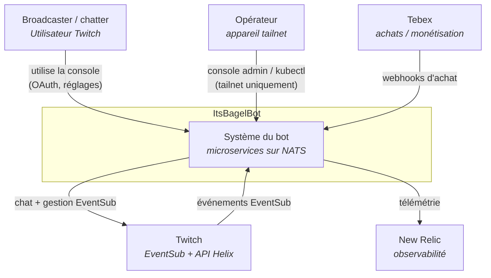

---
# Copyright (c) 2026 Adam Ousmer. All rights reserved.
# Proprietary. No license granted. See LICENSE.md.
title: Vue d'ensemble du système
description: "La vue à 10 000 pieds d'ItsBagelBot : acteurs, frontières et systèmes avec lesquels il communique."
---

ItsBagelBot est un bot Twitch hautement disponible et entièrement évolutif, qui s'étend à de nouveaux services en ajoutant les workers d'ingress appropriés. Les streamers multi-plateformes peuvent ainsi être pilotés depuis une seule configuration.

Nous gardons l'empreinte de chaque service réduite afin de limiter le coût matériel et énergétique du système.

Cette page présente la **vue C4 niveau 1 (contexte système)**. Elle masque volontairement l'intérieur du bot et montre uniquement les acteurs qui interagissent avec lui et les systèmes externes dont il dépend. Pour voir l'intérieur de la boîte, consultez les [microservices →](/fr/microservices/). Pour sa forme en fonctionnement (plan de données, bus et flux des requêtes), consultez [l'état du système →](/fr/reference/system-overview/).

## Diagramme de contexte

## Acteurs et systèmes externes

| Partie | Relation |
|---|---|
| **Broadcaster / chatter** | Pilote le bot via le chat Twitch et EventSub ; le configure via la console (OAuth Twitch avec oauth4webapi). |
| **Opérateur** | Exploite le bot. Accède à la console admin et à `kubectl` uniquement via le tailnet Tailscale ; aucun chemin public. |
| **Twitch** | Source des événements EventSub (ingress) et cible des messages de chat et de la gestion EventSub (outgress), via l'API Helix et le jeton du compte du bot. |
| **Tebex** | Monétisation. Les achats alimentent le service transactions et font passer le niveau d'un broadcaster en payant. |
| **New Relic** | Destination d'observabilité pour les services Go et Elixir. |

La seule surface publique du bot est la console du broadcaster, servie par le tunnel cloudflared sortant. Tout ce qui concerne l'opérateur est limité au tailnet. À l'intérieur de la boîte, les services communiquent exclusivement sur NATS.
