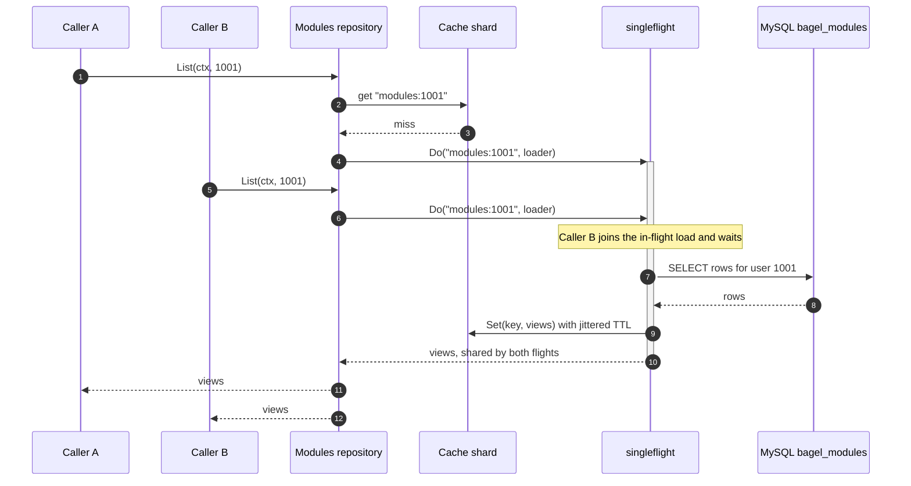
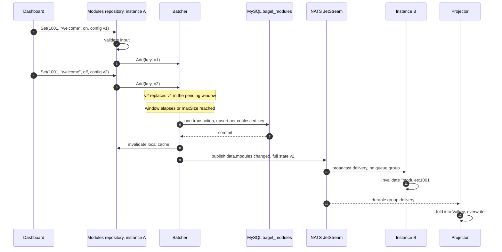
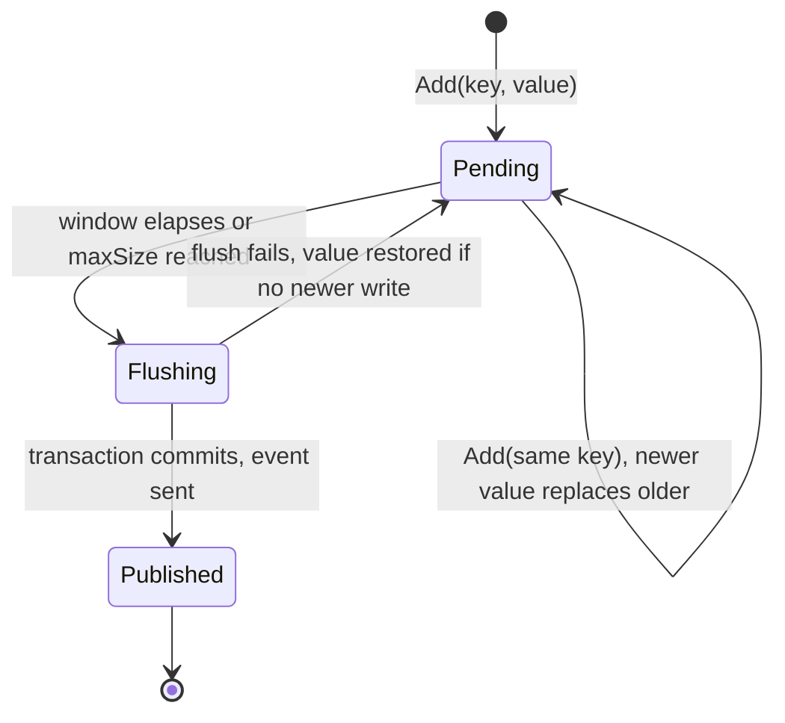

---
# Copyright (c) 2026 Adam Ousmer. All rights reserved.
# Proprietary. No license granted. See LICENSE.md.
title: Cache et write-behind
description: "Chemin de lecture protégé contre le stampede et chemin d'écriture via le batcher coalescent, avec diagrammes UML de séquence et d'état."
sidebar:
  order: 3
---

Deux mécanismes gardent l'instance HeatWave gratuite hors du hot path : un cache en processus protégé contre le stampede à la lecture et un batcher write-behind coalescent à l'écriture. Tous deux publient et consomment les événements de changement de la [vue d'ensemble](/fr/data-and-state/), afin que la flotte converge sans mémoire partagée.

## Chemin de lecture

Les lectures sont servies par un cache TTL en processus et réparti entre shards (`pkg/cache`). Deux protections ciblent les deux formes classiques de stampede : les échecs simultanés sur une clé sont regroupés en une seule requête par singleflight, et les TTL reçoivent une gigue aléatoire allant jusqu'à 10 %, afin que les entrées écrites ensemble n'expirent jamais ensemble. Les erreurs ne sont jamais mises en cache.

La séquence montre deux goroutines qui manquent la même clé au même moment. La seconde se bloque sur le flight ouvert par la première et partage son résultat ; la base ne voit exactement qu'une requête.

Un événement de changement provenant de n'importe quelle instance invalide la clé et oublie aussi tout chargement en cours pour celle-ci. Un flight périmé ne peut donc pas repeupler le cache après l'arrivée du nouvel état. Le TTL de 5 minutes est ainsi un plafond, pas la norme : les événements invalident avant l'expiration.

## Chemin d'écriture

Les écritures de réglages passent par le batcher write-behind (`pkg/batch`). Les écritures de la même clé pendant une fenêtre de flush (2 secondes ou 256 clés en attente, selon la première limite atteinte) sont réduites à la dernière valeur, puis toute la fenêtre est enregistrée dans une transaction de base unique. Les événements ne sont publiés qu'après le commit et portent le nouvel état complet.

La fenêtre de flush est aussi la fenêtre de durabilité : une valeur reste en mémoire au plus pendant l'intervalle de flush avant d'être persistée. Ce compromis n'est acceptable que pour un état qu'un utilisateur peut soumettre à nouveau ; le chemin financier ne passe donc jamais par le batcher :

- **Toujours direct :** transactions Tebex (les IDs dupliqués lors des retries webhook sont déjà enregistrés), changements de niveau, écritures de jetons et suppressions de commandes.
- **Write-behind :** options et configurations de modules, créations et modifications de commandes.

## Cycle de vie d'une écriture groupée

La machine d'état d'une entrée en attente. Un flush échoué renvoie la valeur dans la fenêtre en attente, sauf si une écriture plus récente de la même clé est arrivée entre-temps ; dans ce cas, la nouvelle valeur gagne.

À l'arrêt, le batcher se ferme et flush tout ce qui reste en attente avant la sortie du processus.

## Exactitude des invalidations

Les règles d'invalidation, réunies ici :

- L'instance qui écrit invalide son propre cache de façon synchrone et lit donc immédiatement ses propres écritures.
- Chaque autre instance invalide à l'arrivée de l'événement de changement sur son abonnement broadcast.
- Le projector consomme les mêmes événements via son groupe durable et écrase l'état ; une redelivery est donc inoffensive.
- Les consommateurs doivent rester idempotents : le bus fournit une livraison au moins une fois ([ADR 0003](/fr/adr/0003-adoption-of-nats-as-communication-bridge/)) et les payloads complets rendent le replay sûr.
