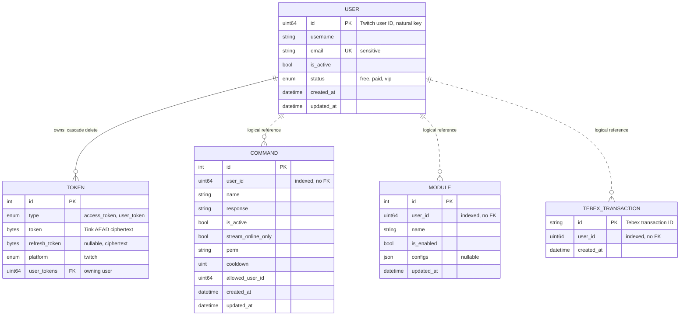
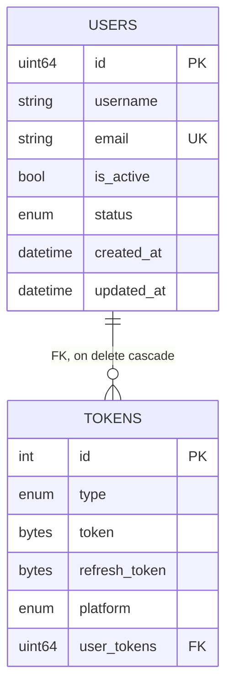
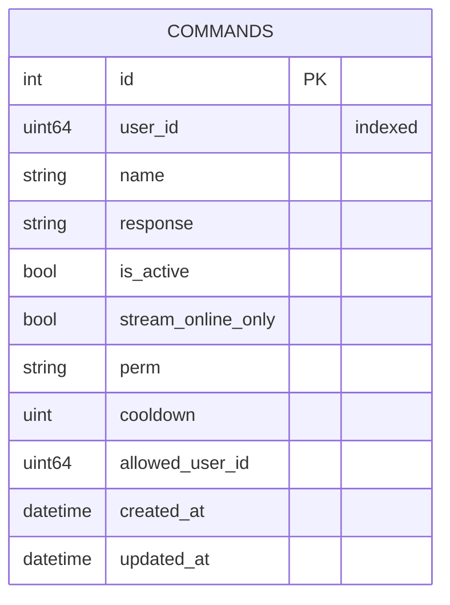
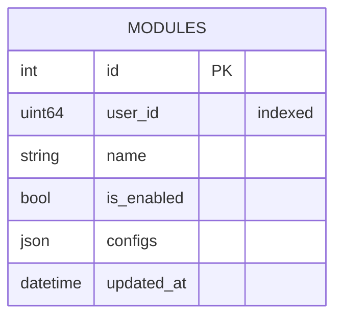
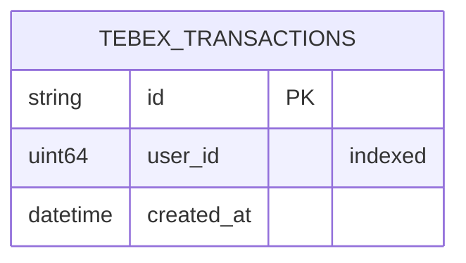

---
# Copyright (c) 2026 Adam Ousmer. All rights reserved.
# Proprietary. No license granted. See LICENSE.md.
title: Conception de la base de données
description: "Modèle conceptuel, schémas physiques par service, règles d'intégrité et argument de normalisation du plan de données."
sidebar:
  order: 2
---

La conception suit les deux étapes classiques : d'abord un modèle conceptuel entité-relation, puis sa correspondance avec les schémas relationnels physiques. La particularité est que cette correspondance est répartie entre quatre schémas MySQL isolés ([ADR 0005](/fr/adr/0005-adoption-of-mysql-heatwave/)) ; les relations qui franchissent une frontière de service n'existent que dans le modèle conceptuel et sont imposées par l'application, jamais par une clé étrangère.

## Modèle conceptuel

Notation en patte-de-corbeau. Les lignes pleines représentent des relations identifiantes imposées par une clé étrangère à l'intérieur d'un schéma ; les lignes en pointillés représentent des références logiques non identifiantes entre schémas, portées par une simple colonne d'identifiant utilisateur Twitch.

## Schémas physiques

Chaque service génère son schéma à partir de ses propres définitions ent et le migre au démarrage. Les paramètres de session sont verrouillés au niveau de la connexion plutôt que de dépendre des valeurs par défaut du serveur : `utf8mb4`, `READ COMMITTED`, mode SQL strict et UTC.

### `bagel_users` (service users)

C'est le seul schéma possédant une véritable clé étrangère, car les utilisateurs et les jetons appartiennent au même contexte délimité et évoluent ensemble (une actualisation de connexion met à jour les deux dans une seule transaction).

Index : index unique sur `email`, index composite sur `(id, is_active)` et index composite unique sur `(type, platform, user)`, afin qu'un utilisateur ne détienne au plus qu'un jeton par type et par plateforme. Les colonnes de jeton ne stockent que le texte chiffré AEAD de Tink ; les données associées lient chaque enveloppe à son propriétaire, à son type et à sa plateforme, de sorte qu'un texte chiffré copié sur une autre ligne échoue à l'authentification lors du déchiffrement.

### `bagel_commands` (service commands)

Index : index composite unique sur `(user_id, name)`. Il impose à la fois « un nom de commande par chaîne » et sert à la recherche par chaîne.

### `bagel_modules` (service modules)

Index : index composite unique sur `(user_id, name)`. La colonne `configs` est un JSON opaque appartenant au module qui le lit ; la base de données garantit seulement qu'il s'agit d'un JSON valide dont la taille est limitée (voir les règles d'intégrité ci-dessous).

### `bagel_transactions` (service transactions)

La clé naturelle est l'identifiant de transaction Tebex lui-même. L'insertion d'un identifiant existant est considérée comme « déjà enregistrée », ce qui rend les nouvelles tentatives de webhook idempotentes sans lecture préalable à l'écriture.

## Règles d'intégrité

L'intégrité est imposée à deux niveaux. Le niveau du schéma porte ce que la base de données peut exprimer : clés primaires, contraintes d'unicité, domaines d'énumération, `NOT NULL` et l'unique clé étrangère interne avec cascade. Le niveau applicatif (`internal/domain/validate`) porte les contraintes de domaine que la base ne peut pas exprimer ; elles sont appliquées à chaque frontière de dépôt et provoquent un rejet plutôt qu'une réécriture :

| Entrée | Règle |
|-------|------|
| Identifiant utilisateur | Non nul |
| Nom d'utilisateur | 1 à 25 caractères parmi `[a-zA-Z0-9_]` |
| E-mail | Adresse RFC 5322, 254 caractères maximum, sans nom affiché injecté ni CRLF |
| Nom de commande | 1 à 64 caractères ASCII imprimables, sans espace blanc |
| Réponse de commande | 1 à 500 caractères, sans caractère de contrôle |
| Nom de module | 1 à 64 caractères parmi `[a-z0-9_-]`, règle stricte car le nom devient une partie d'un champ de hachage Valkey |
| Configuration de module | JSON valide, limite de 16 KiB |
| Identifiant de transaction | 1 à 64 caractères parmi `[a-zA-Z0-9_-]` |
| Jeton | De 1 octet à 8 KiB, stocké uniquement sous forme chiffrée |

ent paramètre chaque requête ; l'injection SQL est donc bloquée au niveau d'accès. Les règles ci-dessus ciblent la validité du domaine, les limites de ressources et la sécurité des clés de projection.

## Normalisation

Chaque table est en BCNF. L'argument est court parce que les schémas sont volontairement étroits :

- `users` : tous les attributs non clés dépendent uniquement de l'identifiant Twitch ; `email` est une clé candidate supplémentaire et ne détermine rien au-delà de lui-même.
- `tokens` : la clé candidate `(user, type, platform)` détermine les colonnes de texte chiffré ; l'`id` de substitution existe pour les besoins d'ent, et non pour dissimuler des dépendances.
- `commands` et `modules` : tous les attributs dépendent entièrement de la clé candidate `(user_id, name)` ; il n'existe aucune dépendance partielle ou transitive.
- `tebex_transactions` : deux attributs, une clé, rien à décomposer.

La seule dénormalisation délibérée du système se trouve hors de MySQL : la projection Valkey duplique l'état du statut et des modules dans un modèle de lecture (voir [Projection des paramètres](/fr/data-and-state/projection/)). Cette copie est un cache, peut être reconstruite à tout moment et ne constitue jamais la source de vérité.
