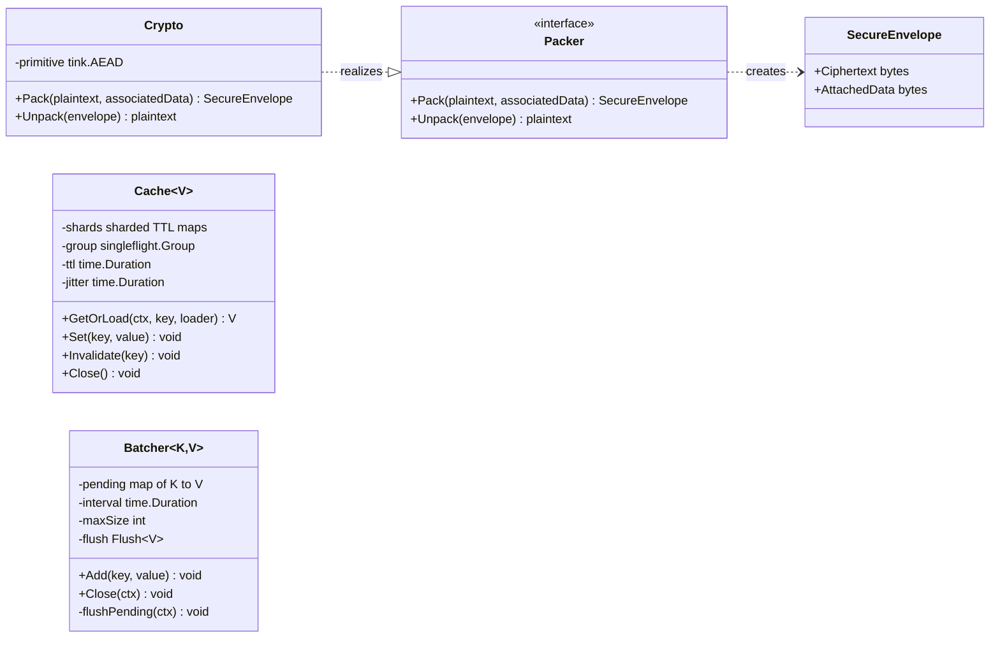
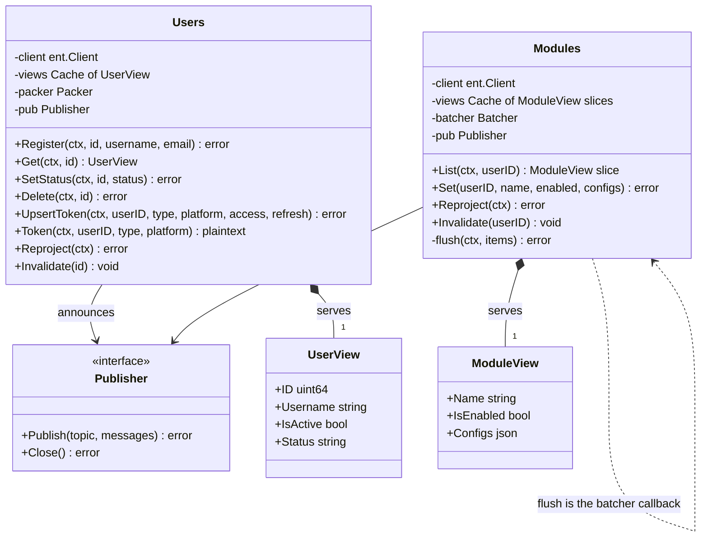

---
# Copyright (c) 2026 Adam Ousmer. All rights reserved.
# Proprietary. No license granted. See LICENSE.md.
title: Conception des classes
description: "Diagrammes de classes UML de l'infrastructure partagée et des dépôts, ainsi que les motifs de conception sur lesquels repose le plan de données."
sidebar:
  order: 4
---

Le plan de données sépare les contrats de domaine (`internal/domain`), l'infrastructure réutilisable (`pkg/`) et le code des services qui les compose (`app/`). Les dépendances pointent vers l'intérieur : les dépôts dépendent des interfaces et de l'infrastructure générique, jamais l'inverse.

## Infrastructure partagée

L'adaptateur cryptographique réalise l'interface de domaine `Packer`, de sorte que les services dépendent de l'abstraction et que Tink reste un détail d'implémentation. Le cache et le batcher sont génériques et ne portent aucune connaissance du domaine.

## Dépôts

Un diagramme est consacré à chaque forme : le dépôt users écrit directement et scelle les jetons ; le dépôt modules (le dépôt commands est son jumeau) fait passer les écritures de paramètres par le batcher et lui transmet sa méthode `flush` comme callback. Tous les collaborateurs arrivent par injection au constructeur, ce qui permet aux tests de remplacer le client SQLite en mémoire et le publisher enregistrant les appels.

La composition (losange plein) entre un dépôt et son cache ou son batcher est intentionnelle : le dépôt les crée et les possède, et la fermeture du dépôt les ferme également. Le publisher et le packer sont des associations vers des interfaces possédées ailleurs et injectées à la construction.

## Motifs utilisés

| Motif | Emplacement | Raison |
|---------|-------|-----|
| Repository (PoEAA) | `app/*/repository` | Un objet par agrégat, faisant le lien entre domaine et ent ; c'est le point commun utilisé par chaque test |
| Data Transfer Object | `internal/domain/event/data`, structures de vue | Payloads d'état complet sur le bus et vues sans champs sensibles dans les caches |
| Publish/Subscribe (Observer à l'échelle du système) | `pkg/bus` sur NATS | Découple les écrivains de chaque lecteur : caches, projecteur et futurs consommateurs |
| Event-Carried State Transfer | Tous les événements de changement | Les consommateurs se mettent à jour à partir du seul événement ; aucun service ne lit le schéma d'un autre |
| Cache read-through avec regroupement des requêtes | `pkg/cache` | Singleflight garantit un seul chargeur par clé, quelle que soit la concurrence |
| Write-Behind | `pkg/batch` | Regroupe les écritures par clé et effectue une transaction par fenêtre plutôt qu'une écriture par clic |
| CQRS, modèle de lecture | `app/projector` et Valkey | Le côté écriture reste normalisé dans MySQL ; le côté lecture est une projection dénormalisée |
| Adaptateur | `pkg/crypto` (Tink derrière `Packer`), `pkg/bus` (`nats.go` derrière les contrats `Publisher`, `Subscriber` et `Message`) | Les API tierces restent derrière des interfaces possédées par l'application |
| Injection de dépendances | Chaque constructeur `NewX` | La composition a lieu dans `main`, et les tests injectent des doublures |
| Récepteur idempotent | Chaque consommateur, `Transactions.Record` | La livraison au moins une fois et les nouvelles tentatives de webhook ne doivent pas appliquer deux fois une opération |

## Motifs absents

Les motifs évités le sont tout aussi délibérément. Il n'existe ni service locator ni registre global : tout arrive par le constructeur. Il n'y a pas de noyau partagé d'entités entre les services : chacun possède son schéma ent, et les seuls types partagés sont les DTO d'événements. Il n'y a pas non plus d'abstraction prématurée de la base de données : les dépôts parlent directement à ent, car le remplacement de MySQL est déjà couvert au niveau du pilote et du dialecte ([ADR 0005](/fr/adr/0005-adoption-of-mysql-heatwave/)).
