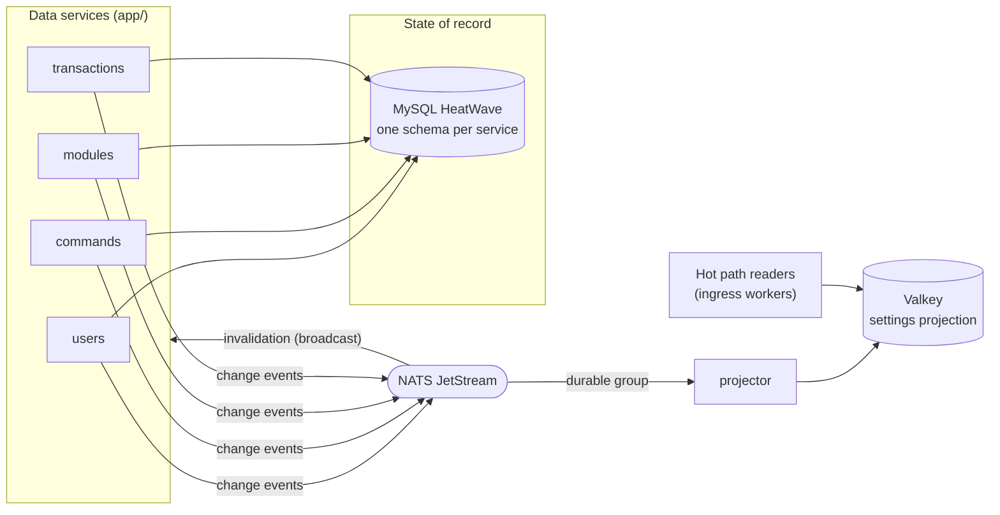

---
# Copyright (c) 2026 Adam Ousmer. All rights reserved.
# Proprietary. No license granted. See LICENSE.md.
title: Vue d'ensemble du plan de données
description: "Les services de données, leurs responsabilités et la circulation de l'état entre MySQL, les caches, NATS et la projection Valkey."
sidebar:
  order: 1
---

Le plan de données regroupe quatre services à contexte borné et un projector, tous sous `app/`. Chaque service possède son propre schéma MySQL sur HeatWave ([ADR 0005](/fr/adr/0005-adoption-of-mysql-heatwave/)), annonce chaque changement validé comme un événement sur NATS ([ADR 0003](/fr/adr/0003-adoption-of-nats-as-communication-bridge/)), puis le projector agrège ces événements dans la projection des réglages Valkey lue par le hot path.

Cette page présente la vue des composants. Le reste de la section approfondit :

- [Conception de la base](/fr/data-and-state/database/) : modèle conceptuel, schémas physiques et règles d'intégrité.
- [Cache et write-behind](/fr/data-and-state/caching/) : chemins de lecture et d'écriture, avec leurs diagrammes UML de séquence et d'état.
- [Conception des classes](/fr/data-and-state/design/) : diagrammes UML de classes et patterns utilisés.
- [Projection des réglages](/fr/data-and-state/projection/) : organisation Valkey et protocole de reconstruction.

## Diagramme des composants

## Propriété

| Service | Schéma | Données détenues | Chemin d’écriture |
|---------|--------|------|------------|
| `app/db/users` | `bagel_users` | Utilisateurs (identifiant Twitch, nom, e-mail, indicateur d’activation, niveau) et jetons OAuth chiffrés par Tink AEAD | Direct, toujours |
| `app/db/commands` | `bagel_commands` | Commandes de chat personnalisées | Écriture différée (suppressions directes) |
| `app/db/modules` | `bagel_modules` | Activation des modules et configurations JSON | Écriture différée |
| `app/db/transactions` | `bagel_transactions` | Identifiant de transaction Tebex et utilisateur propriétaire, rien d’autre | Direct, toujours, idempotent lors des nouvelles tentatives |
| `app/projector` | aucun | Projection Valkey (jetable, reconstructible) | Remplacements déclenchés par événement |

Les références entre services sont de simples colonnes indexées contenant l’identifiant utilisateur Twitch. Par construction, aucune clé étrangère ne traverse les schémas.

## Contrats d'événements

Les sujets et DTO de contenu résident dans `internal/domain/event/data` et constituent un contrat public : renommer un sujet ou réduire son contenu est un changement incompatible. Chaque événement transporte le nouvel état complet (transfert d’état par événement), de sorte que les consommateurs ne lisent jamais le schéma d’un autre service et que la relivraison est sans danger.

| Sujet | Contenu | Moment de publication |
|---------|---------|----------------|
| `data.users.changed` | vue utilisateur complète (identifiant, nom, activation, statut) | Inscription, renommage, changement de niveau |
| `data.users.deleted` | identifiant utilisateur | Suppression de l’utilisateur |
| `data.modules.changed` | identifiant utilisateur, nom du module, activation, configuration JSON | Chaque ligne de module enregistrée lors d’un vidage |
| `data.commands.changed` | identifiant utilisateur, nom, réponse, activation, restriction au direct, permissions, délai, utilisateur autorisé, indicateur de suppression | Chaque ligne de commande enregistrée lors d’un vidage, et les suppressions |
| `data.transactions.recorded` | identifiant de transaction, identifiant utilisateur | Premier enregistrement réussi d’une transaction |
| `data.reproject.request` | vide | Démarrage à froid du projector ; les propriétaires rejouent leur état sous forme d’événements de changement ordinaires |

Deux formes d’abonnement sont utilisées délibérément :

- **Broadcast (sans groupe de file) :** invalidation du cache. Chaque instance d'un service supprime ses clés mises en cache lorsqu'une instance écrit.
- **Groupe de file durable :** le projector et les répondants de reproject. Un seul consommateur par groupe traite chaque événement, et le groupe conserve sa position après un redémarrage.

Les consommateurs valident chaque contenu et **abandonnent** (journalisation et acquittement) ce qui ne peut pas être décodé ou validé. Un acquittement négatif sur un message invalide entraînerait sa relivraison indéfinie.

## Configuration

Chaque service lit sa configuration dans l’environnement. Variables communes :

| Variable | Valeur par défaut | Utilisation |
|----------|---------|---------|
| `APP_ENV` | `development` | tous (profil du logger) |
| `NATS_URL` | `nats://127.0.0.1:4222` | tous |
| `DB_ADDR` | `127.0.0.1:3306` | services de données |
| `DB_USER`, `DB_PASS` | obligatoires | services de données |
| `DB_SCHEMA` | `bagel_<service>` | services de données |
| `DB_CA_CERT` | obligatoire | services de données ; certificat CA PEM dédié à l’endpoint HeatWave, utilisé pour authentifier la chaîne du serveur sans vérification du nom d’hôte/SAN ; le démarrage est bloqué en son absence |
| `DB_ADMIN_CA_CERT` | obligatoire pour les opérations sur les identifiants de base de données | console admin ; certificat CA PEM dédié à l’endpoint HeatWave pour la connexion privilégiée d’administration des schémas (`DB_CA_CERT` sert de repli de compatibilité) |
| `TINK_KEYSET_PATH` | obligatoire | users |
| `VALKEY_ADDR` | `127.0.0.1:6379` | projector |
| `VALKEY_PASSWORD` | vide | projector |
| `NEW_RELIC_LICENSE_KEY` | vide (supervision désactivée) | tous |

Sans clé de licence, la supervision ne fait rien : le développement local n’a donc besoin d’aucune variable `NEW_RELIC_*`.
