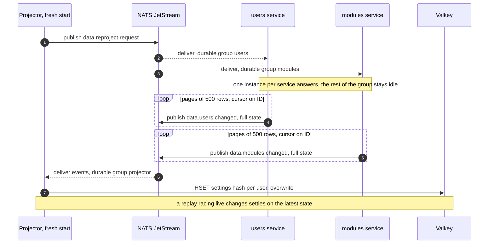

---
# Copyright (c) 2026 Adam Ousmer. All rights reserved.
# Proprietary. No license granted. See LICENSE.md.
title: Projection des réglages
description: "Modèle de lecture Valkey : organisation des hashes, flux d'événements et handshake de reproject qui reconstruit l'état."
sidebar:
  order: 5
---

Le hot path réagit à un message de chat et cette lecture ne peut pas toucher MySQL. Le projector (`app/projector`) maintient dans Valkey un modèle de lecture dénormalisé contenant tout ce dont le hot path a besoin sur une chaîne, lisible en un aller-retour. La projection est un cache, jamais la source de vérité ; MySQL peut la reconstruire à tout moment.

## Organisation

Un hash par utilisateur, lisible avec un seul `HGETALL` :

```
settings:<user_id>
  status                  free | paid | vip
  active                  0 | 1
  live                    0 | 1
  module:<name>:enabled   0 | 1
  module:<name>:config    raw JSON
```

Les lecteurs ne parsèrent que le blob de configuration du module utilisé. Les noms de modules sont validés à la frontière d'écriture (minuscules alphanumériques, underscore, tiret), car le nom est intégré au champ ; un deux-points pourrait sinon fabriquer un autre champ.

Les commandes ne sont volontairement pas projetées dans Valkey. Le service Commands les sert depuis son propre cache en processus, sur un chemin plus lent ; les projeter grossirait chaque hash pour des données inutiles au hot path à chaque message. Le worker lit tout de même le bit `live` lorsqu'une commande est `stream_online_only`.

## Flux en direct

Le projector consomme les événements de changement Users et Modules via un groupe de file durable : chaque événement est plié une fois et le consommateur conserve sa position après un redémarrage. Chaque handler valide le payload puis écrase : `HSET` pour les changements, `DEL` pour la suppression d'un utilisateur. Ces sémantiques rendent redelivery et replay inoffensifs.

## Reconstruction : handshake de reproject

Un Valkey neuf ou effacé converge vers la projection complète sans que le projector ne lise le schéma d'un autre service. Au démarrage, il publie une demande de reproject ; chaque service propriétaire rejoue ses lignes actuelles comme des événements ordinaires, par pages afin de ne jamais charger toute une table en mémoire.



Le handshake sert aussi de réconciliation : si un événement est manqué au-delà de la rétention JetStream ([ADR 0003](/fr/adr/0003-adoption-of-nats-as-communication-bridge/)), la projection de l'utilisateur concerné reste périmée jusqu'à son prochain changement ou au prochain reproject.

## Gestion des pannes

- **Valkey indisponible :** aucune donnée n'est perdue ; la projection se reconstruit depuis une demande de reproject au retour de Valkey. Les lecteurs du hot path doivent choisir leur dégradation pendant l'indisponibilité.
- **Projector indisponible :** le groupe durable conserve sa position ; au redémarrage il reprend où il s'est arrêté, dans la fenêtre de rétention.
- **Événement empoisonné :** validé, journalisé puis acquitté pour l'écarter. La projection ne se bloque jamais sur un message malformé.
- **Pourquoi Valkey plutôt que Redis :** même protocole, mêmes clients et même modèle de données ; Valkey est le fork sous licence BSD et gouvernance ouverte, ce qui compte pour un logiciel potentiellement auto-hébergé indéfiniment ([ADR 0004](/fr/adr/0004-adoption-of-oracle-cloud/)).
