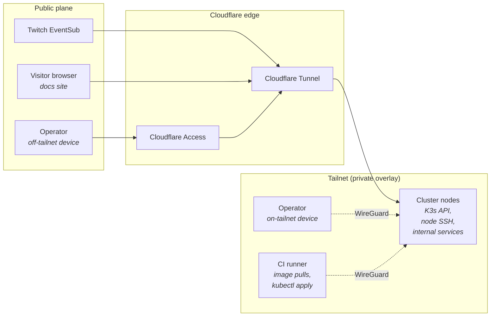

---
# Copyright (c) 2026 Adam Ousmer. All rights reserved.
# Proprietary. No license granted. See LICENSE.md.
title: Réseau
description: Maillage Tailscale, tunnels Cloudflare et modèle Zero Trust reliant le cluster.
---

ItsBagelBot n'a **aucune IP publique**, **aucun port ouvert sur le routeur** et **aucune confiance fondée uniquement sur le LAN**. Chaque connexion entrante ou sortante traverse une frontière Zero Trust contrôlant l'identité plutôt que la position sur le réseau.

La décision architecturale figure dans [ADR-0001](/adr/0001-zero-trust-network/) ; cette page sert de référence opérationnelle.

## Les deux plans

- **Plan public (Cloudflare) :** tout ce qu'une partie que nous ne contrôlons pas doit pouvoir joindre : Twitch, les visiteurs anonymes de la documentation et, parfois, un opérateur depuis un appareil hors du tailnet.
- **Plan privé (Tailscale) :** tout le reste, notamment les échanges entre nœuds, de l'opérateur vers le cluster et de la CI vers le cluster. WireGuard fournit le transport, Tailscale coordonne les identités.

## Tailscale : le réseau privé superposé

### Membres du tailnet

| Membre | Rôle | Étiquette ACL |
| --- | --- | --- |
| `node1`, `node2` (nœuds k3s) | Échanges entre nœuds (plan de contrôle k3s, CNI), destination SSH | `tag:itsbagelbot` |
| `witness1` (micro-VM OCI) | Routeur de sous-réseau OCI VCN pour l'accès à la base de données | `tag:witness` |
| Appareils des opérateurs | SSH, interface d'administration, `kubectl` via le proxy opérateur | `tag:Macbook` |
| `k8s-operator` (dans le cluster) | Opérateur Kubernetes Tailscale et proxy du serveur d'API Kubernetes | `tag:k8s-operator` |
| Proxies `ts-ingress-*` (dans le cluster) | Publication des Services Tailscale (`svc:admin`) | `tag:k8s` |

### Organisation des ACL

La politique est versionnée dans `deploy/infra/tailscale/policy.hujson`, puis copiée ou appliquée dans la console d'administration. Elle **refuse par défaut** et ne contient que des autorisations. En une phrase : **les machines physiques n'acceptent que SSH depuis les appareils des opérateurs ; les services hébergés dans Kubernetes sont accessibles par les proxies de l'opérateur Tailscale.**

- Appareils des opérateurs → nœuds du cluster et témoin : `tcp:22` uniquement.
- Appareils des opérateurs → `svc:admin:443` (interface d'administration) et → `tag:k8s-operator:443`, avec la capacité `tailscale.com/cap/kubernetes` (`kubectl` usurpant l'identité `system:masters`).
- Nœuds ↔ nœuds : sans restriction ; le plan de contrôle k3s et le CNI utilisent le tailnet.
- Témoin ↔ nœuds : uniquement le trafic privé de base de données et de routage de sous-réseau requis par la route OCI VCN ; le quorum Sentinel reste entièrement dans le cluster.
- Tailscale SSH contrôle l'identité de l'opérateur à partir d'une liste explicite d'utilisateurs.

Accès d'urgence si l'opérateur est indisponible : SSH vers `node1`, puis `sudo k3s kubectl`.

### Adresses d'écoute des nœuds

Les services internes écoutent sur **l'adresse de l'interface Tailscale** (`tailscale0`), pas sur `0.0.0.0`. Les unités systemd concernées imposent `IPAddressDeny=any` et limitent `IPAddressAllow=` à la plage CGNAT de Tailscale (`100.64.0.0/10`).

Le serveur d'API Kubernetes démarre avec `--bind-address` fixé à l'IP du nœud sur le tailnet ; une ACL Tailscale mal configurée n'expose donc pas l'API au LAN.

### MagicDNS

Les noms `*.tail451e6d.ts.net` ne se résolvent que pour les membres du tailnet. Les principaux sont :

- `admin.tail451e6d.ts.net` : interface d'administration réservée aux opérateurs (Service Tailscale `svc:admin`, haute disponibilité sur les deux nœuds et TLS Let's Encrypt).
- `k8s-operator.tail451e6d.ts.net` : proxy du serveur d'API Kubernetes (`tailscale configure kubeconfig k8s-operator`).

Nous n'utilisons **pas** MagicDNS pour le routage entre services dans le cluster : ce rôle appartient aux Services Kubernetes et à CoreDNS. MagicDNS sert uniquement au confort des opérateurs.

## Cloudflare Tunnel : l'entrée publique

### Services exposés

| Nom d'hôte | Service cible | Authentification en amont |
| --- | --- | --- |
| `eventsub.bagelbot.[domain]` | `bot-gateway.bagelbot-app:8080/eventsub` | Aucune (Twitch ne peut pas utiliser le SSO) ; vérification de signature HMAC à la passerelle. |
| `bagelbot.[domain]` | `web-ui.bagelbot-app:80` | Cloudflare Access (identités du streamer et du mainteneur). |
| `docs.bagelbot.[domain]` | Site Starlight construit à partir de ce dépôt | Aucune ; site volontairement public. |

Le démon `cloudflared` s'exécute dans un Deployment avec deux réplicas et une anti-affinité entre nœuds, afin que la perte d'un nœud ne coupe pas l'entrée. Les identifiants sont montés depuis un Secret Kubernetes reposant sur [à définir : sealed-secrets ou manifests chiffrés avec SOPS].

### Pourquoi ne pas utiliser Tailscale Funnel ?

Funnel est une option viable pour les interfaces publiques et a été étudié. Cloudflare Tunnel a été retenu pour les raisons suivantes :

- L'absorption des attaques DDoS et la terminaison TLS se font sur le réseau Cloudflare, ce qui compte pour un récepteur public de webhooks.
- Cloudflare Access est déjà intégré à notre SSO ; pour le tableau de bord, il suffit de définir la politique.
- Twitch s'accommode mieux d'une URL de webhook stable à notre nom que d'un nom d'hôte `*.ts.net`.

Voir [ADR-0001](/adr/0001-zero-trust-network/) pour la discussion complète des compromis.

### Politiques Cloudflare Access

Les noms d'hôte non publics sont protégés par les politiques suivantes :

- **`bagelbot.[domain]` → streamer et mainteneur.** SSO GitHub, WebAuthn obligatoire et session de 24 h.
- **`grafana.[domain]` → mainteneur uniquement.** WebAuthn et session de 8 h.
- **Aucun contournement pour les « réseaux de confiance ».** La position sur le réseau ne constitue précisément pas une preuve de confiance.

Ces politiques sont versionnées en Terraform et appliquées en CI ; les modifications faites dans l'interface sont réconciliées avec git à chaque plan.

## Accès d'urgence

Tailscale et Cloudflare sont deux dépendances externes. Si le serveur de coordination ou le réseau périphérique devient inaccessible, une procédure documentée permet d'utiliser la console physique :

1. Brancher un clavier et un écran HDMI au nœud du plan de contrôle, ou utiliser un KVM local disponible.
2. Utiliser l'identifiant d'urgence de l'opérateur conservé localement, hors ligne, dans une enveloppe scellée dans la même pièce que le cluster.
3. Remettre le cluster dans un état sûr depuis la console, ou démarrer un environnement de récupération depuis la carte microSD du SBC.

L'identifiant d'urgence est renouvelé chaque année et après toute suspicion de compromission. Il ne dépend **pas** de la disponibilité de Tailscale ou de Cloudflare.

## Ce qui est volontairement absent

- **Une entrée LAN.** Aucun service `NodePort` n'est accessible sur le LAN. Si le tunnel et Tailscale sont indisponibles, le service est inaccessible ; c'est le choix explicite.
- **Un concentrateur VPN dans le cluster.** Tailscale remplit ce rôle ; nous n'en exécutons pas un second.
- **La découverte `mDNS`, `Avahi` ou Bonjour sur le LAN.** Elle est inutile et constituerait une fuite passive d'informations.

## Pour aller plus loin

- **[Matériel et cluster →](/fr/infrastructure/hardware-and-cluster/)** : caractéristiques des nœuds et organisation de K3s.
- **[Pipeline CI/CD →](/infrastructure/cicd-pipeline/)** : accès du runner CI au tailnet pour déployer.
- **[ADR-0001 →](/adr/0001-zero-trust-network/)** : décision complète à l'origine de ce modèle.
