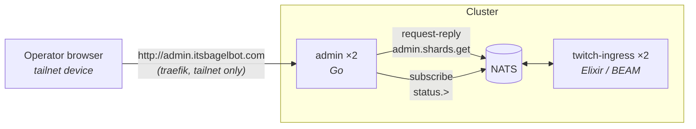

---
# Copyright (c) 2026 Adam Ousmer. All rights reserved.
# Proprietary. No license granted. See LICENSE.md.
title: Administration
description: Service Go réservé aux opérateurs qui affiche l'état en direct de chaque shard Twitch ingress, accessible exclusivement via le tailnet.
---

Le service Admin est la fenêtre de l'opérateur sur [Twitch Ingress](/fr/microservices/twitch-ingress/) : l'état en direct de chaque shard Conduit (nœud BEAM qui le possède, session EventSub, arrivée de sa dernière trame), l'emplacement du singleton conduit-manager et le flux brut des événements de montée et descente des shards. Il lit tout via NATS et ne possède aucune donnée propre.

Il est volontairement simple : aucune couche d'authentification, aucune base de données, aucun identifiant Twitch. Le réseau forme le périmètre : le service est accessible **uniquement via Tailscale**, et les ACL du tailnet (`tag:operator` → `tag:cluster-node`) servent de contrôle d'accès. Voir [Réseau](/fr/infrastructure/networking/) pour le contexte.

## Responsabilités

- Afficher la **page de la flotte de shards** : une carte par shard Conduit avec son état calculé (`connected`, `migrating`, `binding`, `connecting`, `backoff`, `unregistered`, `unresponsive`), son nœud BEAM, l'identifiant de session EventSub, les âges depuis l'association et la dernière trame, la fenêtre keepalive et les tentatives de reconnexion.
- Afficher le **résumé du cluster** : membres du cluster BEAM, emplacement du singleton conduit-manager et identifiant du conduit, tels que les rapporte la réplique ingress qui a répondu.
- Transmettre les **événements live des shards** (`twitch.ingress.status.>`) au navigateur via SSE ; un événement déclenche l'actualisation immédiate de l'instantané, avec une interrogation régulière toutes les 5 secondes en secours.
- **Gérer les utilisateurs** : rechercher un utilisateur par identifiant Twitch ou nom d'utilisateur (avec une liste des utilisateurs récents), accorder le statut **VIP** (premium permanent), marquer un premium payé, revenir au statut **free** et **réinitialiser l'état** (effacer les jetons Twitch stockés ; le compte, le niveau et l'historique des transactions restent). Toutes les actions passent par NATS vers le service users, propriétaire du schéma, qui publie la clé d'invalidation du cache broadcaster afin que les voies ingress réagissent immédiatement.

Ce service ne touche pas à l'infrastructure. Aucun redémarrage de shard ni reconfiguration de conduit : les opérations sur la flotte restent dans `kubectl`, où elles sont auditées et révisables. Il n'ouvre jamais MySQL ; chaque lecture et écriture est un RPC NATS vers le service propriétaire.

Le seul endpoint HTTP de mutation exige un en-tête de requête personnalisé. Les ACL du tailnet contrôlent l'accès, mais l'en-tête force toute requête de navigateur cross-origin à passer par un preflight CORS que ce serveur n'accorde jamais ; un site public malveillant ouvert dans le navigateur d'un opérateur ne peut donc pas envoyer de POST vers l'adresse privée.

## Forme externe

L'instantané des shards est servi par `Ingress.AdminRpc` à l'intérieur de l'ingress : toute réplique peut répondre (un groupe de files en choisit une) et parcourt le registre Horde ; la réponse couvre donc les shards de chaque nœud BEAM, quelle que soit la réplique qui répond.

## Contrats NATS

| Sujet | Direction | Payload |
|---|---|---|
| `twitch.ingress.admin.shards.get` | requête-réponse | réponse : `{generated_at, reporter, nodes, shard_count, conduit_manager, shards[]}` |
| `twitch.ingress.status.>` | abonnement | événements de montée/descente des shards, transmis tels quels au navigateur comme SSE |
| `bagel.rpc.admin.user.get` | requête-réponse | `{user_id}` ou `{username}` → `{user}` |
| `bagel.rpc.admin.user.list` | requête-réponse | `{limit}` → `{users[]}` (modifiés le plus récemment en premier) |
| `bagel.rpc.admin.user.set_status` | requête-réponse | `{user_id, status: free\|paid\|vip}` → `{user}` (crée la ligne si elle n'existe pas) |
| `bagel.rpc.admin.user.reset` | requête-réponse | `{user_id}` → `{user}` (efface les jetons stockés) |
| `bagel.rpc.admin.user.stats` | requête-réponse | `{}` → `{stats}` |
| `bagel.rpc.admin.user.token_set` / `token_status` / `token_clear` | requête-réponse | gestion des jetons du compte bot ; `{token: {present}}` |
| `bagel.rpc.admin.user.delete` | requête-réponse | `{user_id}` ou `{username}` → `{}` (supprime l'utilisateur en cascade) |

Chaque entrée de `shards[]` contient `{shard_id, state, node, session_id, bound, handshake_in_flight, keepalive_ms, attempts, bound_at, last_frame_at}`. Les verbes utilisateurs sont possédés et traités par broadcaster-data ; un utilisateur est `{id, username, is_active, tier, premium_kind, updated_at}`, où `tier` (premium|standard) pilote les voies et `premium_kind` indique l'origine du premium (`vip` = accord de l'opérateur, permanent ; `paid` = Tebex).

## Configuration

Tout vient de l'environnement, sans secret ; le manifeste définit directement ces variables (aucun projet Doppler).

| Variable | Rôle | Valeur par défaut |
|---|---|---|
| `ADMIN_LISTEN_ADDR` | Adresse HTTP d'écoute dans le pod. | `:8080` |
| `NATS_HOST` / `NATS_PORT` | Endpoint NATS. | `127.0.0.1` / `4222` |
| `NATS_ADMIN_SUBJECT` | Sujet requête-réponse traité par l'ingress. | `twitch.ingress.admin.shards.get` |
| `NATS_STATUS_SUBJECT_PREFIX` | Préfixe des sujets d'état transmis par SSE. | `twitch.ingress.status` |

## Déploiement

`deploy/k8s/admin.yaml`. Même forme HA que le reste de la flotte : 2 répliques, anti-affinité des pods entre `node1` (ARM) et `node2` (Intel), PodDisruptionBudget `minAvailable: 1`, image distroless, utilisateur non root et toutes les capacités supprimées. Les images sont construites par nœud : ARM nativement sur le Mac de l'opérateur, Intel nativement sur `node2` — aucune émulation inter-architecture dans le pipeline.

Le service est exposé par l'opérateur Kubernetes Tailscale sous un seul nom :

| URL | Cible |
|---|---|
| `https://admin.tail451e6d.ts.net` | Service Tailscale `svc:admin` → ProxyGroup ingress ×2 → les deux pods admin |

L'exposition limitée au tailnet est structurelle :

1. **DNS** : le nom est fourni par MagicDNS. Il ne se résout que pour les membres du tailnet ; aucun enregistrement DNS public n'existe et les IP tailnet des nœuds ne figurent dans aucune zone publique.
2. **Plan de données** : l'Ingress de classe `tailscale` s'attache au ProxyGroup `ts-ingress` (`deploy/infra/tailscale/proxies.yaml`), deux pods proxy répartis entre `node1` et `node2` qui annoncent le Service Tailscale `svc:admin`. Le chemin ne partage rien avec l'ingress public : aucune route traefik, aucun nom cloudflared, aucun listener sur une interface de nœud.
3. **Contrôle d'accès** : la politique tailnet (`deploy/infra/tailscale/policy.hujson`) accorde `svc:admin:443` uniquement aux appareils des opérateurs ; le bare metal n'accepte que SSH depuis ceux-ci.
4. **TLS** : le proxy termine HTTPS avec un certificat Let's Encrypt fourni par l'opérateur pour le nom MagicDNS ; les navigateurs affichent un cadenas normal sans installation d'une CA privée.

Chaque réplique proxy continue de servir `svc:admin` après la perte d'un nœud, et le Service admin répartit les requêtes entre les deux pods admin. L'injection Linkerd est volontairement désactivée : l'outil sert à diagnostiquer la flotte et ne doit donc pas partager les modes de panne du mesh.

## Références

- [Twitch Ingress](/fr/microservices/twitch-ingress/) : le service observé, notamment `Ingress.AdminRpc`.
- [Réseau](/fr/infrastructure/networking/) : le modèle à deux plans qui donne un sens à « uniquement tailnet ».
- [Contrats RPC](/fr/reference/rpc-contracts/) : toute la surface `bagel.rpc.admin.user.*` et des instantanés de shards.
- [ADR 0004](/fr/adr/0004-adoption-of-oracle-cloud/) : la flotte tailnet sur laquelle repose cette exposition.
