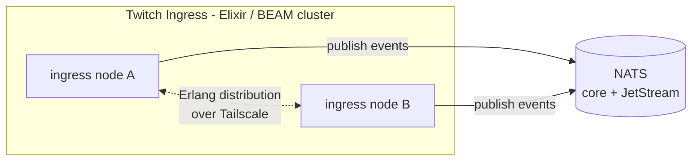
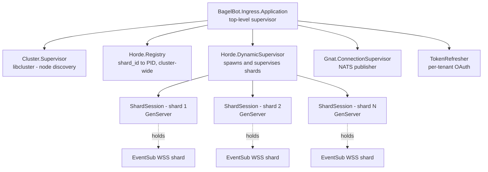

---
# Copyright (c) 2026 Adam Ousmer. All rights reserved.
# Proprietary. No license granted. See LICENSE.md.
title: Twitch Ingress
description: Service Elixir/BEAM qui possède le Conduit EventSub Twitch et ses shards WebSocket, filtre les payloads entrants et transmet les événements normalisés à NATS.
---

Twitch Ingress conserve les shards WebSocket d'un unique **EventSub Conduit** Twitch, les maintient après les resets, filtre les payloads entrants et publie les événements retenus sur NATS sous forme normalisée. C'est le seul service écrit en **Elixir sur la VM BEAM** ; le reste est en Go.

Le choix du langage est justifié dans [ADR 0006](/fr/adr/0006-adoption-of-elixir-for-twitch-ingress/). Le substrat de communication (NATS) derrière lequel il se trouve est justifié dans [ADR 0003](/fr/adr/0003-adoption-of-nats-as-communication-bridge/). Le matériel sur lequel il s'exécute est décrit dans [ADR 0004](/fr/adr/0004-adoption-of-oracle-cloud/).

## Responsabilités

- Maintenir un **EventSub Conduit Twitch** composé d'une petite flotte de shards WebSocket. Twitch répartit les événements entre les shards de son côté ; nous devons seulement les garder connectés.
- Maintenir le WebSocket de chaque shard : gérer la séquence `session_welcome` / `reconnect`, se reconnecter avec backoff après fermeture ou reset, et redémarrer isolément un shard défaillant.
- Actualiser les jetons OAuth de chaque tenant avant leur expiration et réauthentifier lorsque les jetons changent.
- **Filtrer** les payloads Twitch entrants et publier les survivants sur NATS comme événements normalisés. Les messages de chat ont exactement trois issues : ceux des identifiants utilisateur spéciaux (liste du secret store) vont toujours sur la **voie premium** ; ceux qui commencent par `!` vont sur la voie correspondant au statut du **broadcaster** (premium ou standard) ; tous les autres sont supprimés.
- Résoudre le statut du broadcaster par **requête-réponse NATS** auprès du service propriétaire de ces données (l'ingress ne lit jamais MySQL directement), derrière un cache read-through en processus évincé par des clés d'invalidation NATS.
- Répartir la propriété des shards entre les répliques ingress du cluster BEAM afin qu'un seul nœud possède le WSS de chaque shard, avec réaffectation en quelques secondes lorsqu'un nœud quitte le cluster.

Ce service ne traite pas les commandes (commandes de chat ou d'opérateur), ne fait pas de persistance, de logique métier ni de comptabilisation de limites de débit. Tout ce qui doit réagir aux événements vit dans les services Go en aval et s'abonne aux sujets NATS publiés par ce service.

## Forme externe

Les nœuds ingress forment un seul cluster BEAM via la distribution Erlang. Le port de distribution n'est accessible qu'à l'intérieur du tailnet décrit dans [ADR 0004](/fr/adr/0004-adoption-of-oracle-cloud/) ; aucun port public n'est exposé. Les seuls éléments qui quittent le cluster sont les messages NATS publiés.

## Forme interne (arbre de supervision OTP)

- **`BagelBot.Ingress.Application`** est le superviseur de premier niveau. Stratégie de redémarrage : `:one_for_one`.
- **`Cluster.Supervisor` (libcluster)** découvre les nœuds pairs et appelle `Node.connect/1` sur ceux-ci. En production, la stratégie EPMD reçoit la liste des pairs par configuration.
- **`Horde.Registry`** est un registre distribué à l'échelle du cluster, fondé sur un CRDT. Chaque shard est enregistré sous une clé telle que `{:shard, shard_id}`. La recherche inter-nœuds est un appel `Horde.Registry.lookup/2`.
- **`Horde.DynamicSupervisor`** crée les shards et les réattribue aux nœuds survivants lorsqu'un nœud tombe.
- **`ShardSession`** est un `GenServer` par shard. Il possède un WebSocket, pilote la machine d'état du protocole EventSub, exécute le filtre sur chaque payload entrant et publie les survivants sur NATS.
- **`Gnat.ConnectionSupervisor`** possède le pool de connexions NATS (Gnat est le client NATS Elixir). L'ingress ne fait que publier ; il ne s'abonne pas.
- **`TokenRefresher`** est un processus par tenant. Il conserve le jeton OAuth de renouvellement courant, planifie son renouvellement avant expiration et avertit les shards lorsqu'un nouveau jeton d'accès est disponible.

Le filtre lui-même est un module de fonction pure (sans état ni enfant du superviseur). Chaque `ShardSession` l'appelle en ligne avant de décider de publier.

### Stratégies de redémarrage

| Processus                       | Stratégie       | Notes                                                                                |
|---------------------------------|-----------------|--------------------------------------------------------------------------------------|
| `Application`                   | `:one_for_one`  | La panne d'un sous-système ne fait pas tomber ses frères.                           |
| `Horde.DynamicSupervisor`       | `:one_for_one`  | Le crash d'un shard ne redémarre que ce shard.                                       |
| `ShardSession`                  | `:transient`    | Un arrêt normal (shard supprimé) ne redémarre pas ; un crash redémarre avec backoff. |
| `TokenRefresher`                | `:permanent`    | Toujours redémarré ; sans jetons, le tenant ne peut pas fonctionner.                |
| `Gnat.ConnectionSupervisor`     | `:permanent`    | Toujours redémarré ; sans NATS, l'ingress est inutilisable.                          |

Le backoff de reconnexion d'un shard est exponentiel, avec jitter, et plafonné à 60 secondes.

## Partitionnement et propriété

Twitch gère de son côté le routage des événements entre les shards du Conduit ; nous ne choisissons pas la destination de chaque chaîne. Nous possédons le maintien de chaque WebSocket et la réattribution de cette propriété entre les nœuds BEAM lorsque le cluster change.

Le déroulement est le suivant :

1. Au démarrage, le cluster lit le nombre de shards du Conduit et garantit qu'un `ShardSession` existe pour chaque shard, démarré via `Horde.DynamicSupervisor.start_child` et enregistré dans `Horde.Registry` sous `{:shard, shard_id}`.
2. Lorsqu'un nœud quitte le cluster, `Horde` réattribue ses shards aux nœuds survivants. Le nouveau propriétaire rouvre le WebSocket et le réenregistre auprès de Twitch via l'API EventSub.
3. Lorsqu'un nœud rejoint le cluster, `Horde` lui migre des shards selon `Ingress.ShardDistribution` : round-robin par identifiant de shard entre les nœuds vivants (triés par nom), si bien que cinq shards sur deux nœuds se répartissent toujours en 3/2. Le placement est déterministe ; la redistribution active ne déplace que les shards dont la cible a réellement changé.

Nous n'utilisons délibérément pas NATS KV pour cela. Le registre du cluster BEAM fait autorité, vit en mémoire et se met à jour de façon synchrone entre les nœuds. Voir [ADR 0006](/fr/adr/0006-adoption-of-elixir-for-twitch-ingress/) pour le raisonnement.

## Contrats NATS

L'ingress publie les événements et l'état, émet des appels requête-réponse pour le statut du broadcaster et s'abonne à un seul sujet : les clés d'invalidation du cache.

Préfixes des sujets :

- **`twitch.ingress.event.<lane>`** : événements sortants normalisés publiés après filtrage. Exactement trois sujets : `premium` / `standard` (répartis selon le statut du broadcaster) et `stream` (uniquement les événements stream online/offline) ; le `type` EventSub voyage dans le payload, pas dans le sujet.
- **`twitch.ingress.status.*`** : signaux sortants de cycle de vie et de santé.
- **`bagel.rpc.broadcaster.status.get`** : requête-réponse pour consulter le statut auprès du service Go propriétaire.
- **`bagel.cache.invalidate.broadcaster`** : entrée qui évince les entrées du cache de statut en processus.
- **`twitch.ingress.admin.shards.get`** : requête-réponse entrante traitée par `Ingress.AdminRpc`, qui fournit à l'outil [Admin](/fr/microservices/admin/) un instantané d'état des shards du cluster. Un groupe de files garantit qu'une seule réplique répond ; la réponse couvre chaque shard via le registre Horde.

### Sortie : événements

| Sujet                                        | Payload (JSON)                                                                                | Notes                                |
|----------------------------------------------|-----------------------------------------------------------------------------------------------|--------------------------------------|
| `twitch.ingress.event.premium`               | chat: `{type, lane, broadcaster_user_id, chatter_user_id, chatter_user_login, text, ts, msg_id}` ; non-chat: payload EventSub tel que livré par Twitch, plus `{type, lane, received_at, shard_id, msg_id}` | Broadcasters premium et identifiants spéciaux. |
| `twitch.ingress.event.standard`              | mêmes formes que premium                                                                       | Broadcasters standard et événements sans broadcaster extractible. |
| `twitch.ingress.event.stream`                | payload EventSub plus `{type, lane, received_at, shard_id, msg_id}`                           | **Uniquement** `stream.online` / `stream.offline`, quel que soit le statut du broadcaster. |

Les notifications de chat et tous les autres types EventSub abonnés circulent sur les sujets premium/standard ; les consommateurs distribuent selon le champ `type` du payload. Les payloads contiennent `msg_id` afin que les consommateurs dédupliquent les rediffusions Twitch.

### Sortie : état

| Sujet                                        | Payload                                                                                       |
|----------------------------------------------|-----------------------------------------------------------------------------------------------|
| `twitch.ingress.status.shard.up`             | `{tenant, shard_id, node, since}`                                                             |
| `twitch.ingress.status.shard.bound`          | `{shard_id, node, session_id, kind, at}` — `kind` vaut `fresh` (connexion complète + association Helix) ou `moved` (handshake `session_reconnect` terminé) |
| `twitch.ingress.status.shard.down`           | `{tenant, shard_id, node, reason}` — `reason` contient `duplicate_resolved` lorsqu'un doublon issu de la guérison d'un netsplit s'arrête |
| `twitch.ingress.status.node.joined`          | `{node, version, ts}`                                                                         |
| `twitch.ingress.status.node.left`            | `{node, reason, ts}`                                                                          |

L'état est un flux JetStream à rétention courte (10 minutes suffisent pour qu'un observateur rattrape son retard).

## Configuration

Pilotée par l'environnement. Toutes les valeurs arrivent comme variables d'environnement et sont lues une fois au démarrage.

| Variable                       | Rôle                                                                     | Exemple                                     |
|--------------------------------|--------------------------------------------------------------------------|---------------------------------------------|
| `BAGELBOT_NODE_NAME`           | Nom long Erlang de ce nœud.                                              | `ingress-a@10.42.0.7`                       |
| `BAGELBOT_ERLANG_COOKIE`       | Cookie partagé pour la distribution, fourni par le secret store.         | (opaque)                                    |
| `BAGELBOT_CLUSTER_HOSTS`       | Noms longs des pairs séparés par des virgules pour la stratégie EPMD de libcluster. | `ingress-a@10.42.0.7,ingress-b@10.42.0.8` |
| `NATS_URL`                     | URL de connexion NATS dans le VCN.                                       | `nats://nats.internal:4222`                 |
| `NATS_CREDS_FILE`              | Chemin du fichier d'identifiants NATS (JWT + nkey).                      | `/run/secrets/nats.creds`                   |
| `TWITCH_CLIENT_ID`             | Identifiant client pour les appels à l'API Twitch.                      | (opaque)                                    |
| `TWITCH_CLIENT_SECRET`         | Secret client de l'application.                                         | (opaque)                                    |
| `TWITCH_CONDUIT_ID`            | Conduit possédé par cet ingress.                                        | `conduit_abc123`                            |
| `TWITCH_CONDUIT_SHARD_COUNT`   | Nombre souhaité de shards dans le Conduit.                               | `4`                                         |
| `TWITCH_EVENTSUB_WSS_URL`      | Endpoint WebSocket EventSub Twitch, fixé par la configuration.           | `wss://eventsub.wss.twitch.tv/ws`           |
| `TWITCH_SPECIAL_USER_IDS`      | Identifiants de chat toujours envoyés sur la voie premium, depuis le secret store. | `1001,1002` |
| `NATS_SUBJECT_LANE_PREMIUM`    | Sujet de la voie premium (tous les types d'événements).                  | `twitch.ingress.event.premium`              |
| `NATS_SUBJECT_LANE_STANDARD`   | Sujet de la voie standard (tous les types d'événements).                 | `twitch.ingress.event.standard`             |
| `NATS_SUBJECT_LANE_STREAM`     | Voie dédiée aux seuls événements stream.online / stream.offline.         | `twitch.ingress.event.stream`               |
| `NEW_RELIC_LICENSE_KEY`        | Active la surveillance New Relic ; sans clé, l'agent ne fait rien.       | (opaque)                                    |
| `NEW_RELIC_APP_NAME`           | Nom de l'application New Relic.                                         | `itsbagelbot-twitch-ingress`                |
| `NATS_BROADCASTER_STATUS_SUBJECT` | Sujet requête-réponse des consultations de statut broadcaster.        | `bagel.rpc.broadcaster.status.get`          |
| `NATS_CACHE_INVALIDATION_SUBJECT` | Sujet contenant les clés d'invalidation du cache broadcaster.         | `bagel.cache.invalidate.broadcaster`        |
| `NATS_ADMIN_SUBJECT`           | Sujet requête-réponse fournissant l'instantané d'état des shards.        | `twitch.ingress.admin.shards.get`           |
| `BROADCASTER_CACHE_TTL_SECONDS`| TTL du cache de statut broadcaster en processus.                         | `300`                                       |
| `LOG_LEVEL`                    | `debug` / `info` / `warn` / `error`.                                     | `info`                                      |
| `OTEL_EXPORTER_OTLP_ENDPOINT`  | Cible OTLP facultative pour les traces et métriques.                    | `http://otel-collector:4318`                |

Les identifiants par tenant (jetons OAuth de renouvellement, configuration d'abonnement EventSub) viennent de la base relationnelle décrite dans [ADR 0005](/fr/adr/0005-adoption-of-mysql-heatwave/).

## Déploiement

- **Architecture :** ARM et Intel. Réparti entre `node1` (ARM) et `node2` (Intel/x86_64) pour la haute disponibilité (HA). Les images sont construites par nœud : ARM nativement sur le Mac de l'opérateur, Intel nativement sur `node2` — aucune émulation inter-architecture dans le pipeline.
- **Runtime :** OTP 27+, Elixir 1.17+. Publié comme release Mix (`mix release`) sur une image de base Erlang `distroless`.
- **Modèle de processus :** un conteneur par nœud. BEAM est le runtime de concurrence ; nous n'exécutons pas plusieurs VM BEAM par pod.
- **Réseau :** la distribution Erlang est liée uniquement à l'interface Tailscale. EPMD est lié à la même adresse. Aucun port public ; NATS est joint via le VCN interne.
- **Contrôles de santé :**
  - Vivacité : petit endpoint HTTP sur localhost confirmant que le superviseur applicatif est vivant.
  - Disponibilité : `Gnat.ping/1` vers NATS et `Node.list/0` contenant au moins un pair lorsque le service est étendu au-delà d'un nœud.
- **Mises à jour progressives :** un nœud à la fois. `SIGTERM` déclenche `:init.stop/0`, qui exécute les callbacks d'arrêt de l'application et laisse Horde vider les shards vers les nœuds survivants avant la sortie.

## Observabilité

- **Journaux :** JSON vers stdout, structurés par `Logger` avec métadonnées. Champs : `tenant`, `shard_id`, `node`, `event`.
- **Métriques :** événements Telemetry émis par Gnat, Horde et nos appels `:telemetry.execute/3`. Exportés via le SDK OpenTelemetry vers le collecteur à `OTEL_EXPORTER_OTLP_ENDPOINT`.
- **Traces :** le traitement du payload de chaque shard ouvre un span ; les publications NATS sortantes transportent le contexte de trace dans un en-tête afin que les services Go en aval voient la continuité.
- **Métriques principales :**
  - `ingress.shard.count{state}` (jauge) : shards vivants par état (`connected`, `reconnecting`).
  - `ingress.shard.reconnects_total` (compteur) : tentatives de reconnexion ; des pics persistants signalent une panne Twitch.
  - `ingress.filter.dropped_total{reason}` (compteur) : événements supprimés par le filtre et par raison.
  - `ingress.nats.publish_latency_ms{subject}` (histogramme).
  - `ingress.token.refreshes_total{tenant, outcome}` (compteur).
  - `ingress.cluster.members` (jauge) : nœuds de `Node.list/0`.

## Modes de panne et réponses du service

| Panne                                              | Réponse                                                                                                       |
|----------------------------------------------------|---------------------------------------------------------------------------------------------------------------|
| Le WebSocket d'un shard tombe                      | `ShardSession` intercepte la fermeture, redémarre via le superviseur et se reconnecte avec backoff. Les shards frères restent intacts. |
| Twitch renvoie 401 pour un shard                   | Le shard demande un nouveau jeton à `TokenRefresher` ; en cas de succès il se réauthentifie, sinon il crashe et le superviseur le redémarre. |
| Un nœud ingress tombe                               | `Horde` réattribue ses shards aux nœuds survivants. Les nouveaux propriétaires rouvrent les WebSockets et les réenregistrent auprès de Twitch ; des événements d'état sont émis. |
| NATS est inaccessible                              | `Gnat.ConnectionSupervisor` se reconnecte. Les événements sortants sont bufferisés (avec limite) puis supprimés en cas de débordement avec un journal de niveau avertissement ; nous préférons la perte à une croissance mémoire illimitée. |
| Partition de la distribution Erlang                | Chaque côté devient un cluster sans quorum et peut exécuter des shards en double. Après rétablissement, la fusion du registre signale le doublon et la résolution est fondée sur la santé : la copie **liée** au Conduit conserve le shard (en reprenant l'enregistrement si le registre avait choisi la copie non liée), tandis que la copie redondante s'arrête correctement et publie `shard.down` avec la raison `duplicate_resolved`. |
| Un seul payload Twitch mal formé                   | Le shard crashe, le superviseur le redémarre et Twitch renvoie l'événement via le Conduit. Aucun raz-de-marée de retries sur les payloads invalides. |

## Références

- [ADR 0001](/fr/adr/0001-rewriting-to-microservices/) : la réécriture en microservices, qui a initialement fait apparaître le problème des sockets Twitch zombies que ce service résout.
- [ADR 0003](/fr/adr/0003-adoption-of-nats-as-communication-bridge/) : NATS comme substrat de communication et espace de sujets publié par ce service.
- [ADR 0004](/fr/adr/0004-adoption-of-oracle-cloud/) : la flotte où s'exécute ce service, notamment le tailnet utilisé par la distribution BEAM.
- [ADR 0005](/fr/adr/0005-adoption-of-mysql-heatwave/) : la base qui conserve les identifiants Twitch de chaque tenant.
- [ADR 0006](/fr/adr/0006-adoption-of-elixir-for-twitch-ingress/) : le choix du langage et du runtime de ce service.
