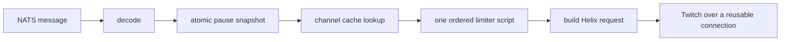

---
# Copyright (c) 2026 Adam Ousmer. All rights reserved.
# Proprietary. No license granted. See LICENSE.md.
title: Plan de déploiement canari du chemin critique outgress
description: Critères d’acceptation pour valider l’optimisation du chemin critique outgress en production et avec une instance Valkey réelle.
---

État : implémentation terminée ; le déploiement canari en production et le test d’intégration avec Valkey réel restent à effectuer.
Périmètre : `app/twitch/outgress` et gestion des acquittements négatifs attendus dans `pkg/bus`.

## Résultat attendu

Pour un envoi de chat avec un cache chaud, réduire le chemin synchrone précédant Twitch à un seul aller-retour d’écriture Valkey, tout en conservant la réservation de capacité Premium et la sémantique de l’arrêt d’urgence.

Chemin cible de la commande :



Allers-retours Valkey attendus en régime permanent :

| Chemin | Actuel | Cible |
|---|---:|---:|
| Chat standard, cache de chaîne chaud | 3 | 1 |
| Chat standard, cache de chaîne froid | 4 | 2 |
| Chat Premium, cache de chaîne chaud | 2 | 1 |
| Chat Premium, cache de chaîne froid | 3 | 2 |

Le chemin standard actuel avec cache chaud nécessite trois allers-retours, et non quatre : le cache de chaîne de 24 heures évite normalement `HGETALL`. Le cas à quatre allers-retours correspond au cache froid.

## Corrections de la proposition initiale

1. Ne pas implémenter le pipeline `Lua.ExecMulti` proposé.

   - Il n’est pas atomique. Les deux scripts s’exécutent même si le réservoir standard refuse la requête. Dans ce cas, le réservoir partagé est tout de même consommé : le trafic standard rejeté peut ainsi réduire la capacité réservée au trafic Premium.
   - Ce comportement diffère de l’ordre actuel. Aujourd’hui, un refus du réservoir standard arrête le traitement avant de toucher le réservoir partagé ; un refus du réservoir partagé intervient après la consommation du jeton standard.
   - Dans valkey-go v1.0.75, `Lua.ExecMulti` exécute `SCRIPT LOAD` sur les nœuds du client à chaque appel avant d’envoyer le pipeline. Ce n’est donc pas une opération du chemin critique garantissant un seul aller-retour.

2. Ne pas utiliser tel quel un cache de pause sans verrou avec un TTL de deux secondes.

   Libérer le verrou de lecture avant le rafraîchissement permet à chaque worker qui franchit la limite du TTL d’émettre le même `GET`. Cela retarde aussi une pause d’urgence sur les autres répliques outgress, car le RPC de gestion utilise un groupe de file d’attente et une seule réplique exécute `SetPaused`.

3. Considérer l’affirmation sur les connexions HTTP comme une hypothèse à vérifier.

   Vider les corps des réponses est correct et nécessaire à une réutilisation fiable en HTTP/1.1, mais `http.Transport` gère déjà un pool de connexions et Twitch peut négocier HTTP/2. Avant d’attribuer un gain de latence à l’affirmation selon laquelle chaque requête effectue actuellement une nouvelle négociation TCP/TLS, il faut tracer les connexions.

4. Reporter une API `PreparedBucket` étendue jusqu’à ce que les profils d’allocation la justifient.

   Les allers-retours réseau dominent. L’heure du serveur et une petite spécification de réservoir préencodée suppriment l’essentiel du travail de formatage sans ajouter quatre méthodes publiques au limiteur.

## Privilégier les fonctionnalités natives de Valkey

Utiliser les opérations intégrées à Valkey, sauf si elles ne peuvent pas exprimer l’invariant requis :

| Besoin | Fonctionnalité native | Décision |
|---|---|---|
| Mise à jour de l’état et de la version de pause | `MULTI/EXEC` + `SET`/`DEL` + `INCR` | À utiliser |
| Réconciliation de la pause | `MGET` | À utiliser |
| Nettoyage des limiteurs inactifs | Tables de hachage + `EXPIRE` | À utiliser |
| Regroupement de commandes indépendantes | Pipeline | À utiliser en l’absence de dépendance conditionnelle |
| Admission ordonnée sur deux réservoirs | Pipeline | Rejeté : exécute toujours le deuxième réservoir |
| Admission ordonnée sur deux réservoirs | `MULTI/EXEC` | Rejeté : une transaction ne peut pas choisir une branche selon le premier réservoir |
| Admission ordonnée sur deux réservoirs | `WATCH` | Rejeté : allers-retours supplémentaires de lecture/transaction et nouvelles tentatives en cas de contention |
| Admission ordonnée sur deux réservoirs | Un script Lua borné | À utiliser comme exception limitée |

Le script Lua combine les opérations natives `TIME`, `HMGET`, `HSET` et `EXPIRE` ; il ne remplace pas des fonctionnalités natives qui résolvent déjà le problème.

## Phase 0 : établir une référence

Instrumenter les étapes avant de modifier le comportement :

- durée de décodage ;
- durée de consultation de la pause et âge de l’instantané ;
- succès/échec du cache de chaîne et durée de chargement ;
- durée du limiteur, voie, décision et classe du réservoir ayant refusé ;
- durée de recherche du jeton ;
- durée de requête Twitch et classe de statut ;
- réutilisation des connexions HTTP échantillonnée (`httptrace.GotConnInfo.Reused`) ;
- nombres d’acquittements négatifs et de relivraisons par motif.

Ne pas étiqueter les métriques avec l’identifiant du diffuseur, les paramètres d’URL des endpoints ou les clés des réservoirs : leur cardinalité n’est pas bornée. Utiliser des étiquettes fixes comme la voie, l’opération, la classe de statut et `standard`/`shared`/`system`.

Relever p50/p95/p99 et les profils d’allocation pour les chemins avec cache de chaîne chaud et froid. Exécuter le benchmark avec une véritable instance Valkey ; des benchmarks de fonctions locales ne peuvent pas valider la réduction des allers-retours.

## Phase 1 : une seule exécution ordonnée du limiteur

### Conception

Remplacer les deux exécutions séquentielles de la voie standard par un script Lua qui évalue un ou deux réservoirs dans l’ordre. Utiliser `valkey.Lua.Exec`, et non `ExecMulti`.

Le script doit conserver exactement ces transitions :

| Premier réservoir | Deuxième réservoir | Résultat | Modification de l’état |
|---|---|---|---|
| refus | quelconque | refus du premier | mettre à jour l’horodatage et l’état de recharge du premier ; ne pas toucher au deuxième |
| autorisation | refus | refus du deuxième | consommer le premier ; mettre à jour le deuxième, qui refuse |
| autorisation | autorisation | autorisation | consommer les deux |

Exigences d’implémentation :

- Appeler `TIME` de Valkey une seule fois dans le script. Cela élimine les écarts d’horloge de la flotte dans le calcul de recharge et l’allocation de formatage d’horodatage à chaque appel.
- Lire et valider toutes les tables de hachage concernées avant la première écriture. Les scripts Lua sont isolés, mais Redis/Valkey n’annule pas les écritures précédentes après une erreur d’exécution ; lire avant d’écrire évite une modification partielle lorsqu’une clé a un type incorrect.
- Renvoyer une décision compacte : autorisé, premier refusé ou deuxième refusé. Éventuellement, renvoyer le délai calculé avant la disponibilité d’un jeton pour les métriques et une amélioration ultérieure de la politique de nouvelle tentative.
- Conserver les clés et champs de hachage existants. Les anciens et nouveaux pods partagent alors l’état du limiteur sans risque pendant un déploiement progressif, et un retour arrière ne réinitialise pas les budgets.
- Ne pas réessayer automatiquement le script. Répéter une écriture dont le résultat est incertain peut consommer deux fois un jeton.
- Limiter l’API au cas réel : un ou deux réservoirs. Éviter les allocations liées aux paramètres variadiques et les clés dupliquées par accident sur le chemin critique.

Forme d’API suggérée :

```go
type Spec struct {
    capacityArg string
    refillArg   string
    ttlArg      string
}

type Request struct {
    Key  string
    Spec Spec
}

// AllowOrdered evaluates first and, only when first allows, second.
// denied is 0 on success, 1 for first, and 2 for second.
func (l *Limiter) AllowOrdered(
    ctx context.Context,
    first Request,
    second *Request,
) (denied uint8, err error)
```

Précalculer une seule fois le petit ensemble de valeurs `Spec` :

- chat sans statut de modérateur, partagé et standard ;
- chat avec statut de modérateur, partagé et standard ;
- Helix général, standard et système.

Seule la clé propre à la chaîne est assemblée à chaque message de chat. Regrouper la logique répétée de limitation Helix de `processAPI`, `processAnnounce` et `processShoutout` dans un helper du worker afin que les trois routes ne divergent pas.

### Tests d’invariants requis

Utiliser un test d’intégration avec un véritable Valkey pour le script :

- réservoirs neufs, partiellement remplis, vides et tout juste rechargés ;
- un refus du premier laisse le deuxième hachage strictement inchangé, octet par octet ;
- un refus du deuxième consomme le premier jeton, conformément au comportement actuel ;
- les appels concurrents produisent exactement le nombre de succès autorisé ;
- les changements d’horloge de l’hôte applicatif, en avant ou en arrière, n’ont aucun effet ;
- une deuxième clé de type incorrect ne modifie pas la première ;
- `SCRIPT FLUSH` exerce le repli de `EVALSHA` vers `EVAL` ;
- l’annulation et l’échec de connexion ne déclenchent aucune nouvelle tentative automatique d’écriture.

## Phase 2 : lire la pause sans entrée-sortie ni état périmé dans la flotte

### Conception

Conserver un instantané de pause immuable et versionné derrière `atomic.Pointer`. Le chemin des messages effectue un seul chargement atomique, sans verrou, allocation ni commande Valkey.

`SetPaused` utilise les opérations natives `MULTI/EXEC` pour :

1. enregistrer atomiquement le nouveau booléen et incrémenter une version Valkey ;
2. publier `{paused, version}` sur un sujet NATS dédié à l’invalidation ;
3. mettre à jour l’instantané local uniquement après la réussite de l’écriture Valkey.

Chaque réplique outgress doit :

- s’abonner avant de commencer à consommer les messages des voies ;
- charger l’état initial et sa version avant de se déclarer prête ;
- appliquer un événement uniquement si sa version est plus récente, pour éviter d’appliquer dans le désordre des demandes concurrentes de pause et de reprise ;
- se réconcilier avec Valkey à intervalle légèrement aléatoire, par exemple une seconde, afin de corriger la perte d’un événement NATS envoyé sans garantie ;
- exposer l’âge de l’instantané et les échecs de réconciliation ;
- annuler le processus de réconciliation et attendre sa fin dans `Registry.Close`.

Définir explicitement la politique d’échec. Pour conserver le comportement actuel qui bloque les envois en cas d’échec, renvoyer une erreur dès que le dernier instantané réconcilié avec succès dépasse un âge maximal borné. `system.status` peut utiliser une consultation directe faisant autorité plutôt que l’instantané du chemin critique, afin que le résultat présenté aux opérateurs reste fiable.

Cela assure normalement une propagation immédiate de la pause à toute la flotte, une réparation bornée après un événement manqué et aucune vague de requêtes à l’expiration du TTL.

### Tests requis

- le service ne devient pas prêt au démarrage sans instantané initial ;
- toutes les répliques simulées observent un événement de pause ;
- la réconciliation corrige un événement volontairement perdu ;
- les versions reçues dans le désordre ne peuvent pas rétablir un ancien état ;
- les lectures concurrentes du chemin critique passent `go test -race` et ne déclenchent aucun rafraîchissement ;
- les instantanés périmés bloquent les envois ;
- une écriture Valkey échouée n’est ni publiée ni exposée localement.

## Phase 3 : rendre la réutilisation HTTP explicite et mesurable

Après chaque appel `Do`/`ExecuteAs` réussi, enregistrer immédiatement avec `defer` un helper qui vide le corps dans une limite fixée, puis le ferme. Il doit couvrir les réponses 2xx, 4xx, 429 et 5xx. Lire au maximum `maxBody + 1` ; atteindre EOF dans cette limite permet la réutilisation HTTP/1.1, tandis qu’un corps trop volumineux ou sans fin est fermé sans lecture illimitée.

Donner au client Twitch un transport dédié cloné depuis `http.DefaultTransport` :

- conserver les réglages par défaut de proxy, connexion, TLS et HTTP/2 ;
- régler `MaxIdleConns` et `MaxIdleConnsPerHost` assez haut pour la concurrence configurée par pod, plutôt que la valeur HTTP/1.1 par défaut de deux connexions inactives ;
- éviter un `MaxConnsPerHost` faible qui déplace simplement la file d’attente dans le transport ;
- fermer les connexions inactives à l’arrêt.

Vérifier avec un `httptest.Server` HTTP/1.1 que les petites réponses séquentielles et concurrentes réutilisent les connexions. Couvrir les corps de succès et d’erreur, un corps trop volumineux et l’annulation. Utiliser des traces de production échantillonnées pour déterminer si Twitch utilise HTTP/1.1 ou HTTP/2 et si le réglage du transport modifie p95/p99 ; ne pas annoncer un gain fixe de négociation sans ces preuves.

## Phase 4 : supprimer l’amplification en cas de surcharge

Un refus du limiteur est une contre-pression attendue, mais il devient actuellement une erreur formatée, une erreur signalée à New Relic et un journal d’avertissement à chaque tentative de livraison. Sous forte charge, ce travail d’observabilité peut devenir le chemin local le plus sollicité.

Introduire une classification typée des acquittements négatifs attendus, comprise par `pkg/bus` :

- conserver la même sémantique de livraison pour l’acquittement négatif ;
- le compter dans une métrique à cardinalité bornée ;
- omettre `NoticeError` et les journaux d’avertissement, ou les échantillonner à faible fréquence ;
- conserver comme véritables erreurs les défaillances de dépendances et les échecs inattendus des handlers.

Si le limiteur renvoie un délai de nouvelle tentative, évaluer ultérieurement un changement qui retarde la relivraison jusqu’à la disponibilité possible d’un jeton. Cela nécessite un contrat d’acquittement négatif de bout en bout ; ne pas mettre en sommeil une goroutine de worker. Abandonner aussi immédiatement le travail lorsque le délai calculé dépasse la durée de vie restante du message, limitée à cinq secondes.

## Optimisation différée : baux locaux de jetons

Ne pas commencer par des baux de jetons par pod. Ils peuvent supprimer la plupart des appels Valkey, mais quatre pods peuvent immobiliser des jetons de chat loués et réduire sensiblement la capacité effective. Ne les envisager que si les profils de production montrent encore que le temps d’aller-retour du limiteur constitue un goulot d’étranglement après le passage à un script unique. Toute conception de bail doit réserver les jetons de façon centralisée, ne jamais restituer de baux expirés, adapter la taille des lots au trafic observé et prouver que la flotte ne peut dépasser ni la capacité partagée ni la capacité standard.

## Vérification et critères d’acceptation

Exécuter :

```bash
go test -race ./app/twitch/outgress/...
go test ./...
go vet ./app/twitch/outgress/...
go test -run '^$' -bench 'Limiter|Pause|HTTP' -benchmem -count 10 ./app/twitch/outgress/...
```

Comparer les benchmarks avec `benchstat`. Ajouter un test de latence avec un Valkey réel, un délai réseau représentatif et un faux serveur Twitch afin de mesurer l’ensemble du chemin du worker avant HTTP, et pas uniquement les fonctions auxiliaires.

Livrer les changements par étapes réversibles indépendamment :

1. métriques et référence ;
2. vidage des réponses et tests du transport ;
3. script ordonné du limiteur utilisant les clés existantes ;
4. instantané de pause versionné ;
5. suppression des signalements d’acquittements négatifs attendus ;
6. travail limité aux allocations si les profils le justifient encore.

Déployer d’abord sur une réplique canari, puis sur toute la flotte. À chaque étape, exiger :

- aucune hausse des réponses Twitch 429 ou des échecs d’autorisation ;
- aucun affaiblissement de l’invariant de réservation Premium ;
- aucune hausse des messages abandonnés ou relivrés ;
- le nombre attendu de commandes Valkey par message avec cache chaud : une en standard, une en Premium ;
- une baisse de p95/p99 avant Twitch et aucune régression du renouvellement des connexions HTTP ;
- une propagation de la pause et un âge de réconciliation dans les limites annoncées.

Le retour arrière est sûr, car le schéma des clés du limiteur et leur sémantique restent compatibles avec l’implémentation actuelle. Ne pas associer ce déploiement à un renommage des clés du limiteur ni à un changement de capacité des réservoirs.
